# Memento - 跨平台个人助手应用

> 项目愿景：终身使用的个人数据管理与分析平台，利用 AI 驱动数据价值

## 项目概览

**Memento** 是一个基于 Flutter 构建的跨平台个人助手应用，采用插件化架构，支持 25+ 功能模块，涵盖聊天、日记、活动追踪、账单管理、习惯养成、AI 对话等多个领域。

### 核心特性

| 特性 | 说明 |
|------|------|
| **跨平台支持** | Android、iOS、Web、Windows、macOS、Linux |
| **插件化架构** | 动态加载、独立开发、热插拔 |
| **本地优先** | 数据存储在本地，支持 WebDAV 同步 |
| **AI 集成** | 内置多 AI 服务商，支持工具调用和数据分析 |
| **JavaScript 引擎** | 支持自定义脚本和小程序扩展 |
| **端到端加密同步** | 基于 Shelf 框架的自建同步服务器 |

### 技术栈

| 分类 | 技术 |
|------|------|
| **框架** | Flutter 3.7+, Dart 3.0+ |
| **状态管理** | GetX 4.7+ |
| **存储** | JSON 文件存储 + IndexedDB (Web) |
| **同步** | WebDAV + 自建服务器 (Dart Shelf) |
| **AI** | OpenAI API、腾讯云 ASR、自定义 TTS 服务 |
| **国际化** | 内置中英双语 |

---

## 模块结构图

```mermaid
graph TD
    A["(根) Memento"] --> B["lib/core"]
    A --> C["lib/plugins"]
    A --> D["lib/screens"]
    A --> E["lib/widgets"]
    A --> F["lib/utils"]
    A --> G["shared_models"]
    A --> H["server"]

    C --> C1["activity"]
    C --> C2["agent_chat"]
    C --> C3["bill"]
    C --> C4["calendar"]
    C --> C5["calendar_album"]
    C --> C6["chat"]
    C --> C7["checkin"]
    C --> C8["contact"]
    C --> C9["database"]
    C --> C10["day"]
    C --> C11["diary"]
    C --> C12["goods"]
    C --> C13["habits"]
    C --> C14["nfc"]
    C --> C15["nodes"]
    C --> C16["notes"]
    C --> C17["openai"]
    C --> C18["scripts_center"]
    C --> C19["store"]
    C --> C20["timer"]
    C --> C21["todo"]
    C --> C22["tracker"]
    C --> C23["tts"]
    C --> C24["webview"]

    D --> D1["home_screen"]
    D --> D2["settings_screen"]
    D --> D3["js_console"]
    D --> D4["widgets_gallery"]

    click B "#核心层-core" "查看核心层文档"
    click C "#功能插件-plugins" "查看功能插件文档"
    click D1 "#主屏幕-home_screen" "查看 home_screen 文档"
    click D2 "#设置界面-settings_screen" "查看 settings_screen 文档"
    click D3 "#JavaScript控制台-js_console" "查看 js_console 文档"
    click E "#通用组件-widgets" "查看 widgets 文档"
    click H "#同步服务器-server" "查看 server 文档"
```



---

## 模块索引

### 核心层 (Core)

| 模块 | 路径 | 说明 | 文档 |
|------|------|------|------|
| **插件系统** | `lib/core/plugin_manager.dart` | 插件注册、生命周期管理、访问追踪 | [查看](lib/core/CLAUDE.md) |
| **存储管理** | `lib/core/storage/` | 跨平台文件存储抽象（移动端 + Web） | [查看](lib/core/CLAUDE.md) |
| **配置管理** | `lib/core/config_manager.dart` | 应用级与插件级配置 | [查看](lib/core/CLAUDE.md) |
| **事件系统** | `lib/core/event/` | 全局事件总线，插件间通信 | [查看](lib/core/CLAUDE.md) |
| **JS Bridge** | `lib/core/js_bridge/` | JavaScript 引擎与双向通信 | [查看](lib/core/CLAUDE.md) |
| **悬浮球系统** | `lib/core/floating_ball/` | 悬浮球组件与动作管理 | [查看](lib/core/CLAUDE.md) |
| **动作系统** | `lib/core/action/` | 自定义动作与快捷操作 | [查看](lib/core/CLAUDE.md) |

### 功能插件 (Plugins)

#### 已有详细文档的插件 (25个)

| 插件 | 说明 | 入口文件 | 文档 |
|------|------|----------|------|
| **activity** | 活动记录：时间轴、标签、统计 | `activity_plugin.dart` | [查看](lib/plugins/activity/CLAUDE.md) |
| **agent_chat** | Agent聊天：工具调用、语音识别 | `agent_chat_plugin.dart` | [查看](lib/plugins/agent_chat/CLAUDE.md) |
| **bill** | 账单：多账户、统计、订阅管理 | `bill_plugin.dart` | [查看](lib/plugins/bill/CLAUDE.md) |
| **calendar** | 日历：8种视图、Todo集成 | `calendar_plugin.dart` | [查看](lib/plugins/calendar/CLAUDE.md) |
| **calendar_album** | 日记相册：照片标签 | `calendar_album_plugin.dart` | [查看](lib/plugins/calendar_album/CLAUDE.md) |
| **chat** | 聊天：多频道、消息管理 | `chat_plugin.dart` | [查看](lib/plugins/chat/CLAUDE.md) |
| **checkin** | 签到：分组、统计、连续签到 | `checkin_plugin.dart` | [查看](lib/plugins/checkin/CLAUDE.md) |
| **contact** | 联系人：信息管理、互动历史 | `contact_plugin.dart` | [查看](lib/plugins/contact/CLAUDE.md) |
| **database** | 自定义数据库：11种字段类型 | `database_plugin.dart` | [查看](lib/plugins/database/CLAUDE.md) |
| **day** | 纪念日：倒计时/正计时 | `day_plugin.dart` | [查看](lib/plugins/day/CLAUDE.md) |
| **diary** | 日记：日历视图、Markdown | `diary_plugin.dart` | [查看](lib/plugins/diary/CLAUDE.md) |
| **goods** | 物品管理：分类、使用记录 | `goods_plugin.dart` | [查看](lib/plugins/goods/CLAUDE.md) |
| **habits** | 习惯管理：技能关联、一万小时 | `habits_plugin.dart` | [查看](lib/plugins/habits/CLAUDE.md) |
| **nfc** | NFC：近场通信读写 | `nfc_plugin.dart` | [查看](lib/plugins/nfc/CLAUDE.md) |
| **nodes** | 节点：笔记本树结构 | `nodes_plugin.dart` | [查看](lib/plugins/nodes/CLAUDE.md) |
| **notes** | 笔记：无限层级、全文搜索 | `notes_plugin.dart` | [查看](lib/plugins/notes/CLAUDE.md) |
| **openai** | AI助手：多服务商、数据分析 | `openai_plugin.dart` | [查看](lib/plugins/openai/CLAUDE.md) |
| **scripts_center** | 脚本中心：JS脚本管理 | `scripts_center_plugin.dart` | [查看](lib/plugins/scripts_center/CLAUDE.md) |
| **store** | 物品兑换：积分系统 | `store_plugin.dart` | [查看](lib/plugins/store/CLAUDE.md) |
| **timer** | 计时器：多种计时方式 | `timer_plugin.dart` | [查看](lib/plugins/timer/CLAUDE.md) |
| **todo** | 任务：子任务、优先级、日期范围 | `todo_plugin.dart` | [查看](lib/plugins/todo/CLAUDE.md) |
| **tracker** | 目标追踪：量化目标、数据记录 | `tracker_plugin.dart` | [查看](lib/plugins/tracker/CLAUDE.md) |
| **tts** | 文本转语音：系统TTS + HTTP API | `tts_plugin.dart` | [查看](lib/plugins/tts/CLAUDE.md) |
| **webview** | WebView：浏览器、应用商店 | `webview_plugin.dart` | [查看](lib/plugins/webview/CLAUDE.md) |

### 界面层 (UI)

| 模块 | 说明 | 文档 |
|------|------|------|
| **lib/screens** | 应用屏幕层：主页、设置、测试页面等 | [查看](lib/screens/CLAUDE.md) |
| **lib/widgets** | 通用组件库：编辑器、选择器、对话框等 | [查看](lib/widgets/CLAUDE.md) |

### 主屏幕子模块

| 模块 | 说明 | 文档 |
|------|------|------|
| **home_screen** | 主屏幕：插件卡片布局、小组件系统 | [查看](lib/screens/home_screen/CLAUDE.md) |
| **settings_screen** | 设置界面：应用设置、数据管理 | [查看](lib/screens/settings_screen/CLAUDE.md) |
| **js_console** | JavaScript 控制台 | [查看](lib/screens/js_console/CLAUDE.md) |

### 服务端模块 (Server)

| 模块 | 说明 | 文档 |
|------|------|------|
| **server** | Dart 同步服务器（Shelf框架、端到端加密） | [查看](server/CLAUDE.md) |
| **mcp-memento-server** | TypeScript MCP 服务（AI工具接口） | - |

### 原生插件 (Native Plugins)

| 插件 | 说明 |
|------|------|
| **memento_foreground_service** | Android/iOS 前台服务 |
| **memento_notifications** | 通知管理服务 |
| **memento_intent** | Android Intent 处理 |
| **memento_nfc** | NFC 读写功能 |
| **floating_ball_plugin** | 系统级悬浮球 |
| **memento_widgets** | Android/iOS 桌面小组件 |

### 共享模块 (Shared)

| 模块 | 说明 |
|------|------|
| **shared_models** | 客户端与服务端共用的数据模型（DTO、UseCase、Repository 接口） |
| **memento_widgets** | 通用 UI 组件库 |

---

## 运行与开发

### 环境要求

- Flutter SDK >= 3.7.0
- Dart SDK >= 3.0.0
- Node.js >= 18.0.0（用于 MCP 服务器）

### 启动应用

```bash
# 1. 获取依赖
flutter pub get

# 2. 运行应用
flutter run

# 3. 构建发布版本
flutter build apk --release
flutter build ios --release
```

### 启动同步服务器

```bash
cd server
dart bin/server.dart --port 8080
```

### 启动 MCP 服务器

```bash
cd mcp-memento-server
npm install
npm run build
npm start
```

---

## 测试策略

### 当前状态

- **单元测试**: 无
- **集成测试**: 无
- **E2E 测试**: 无

### 测试建议

1. **高优先级**: 核心层测试（PluginManager、StorageManager、ConfigManager）
2. **中优先级**: 插件 Service 层测试
3. **低优先级**: UI 组件测试

---

## 编码规范

### 文件组织

- 单个文件不超过 1000 行
- 按功能模块拆分文件
- 使用 `part` 和 `part of` 管理私有类

### 命名规范

- 文件名: `snake_case.dart`
- 类名: `PascalCase`
- 变量/方法: `camelCase`
- 常量: `UPPER_SNAKE_CASE`

### 注释规范

- 使用中文注释
- 公共 API 必须有文档注释
- 复杂逻辑需要行内注释

---

## AI 使用指引

### 插件架构模式

```dart
class MyPlugin extends BasePlugin with JSBridgePlugin {
  @override
  String get id => 'my_plugin';

  @override
  Future<void> initialize() async {
    // 1. 初始化服务层
    // 2. 注册数据选择器
    // 3. 注册 JS API
    await registerJSAPI();
  }

  @override
  Map<String, Function> defineJSAPI() {
    return {
      'getItems': _jsGetItems,
      'createItem': _jsCreateItem,
    };
  }
}
```

### UseCase 架构模式（推荐）

```dart
// 架构层次
MyPlugin (JS API 适配层)
    ↓
MyUseCase (业务逻辑层)
    ↓
ClientMyRepository (数据访问适配层)
    ↓
MyService + MyController (具体实现)
```

### JS API 命名规范

- `get{Entity}s` - 获取列表（支持分页）
- `get{Entity}ById` - 根据 ID 获取
- `find{Entity}By{Field}` - 根据字段查找
- `create{Entity}` - 创建
- `update{Entity}` - 更新
- `delete{Entity}` - 删除

---

## 变更记录 (Changelog)

### 2025-12-31
- 为同步服务器生成完整文档 (server/CLAUDE.md)
- 为应用屏幕层生成架构文档 (lib/screens/CLAUDE.md)
- 更新根级索引，添加所有 25 个插件的文档链接
- 添加界面层 (screens 和 widgets) 模块说明
- 更新 Mermaid 结构图

### 历史记录
- 2025-12-17: 完成 calendar 插件文档
- 2025-12-12: Database 插件迁移到 UseCase 架构
- 2025-11-13: 初始化项目文档系统
