# Memento 项目 - AI 上下文文档

> **变更记录 (Changelog)**
> - **2025-12-17T11:17:49+08:00**: 增量更新 - 识别新插件（agent_chat、webview、tts 等），新增 Mermaid 结构图
> - **2025-11-13T04:06:10+00:00**: 初始化 AI 上下文文档，完成全仓扫描与模块识别

---

## 项目愿景

Memento 是一个使用 Flutter 构建的跨平台个人助手应用，旨在降低不同应用间切换的成本。核心愿景是实现**终身使用、持续改进和收集个人数据**，利用 AI 进行数据分析和决策以改善生活。

### 技术特点
- **完全由 AI 编写**：开发者提供想法和框架，代码由 AI 生成
- **跨平台支持**：Android、iOS、Web、Windows、macOS、Linux
- **插件化架构**：25+ 功能插件，可独立开发和维护
- **本地优先**：支持 WebDAV 同步，数据掌控在用户手中
- **国际化支持**：内置中英双语
- **新特性**：动作系统、悬浮球、数据同步服务、WebView 集成

---

## 架构总览

### 技术栈
- **框架**: Flutter 3.7+, Dart SDK
- **状态管理**: Provider + ChangeNotifier
- **存储**: 本地文件系统（移动端）/ IndexedDB（Web）
- **多媒体**: media_kit, audioplayers
- **AI 集成**: openai_dart (支持多 LLM 服务商)
- **UI 组件**: Material Design 3

### 分层架构

```
Memento/
├── 应用层 (App Layer)
│   ├── 主入口与路由 (main.dart, route.dart)
│   ├── 全局导航与主题管理
│   └── 国际化资源 (l10n/)
│
├── 核心层 (Core Layer)
│   ├── 插件管理器 (plugin_manager.dart)
│   ├── 存储管理器 (storage_manager.dart)
│   ├── 配置管理器 (config_manager.dart)
│   ├── 插件基类 (plugin_base.dart)
│   ├── 事件系统 (event/)
│   ├── 动作系统 (action/)
│   └── 悬浮球系统 (floating_ball/)
│
├── 插件层 (Plugin Layer) - 25个功能插件
│   ├── chat - 频道聊天与 AI 对话
│   ├── openai - AI 助手管理
│   ├── diary - 日记记录
│   ├── activity - 活动追踪
│   ├── notes - 无限层级笔记
│   ├── goods - 物品管理
│   ├── bill - 账单管理
│   ├── agent_chat - Agent 聊天与工具调用
│   ├── webview - 内置浏览器与应用商店
│   └── ... (其他 16 个插件)
│
├── 界面层 (UI Layer)
│   ├── 主屏幕 (home_screen/)
│   ├── 设置屏幕 (settings_screen/)
│   └── 通用组件 (widgets/)
│
└── 平台层 (Platform Layer)
    ├── android/ - Android 原生配置
    ├── ios/ - iOS 原生配置
    ├── windows/ - Windows 桌面
    ├── web/ - Web 部署
    ├── macos/ - macOS 桌面
    └── linux/ - Linux 桌面
```

---

## 模块结构图

```mermaid
graph TD
    A["根目录 - Memento"] --> B["lib/"];
    B --> C["core/ (核心层)"];
    B --> D["plugins/ (插件层)"];
    B --> E["screens/ (界面层)"];
    B --> F["widgets/ (通用组件)"];

    C --> C1["plugin_manager.dart"];
    C --> C2["storage/"];
    C --> C3["event/"];
    C --> C4["action/ (动作系统)"];
    C --> C5["floating_ball/ (悬浮球)"];
    C --> C6["services/sync/ (数据同步)"];

    D --> D1["chat (聊天)"];
    D --> D2["openai (AI助手)"];
    D --> D3["diary (日记)"];
    D --> D4["activity (活动)"];
    D --> D5["notes (笔记)"];
    D --> D6["goods (物品)"];
    D --> D7["bill (账单)"];
    D --> D8["agent_chat (Agent聊天)"];
    D --> D9["webview (浏览器)"];
    D --> D10["其他 16 个插件..."];

    E --> E1["home_screen/"];
    E --> E2["settings_screen/"];

    A --> G["android/"];
    A --> H["ios/"];
    A --> I["web/"];
    A --> J["windows/"];
    A --> K["scripts/"];

    click C "D:/Memento/lib/core/CLAUDE.md" "查看核心层文档"
    click D1 "D:/Memento/lib/plugins/chat/CLAUDE.md" "查看聊天插件文档"
    click D2 "D:/Memento/lib/plugins/openai/CLAUDE.md" "查看AI助手插件文档"
    click D3 "D:/Memento/lib/plugins/diary/CLAUDE.md" "查看日记插件文档"
    click D4 "D:/Memento/lib/plugins/activity/CLAUDE.md" "查看活动插件文档"
    click D5 "D:/Memento/lib/plugins/notes/CLAUDE.md" "查看笔记插件文档"
    click D6 "D:/Memento/lib/plugins/goods/CLAUDE.md" "查看物品插件文档"
    click D7 "D:/Memento/lib/plugins/bill/CLAUDE.md" "查看账单插件文档"
    click E1 "D:/Memento/lib/screens/home_screen/CLAUDE.md" "查看主屏幕文档"
    click E2 "D:/Memento/lib/screens/settings_screen/CLAUDE.md" "查看设置屏幕文档"
    click K "D:/Memento/scripts/CLAUDE.md" "查看构建脚本文档"
```



---

## 模块索引

| 模块路径 | 职责描述 | 关键文件 | 文档链接 |
|---------|---------|---------|---------|
| `lib/core/` | 核心基础设施：插件系统、存储、配置、事件、动作系统、悬浮球 | plugin_manager.dart, storage_manager.dart, action_manager.dart | [查看](lib/core/CLAUDE.md) |
| `lib/plugins/chat/` | 频道聊天插件：多频道、消息管理、AI对话 | chat_plugin.dart, channel_service.dart | [查看](lib/plugins/chat/CLAUDE.md) |
| `lib/plugins/openai/` | AI 助手插件：多服务商集成、数据分析、工具调用 | openai_plugin.dart, request_service.dart | [查看](lib/plugins/openai/CLAUDE.md) |
| `lib/plugins/diary/` | 日记插件：日历视图、Markdown编辑、相册集成 | diary_plugin.dart, diary_entry.dart | [查看](lib/plugins/diary/CLAUDE.md) |
| `lib/plugins/activity/` | 活动记录插件：时间轴、标签、统计、数据同步 | activity_plugin.dart, activity_service.dart | [查看](lib/plugins/activity/CLAUDE.md) |
| `lib/plugins/notes/` | 笔记插件：无限层级、Markdown、全文搜索 | notes_plugin.dart, note.dart | [查看](lib/plugins/notes/CLAUDE.md) |
| `lib/plugins/goods/` | 物品管理插件：分类、自定义字段、使用记录 | goods_plugin.dart, goods_item.dart | [查看](lib/plugins/goods/CLAUDE.md) |
| `lib/plugins/bill/` | 账单插件：多账户、收支统计、订阅管理 | bill_plugin.dart, account.dart, subscription.dart | [查看](lib/plugins/bill/CLAUDE.md) |
| `lib/plugins/checkin/` | 签到插件：分组、统计、连续签到 | checkin_plugin.dart, checkin_item.dart | [查看](lib/plugins/checkin/CLAUDE.md) |
| `lib/plugins/calendar/` | 日历插件：事件聚合、多视图、设备日历同步 | calendar_plugin.dart, event.dart | [查看](lib/plugins/calendar/CLAUDE.md) |
| `lib/plugins/day/` | 纪念日插件：倒计时/正计时 | day_plugin.dart, memorial_day.dart | [查看](lib/plugins/day/CLAUDE.md) |
| `lib/plugins/todo/` | 任务插件：子任务、优先级、日期范围 | todo_plugin.dart, task.dart | [查看](lib/plugins/todo/CLAUDE.md) |
| `lib/plugins/tracker/` | 目标追踪插件：量化目标、数据记录 | tracker_plugin.dart, goal.dart | [查看](lib/plugins/tracker/CLAUDE.md) |
| `lib/plugins/contact/` | 联系人插件：信息管理、互动历史 | contact_plugin.dart, contact_model.dart | [查看](lib/plugins/contact/CLAUDE.md) |
| `lib/plugins/timer/` | 计时器插件：多种计时方式 | timer_plugin.dart, timer_task.dart | [查看](lib/plugins/timer/CLAUDE.md) |
| `lib/plugins/store/` | 物品兑换插件：积分系统 | store_plugin.dart, product.dart | [查看](lib/plugins/store/CLAUDE.md) |
| `lib/plugins/nodes/` | 节点插件：笔记本树结构 | nodes_plugin.dart, node.dart | [查看](lib/plugins/nodes/CLAUDE.md) |
| `lib/plugins/calendar_album/` | 日记相册插件：照片标签、日期记录 | calendar_album_plugin.dart | [查看](lib/plugins/calendar_album/CLAUDE.md) |
| `lib/plugins/habits/` | 习惯管理插件：技能关联、一万小时 | habits_plugin.dart, habit.dart | [查看](lib/plugins/habits/CLAUDE.md) |
| `lib/plugins/database/` | 自定义数据库插件：灵活字段定义 | database_plugin.dart, database_model.dart | [查看](lib/plugins/database/CLAUDE.md) |
| `lib/plugins/agent_chat/` | Agent聊天插件：工具调用、语音识别、智能对话 | agent_chat_plugin.dart, tool_service.dart | [查看](lib/plugins/agent_chat/CLAUDE.md) |
| `lib/plugins/webview/` | WebView插件：内置浏览器、应用商店、JS桥接 | webview_plugin.dart, download_manager.dart | [查看](lib/plugins/webview/CLAUDE.md) |
| `lib/plugins/tts/` | 文本转语音插件：多语言支持 | tts_plugin.dart | [查看](lib/plugins/tts/CLAUDE.md) |
| `lib/plugins/scripts_center/` | 脚本中心插件：自定义脚本执行 | scripts_center_plugin.dart | [查看](lib/plugins/scripts_center/CLAUDE.md) |
| `lib/plugins/nfc/` | NFC插件：近场通信读写 | nfc_plugin.dart | [查看](lib/plugins/nfc/CLAUDE.md) |
| `lib/screens/home_screen/` | 主屏幕：插件网格、卡片管理 | home_screen.dart, plugin_grid.dart | [查看](lib/screens/home_screen/CLAUDE.md) |
| `lib/screens/settings_screen/` | 设置屏幕：WebDAV同步、数据管理、自动更新 | settings_screen.dart, webdav_controller.dart | [查看](lib/screens/settings_screen/CLAUDE.md) |
| `lib/widgets/` | 通用 UI 组件：Markdown编辑器、文件预览、标签管理 | markdown_editor/, file_preview/, tag_manager_dialog/ | [查看](lib/widgets/CLAUDE.md) |
| `scripts/` | 构建与发布脚本 | build.sh, release.sh | [查看](scripts/CLAUDE.md) |
| `android/` | Android 平台配置与小组件 | AndroidManifest.xml, BasePluginWidgetProvider.kt | [小组件指南](docs/WIDGET_IMPLEMENTATION_GUIDE.md) |
| `ios/` | iOS 平台配置 | Info.plist, Podfile | - |
| `docs/` | 开发文档 | 小组件实现指南、快速参考 | [查看目录](#开发文档) |

---

## 运行与开发

### 环境要求
- Flutter SDK >= 3.7.0
- Dart SDK >= 3.7.0
- 对应平台的开发工具链（Android Studio / Xcode / Visual Studio）

### 快速开始

```bash
# 1. 克隆项目
git clone https://github.com/hunmer/Memento.git
cd Memento

# 2. 安装依赖
flutter pub get

# 3. 运行项目
flutter run                  # 默认设备
flutter run -d chrome        # Web
flutter run -d windows       # Windows
flutter run -d android       # Android
```

### 构建发布版

```bash
# 使用项目自带的构建脚本
chmod +x scripts/build.sh
./scripts/build.sh

# 或手动构建特定平台
flutter build apk --release              # Android
flutter build ios --release              # iOS
flutter build web --release              # Web
flutter build windows --release          # Windows
flutter build macos --release            # macOS
flutter build linux --release            # Linux
```

### 关键配置文件
- `pubspec.yaml`: 依赖管理与资源配置
- `analysis_options.yaml`: Lint 规则
- `scripts/release_config.json`: 构建发布配置（需自行创建，参考 `release_config.example.json`）
- `.gitignore`: Git 忽略规则

---

## 测试策略

### 当前状态
- **单元测试**: 暂无（项目当前无 `test/` 目录）
- **集成测试**: 暂无
- **手动测试**: 通过 GitHub Actions 自动构建验证

### 测试建议
1. **优先级高**：为核心层（plugin_manager, storage_manager, config_manager）添加单元测试
2. **优先级中**：为关键插件（chat, openai, diary）添加集成测试
3. **优先级低**：UI 测试（可使用 flutter_test 的 widget test）

### 持续集成
- 使用 GitHub Actions 自动构建多平台版本
- 工作流文件位于 `.github/workflows/`（如存在）

---

## 编码规范

### Dart 代码风格
- 遵循 `package:flutter_lints/flutter.yaml` 规则
- 部分规则已禁用：`unnecessary_null_comparison`, `unnecessary_type_check`
- 使用 4 空格缩进
- 类名：大驼峰（PascalCase）
- 方法/变量：小驼峰（camelCase）
- 私有成员：前缀 `_`

### 插件开发规范
1. **继承** `PluginBase` 或 `BasePlugin`
2. **必须实现**：
   - `id`: 唯一标识符
   - `icon`: 插件图标
   - `color`: 主题色
   - `initialize()`: 初始化逻辑
   - `buildMainView()`: 主界面
3. **推荐模式**：
   - 使用 Service 层分离业务逻辑（参考 chat 插件）
   - 国际化文件放在 `l10n/` 子目录
   - 数据模型放在 `models/` 子目录
   - 界面组件放在 `screens/` 或 `widgets/` 子目录

### 文件组织
```
lib/plugins/<plugin_id>/
├── <plugin_id>_plugin.dart    # 插件主类
├── models/                     # 数据模型
├── services/                   # 业务逻辑层
├── screens/                    # 界面层
│   └── <screen_name>/
│       ├── <screen_name>.dart
│       ├── components/         # 子组件
│       └── controllers/        # 控制器
├── widgets/                    # 可复用组件
└── l10n/                       # 国际化资源
    ├── <plugin>_localizations.dart
    ├── <plugin>_localizations_zh.dart
    └── <plugin>_localizations_en.dart
```

---

## AI 使用指引

### 上下文文档体系
- **根级**: `CLAUDE.md` (本文件) - 全局架构与模块索引
- **模块级**: `lib/*/CLAUDE.md` - 各模块的详细文档
- **索引文件**: `.claude/index.json` - 机器可读的元数据

### 与 AI 协作的最佳实践

#### 1. 新增插件
```
请帮我创建一个新的插件"习惯跟踪2.0"，参考 lib/plugins/habits/ 的架构。
需求：
- 支持每日打卡
- 记录完成时长
- 统计连续天数
```

#### 2. 修复 Bug
```
lib/plugins/chat/services/message_service.dart 第 123 行的消息发送失败。
错误信息：[粘贴错误堆栈]
相关上下文：用户点击发送按钮后消息未出现在列表中。
```

#### 3. 重构代码
```
请帮我重构 lib/plugins/diary/diary_plugin.dart，将数据访问逻辑提取到独立的 Service 层，
参考 lib/plugins/chat/ 的 Service 模式。
```

#### 4. 国际化
```
请为 lib/plugins/goods/ 添加英文支持，当前只有中文。
参考 lib/plugins/chat/l10n/ 的国际化实现。
```

### 常见问题速查

**Q: 如何注册新插件？**
A: 在 `main.dart` 的 `plugins` 列表中添加插件实例，并注册国际化委托。

**Q: 如何访问存储？**
A: 通过插件基类的 `storage` 属性，使用 `storage.write(key, data)` 和 `storage.read(key)` 方法。

**Q: 如何在插件间通信？**
A: 使用全局事件系统 `eventManager.broadcast(eventName, data)` 和 `eventManager.subscribe(eventName, handler)`。

**Q: 如何添加平台特定代码？**
A: 使用 Flutter 的 Platform Channels，参考现有的平台目录（android/, ios/, windows/ 等）。

**Q: 如何为插件添加 Android 小组件？**
A: 参考 [小组件实现指南](docs/WIDGET_IMPLEMENTATION_GUIDE.md) 或 [快速参考](docs/WIDGET_QUICK_REFERENCE.md)。

**Q: 如何使用新添加的动作系统？**
A: 动作系统允许用户创建自定义操作流程，参考 `lib/core/action/` 目录下的实现。

**Q: 如何配置悬浮球？**
A: 悬浮球系统位于 `lib/core/floating_ball/`，支持快速访问插件和自定义快捷操作。

---

## 开发文档

### Android 小组件开发

Memento 支持为各插件添加 Android 桌面小组件（1x1 和 2x2 尺寸），可实时展示插件统计数据。

**核心文档**:
- 📘 **[小组件实现指南](docs/WIDGET_IMPLEMENTATION_GUIDE.md)** - 完整的实现教程
  - 架构说明与工作流程
  - 分步实现指南（4 步完成）
  - 完整示例（Notes 插件）
  - 数据同步最佳实践
  - 常见问题排查

- 📝 **[小组件快速参考](docs/WIDGET_QUICK_REFERENCE.md)** - 5 分钟快速上手
  - 关键代码片段
  - 常用配置速查
  - 快速排查清单

**已实现的插件示例**:
- `activity` - 活动记录（4 个统计项）
- `diary` - 日记（3 个统计项）
- `checkin` - 签到（3 个统计项）
- `chat` - 聊天（3 个统计项）
- `habits` - 习惯（2 个统计项）

**关键组件**:
- `lib/core/services/system_widget_service.dart` - 小组件数据同步服务
- `lib/core/services/plugin_widget_sync_helper.dart` - 各插件的同步逻辑
- `android/.../widget/BasePluginWidgetProvider.kt` - 小组件基类

---

## 项目注意事项

### 重要警告
1. **数据备份**：项目处于早期测试阶段，更新可能导致数据丢失，请定期备份！
2. **AI 生成代码**：代码完全由 AI 编写，可能存在 bug 和不一致性
3. **平台兼容性**：部分功能在不同平台上表现可能不一致

### 依赖覆盖说明
- `location_web`: 使用 Git 版本以修复已知问题
- `file_picker`: 使用 Git 主分支获取最新修复

### WebDAV 同步
- 配置路径：设置 > 数据管理 > WebDAV 设置
- 支持自动/手动同步
- 数据路径可自定义

---

## 相关资源

- **代码仓库**: https://github.com/hunmer/Memento
- **下载地址**:
  - 稳定版：[Releases](https://github.com/hunmer/Memento/releases)
  - 测试版：[GitHub Actions](https://github.com/hunmer/Memento/actions)
- **Flutter 文档**: https://docs.flutter.dev/
- **Dart 文档**: https://dart.dev/guides

---

## 贡献指南

欢迎各类贡献！包括但不限于：
- 代码贡献（新功能、Bug 修复）
- 文档改进
- 问题反馈
- 功能建议
- 本地化翻译

请通过 GitHub Issues 或 Pull Requests 参与。

---

**最后更新**: 2025-12-17T11:17:49+08:00
**维护者**: hunmer
**许可证**: 未指定（建议添加）