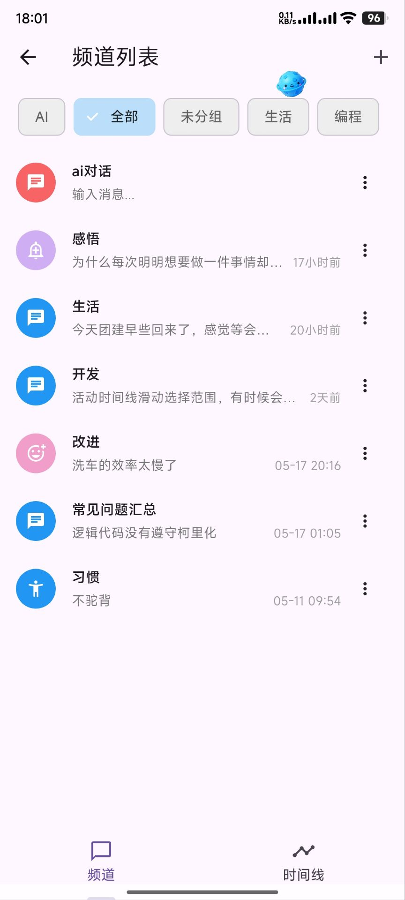
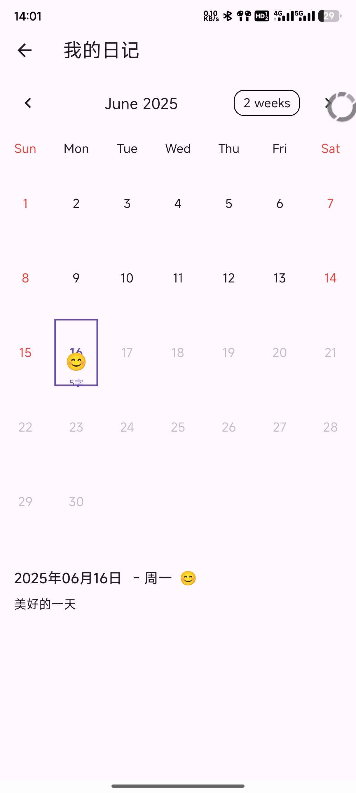
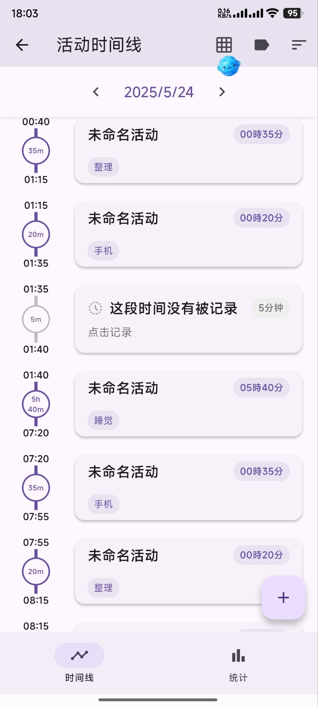
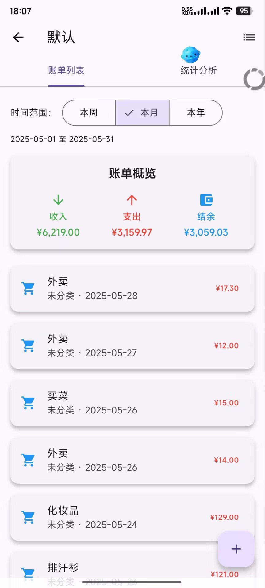
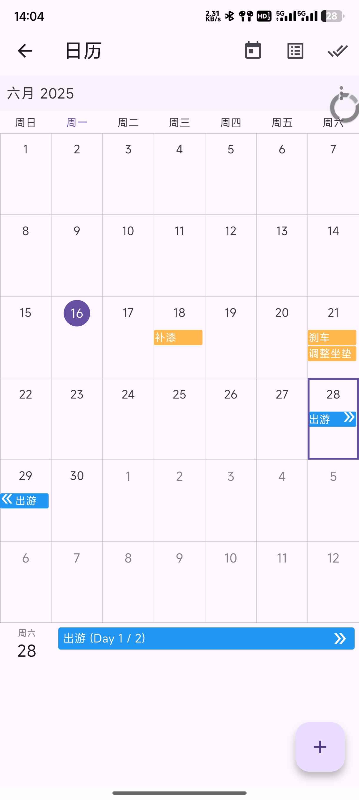
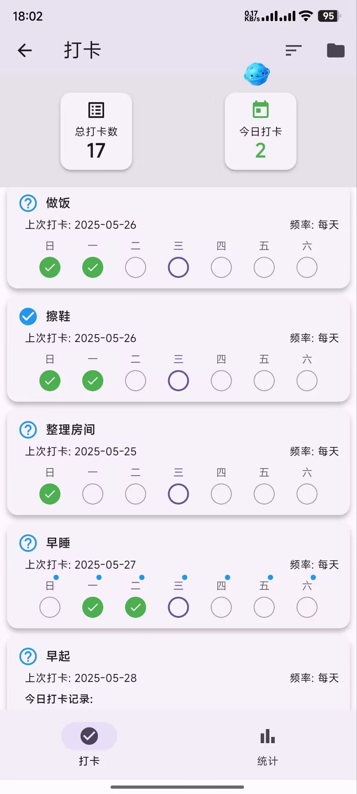
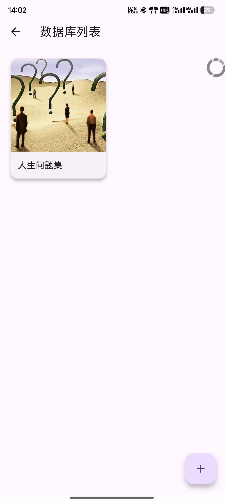
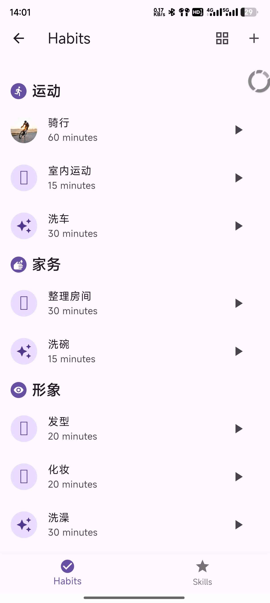
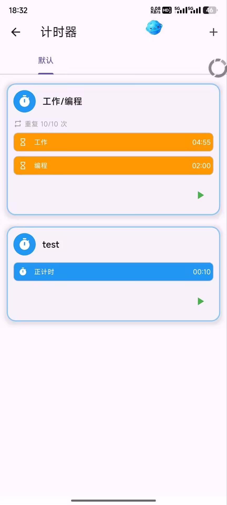
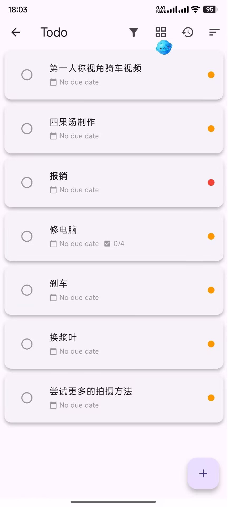

<p align="center">
  
</p>

<h1 align="center">Memento</h1>

<p align="center">
Memento 是一个使用 Flutter 构建的跨平台个人助手应用，集成了聊天、日记和活动追踪功能。
</p>

[English](README_en.md) | [下载安卓稳定版](https://github.com/hunmer/Memento/releases) | [下载测试版/其他系统](https://github.com/hunmer/Memento/actions) | 

## 项目介绍
这是一个使用 Flutter 开发的多功能记录应用集合，旨在降低不同应用间切换的成本。愿景是实现终身使用、持续改进和收集个人数据，利用AI进行数据分析和决策以改善生活。


## 快速开始

1. 克隆项目
```bash
git clone https://github.com/hunmer/Memento.git
cd Memento
```

2. 获取依赖
```bash
flutter pub get
```

3. 运行项目
```bash
# 调试模式
flutter run

# 平台特定运行
flutter run -d chrome  # 网页
flutter run -d windows # Windows
flutter run -d macos   # macOS
flutter run -d linux   # Linux
```

## 发布构建

```bash
# Android
flutter build apk --release
flutter build appbundle --release

# iOS
flutter build ios --release

# 网页
flutter build web --release

# Windows
flutter build windows --release

# macOS
flutter build macos --release

# Linux
flutter build linux --release
```

## 构建与发布

```bash
# 复制示例配置文件并编辑
cp scripts/release_config.example.json scripts/release_config.json

# 运行构建脚本
chmod +x scripts/build.sh
./scripts/build.sh

# 运行发布脚本
chmod +x scripts/release.sh
./scripts/release.sh
```

## 功能插件

### 频道聊天插件
- 创建多个频道用于自我聊天/记录，类似微信文件助手
- 支持添加markdown/图片/视频/语音记录
- @AI进行上下文对话
- 时间线视图和搜索功能

### AI助手插件
- 添加来自不同服务商的AI助手供其他插件调用
- 内置数据分析应用，可根据提示分析指定数据
- 未来支持AI插件命令和语音输入，让AI协助添加任务/创建目标

### 日记插件
- 简单的日历视图日记
- 支持markdown格式输入

### 活动记录插件
- 记录基于时间的活动
- 添加名称/标签/心情/描述等字段
- 时间线/网格显示
- 数据统计

### 笔记插件
- 无限层级笔记系统
- 支持Markdown

### 物品管理插件
- 分类个人物品管理
- 上传图片/价格/数量/自定义字段/子物品/使用记录
- 显示最后使用时间避免闲置物品

### 账单插件
- 管理多个账户
- 记录收入/支出账单
- 统计分析

### 日历插件(待完善)
- 显示所有插件事件
- 支持自定义事件
- 多种视图模式

### 签到插件
- 在不同组中创建多个签到项

### 联系人插件
- 管理联系人信息(姓名/电话/地址/标签/自定义字段)
- 记录联系历史
- 维护人际关系

### 计时器插件(待完善)
- 创建多个计时器
- 支持多种计时方式

### 任务插件
- 管理任务/子任务
- 支持优先级/日期范围/执行时间

### 纪念日插件
- 记录多个纪念日(正计时/倒计时)
- 设置封面/添加事件备注

### 目标追踪插件
- 追踪可量化的目标(如跑步距离/饮水量)

### 物品兑换插件
- 创建物品兑换系统
- 设置完成不同插件任务获得的积分

### 节点插件
- 创建笔记本系统
- 用节点/子节点树结构组织内容

### 日记相册插件
- 按日期记录日常小事
- 上传带标签的照片

### 习惯管理插件
- 管理多个习惯和技能
- 关联习惯与技能，积累"一万小时"精通度

### 数据库插件
- 创建自定义数据库
- 灵活定义字段类型
- 自由管理数据

## 注意事项
- 本软件完全由AI编写，开发者仅提供想法和框架
- 首次尝试Flutter应用，可能存在许多bug
- 欢迎开发者贡献代码！
- 目前处于早期测试阶段，更新可能导致数据丢失 - 请备份！
- 欢迎所有建议/想法，合理的将加入开发计划
- 欢迎建设性批评！

## 截图

| 聊天 | 日记 | 活动 |
|:----:|:-----:|:-----:|
|  |  |  |

| AI | 账单 | 相册 |
|:----:|:-----:|:-----:|
|  |  |  |

| 日历 | 签到 | 联系人 |
|:----:|:-----:|:-----:|
|  |  |  |

| 数据库 | 每日 | 日记 |
|:----:|:-----:|:-----:|
|  |  |  |

| 物品 | 习惯 | 笔记 |
|:----:|:-----:|:-----:|
|  |  |  |

| 商店 | 计时器 | 待办 | 追踪器 |
|:----:|:-----:|:-----:|:-----:|
|  |  |  |  |