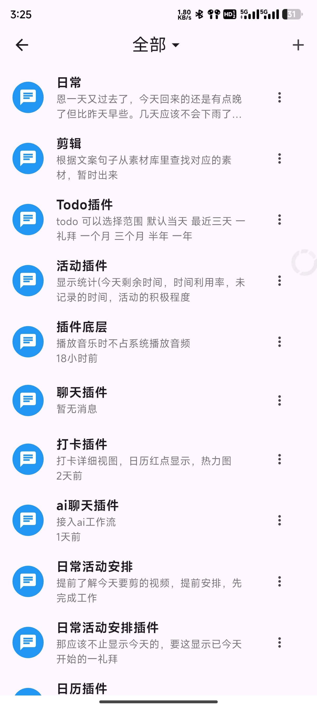
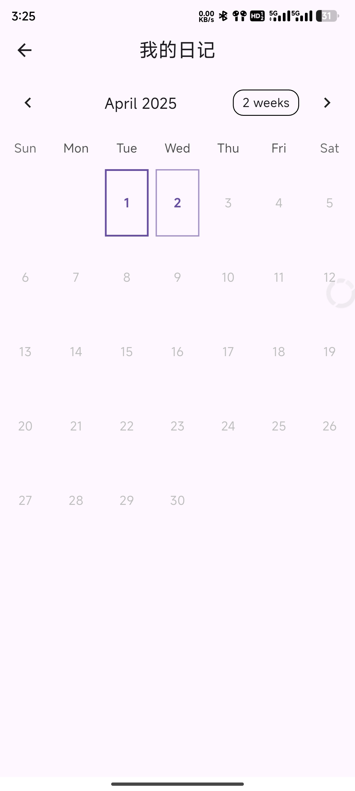
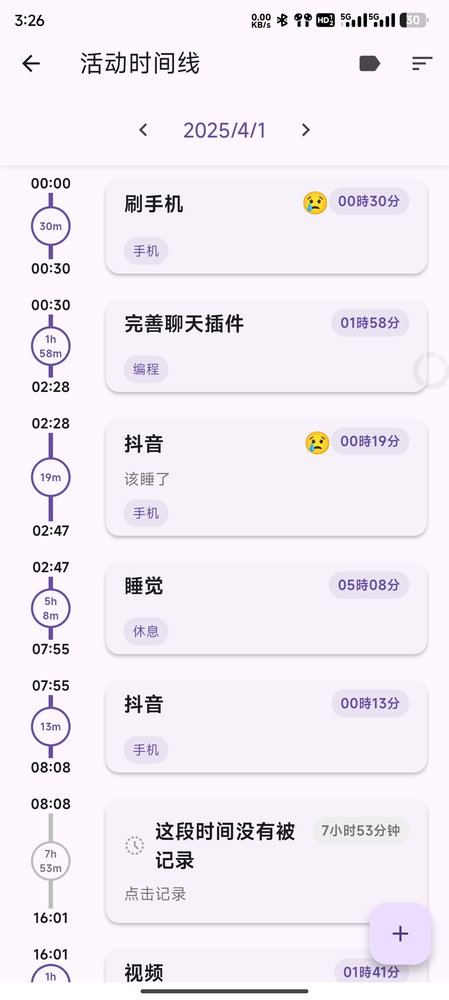

# Memento

Memento 是一个基于 Flutter 开发的跨平台应用程序，集成了聊天、日记和活动记录等功能的个人助手应用。

[English](README.md)

## 功能特点

- 💬 聊天功能：支持多人聊天、消息管理
- 📝 日记功能：记录每日心情和生活点滴
- 📅 活动记录：跟踪和管理个人活动
- 🔌 插件系统：支持功能扩展
- 💾 本地存储：确保数据安全性
- 🌐 跨平台支持：支持 Android、iOS、Web、Windows、macOS 和 Linux

## 项目结构

```
lib/
├── core/          # 核心功能实现
├── models/        # 数据模型
├── plugins/       # 插件系统
├── screens/       # 页面
├── utils/         # 工具类
└── widgets/       # 通用组件
```

## 开发环境要求

- Flutter SDK: 最新稳定版
- Dart SDK: 最新稳定版
- 支持的 IDE: Android Studio, VS Code

## 快速开始

1. 克隆项目
```bash
git clone https://github.com/hunmer/Memento.git
cd Memento
```

2. 获取依赖
```bash
flutter pub get
```

3. 运行项目
```bash
# 调试模式运行
flutter run

# 指定平台运行
flutter run -d chrome  # Web
flutter run -d windows # Windows
flutter run -d macos   # macOS
flutter run -d linux   # Linux
```

## 构建发布

```bash
# Android
flutter build apk --release
flutter build appbundle --release

# iOS
flutter build ios --release

# Web
flutter build web --release

# Windows
flutter build windows --release

# macOS
flutter build macos --release

# Linux
flutter build linux --release
```

## 插件开发

Memento 支持插件系统，您可以通过以下步骤开发新插件：

1. 在 `lib/plugins` 目录下创建新的插件目录
2. 实现 `BasePlugin` 接口
3. 在 `plugin.json` 中配置插件信息
4. 重启应用加载新插件

## 贡献指南

欢迎提交 Pull Request 或创建 Issue！

## 应用截图

| 聊天功能 | 日记功能 | 活动记录 |
|:--------:|:--------:|:--------:|
|  |  |  |

| 插件系统 | 本地存储 | 跨平台支持 |
|:--------:|:--------:|:----------:|
|  |  |  |

## 许可证

本项目采用 MIT 许可证