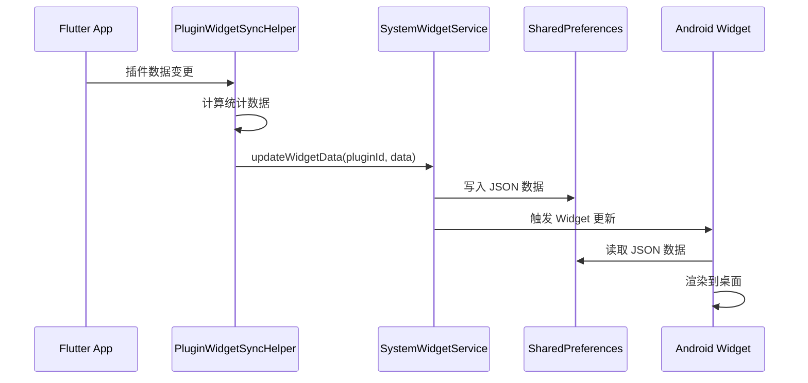

# Memento 小组件实现指南

> 本文档说明如何为 Memento 插件添加 Android 桌面小组件支持

**版本**: 1.0
**更新日期**: 2025-01-21
**适用于**: Memento 插件系统

---

## 目录

1. [概述](#概述)
2. [架构说明](#架构说明)
3. [实现步骤](#实现步骤)
4. [完整示例](#完整示例)
5. [数据同步最佳实践](#数据同步最佳实践)
6. [常见问题](#常见问题)
7. [附录](#附录)

---

## 概述

### 小组件尺寸支持

Memento 目前支持两种小组件尺寸：

| 尺寸 | 网格 | 统计项数量 | 适用场景 |
|------|------|-----------|---------|
| **1x1** | 1列×1行 | 1个 | 单一核心指标展示 |
| **2x2** | 2列×2行 | 最多4个 | 多维度数据展示（推荐） |

### 小组件工作流程



---

## 架构说明

### 核心组件

```
lib/
├── core/services/
│   ├── system_widget_service.dart           # 小组件数据同步服务
│   └── plugin_widget_sync_helper.dart       # 各插件的同步逻辑
└── plugins/<plugin_id>/
    └── <plugin_id>_plugin.dart              # 插件主类（提供数据接口）

android/app/src/main/kotlin/github/hunmer/memento/
├── widget/
│   ├── BasePluginWidgetProvider.kt          # 小组件基类
│   └── providers/
│       └── <Plugin>WidgetProvider.kt        # 插件专属 Provider
└── AndroidManifest.xml                       # 注册小组件
```

### 数据流向

```
插件数据 → PluginWidgetSyncHelper.syncXxx()
         → SystemWidgetService.updateWidgetData()
         → SharedPreferences
         → BasePluginWidgetProvider.updateAppWidget()
         → RemoteViews
         → 桌面显示
```

---

## 实现步骤

### 步骤 1: 创建 Android WidgetProvider 类

**位置**: `android/app/src/main/kotlin/github/hunmer/memento/widget/providers/<Plugin>WidgetProvider.kt`

**示例代码**:

```kotlin
package github.hunmer.memento.widget.providers

import github.hunmer.memento.widget.BasePluginWidgetProvider

/**
 * <插件名称>小组件 - 1x1 尺寸
 */
class <Plugin>WidgetProvider : BasePluginWidgetProvider() {
    override val pluginId: String = "<plugin_id>"  // 插件 ID（与 Flutter 端一致）
    override val widgetSize: WidgetSize = WidgetSize.SIZE_1X1
}

/**
 * <插件名称>小组件 - 2x2 尺寸
 */
class <Plugin>Widget2x1Provider : BasePluginWidgetProvider() {
    override val pluginId: String = "<plugin_id>"
    override val widgetSize: WidgetSize = WidgetSize.SIZE_2X2
}
```

**关键点**:
- 文件命名：`<Plugin>WidgetProvider.kt`（首字母大写）
- `pluginId` 必须与 Flutter 插件的 `id` 属性完全一致
- 类名建议：`<Plugin>WidgetProvider` 和 `<Plugin>Widget2x1Provider`

---

### 步骤 2: 在 AndroidManifest.xml 中注册

**位置**: `android/app/src/main/AndroidManifest.xml`

**在 `<application>` 标签内添加**:

```xml
<!-- <插件名称>小组件 - 1x1 -->
<receiver
    android:name=".widget.providers.<Plugin>WidgetProvider"
    android:exported="false">
    <intent-filter>
        <action android:name="android.appwidget.action.APPWIDGET_UPDATE" />
    </intent-filter>
    <meta-data
        android:name="android.appwidget.provider"
        android:resource="@xml/widget_plugin_1x1_info" />
</receiver>

<!-- <插件名称>小组件 - 2x2 -->
<receiver
    android:name=".widget.providers.<Plugin>Widget2x1Provider"
    android:exported="false">
    <intent-filter>
        <action android:name="android.appwidget.action.APPWIDGET_UPDATE" />
    </intent-filter>
    <meta-data
        android:name="android.appwidget.provider"
        android:resource="@xml/widget_plugin_2x1_info" />
</receiver>
```

**替换规则**:
- `<Plugin>` → 实际的类名（如 `Diary`、`Notes`）
- 保持 `android:exported="false"` 不变（安全考虑）

---

### 步骤 3: 在 Flutter 端实现数据同步

#### 3.1 在插件中暴露数据访问方法

**位置**: `lib/plugins/<plugin_id>/<plugin_id>_plugin.dart`

```dart
class <Plugin>Plugin extends BasePlugin {
  // ... 现有代码 ...

  /// 供小组件同步使用的统计方法
  /// 示例：获取今日数据
  Future<int> getTodayCount() async {
    if (!_isInitialized) return 0;
    // 从服务层或数据存储中获取数据
    final data = await _service.getTodayData();
    return data.length;
  }

  /// 示例：获取总数
  Future<int> getTotalCount() async {
    if (!_isInitialized) return 0;
    final allData = await _service.getAllData();
    return allData.length;
  }

  // 可选：同步方法（推荐在数据变更后调用）
  Future<void> syncToWidget() async {
    await PluginWidgetSyncHelper.instance.sync<Plugin>();
  }
}
```

**设计原则**:
- ✅ 方法名清晰明了（如 `getTodayXxx`, `getTotalXxx`）
- ✅ 返回基础数据类型（int, String, double）
- ✅ 处理未初始化状态（返回默认值）
- ✅ 使用 async 以支持异步数据加载

---

#### 3.2 在 PluginWidgetSyncHelper 中添加同步逻辑

**位置**: `lib/core/services/plugin_widget_sync_helper.dart`

**步骤 A: 在 `syncAllPlugins()` 中添加调用**

```dart
Future<void> syncAllPlugins() async {
  await Future.wait([
    // ... 现有插件 ...
    sync<Plugin>(),  // 添加新插件
  ]);
}
```

**步骤 B: 实现 `sync<Plugin>()` 方法**

```dart
/// 同步<插件名称>插件
Future<void> sync<Plugin>() async {
  try {
    final plugin = PluginManager.instance.getPlugin('<plugin_id>') as <Plugin>Plugin?;
    if (plugin == null) return;

    // 1. 获取统计数据
    final todayCount = await plugin.getTodayCount();
    final totalCount = await plugin.getTotalCount();
    // ... 其他需要的数据

    // 2. 计算衍生指标（可选）
    final percentage = totalCount > 0 ? (todayCount / totalCount * 100).toStringAsFixed(0) : '0';

    // 3. 更新小组件
    await _updateWidget(
      pluginId: '<plugin_id>',
      pluginName: '<插件显示名称>',
      iconCodePoint: Icons.<icon_name>.codePoint,
      colorValue: Colors.<color>.value,
      stats: [
        WidgetStatItem(
          id: 'today',
          label: '今日',
          value: '$todayCount',
          highlight: todayCount > 0,  // 条件高亮
          colorValue: todayCount > 0 ? Colors.green.value : null,
        ),
        WidgetStatItem(
          id: 'total',
          label: '总计',
          value: '$totalCount',
        ),
        WidgetStatItem(
          id: 'percentage',
          label: '完成度',
          value: '$percentage%',
        ),
        // 2x2 小组件最多支持 4 个统计项
      ],
    );
  } catch (e) {
    debugPrint('Failed to sync <plugin> widget: $e');
  }
}
```

---

#### 3.3 在 SystemWidgetService 中注册 Provider 映射

**位置**: `lib/core/services/system_widget_service.dart`

**步骤 A: 在 `updateAllWidgets()` 中添加 Provider 名称**

```dart
Future<void> updateAllWidgets() async {
  final providers = [
    // ... 现有 Provider ...
    '<Plugin>WidgetProvider',  // 添加新的
  ];
  // ...
}
```

**步骤 B: 在 `_getProviderName()` 中添加映射**

```dart
String? _getProviderName(String pluginId) {
  final providerMap = {
    // ... 现有映射 ...
    '<plugin_id>': '<Plugin>WidgetProvider',  // 添加新的
  };
  return providerMap[pluginId];
}
```

---

### 步骤 4: 触发数据同步

#### 方式 1: 手动触发（推荐）

在插件数据变更的关键位置调用：

```dart
// 创建/编辑/删除数据后
await _service.saveData(newData);

// 同步到小组件
await PluginWidgetSyncHelper.instance.sync<Plugin>();
```

**常见触发点**:
- 创建新记录
- 编辑记录
- 删除记录
- 批量操作完成

---

#### 方式 2: 定时自动刷新

在 `main.dart` 或插件初始化时设置：

```dart
// 每 30 分钟自动刷新
Timer.periodic(Duration(minutes: 30), (_) {
  PluginWidgetSyncHelper.instance.syncAllPlugins();
});
```

---

## 完整示例

### 示例：为 Notes（笔记）插件添加小组件

#### 1. 创建 WidgetProvider

**文件**: `android/app/src/main/kotlin/github/hunmer/memento/widget/providers/NotesWidgetProvider.kt`

```kotlin
package github.hunmer.memento.widget.providers

import github.hunmer.memento.widget.BasePluginWidgetProvider

/**
 * 笔记小组件 - 1x1 尺寸
 */
class NotesWidgetProvider : BasePluginWidgetProvider() {
    override val pluginId: String = "notes"
    override val widgetSize: WidgetSize = WidgetSize.SIZE_1X1
}

/**
 * 笔记小组件 - 2x2 尺寸
 */
class NotesWidget2x1Provider : BasePluginWidgetProvider() {
    override val pluginId: String = "notes"
    override val widgetSize: WidgetSize = WidgetSize.SIZE_2X2
}
```

---

#### 2. 注册到 AndroidManifest.xml

```xml
<!-- 笔记小组件 - 1x1 -->
<receiver
    android:name=".widget.providers.NotesWidgetProvider"
    android:exported="false">
    <intent-filter>
        <action android:name="android.appwidget.action.APPWIDGET_UPDATE" />
    </intent-filter>
    <meta-data
        android:name="android.appwidget.provider"
        android:resource="@xml/widget_plugin_1x1_info" />
</receiver>

<!-- 笔记小组件 - 2x2 -->
<receiver
    android:name=".widget.providers.NotesWidget2x1Provider"
    android:exported="false">
    <intent-filter>
        <action android:name="android.appwidget.action.APPWIDGET_UPDATE" />
    </intent-filter>
    <meta-data
        android:name="android.appwidget.provider"
        android:resource="@xml/widget_plugin_2x1_info" />
</receiver>
```

---

#### 3. 在 NotesPlugin 中暴露数据接口

**文件**: `lib/plugins/notes/notes_plugin.dart`

```dart
class NotesPlugin extends BasePlugin {
  // ... 现有代码 ...

  /// 获取今日创建的笔记数
  Future<int> getTodayNoteCount() async {
    if (!_isInitialized) return 0;

    final today = DateTime.now();
    final todayStart = DateTime(today.year, today.month, today.day);

    final allNotes = await _noteService.getAllNotes();
    return allNotes.where((note) {
      return note.createdAt.isAfter(todayStart);
    }).length;
  }

  /// 获取总笔记数
  Future<int> getTotalNoteCount() async {
    if (!_isInitialized) return 0;
    final allNotes = await _noteService.getAllNotes();
    return allNotes.length;
  }

  /// 获取本周新增笔记数
  Future<int> getWeekNoteCount() async {
    if (!_isInitialized) return 0;

    final now = DateTime.now();
    final weekStart = now.subtract(Duration(days: now.weekday - 1));
    final weekStartDate = DateTime(weekStart.year, weekStart.month, weekStart.day);

    final allNotes = await _noteService.getAllNotes();
    return allNotes.where((note) {
      return note.createdAt.isAfter(weekStartDate);
    }).length;
  }

  /// 获取总字数
  Future<int> getTotalWordCount() async {
    if (!_isInitialized) return 0;

    final allNotes = await _noteService.getAllNotes();
    int totalWords = 0;

    for (final note in allNotes) {
      // 简单的字数统计（按空格分割）
      totalWords += note.content.split(RegExp(r'\s+')).length;
    }

    return totalWords;
  }
}
```

---

#### 4. 实现数据同步逻辑

**文件**: `lib/core/services/plugin_widget_sync_helper.dart`

```dart
/// 同步笔记插件
Future<void> syncNotes() async {
  try {
    final plugin = PluginManager.instance.getPlugin('notes') as NotesPlugin?;
    if (plugin == null) return;

    // 获取统计数据
    final todayCount = await plugin.getTodayNoteCount();
    final totalCount = await plugin.getTotalNoteCount();
    final weekCount = await plugin.getWeekNoteCount();
    final totalWords = await plugin.getTotalWordCount();

    // 格式化字数（超过 1000 显示为 k）
    final wordsDisplay = totalWords >= 1000
        ? '${(totalWords / 1000.0).toStringAsFixed(1)}k'
        : '$totalWords';

    await _updateWidget(
      pluginId: 'notes',
      pluginName: '笔记',
      iconCodePoint: Icons.note.codePoint,
      colorValue: Colors.yellow.shade700.value,
      stats: [
        WidgetStatItem(
          id: 'today',
          label: '今日新增',
          value: '$todayCount',
          highlight: todayCount > 0,
          colorValue: todayCount > 0 ? Colors.green.value : null,
        ),
        WidgetStatItem(
          id: 'week',
          label: '本周新增',
          value: '$weekCount',
        ),
        WidgetStatItem(
          id: 'total',
          label: '总笔记',
          value: '$totalCount',
        ),
        WidgetStatItem(
          id: 'words',
          label: '总字数',
          value: wordsDisplay,
        ),
      ],
    );
  } catch (e) {
    debugPrint('Failed to sync notes widget: $e');
  }
}
```

**同时更新其他必要位置**:

```dart
// syncAllPlugins() 中添加
await Future.wait([
  // ...
  syncNotes(),
]);

// SystemWidgetService 中添加
final providers = [
  // ...
  'NotesWidgetProvider',
];

final providerMap = {
  // ...
  'notes': 'NotesWidgetProvider',
};
```

---

#### 5. 在数据变更处触发同步

**文件**: `lib/plugins/notes/services/note_service.dart` 或控制器中

```dart
// 创建笔记
Future<void> createNote(Note note) async {
  await _storage.saveNote(note);

  // 同步到小组件
  await PluginWidgetSyncHelper.instance.syncNotes();
}

// 删除笔记
Future<void> deleteNote(String noteId) async {
  await _storage.deleteNote(noteId);

  // 同步到小组件
  await PluginWidgetSyncHelper.instance.syncNotes();
}
```

---

## 数据同步最佳实践

### 1. 统计项设计原则

#### ✅ 好的统计项

```dart
WidgetStatItem(
  id: 'today_count',
  label: '今日新增',          // 简短明了
  value: '5',                 // 数字清晰
  highlight: true,            // 有条件高亮
  colorValue: Colors.green.value,
)
```

**特点**:
- 用户关心的核心指标
- 标签简短（4-6 个汉字）
- 数值直观（带单位）
- 有条件高亮增强可读性

#### ❌ 不好的统计项

```dart
WidgetStatItem(
  id: 'complex_calculation',
  label: '加权平均完成度与预期偏差值',  // ❌ 标签过长
  value: '0.00123456789',              // ❌ 精度过高
  highlight: false,                     // ❌ 无区分度
)
```

---

### 2. 数值格式化建议

| 数据类型 | 格式化方式 | 示例 |
|---------|-----------|------|
| **计数** | 直接显示，大于 1000 用 k | `1234` → `1.2k` |
| **时长** | 小时.分钟 | `125分钟` → `2.1h` |
| **百分比** | 整数 % | `45.678%` → `46%` |
| **货币** | 带符号，保留小数 | `1234.56` → `¥1,235` |
| **日期** | 相对时间 | `2天前`、`1小时前` |

**示例代码**:

```dart
// 数字格式化
String formatCount(int count) {
  if (count >= 1000000) {
    return '${(count / 1000000.0).toStringAsFixed(1)}M';
  } else if (count >= 1000) {
    return '${(count / 1000.0).toStringAsFixed(1)}k';
  }
  return '$count';
}

// 时长格式化
String formatDuration(int minutes) {
  final hours = minutes / 60.0;
  return '${hours.toStringAsFixed(1)}h';
}

// 百分比格式化
String formatPercentage(double value) {
  return '${value.toStringAsFixed(0)}%';
}
```

---

### 3. 高亮规则设计

**推荐的高亮场景**:

```dart
// 场景 1: 完成度达标
WidgetStatItem(
  id: 'progress',
  label: '完成度',
  value: '$percentage%',
  highlight: percentage >= 100,
  colorValue: percentage >= 100 ? Colors.green.value : null,
)

// 场景 2: 异常警告
WidgetStatItem(
  id: 'remaining',
  label: '剩余时间',
  value: '${hours}h',
  highlight: hours < 2,
  colorValue: hours < 2 ? Colors.red.value : null,
)

// 场景 3: 连续成就
WidgetStatItem(
  id: 'streak',
  label: '连续天数',
  value: '$days天',
  highlight: days >= 7,
  colorValue: days >= 7 ? Colors.amber.value : null,
)

// 场景 4: 新增内容
WidgetStatItem(
  id: 'today',
  label: '今日新增',
  value: '$count',
  highlight: count > 0,
  colorValue: count > 0 ? Colors.green.value : null,
)
```

**颜色选择建议**:
- 🟢 **绿色** (`Colors.green`): 正面指标、完成、成功
- 🔴 **红色** (`Colors.red`): 警告、未读、异常
- 🟡 **黄色/琥珀** (`Colors.amber`): 中性提示、成就
- 🟠 **橙色** (`Colors.orange`): 进行中、活跃

---

### 4. 性能优化

#### 缓存机制

对于计算密集型统计，建议在插件中缓存：

```dart
class MyPlugin extends BasePlugin {
  // 缓存
  int? _cachedTodayCount;
  DateTime? _cacheDate;

  Future<int> getTodayCount() async {
    final today = DateTime.now();
    final todayDate = DateTime(today.year, today.month, today.day);

    // 检查缓存
    if (_cacheDate != null && _cacheDate!.isAtSameMomentAs(todayDate)) {
      return _cachedTodayCount ?? 0;
    }

    // 重新计算
    final count = await _service.calculateTodayCount();

    // 更新缓存
    _cachedTodayCount = count;
    _cacheDate = todayDate;

    return count;
  }

  // 数据变更时清除缓存
  Future<void> onDataChanged() async {
    _cachedTodayCount = null;
    _cacheDate = null;

    await syncToWidget();
  }
}
```

---

#### 批量更新

避免频繁调用，使用防抖：

```dart
Timer? _syncTimer;

void scheduleSyncToWidget() {
  _syncTimer?.cancel();
  _syncTimer = Timer(Duration(seconds: 2), () {
    PluginWidgetSyncHelper.instance.syncMyPlugin();
  });
}
```

---

## 常见问题

### Q1: 小组件不显示数据，显示占位符

**可能原因**:
1. `pluginId` 不匹配
2. Flutter 端未调用 `sync<Plugin>()`
3. 插件未初始化完成

**排查步骤**:
```dart
// 1. 检查 pluginId
print('Plugin ID: ${plugin.id}');  // 应输出正确的 ID

// 2. 手动触发同步
await PluginWidgetSyncHelper.instance.sync<Plugin>();

// 3. 检查 SharedPreferences
final prefs = await SharedPreferences.getInstance();
final data = prefs.getString('<plugin_id>_widget_data');
print('Widget data: $data');
```

---

### Q2: 如何调试小组件数据

**方法 1: 查看 SharedPreferences**

```dart
// 在 Flutter 端
import 'package:shared_preferences/shared_preferences.dart';

final prefs = await SharedPreferences.getInstance();
final widgetData = prefs.getString('notes_widget_data');
print('Widget Data: $widgetData');
```

**方法 2: Android 日志**

```kotlin
// 在 BasePluginWidgetProvider.kt 中添加日志
private fun loadWidgetData(context: Context): JSONObject? {
    val prefs = context.getSharedPreferences(PREFS_NAME, Context.MODE_PRIVATE)
    val jsonString = prefs.getString("${pluginId}_widget_data", null)

    Log.d("WidgetDebug", "Plugin: $pluginId, Data: $jsonString")  // 添加这行

    return try {
        JSONObject(jsonString)
    } catch (e: Exception) {
        null
    }
}
```

---

### Q3: 小组件更新不及时

**解决方案**:

1. **手动刷新** - 在数据变更后立即调用同步
2. **定时刷新** - 设置周期性更新（建议 30 分钟）
3. **检查更新周期** - 确保 `widget_plugin_2x1_info.xml` 中的 `updatePeriodMillis` 设置合理

```xml
<!-- 最短 30 分钟（1800000 毫秒） -->
<appwidget-provider
    android:updatePeriodMillis="1800000"
    .../>
```

---

### Q4: 如何支持点击跳转到插件

**当前实现**:

小组件点击会自动跳转到对应插件，无需额外配置。

**工作原理**:

```kotlin
// BasePluginWidgetProvider.kt
private fun setupClickIntent(context: Context, views: RemoteViews) {
    val intent = Intent(context, MainActivity::class.java).apply {
        action = Intent.ACTION_VIEW
        data = Uri.parse("memento://widget/$pluginId")  // 自动跳转
        flags = Intent.FLAG_ACTIVITY_NEW_TASK or Intent.FLAG_ACTIVITY_CLEAR_TOP
    }
    // ...
}
```

---

### Q5: 小组件显示异常字符

**常见原因**: 图标 codePoint 错误

**解决方法**:

```dart
// ✅ 正确方式
iconCodePoint: Icons.note.codePoint,

// ❌ 错误方式
iconCodePoint: 0xE87C,  // 硬编码可能不准确
```

**验证图标**:

```dart
print('Icon CodePoint: ${Icons.note.codePoint}');  // 打印正确的值
```

---

## 附录

### A. 完整的插件统计项示例

```dart
// Activity - 活动追踪
stats: [
  WidgetStatItem(id: 'count', label: '今日活动', value: '$activityCount'),
  WidgetStatItem(id: 'duration', label: '已记录', value: '${durationHours}h'),
  WidgetStatItem(id: 'remaining', label: '剩余时间', value: '${remainingHours}h', highlight: remainingMinutes < 120, colorValue: Colors.red.value),
  WidgetStatItem(id: 'coverage', label: '覆盖率', value: '$coveragePercent%'),
]

// Diary - 日记
stats: [
  WidgetStatItem(id: 'today', label: '今日字数', value: '$todayCount', highlight: todayCount > 0, colorValue: Colors.deepOrange.value),
  WidgetStatItem(id: 'month', label: '本月字数', value: '$monthCount'),
  WidgetStatItem(id: 'progress', label: '本月进度', value: '$completedDays/$totalDays', highlight: completedDays == totalDays, colorValue: Colors.green.value),
]

// Checkin - 签到
stats: [
  WidgetStatItem(id: 'today', label: '今日完成', value: '$todayCount/$totalItems', highlight: todayCount == totalItems, colorValue: Colors.green.value),
  WidgetStatItem(id: 'total', label: '总签到数', value: '$totalCheckins'),
  WidgetStatItem(id: 'streak', label: '最长连续', value: '$maxConsecutiveDays天', highlight: maxConsecutiveDays >= 7, colorValue: Colors.amber.value),
]

// Chat - 聊天
stats: [
  WidgetStatItem(id: 'channels', label: '频道数', value: '$channelCount'),
  WidgetStatItem(id: 'messages', label: '消息数', value: '$totalMessageCount'),
  WidgetStatItem(id: 'unread', label: '未读', value: '$unreadCount', highlight: unreadCount > 0, colorValue: Colors.red.value),
]

// Habits - 习惯
stats: [
  WidgetStatItem(id: 'habits', label: '习惯', value: '$habitCount'),
  WidgetStatItem(id: 'skills', label: '技能', value: '$skillCount'),
]
```

---

### B. 当前已实现的插件列表

| 插件 ID | 插件名称 | 2x2 小组件 | 数据同步 | 统计项数量 |
|---------|---------|-----------|---------|-----------|
| `activity` | 活动记录 | ✅ | ✅ | 4 |
| `diary` | 日记 | ✅ | ✅ | 3 |
| `checkin` | 签到 | ✅ | ✅ | 3 |
| `chat` | 聊天 | ✅ | ✅ | 3 |
| `habits` | 习惯 | ✅ | ✅ | 2 |
| `todo` | 待办事项 | ✅ | ⚠️ 占位符 | - |
| `timer` | 计时器 | ✅ | ⚠️ 占位符 | - |
| `bill` | 账单 | ✅ | ⚠️ 占位符 | - |
| `calendar` | 日历 | ✅ | ⚠️ 占位符 | - |
| `tracker` | 目标追踪 | ✅ | ⚠️ 占位符 | - |
| `notes` | 笔记 | ✅ | ⚠️ 占位符 | - |
| `goods` | 物品管理 | ✅ | ⚠️ 占位符 | - |
| `store` | 商店 | ✅ | ⚠️ 占位符 | - |
| `nodes` | 节点 | ✅ | ⚠️ 占位符 | - |
| `database` | 数据库 | ✅ | ⚠️ 占位符 | - |
| `contact` | 联系人 | ✅ | ⚠️ 占位符 | - |
| `day` | 纪念日 | ✅ | ⚠️ 占位符 | - |
| `openai` | AI助手 | ✅ | ⚠️ 占位符 | - |
| `agent_chat` | AI对话 | ✅ | ⚠️ 占位符 | - |
| `calendar_album` | 相册 | ✅ | ⚠️ 占位符 | - |

**图例**:
- ✅ 已完整实现
- ⚠️ 已注册但显示占位符数据

---

### C. 测试检查清单

在实现小组件后，请按以下清单验证：

- [ ] **Android 代码**
  - [ ] WidgetProvider 类已创建
  - [ ] pluginId 与 Flutter 端一致
  - [ ] AndroidManifest.xml 已正确注册
  - [ ] 编译无错误

- [ ] **Flutter 代码**
  - [ ] 插件暴露了统计方法
  - [ ] PluginWidgetSyncHelper 中实现了 `sync<Plugin>()`
  - [ ] syncAllPlugins() 中已添加调用
  - [ ] SystemWidgetService 映射已更新

- [ ] **数据同步**
  - [ ] 手动调用 sync 方法可以更新数据
  - [ ] SharedPreferences 中能看到 JSON 数据
  - [ ] 数据格式正确（有 pluginId, stats 等字段）

- [ ] **界面测试**
  - [ ] 能在桌面添加小组件
  - [ ] 小组件显示正确的统计数据
  - [ ] 高亮和颜色按预期显示
  - [ ] 点击小组件能跳转到插件

- [ ] **边界情况**
  - [ ] 插件未初始化时返回默认值
  - [ ] 数据为空时显示 "0" 或 "-"
  - [ ] 异常时不会崩溃

---

### D. 参考资料

**项目内部文档**:
- `CLAUDE.md` - 项目总览
- `lib/core/CLAUDE.md` - 核心层文档
- `lib/plugins/activity/CLAUDE.md` - Activity 插件文档（参考实现）

**相关文件**:
- `lib/core/services/system_widget_service.dart` - 小组件服务
- `lib/core/services/plugin_widget_sync_helper.dart` - 同步辅助类
- `android/.../widget/BasePluginWidgetProvider.kt` - 小组件基类

**Android 官方文档**:
- [AppWidget 概览](https://developer.android.com/guide/topics/appwidgets/overview)
- [RemoteViews 参考](https://developer.android.com/reference/android/widget/RemoteViews)

---

## 变更记录

| 版本 | 日期 | 变更内容 |
|------|------|---------|
| 1.0 | 2025-01-21 | 初始版本，基于 Activity/Diary/Checkin/Chat/Habits 实现经验整理 |

---

**文档维护者**: Memento AI Development Team
**最后更新**: 2025-01-21
