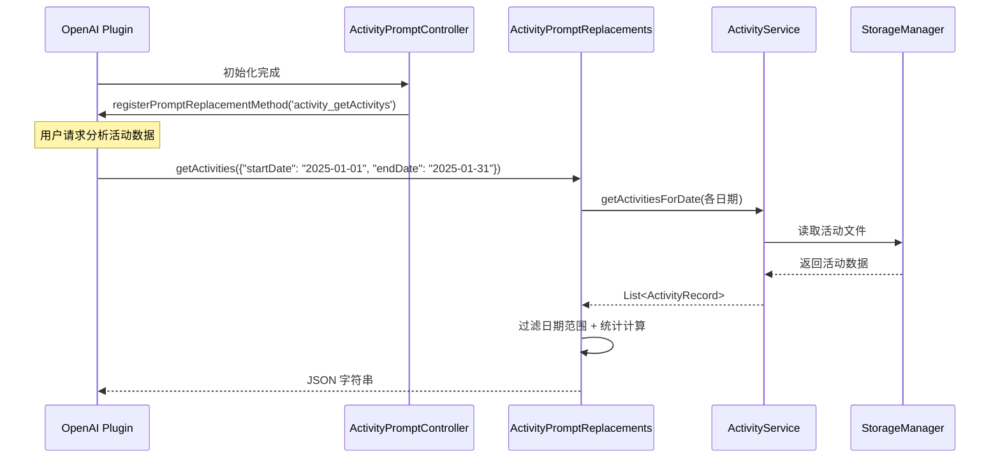

[根目录](../../../CLAUDE.md) > [lib](../../) > [plugins](../) > **activity**

---

# 活动插件 (Activity Plugin) - 模块文档

## 模块职责

活动插件是 Memento 的核心时间管理模块,提供:

- **时间轴视图管理**: 基于日期的时间轴展示活动记录
- **网格视图**: 24小时网格可视化,快速选择未记录时间段
- **活动记录管理**: 创建、编辑、删除活动记录(带时间段、标题、标签、心情)
- **标签分组系统**: 支持标签分组管理和最近使用标签
- **时间统计**: 今日活动数、今日时长、剩余时间统计
- **统计图表**: 时间分布图、活动分布饼图
- **AI 数据分析**: 注册到 OpenAI 插件,支持活动数据分析
- **时间重叠检测**: 自动检测和处理时间段重叠

---

## 入口与启动

### 插件主类

**文件**: `activity_plugin.dart`

```dart
class ActivityPlugin extends BasePlugin {
    @override
    String id => 'activity';

    @override
    Future<void> initialize() async {
        // 确保活动数据目录存在
        await storage.createDirectory('activity');

        // 初始化服务
        _activityService = ActivityService(storage, 'activity');

        // 初始化Prompt控制器
        _promptController = ActivityPromptController(storage, 'activity');
        _promptController.initialize();

        _isInitialized = true;
    }

    @override
    Future<void> registerToApp(
        PluginManager pluginManager,
        ConfigManager configManager,
    ) async {
        // 插件已在 initialize() 中完成初始化
    // 这里可以添加额外的应用级注册逻辑
    }
}
```

### 主界面入口

**文件**: `activity_plugin.dart`

**路由**: 通过 `ActivityPlugin.buildMainView()` 返回 `ActivityMainView`,内部使用 `NavigationBar` 切换两个界面:
- **时间轴视图** (`ActivityTimelineScreen`): 主要的活动记录界面
- **统计视图** (`ActivityStatisticsScreen`): 数据可视化和统计分析

---

## 对外接口

### 核心 API

#### 统计接口

```dart
// 获取今日活动数
Future<int> getTodayActivityCount();

// 获取今日活动总时长(分钟)
Future<int> getTodayActivityDuration();

// 获取今日剩余时间(分钟)
int getTodayRemainingTime();
```

#### ActivityService 服务类

**文件**: `services/activity_service.dart`

```dart
// 保存活动记录(自动处理时间重叠)
Future<void> saveActivity(ActivityRecord activity);

// 获取指定日期的所有活动
Future<List<ActivityRecord>> getActivitiesForDate(DateTime date);

// 更新活动记录(支持跨日期更新)
Future<void> updateActivity(
  ActivityRecord oldActivity,
  ActivityRecord newActivity,
);

// 删除活动记录
Future<void> deleteActivity(ActivityRecord activity);

// 检查时间段是否有重叠的活动
Future<bool> hasOverlappingActivities(
  DateTime start,
  DateTime end, {
  ActivityRecord? excludeActivity,
});

// 标签管理
Future<void> saveTagGroups(List<TagGroup> groups);
Future<List<TagGroup>> getTagGroups();
Future<void> saveRecentTags(List<String> tags);
Future<List<String>> getRecentTags();

// 心情管理
Future<void> saveRecentMoods(List<String> moods);
Future<List<String>> getRecentMoods();
```

### AI 集成接口

#### Prompt 替换方法

**文件**: `services/prompt_replacements.dart`

```dart
// 获取指定日期范围的活动数据(供 OpenAI 插件调用)
Future<String> getActivities(Map<String, dynamic> params);
// params: { "startDate": "YYYY-MM-DD", "endDate": "YYYY-MM-DD" }
// 返回: JSON 字符串,包含活动列表、统计信息和标签统计
```

**注册方式**: 通过 `ActivityPromptController` 在 OpenAI 插件中注册为 `activity_getActivitys` 方法

**返回数据格式**:
```json
{
  "sum": {
    "total": 10,           // 总活动数
    "tDur": 480,          // 总时长(分钟)
    "avgDur": 48          // 平均时长(分钟)
  },
  "tagStat": {            // 按标签统计时长(分钟)
    "工作": 240,
    "学习": 120,
    "运动": 60
  },
  "records": [            // 详细活动记录列表
    {
      "start": "2025-01-15 08:00",
      "end": "10:00",
      "dur": 120,
      "title": "晨间会议",
      "tags": ["工作", "会议"],
      "desc": "讨论项目进度",
      "mood": "😊"
    }
  ]
}
```

---

## 关键依赖与配置

### 外部依赖

- `uuid`: 生成唯一活动ID
- `fl_chart`: 图表绘制(时间分布、饼图)
- `intl`: 日期格式化

### 插件依赖

- **OpenAI Plugin**: AI 数据分析功能
- **Core Event System**: 消息事件广播
- **StorageManager**: 数据存储

### 存储路径

**根目录**: `activity/`

**存储结构**:
```
activity/
├── tag_groups.json                # 标签分组配置
├── recent_tags.json               # 最近使用的标签(最多10个)
├── recent_moods.json              # 最近使用的心情(最多10个)
├── activities_2025-01-15.json    # 2025年1月15日的活动记录
├── activities_2025-01-16.json    # 2025年1月16日的活动记录
└── ...
```

**标签分组格式** (`tag_groups.json`):
```json
[
  {
    "name": "工作",
    "tags": ["会议", "编码", "文档", "评审"]
  },
  {
    "name": "生活",
    "tags": ["锻炼", "阅读", "购物", "做饭"]
  }
]
```

**活动记录格式** (`activities_YYYY-MM-DD.json`):
```json
[
  {
    "id": "550e8400-e29b-41d4-a716-446655440000",
    "startTime": "2025-01-15T08:00:00.000Z",
    "endTime": "2025-01-15T10:00:00.000Z",
    "title": "晨间会议",
    "tags": ["工作", "会议"],
    "description": "讨论项目进度和下周计划",
    "mood": "😊",
    "color": "4294198070"
  }
]
```

---

## 数据模型

### ActivityRecord (活动记录)

**文件**: `models/activity_record.dart`

```dart
class ActivityRecord {
  String id;                // 唯一ID(UUID v4)
  DateTime startTime;       // 开始时间
  DateTime endTime;         // 结束时间
  String title;            // 活动标题
  List<String> tags;       // 标签列表
  String? description;     // 详细描述(可选)
  String? mood;            // 心情表情符号(可选)
  Color? color;            // 活动颜色(可选)

  // 计算持续时间(分钟)
  int get durationInMinutes;

  // 格式化持续时间显示(如: "02時30分")
  String get formattedDuration;

  Map<String, dynamic> toJson();
  factory ActivityRecord.fromJson(Map<String, dynamic> json);
}
```

**存储路径**: `activity/activities_<YYYY-MM-DD>.json`

**特性**:
- 使用 UUID v4 生成唯一ID
- 颜色以整数值存储(Color.value)
- 支持跨天活动(通过 startTime 判断所属日期)

### TagGroup (标签组)

**文件**: `models/tag_group.dart`

```dart
class TagGroup {
  String name;            // 组名
  List<String> tags;      // 标签列表

  Map<String, dynamic> toJson();
  factory TagGroup.fromJson(Map<String, dynamic> json);
  TagGroup copyWith({String? name, List<String>? tags});
}
```

**存储路径**: `activity/tag_groups.json`

**用途**: 组织和分类标签,便于用户快速选择

---

## 界面层结构

### 主要界面组件

| 组件 | 文件 | 职责 |
|------|------|------|
| `ActivityMainView` | `activity_plugin.dart` | 插件主视图容器(双Tab导航) |
| `ActivityTimelineScreen` | `screens/activity_timeline_screen/activity_timeline_screen.dart` | 时间轴主界面 |
| `ActivityStatisticsScreen` | `screens/activity_statistics_screen.dart` | 统计分析界面 |
| `ActivityTimeline` | `widgets/activity_timeline.dart` | 时间轴列表组件 |
| `ActivityGridView` | `screens/activity_timeline_screen/components/activity_grid_view.dart` | 24小时网格视图 |
| `ActivityForm` | `widgets/activity_form.dart` | 活动表单(创建/编辑) |

### ActivityTimelineScreen 布局

**布局结构**:
```
Scaffold
├── AppBar (TimelineAppBar)
│   ├── 标签筛选按钮
│   └── 视图模式切换按钮(时间轴/网格)
├── Column
│   ├── DateSelector (日期选择器)
│   └── Expanded
│       ├── ActivityTimeline (时间轴模式)
│       └── ActivityGridView (网格模式)
└── FloatingActionButton (新建活动)
```

**关键特性**:
- 日期选择器支持前后翻页
- 双视图模式切换:
  - **时间轴模式**: 线性展示活动,显示未记录时间段
  - **网格模式**: 24小时×60分钟网格,可拖选时间段
- 标签筛选: 支持多选标签过滤
- 点击未记录时间段快速创建活动

### ActivityForm 表单

**核心组件**: 使用 `showModalBottomSheet` 展示

**功能**:
- 活动标题输入
- 时间选择器(开始/结束时间)
- 标签选择(分组展示+最近使用)
- 心情选择器(emoji)
- 详细描述(可选)
- 活动颜色选择(可选)
- 时间重叠检测和提示

**验证规则**:
- 标题不能为空
- 结束时间必须晚于开始时间
- 时间段不能与现有活动重叠(除编辑自身外)

---

## 视图控制器

### ActivityController

**文件**: `screens/activity_timeline_screen/controllers/activity_controller.dart`

**职责**:
- 加载/刷新活动列表
- 处理活动的增删改操作
- 调用 ActivityForm 进行编辑
- 通知界面更新

### TagController

**文件**: `screens/activity_timeline_screen/controllers/tag_controller.dart`

**职责**:
- 管理标签分组
- 维护最近使用标签列表
- 处理标签筛选逻辑
- 通知界面更新

### ViewModeController

**文件**: `screens/activity_timeline_screen/controllers/view_mode_controller.dart`

**职责**:
- 切换时间轴/网格视图模式
- 跟踪网格视图中选中的分钟数
- 通知界面更新

---

## AI 数据分析集成

### 工作流程



### 注册流程

**文件**: `controls/prompt_controller.dart`

```dart
class ActivityPromptController {
  void initialize() {
    _promptReplacements.initialize(_storage, _pluginDir);

    // 延迟注册,等待 OpenAI 插件初始化
    Future.delayed(const Duration(seconds: 1), () {
      _registerPromptMethods();
    });
  }

  void _registerPromptMethods() {
    final openaiPlugin = PluginManager.instance.getPlugin('openai') as OpenAIPlugin?;
    if (openaiPlugin != null) {
      openaiPlugin.registerPromptReplacementMethod(
        'activity_getActivitys',
        _promptReplacements.getActivities,
      );
    } else {
      // 重试机制
      Future.delayed(const Duration(seconds: 5), _registerPromptMethods);
    }
  }
}
```

### 调用示例

在 OpenAI 插件的 Prompt 中可以使用:

```
请分析我在 {{activity_getActivitys(startDate: "2025-01-01", endDate: "2025-01-31")}} 的活动数据,总结我这个月的时间分配情况。
```

**日期格式支持**:
- `YYYY-MM-DD` (如: 2025-01-15)
- `YYYY/MM/DD` (如: 2025/01/15)
- ISO 8601 格式 (如: 2025-01-15T00:00:00.000Z)

**省略参数行为**:
- 不提供日期: 返回当天数据
- 只提供 startDate: 返回该日全天数据
- 只提供 endDate: 返回该日全天数据

---

## 卡片视图

插件在主页提供卡片视图,展示:

**布局**:
```
┌─────────────────────────────┐
│ 📅 活动                    │
├─────────────────────────────┤
│  今日活动    │   今日时长   │
│      5      │     6.5H     │
├─────────────────────────────┤
│        剩余时间             │
│         8.3H                │
│  (少于2小时显示红色警告)     │
└─────────────────────────────┘
```

**实现**: `activity_plugin.dart` 中的 `buildCardView()` 方法

**数据来源**:
- 今日活动数: `getTodayActivityCount()`
- 今日时长: `getTodayActivityDuration()` / 60
- 剩余时间: `getTodayRemainingTime()` / 60

---

## 国际化

### 支持语言

- 简体中文 (zh)
- 英语 (en)

### 本地化文件

| 文件 | 语言 |
|------|------|
| `l10n/activity_localizations.dart` | 本地化接口 |
| `l10n/activity_localizations_zh.dart` | 中文翻译 |
| `l10n/activity_localizations_en.dart` | 英文翻译 |

### 关键字符串

```dart
abstract class ActivityLocalizations {
  String get name;                      // 插件名称
  String get timeline;                  // 时间轴
  String get statistics;                // 统计
  String get todayActivities;           // 今日活动
  String get todayDuration;             // 今日时长
  String get remainingTime;             // 剩余时间
  String get startTime;                 // 开始时间
  String get endTime;                   // 结束时间
  String get activityName;              // 活动名称
  String get activityDescription;       // 活动描述
  String get tags;                      // 标签
  String get mood;                      // 心情
  String get addActivity;               // 添加活动
  String get editActivity;              // 编辑活动
  String get deleteActivity;            // 删除活动
  String get confirmDelete;             // 确认删除
  String get noActivities;              // 没有活动
  String hoursFormat(double hours);     // 小时格式化
  String minutesFormat(int minutes);    // 分钟格式化
}
```

---

## 测试与质量

### 当前状态
- **单元测试**: 无
- **集成测试**: 无
- **已知问题**: 无明显问题

### 测试建议

1. **高优先级**:
   - `ActivityService.saveActivity()` - 测试时间重叠检测和替换逻辑
   - `ActivityService.hasOverlappingActivities()` - 测试边界条件
   - `ActivityPromptReplacements.getActivities()` - 测试日期解析和数据过滤
   - 跨日期活动更新 - 测试文件迁移逻辑

2. **中优先级**:
   - 标签管理 - 测试分组保存和最近使用列表
   - AI 数据分析方法 - 测试统计计算准确性
   - 时间格式化 - 测试多种日期格式解析
   - 活动删除 - 测试文件清理

3. **低优先级**:
   - UI 交互逻辑
   - 国际化字符串完整性
   - 视图模式切换
   - 卡片视图统计展示

---

## 常见问题 (FAQ)

### Q1: 如何自定义标签分组?

点击时间轴界面的标签筛选按钮 → 选择"管理标签" → 添加/编辑/删除标签组。

标签组数据存储在 `activity/tag_groups.json` 中。

### Q2: 如何处理时间重叠的活动?

Activity 插件会自动检测时间重叠:
- **创建时**: 如果新活动与现有活动重叠,会**替换**原活动
- **编辑时**: 允许编辑自身,但不允许与其他活动重叠
- **验证**: 使用 `ActivityService.hasOverlappingActivities()` 检测

### Q3: 如何在 AI 分析中使用活动数据?

在 OpenAI 插件的系统提示词或用户消息中使用:

```
{{activity_getActivitys(startDate: "2025-01-01", endDate: "2025-01-31")}}
```

OpenAI 插件会自动调用 `ActivityPromptReplacements.getActivities()` 并替换占位符。

### Q4: 网格视图和时间轴视图有什么区别?

- **时间轴视图**:
  - 线性展示所有活动
  - 显示未记录时间段
  - 适合查看和浏览
  - 支持滑动删除

- **网格视图**:
  - 24小时×60分钟网格可视化
  - 可拖选连续时间段
  - 适合快速创建活动
  - 显示选中时间段的分钟数

### Q5: 活动的颜色如何存储?

`ActivityRecord.color` 是 `Color?` 类型,存储时转换为 `int`:

```dart
// 保存
'color': color?.value.toString()

// 加载
color = Color(int.parse(json['color']))
```

颜色值示例: `4294198070` (代表 `Color(0xFFE91E63)`)

### Q6: 如何导出活动数据?

当前未实现导出功能,建议添加:

```dart
Future<File> exportActivitiesToJson(DateTime startDate, DateTime endDate) async {
  final allActivities = await _getActivitiesInRange(startDate, endDate);
  final jsonData = {
    'exportDate': DateTime.now().toIso8601String(),
    'dateRange': {
      'start': startDate.toIso8601String(),
      'end': endDate.toIso8601String(),
    },
    'activities': allActivities.map((a) => a.toJson()).toList(),
  };

  final file = File('activities_export_${DateTime.now().millisecondsSinceEpoch}.json');
  await file.writeAsString(jsonEncode(jsonData));
  return file;
}
```

---

## 目录结构

```
activity/
├── activity_plugin.dart                                   # 插件主类 + 主视图
├── models/
│   ├── activity_record.dart                               # 活动记录模型
│   └── tag_group.dart                                     # 标签组模型
├── services/
│   ├── activity_service.dart                              # 活动服务(CRUD + 标签管理)
│   └── prompt_replacements.dart                           # AI Prompt 替换方法
├── screens/
│   ├── activity_timeline_screen/
│   │   ├── activity_timeline_screen.dart                  # 时间轴主界面
│   │   ├── components/
│   │   │   ├── activity_grid_view.dart                    # 网格视图组件
│   │   │   ├── date_selector.dart                         # 日期选择器
│   │   │   └── timeline_app_bar.dart                      # AppBar组件
│   │   └── controllers/
│   │       ├── activity_controller.dart                   # 活动控制器
│   │       ├── tag_controller.dart                        # 标签控制器
│   │       └── view_mode_controller.dart                  # 视图模式控制器
│   └── activity_statistics_screen.dart                    # 统计分析界面
├── widgets/
│   ├── activity_timeline.dart                             # 时间轴列表组件
│   └── activity_form/
│       ├── activity_form.dart                             # 活动表单主文件
│       ├── activity_form_widget.dart                      # 表单UI组件
│       ├── activity_form_state.dart                       # 表单状态管理
│       ├── activity_form_utils.dart                       # 表单工具函数
│       ├── activity_time_section.dart                     # 时间选择部分
│       └── constants.dart                                 # 常量定义
├── controls/
│   └── prompt_controller.dart                             # Prompt 控制器(注册到 OpenAI)
└── l10n/
    ├── activity_localizations.dart                        # 国际化接口
    ├── activity_localizations_zh.dart                     # 中文翻译
    └── activity_localizations_en.dart                     # 英文翻译
```

---

## 关键实现细节

### 时间重叠检测

```dart
Future<bool> hasOverlappingActivities(
  DateTime start,
  DateTime end, {
  ActivityRecord? excludeActivity,
}) async {
  final activities = await getActivitiesForDate(start);

  return activities.any((activity) {
    // 排除自身
    if (excludeActivity != null && activity == excludeActivity) {
      return false;
    }

    // 检查重叠: [start, end) 与 [activity.startTime, activity.endTime) 重叠
    return start.isBefore(activity.endTime) && end.isAfter(activity.startTime);
  });
}
```

**原理**: 两个时间段 [A1, A2) 和 [B1, B2) 重叠当且仅当 `A1 < B2 && A2 > B1`

### 跨日期活动更新

```dart
Future<void> updateActivity(
  ActivityRecord oldActivity,
  ActivityRecord newActivity,
) async {
  // 检查日期是否改变
  if (oldActivity.startTime.year != newActivity.startTime.year ||
      oldActivity.startTime.month != newActivity.startTime.month ||
      oldActivity.startTime.day != newActivity.startTime.day) {
    // 从旧日期文件删除
    await deleteActivity(oldActivity);

    // 添加到新日期文件
    await saveActivity(newActivity);
  } else {
    // 同一天内更新
    // ... 直接替换
  }
}
```

**原因**: 活动按日期分文件存储,日期改变需要迁移文件

### 最近使用标签管理

```dart
// 更新最近使用标签(保持最多10个,新的在前)
Future<void> updateRecentTags(List<String> newTags) async {
  final recentTags = await getRecentTags();

  // 移除重复项
  for (final tag in newTags) {
    recentTags.remove(tag);
  }

  // 添加到开头
  recentTags.insertAll(0, newTags);

  // 限制最多10个
  if (recentTags.length > 10) {
    recentTags.removeRange(10, recentTags.length);
  }

  await saveRecentTags(recentTags);
}
```

**策略**: FIFO队列,新使用的标签置顶,最多保留10个

### 延迟注册到 OpenAI

由于插件初始化顺序不确定,使用延迟 + 重试机制:

```dart
Future.delayed(const Duration(seconds: 1), () {
  _registerPromptMethods();
});

// 失败时重试
if (openaiPlugin == null) {
  Future.delayed(const Duration(seconds: 5), _registerPromptMethods);
}
```

---

## 依赖关系

### 核心依赖

- **BasePlugin**: 插件基类
- **StorageManager**: 数据持久化
- **PluginManager**: 插件管理器
- **ConfigManager**: 配置管理器

### 第三方包依赖

- `uuid: ^4.0.0` - UUID生成
- `fl_chart: ^0.65.0` - 图表绘制
- `intl: ^0.18.0` - 日期格式化

### 其他插件依赖

- **OpenAI Plugin**: 可选依赖,用于 AI 数据分析

**依赖方向**: `activity` → `openai`(通过 `PluginManager` 获取)

---

## 统计功能详解

### ActivityStatisticsScreen

**图表类型**:

1. **时间分布图** (柱状图)
   - X轴: 时间段(0-24小时)
   - Y轴: 活动时长(分钟)
   - 数据: 按小时分组统计活动时长

2. **活动分布饼图**
   - 按标签统计活动时长占比
   - 显示百分比和实际时长

**时间范围选项**:
- 今日
- 本周
- 本月
- 本年
- 自定义范围

**统计指标**:
- 总时长
- 活动记录数
- 标签分布

---

## 变更记录 (Changelog)

- **2025-11-13**: 初始化活动插件文档,识别 23 个文件、2 个数据模型、13 个 Service 接口、核心功能包括时间轴管理、网格视图、标签系统、AI 集成

---

**上级目录**: [返回插件目录](../../../CLAUDE.md#模块索引) | [返回根文档](../../../CLAUDE.md)
