# Agent Chat 插件 - AI 上下文文档

[根目录](../../../CLAUDE.md) > [plugins](../../) > **agent_chat**

> **变更记录 (Changelog)**
> - **2025-12-17T11:59:52+08:00**: 初始化文档，完成架构分析

## 模块职责

Agent Chat 是一个功能强大的 AI 聊天插件，专注于提供智能对话体验，具有以下核心职责：

- **多会话管理**：支持创建、编辑、分组和管理多个对话会话
- **工具调用系统**：集成 JavaScript 工具调用，支持与 App 其他插件交互
- **语音识别**：支持腾讯云 ASR 等多种语音识别服务
- **Agent 集成**：与 OpenAI 插件深度集成，支持多 Agent 配置
- **文件处理**：支持图片和文档附件，提供 Vision 模式
- **智能对话**：支持上下文管理、流式响应、Markdown 渲染

---

## 架构概览

### Mermaid 结构图

```mermaid
graph TD
    A["AgentChatPlugin<br/>插件入口"] --> B["ConversationController<br/>会话控制器"]
    A --> C["ToolService<br/>工具服务"]
    A --> D["ToolTemplateService<br/>工具模板服务"]
    A --> E["AgentChatWidgetService<br/>小组件服务"]

    B --> F["ConversationService<br/>会话业务逻辑"]
    B --> G["MessageService<br/>消息业务逻辑"]
    B --> H["MessageDetailService<br/>消息详情服务"]

    C --> I["ToolConfigManager<br/>工具配置管理"]
    C --> J["JSToolService<br/>JS工具执行"]

    D --> K["SavedToolTemplate<br/>保存的模板"]

    L["语音识别模块"] --> M["TencentASRService<br/>腾讯云ASR"]
    L --> N["SpeechRecognitionService<br/>语音识别接口"]

    O["聊天界面"] --> P["ChatScreen<br/>主聊天界面"]
    O --> Q["ConversationListScreen<br/>会话列表"]
    O --> R["ToolManagementScreen<br/>工具管理"]

    S["数据模型"] --> T["Conversation<br/>会话模型"]
    S --> U["ChatMessage<br/>消息模型"]
    S --> V["ToolCallStep<br/>工具调用步骤"]
    S --> W["SavedToolTemplate<br/>保存的工具模板"]

    X["UI组件"] --> Y["MessageBubble<br/>消息气泡"]
    X --> Z["MessageInput<br/>消息输入"]
    X --> AA["VoiceInputDialog<br/>语音输入对话框"]
    X --> BB["ToolCallSteps<br/>工具调用步骤展示"]
```



---

## 核心功能详解

### 1. 工具调用系统

工具调用系统是 Agent Chat 的核心特色，允许 AI 通过 JavaScript 代码与 App 其他插件交互：

#### 三阶段调用流程
1. **工具模版匹配**（第零阶段）：匹配已保存的工具模板
2. **工具需求识别**（第一阶段）：识别需要使用的工具
3. **工具执行**（第二阶段）：生成并执行 JavaScript 代码

#### 关键特性
- **插件集成**：可调用 todo、notes、diary、bill 等所有插件的 API
- **数据传递**：支持步骤间数据共享（setResult/getResult）
- **智能参数**：支持字段过滤（mode/fields）减少 Token 消耗
- **模板系统**：支持保存和重用工具调用模板

### 2. 语音识别功能

支持多种语音识别服务，目前实现了腾讯云 ASR：

#### 服务架构
```dart
abstract class SpeechRecognitionService {
  Stream<String> get recognitionStream;     // 识别结果流
  Stream<SpeechRecognitionState> get stateStream;  // 状态变化流
  Future<bool> startRecording();           // 开始录音
  Future<void> stopRecording();            // 停止录音
}
```

#### 语音输入流程
1. 用户按住录音按钮
2. 实时上传音频到腾讯云
3. 实时返回识别结果
4. 自动填充到输入框

### 3. 会话管理

#### 会话模型
```dart
class Conversation {
  final String id;              // 会话ID
  String title;                 // 会话标题
  final String? agentId;        // 绑定的Agent ID
  List<String> groups;          // 所属分组
  int? contextMessageCount;     // 上下文消息数量
  bool isPinned;               // 是否置顶
  int unreadCount;             // 未读消息数
}
```

#### 消息模型
```dart
class ChatMessage {
  final String id;              // 消息ID
  final MessageRole role;       // 角色（user/assistant）
  final String content;         // 消息内容
  final List<FileAttachment>? files;  // 附件列表
  final List<ToolCallStep>? toolCallSteps;  // 工具调用步骤
  final int tokenCount;         // Token数量
}
```

### 4. 智能对话功能

#### 上下文管理
- **全局默认设置**：在插件配置中设置默认上下文消息数
- **会话级设置**：每个会话可独立设置上下文消息数量
- **智能截断**：自动保留最近的 N 条消息作为上下文

#### 流式响应
- 实时显示 AI 回复（打字机效果）
- 支持中断和重新生成
- 自动计算和显示 Token 消耗

#### 文件处理
- **图片支持**：jpg, jpeg, png, gif, bmp, webp
- **文档支持**：pdf, doc, docx, txt, xls, xlsx
- **Vision 模式**：自动识别图片内容并传递给 AI

---

## 数据存储结构

### 存储路径规划
```
agent_chat/
├── conversations/           # 会话列表
│   ├── {conversationId}.json
├── messages/               # 消息存储
│   ├── {conversationId}/
│   │   ├── {messageId}.json
├── tool_templates/         # 工具模板
│   ├── {templateId}.json
└── settings.json          # 插件设置
```

### 配置项
```json
{
  "defaultContextMessageCount": 20,  // 默认上下文消息数
  "speechRecognition": {
    "provider": "tencent",           // 语音识别服务商
    "config": {...}
  },
  "autoTTS": {                      // 自动朗读
    "enabled": false,
    "serviceId": null
  }
}
```

---

## 主要服务层

### 1. ToolService
负责工具调用的解析、执行和管理：
- 加载和管理工具配置
- 解析 AI 返回的工具调用 JSON
- 执行 JavaScript 代码
- 管理工具模板匹配

### 2. ConversationController
管理会话和消息：
- 加载会话列表
- 创建/编辑/删除会话
- 管理消息历史
- 处理 Agent 配置

### 3. MessageService
处理消息相关操作：
- 发送消息
- 接收流式响应
- 编辑/删除消息
- 管理 Token 统计

### 4. SpeechRecognitionService
语音识别抽象接口：
- 定义标准识别接口
- 支持多服务商扩展
- 管理录音状态

---

## UI 组件架构

### 主要界面
1. **ConversationListScreen**：会话列表，支持搜索、分组、筛选
2. **ChatScreen**：聊天主界面，包含消息列表和输入框
3. **ToolManagementScreen**：工具管理界面
4. **ToolTemplateScreen**：工具模板管理

### 核心组件
- **MessageBubble**：消息气泡，支持 Markdown 渲染
- **MessageInput**：消息输入框，支持文件选择和语音输入
- **ToolCallSteps**：工具调用步骤展示组件
- **VoiceInputDialog**：语音输入对话框

---

## 与其他插件的集成

### OpenAI 插件
- 读取 Agent 配置
- 发送请求和处理响应
- Vision 模式支持

### TTS 插件
- 消息自动朗读
- TTS 服务选择和配置

### WebView 插件
- JavaScript 执行环境
- JS Bridge 通信

### 其他数据插件（todo、notes、diary 等）
- 通过工具调用访问
- 提供统一的 API 接口

---

## 开发指南

### 添加新工具
1. 在 `tools/` 目录下创建 `{plugin_id}.json`
2. 定义工具的参数和返回值
3. 实现对应的 JavaScript API
4. 更新工具索引

### 扩展语音识别服务
1. 实现 `SpeechRecognitionService` 接口
2. 在配置中添加服务商选项
3. 注册到语音识别管理器

### 自定义消息类型
1. 扩展 `ChatMessage` 模型
2. 更新 `MessageBubble` 组件
3. 处理序列化和反序列化

---

## 性能优化

### Token 管理
- 实时估算输入 Token 数
- 上下文智能截断
- 支持 summary/compact/full 三种数据模式

### 消息加载
- 分页加载历史消息
- 懒加载图片和附件
- 缓存工具配置和模板

### UI 优化
- 消息列表虚拟滚动
- 流式响应优化
- 防抖和节流处理

---

## 故障排查

### 常见问题
1. **工具调用失败**
   - 检查 JavaScript 语法
   - 确认插件 API 可用性
   - 查看控制台错误日志

2. **语音识别无响应**
   - 检查麦克风权限
   - 确认网络连接
   - 验证服务商配置

3. **消息发送失败**
   - 检查 Agent 配置
   - 确认 API Key 有效
   - 查看网络请求状态

---

## 未来规划

### 计划功能
- 支持更多语音识别服务商
- 实现语音输出（TTS）
- 添加消息搜索功能
- 支持插件自定义工具
- 实现对话导出功能

### 改进方向
- 优化工具调用的错误处理
- 改进语音识别的准确性
- 增强上下文管理策略
- 优化大规模消息的性能

---

**最后更新**: 2025-12-17T11:59:52+08:00
**维护者**: AI Agent
**状态**: ✅ 核心功能完整，可用于生产环境