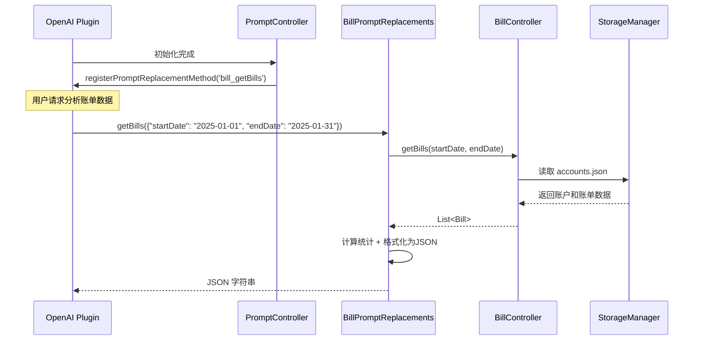

[根目录](../../../CLAUDE.md) > [lib](../../) > [plugins](../) > **bill**

---

# 账单插件 (Bill Plugin) - 模块文档

## 模块职责

账单插件是 Memento 的核心财务管理模块,提供:

- **账户管理系统**: 支持多账户管理,每个账户独立记账
- **账单记录管理**: 创建、编辑、删除收入/支出账单记录
- **财务统计分析**: 今日/本月财务统计,收支分类统计,饼图可视化
- **时间范围筛选**: 按周/月/年筛选账单,支持自定义日期范围
- **AI 数据分析**: 注册到 OpenAI 插件,支持账单数据分析
- **事件系统**: 广播账单和账户的创建、删除事件

---

## 入口与启动

### 插件主类

**文件**: `bill_plugin.dart`

```dart
class BillPlugin extends PluginBase {
    @override
    String get id => 'bill';

    @override
    Future<void> initialize() async {
        // 初始化账单控制器
        _billController.setPlugin(this);
        _billController.initialize();

        // 初始化 Prompt 控制器
        _promptController.initialize();
    }

    @override
    Future<void> registerToApp(
        PluginManager pluginManager,
        ConfigManager configManager,
    ) async {
        // 插件已在 initialize() 中完成初始化
    // 这里可以添加额外的应用级注册逻辑
    }
}
```

### 主界面入口

**文件**: `bill_plugin.dart`

**路由**: 通过 `BillPlugin.buildMainView()` 返回 `BillMainView`,内部使用 `TabBar` 切换两个界面:
- **账单列表视图** (`BillListScreen`): 主要的账单记录界面
- **统计分析视图** (`BillStatsScreen`): 数据可视化和统计分析

**特殊逻辑**: 如果没有账户,自动跳转到账户列表页面 (`AccountListScreen`)

---

## 对外接口

### 核心 API

#### 统计接口

```dart
// 获取今日财务统计(收入+支出净值)
double getTodayFinance();

// 获取本月财务统计(收入+支出净值)
double getMonthFinance();

// 获取本月记账次数
int getMonthBillCount();
```

#### BillController 控制器类

**文件**: `controls/bill_controller.dart`

```dart
// 账户管理
Future<void> createAccount(Account account);
Future<void> saveAccount(Account account);
Future<void> deleteAccount(String accountId);

// 账单管理
Future<void> saveBill(Bill bill);  // 创建或更新账单
Future<void> deleteBill(String accountId, String billId);
Future<List<Bill>> getBills({DateTime? startDate, DateTime? endDate});

// 统计分析
BillStatistics getStatistics({
  required List<Bill> bills,
  required StatisticRange range,
  DateTime? startDate,
  DateTime? endDate,
});

Future<Map<String, double>> getCategoryStatistics({
  DateTime? startDate,
  DateTime? endDate,
});

Future<double> getTotalIncome({DateTime? startDate, DateTime? endDate});
Future<double> getTotalExpense({DateTime? startDate, DateTime? endDate});
```

### AI 集成接口

#### Prompt 替换方法

**文件**: `services/prompt_replacements.dart`

```dart
// 获取指定日期范围的账单数据(供 OpenAI 插件调用)
Future<String> getBills(Map<String, dynamic> params);
// params: { "startDate": "YYYY-MM-DD", "endDate": "YYYY-MM-DD" }
// 返回: JSON 字符串,包含账单列表和统计信息
```

**注册方式**: 通过 `PromptController` 在 OpenAI 插件中注册为 `bill_getBills` 方法

**返回数据格式**:
```json
{
  "sum": {
    "tInc": 5000.00,      // 总收入 (totalIncome)
    "tExp": 3000.00,      // 总支出 (totalExpense)
    "net": 2000.00        // 净余额 (netBalance)
  },
  "catStat": {            // 按类别统计金额
    "工资": 5000.00,
    "餐饮": -800.00,
    "交通": -200.00
  },
  "records": [            // 详细账单记录列表
    {
      "date": "2025-01-15",
      "title": "工资收入",
      "cat": "工资",
      "amt": 5000.00,
      "note": "月度工资"  // 可选字段
    }
  ]
}
```

---

## 关键依赖与配置

### 外部依赖

- `uuid`: 生成唯一账户和账单ID
- `fl_chart`: 图表绘制(饼图统计)
- `intl`: 日期和货币格式化

### 插件依赖

- **OpenAI Plugin**: AI 数据分析功能
- **Core Event System**: 消息事件广播
- **StorageManager**: 数据存储

### 存储路径

**根目录**: `bill/`

**存储结构**:
```
bill/
└── accounts.json                # 所有账户数据(包含账单嵌套)
```

**accounts.json 格式**:
```json
{
  "accounts": [
    "{\"id\":\"...\",\"title\":\"现金账户\",\"totalAmount\":5000.0,\"bills\":[...]}",
    "{\"id\":\"...\",\"title\":\"信用卡\",\"totalAmount\":-1200.0,\"bills\":[...]}"
  ]
}
```

**单个账户 JSON 结构**:
```json
{
  "id": "550e8400-e29b-41d4-a716-446655440000",
  "title": "现金账户",
  "iconCodePoint": 58837,
  "iconFontFamily": "MaterialIcons",
  "iconFontPackage": null,
  "backgroundColor": 4280391411,
  "totalAmount": 5000.0,
  "bills": [
    {
      "id": "660e8400-e29b-41d4-a716-446655440001",
      "title": "工资收入",
      "amount": 5000.0,
      "category": "工资",
      "date": "2025-01-15T00:00:00.000Z",
      "note": "月度工资",
      "tag": "工资",
      "accountId": "550e8400-e29b-41d4-a716-446655440000",
      "icon": 59356,
      "iconColor": 4278238420,
      "createdAt": "2025-01-15T08:30:00.000Z",
      "updatedAt": "2025-01-15T08:30:00.000Z"
    }
  ]
}
```

---

## 数据模型

### Account (账户)

**文件**: `models/account.dart`

```dart
class Account {
  String id;                  // 唯一ID(UUID v4)
  String title;              // 账户名称
  IconData icon;             // 账户图标
  Color backgroundColor;     // 背景颜色
  double totalAmount;        // 账户总金额(自动计算)
  List<Bill> bills;          // 账单列表

  // 计算总金额(收入-支出)
  void calculateTotal();

  // 添加账单(自动触发事件)
  void addBill(Bill bill);

  Map<String, dynamic> toJson();
  factory Account.fromJson(Map<String, dynamic> json);
  Account copyWith({...});
}
```

**存储方式**: 嵌套在 `accounts.json` 中,以 JSON 字符串数组形式存储

**特性**:
- 使用 UUID v4 生成唯一ID
- totalAmount 在保存前自动计算
- 图标和颜色以整数值存储
- 账单嵌套在账户内部

### Bill (账单)

**文件**: `models/bill.dart`

```dart
class Bill {
  String id;              // 唯一ID(UUID v4)
  String title;          // 账单标题
  double amount;         // 金额(正数=收入,负数=支出)
  String category;       // 分类
  DateTime date;         // 账单日期
  String note;           // 备注(可选)
  String? tag;           // 标签(可选)
  IconData icon;         // 图标
  Color iconColor;       // 图标颜色
  String accountId;      // 所属账户ID
  DateTime createdAt;    // 创建时间
  DateTime updatedAt;    // 更新时间

  // 判断是否为支出
  bool get isExpense => amount < 0;

  // 获取账单金额的绝对值
  double get absoluteAmount => amount.abs();

  Map<String, dynamic> toJson();
  factory Bill.fromJson(Map<String, dynamic> json);
  Bill copyWith({...});
}
```

**金额规则**:
- `amount > 0`: 收入
- `amount < 0`: 支出
- 显示时使用 `absoluteAmount` 获取绝对值

### BillStatistics (账单统计)

**文件**: `models/bill_statistics.dart`

```dart
class BillStatistics {
  double totalIncome;     // 总收入
  double totalExpense;    // 总支出
  double balance;         // 余额(收入-支出)
}
```

### StatisticRange (统计范围)

**文件**: `models/statistic_range.dart`

```dart
enum StatisticRange {
  week,     // 本周账单
  month,    // 本月账单
  year,     // 本年账单
  all,      // 全部账单
  custom,   // 自定义时间范围
}
```

### BillModel (界面展示模型)

**文件**: `models/bill_model.dart`

轻量级的账单展示模型,用于 UI 层数据绑定:

```dart
class BillModel {
  String id;
  String title;
  double amount;          // 始终为正数(绝对值)
  DateTime date;
  IconData icon;
  Color color;
  String category;
  String? note;
  bool isExpense;         // 标记收入/支出
}
```

---

## 界面层结构

### 主要界面组件

| 组件 | 文件 | 职责 |
|------|------|------|
| `BillMainView` | `bill_plugin.dart` | 插件主视图容器(双Tab导航) |
| `BillListScreen` | `screens/bill_list_screen.dart` | 账单列表主界面 |
| `BillStatsScreen` | `screens/bill_stats_screen.dart` | 统计分析界面 |
| `BillEditScreen` | `screens/bill_edit_screen.dart` | 账单编辑/创建界面 |
| `AccountListScreen` | `screens/account_list_screen.dart` | 账户列表界面 |
| `AccountEditScreen` | `screens/account_edit_screen.dart` | 账户编辑/创建界面 |
| `AccountBillsScreen` | `screens/account_bills_screen.dart` | 单个账户的账单界面 |

### BillMainView 布局

**布局结构**:
```
Scaffold
├── AppBar
│   ├── 标题(显示当前账户名称)
│   ├── TabBar (账单列表/统计分析)
│   └── 账户列表按钮
└── TabBarView
    ├── BillListScreen
    └── BillStatsScreen
```

**特殊逻辑**:
- 如果 `accounts` 为空,自动跳转到 `AccountListScreen`
- 如果 `selectedAccountId` 为空,自动选择第一个账户

### BillListScreen 布局

**布局结构**:
```
Scaffold
├── Column
│   ├── 时间段选择器 (周/月/年)
│   ├── 日期范围显示
│   ├── 账单统计卡片
│   │   ├── 收入
│   │   ├── 支出
│   │   └── 结余
│   └── Expanded (账单列表)
│       └── ListView (可滑动删除)
└── FloatingActionButton (新建账单)
```

**关键特性**:
- 时间段选择: `SegmentedButton` 支持周/月/年切换
- 统计卡片: 实时计算选定时间范围内的收支
- 滑动删除: `Dismissible` 组件,支持确认对话框
- 监听更新: 监听 `BillPlugin` 的 `notifyListeners()` 自动刷新

### BillStatsScreen 统计界面

**核心功能**:
1. **收支概览卡片**: 显示总收入、总支出、结余
2. **支出分类饼图**: 使用 `fl_chart` 绘制,按类别统计支出占比
3. **类别排名列表**: 支出金额从高到低排序

---

## 事件系统

### 事件类型

**文件**: `controls/bill_controller.dart`

| 事件名 | 事件类 | 触发时机 | 参数 |
|-------|--------|---------|------|
| `bill_added` | `BillAddedEventArgs` | 新建/更新账单时 | `Bill bill, String accountId` |
| `bill_deleted` | `BillDeletedEventArgs` | 删除账单时 | `String billId, String accountId` |
| `account_added` | `AccountAddedEventArgs` | 新建账户时 | `Account account` |
| `account_deleted` | `AccountDeletedEventArgs` | 删除账户时 | `String accountId` |

### 事件广播示例

```dart
// 在 BillController.createAccount() 中
EventManager.instance.broadcast(
  accountAddedEvent,
  AccountAddedEventArgs(account),
);

// 在 Account.addBill() 中
EventManager.instance.broadcast(
  BillController.billAddedEvent,
  BillAddedEventArgs(bill, id),
);
```

---

## AI 数据分析集成

### 工作流程



### 注册流程

**文件**: `controls/prompt_controller.dart`

```dart
class PromptController {
  void initialize() {
    _promptReplacements.initialize();

    // 延迟注册,等待 OpenAI 插件初始化
    Future.delayed(const Duration(seconds: 1), () {
      _registerPromptMethods();
    });
  }

  void _registerPromptMethods() {
    final openaiPlugin = PluginManager.instance.getPlugin('openai') as OpenAIPlugin?;
    if (openaiPlugin != null) {
      openaiPlugin.registerPromptReplacementMethod(
        'bill_getBills',
        _promptReplacements.getBills,
      );
    } else {
      // 重试机制
      Future.delayed(const Duration(seconds: 5), _registerPromptMethods);
    }
  }
}
```

### 调用示例

在 OpenAI 插件的 Prompt 中可以使用:

```
请分析我在 {{bill_getBills(startDate: "2025-01-01", endDate: "2025-01-31")}} 的账单数据,总结我这个月的消费情况。
```

**日期格式支持**:
- `YYYY-MM-DD` (如: 2025-01-15)
- `YYYY/MM/DD` (如: 2025/01/15)
- ISO 8601 格式 (如: 2025-01-15T00:00:00.000Z)

**省略参数行为**:
- 不提供日期: 返回所有账单数据
- 只提供 startDate: 返回该日之后的所有账单
- 只提供 endDate: 返回该日之前的所有账单

---

## 卡片视图

插件在主页提供卡片视图,展示:

**布局**:
```
┌─────────────────────────────┐
│ 💰 账单                    │
├─────────────────────────────┤
│  今日财务    │   本月财务   │
│   +¥50.00   │  -¥120.00    │
│   (绿/红)    │   (绿/红)    │
├─────────────────────────────┤
│        本月记账             │
│          15                 │
└─────────────────────────────┘
```

**实现**: `bill_plugin.dart` 中的 `buildCardView()` 方法

**数据来源**:
- 今日财务: `getTodayFinance()` (收入+支出净值)
- 本月财务: `getMonthFinance()` (收入+支出净值)
- 本月记账: `getMonthBillCount()` (记账次数)

**颜色规则**:
- 正数显示绿色 (收入>支出)
- 负数显示红色 (支出>收入)

---

## 国际化

### 支持语言

- 简体中文 (zh)
- 英语 (en)

### 本地化文件

| 文件 | 语言 |
|------|------|
| `l10n/bill_localizations.dart` | 本地化接口 |
| `l10n/bill_localizations_zh.dart` | 中文翻译 |
| `l10n/bill_localizations_en.dart` | 英文翻译 |

### 关键字符串

```dart
abstract class BillLocalizations {
  String get name;                      // 插件名称
  String get income;                    // 收入
  String get expense;                   // 支出
  String get balance;                   // 结余
  String get todayFinance;              // 今日财务
  String get monthFinance;              // 本月财务
  String get monthBills;                // 本月记账
  String get billList;                  // 账单列表
  String get statistics;                // 统计分析
  String get newBill;                   // 新建账单
  String get editBill;                  // 编辑账单
  String get deleteBill;                // 删除账单
  String get confirmDelete;             // 确认删除
  String get thisWeek;                  // 本周
  String get thisMonth;                 // 本月
  String get thisYear;                  // 本年
  String get accountManagement;         // 账户管理
  String get noBillsClickToAdd;         // 暂无账单,点击添加
}
```

---

## 测试与质量

### 当前状态
- **单元测试**: 无
- **集成测试**: 无
- **已知问题**: 无明显问题

### 测试建议

1. **高优先级**:
   - `BillController.saveBill()` - 测试创建/更新逻辑
   - `Account.calculateTotal()` - 测试金额计算准确性
   - `BillPromptReplacements.getBills()` - 测试日期解析和数据过滤
   - 数据持久化 - 测试账户和账单的保存/加载

2. **中优先级**:
   - 统计计算 - 测试收支统计准确性
   - 事件广播 - 测试事件是否正确触发
   - AI 数据分析方法 - 测试 JSON 格式化
   - 时间范围筛选 - 测试周/月/年边界条件

3. **低优先级**:
   - UI 交互逻辑
   - 国际化字符串完整性
   - 图表渲染
   - 卡片视图显示

---

## 常见问题 (FAQ)

### Q1: 如何创建新账户?

点击主界面右上角的账户列表按钮 → 点击 FloatingActionButton → 填写账户名称、选择图标和颜色 → 保存。

账户数据存储在 `bill/accounts.json` 中。

### Q2: 账单的金额是如何区分收入和支出的?

通过 `amount` 字段的正负值区分:
- **收入**: `amount > 0` (如: 5000.00)
- **支出**: `amount < 0` (如: -200.00)
- **判断方法**: `bill.isExpense` 或 `bill.amount < 0`

### Q3: 账户的 totalAmount 是如何计算的?

调用 `Account.calculateTotal()` 方法:
```dart
void calculateTotal() {
  totalAmount = bills.fold(0.0, (sum, bill) => sum + bill.amount);
}
```

在 `toJson()` 保存前自动计算,确保总金额始终与账单总和一致。

### Q4: 如何在 AI 分析中使用账单数据?

在 OpenAI 插件的系统提示词或用户消息中使用:

```
{{bill_getBills(startDate: "2025-01-01", endDate: "2025-01-31")}}
```

OpenAI 插件会自动调用 `BillPromptReplacements.getBills()` 并替换占位符。

返回的 JSON 数据已压缩格式化,包含:
- `sum`: 总收入、总支出、净余额
- `catStat`: 按类别统计金额
- `records`: 详细账单记录列表

### Q5: 为什么账户数据使用嵌套的 JSON 字符串?

存储格式:
```json
{
  "accounts": [
    "{\"id\":\"...\",\"title\":\"现金\",\"bills\":[...]}",
    "{\"id\":\"...\",\"title\":\"信用卡\",\"bills\":[...]}"
  ]
}
```

**原因**:
- 简化数据结构,避免深层嵌套解析
- 每个账户作为独立 JSON 字符串,便于单独序列化/反序列化
- 兼容 StorageManager 的读写接口

**缺点**: 需要两次 JSON 解析 (外层数组 + 内层对象)

### Q6: 如何导出账单数据?

当前未实现导出功能,建议添加:

```dart
Future<File> exportBillsToCSV(DateTime startDate, DateTime endDate) async {
  final bills = await getBills(startDate: startDate, endDate: endDate);
  final buffer = StringBuffer();

  // CSV 表头
  buffer.writeln('日期,标题,类别,金额,备注,账户');

  // CSV 数据行
  for (final bill in bills) {
    buffer.writeln(
      '${DateFormat('yyyy-MM-dd').format(bill.date)},'
      '${bill.title},'
      '${bill.category},'
      '${bill.amount},'
      '${bill.note},'
      '${bill.accountId}'
    );
  }

  final file = File('bills_export_${DateTime.now().millisecondsSinceEpoch}.csv');
  await file.writeAsString(buffer.toString());
  return file;
}
```

---

## 目录结构

```
bill/
├── bill_plugin.dart                    # 插件主类 + 主视图
├── models/
│   ├── account.dart                    # 账户模型
│   ├── bill.dart                       # 账单模型
│   ├── bill_model.dart                 # UI 展示模型
│   ├── bill_statistics.dart            # 统计数据模型
│   └── statistic_range.dart            # 统计范围枚举
├── controls/
│   ├── bill_controller.dart            # 账单控制器(CRUD + 统计)
│   └── prompt_controller.dart          # Prompt 控制器(注册到 OpenAI)
├── services/
│   └── prompt_replacements.dart        # AI Prompt 替换方法
├── screens/
│   ├── bill_list_screen.dart           # 账单列表界面
│   ├── bill_edit_screen.dart           # 账单编辑界面
│   ├── bill_stats_screen.dart          # 统计分析界面
│   ├── account_list_screen.dart        # 账户列表界面
│   ├── account_edit_screen.dart        # 账户编辑界面
│   └── account_bills_screen.dart       # 单账户账单界面
├── widgets/
│   └── bill_statistics_card.dart       # 统计卡片组件
└── l10n/
    ├── bill_localizations.dart         # 国际化接口
    ├── bill_localizations_zh.dart      # 中文翻译
    └── bill_localizations_en.dart      # 英文翻译
```

---

## 关键实现细节

### 账户总金额自动计算

```dart
// 在保存前自动计算
void calculateTotal() {
  totalAmount = bills.fold(0.0, (sum, bill) => sum + bill.amount);
}

// 在 toJson() 中调用
Map<String, dynamic> toJson() {
  calculateTotal(); // 确保总金额最新
  return {...};
}
```

**原因**: 避免手动维护 totalAmount 导致不一致

### 账单创建/更新逻辑

```dart
Future<void> saveBill(Bill bill) async {
  final accountIndex = _accounts.indexWhere((a) => a.id == bill.accountId);
  final currentAccount = _accounts[accountIndex];

  // 检查是否存在相同ID的账单
  final existingBillIndex = currentAccount.bills.indexWhere(
    (b) => b.id == bill.id,
  );

  if (existingBillIndex == -1) {
    // 创建新账单
    updatedAccount = currentAccount.copyWith(
      bills: [...currentAccount.bills, bill],
    );
  } else {
    // 更新现有账单
    final updatedBills = List<Bill>.from(currentAccount.bills);
    updatedBills[existingBillIndex] = bill;
    updatedAccount = currentAccount.copyWith(bills: updatedBills);
  }

  // 更新总金额
  updatedAccount.calculateTotal();
}
```

**策略**: 通过 `bill.id` 判断是创建还是更新

### 延迟注册到 OpenAI

由于插件初始化顺序不确定,使用延迟 + 重试机制:

```dart
Future.delayed(const Duration(seconds: 1), () {
  _registerPromptMethods();
});

// 失败时重试
if (openaiPlugin == null) {
  Future.delayed(const Duration(seconds: 5), _registerPromptMethods);
}
```

### 时间范围筛选算法

```dart
void _updateDateRange() {
  final now = DateTime.now();
  switch (_selectedPeriod) {
    case '周':
      final weekday = now.weekday;
      _startDate = now.subtract(Duration(days: weekday - 1)); // 本周一
      _endDate = _startDate.add(const Duration(days: 6));    // 本周日
      break;
    case '月':
      _startDate = DateTime(now.year, now.month, 1);         // 本月第一天
      _endDate = DateTime(now.year, now.month + 1, 0);       // 本月最后一天
      break;
    case '年':
      _startDate = DateTime(now.year, 1, 1);                 // 本年第一天
      _endDate = DateTime(now.year, 12, 31);                 // 本年最后一天
      break;
  }

  // 将时间设置为当天的开始和结束
  _startDate = DateTime(_startDate.year, _startDate.month, _startDate.day);
  _endDate = DateTime(_endDate.year, _endDate.month, _endDate.day, 23, 59, 59);
}
```

### AI 数据格式化优化

使用字段缩写减少 Token 消耗:

```dart
final Map<String, dynamic> summary = {};
if (totalIncome > 0) summary['tInc'] = totalIncome;  // totalIncome缩写
if (totalExpense > 0) summary['tExp'] = totalExpense; // totalExpense缩写
if (netBalance != 0) summary['net'] = netBalance;     // netBalance缩写

final record = {
  'date': bill.date.toString().substring(0, 10),
  'title': bill.title,
  'cat': bill.category,  // category缩写
  'amt': bill.amount     // amount缩写
};
```

**策略**:
- 移除金额为0的类别统计
- 备注为空时不添加 `note` 字段
- 金额保留两位小数

---

## 依赖关系

### 核心依赖

- **PluginBase**: 插件基类
- **StorageManager**: 数据持久化
- **EventManager**: 事件广播系统
- **PluginManager**: 插件管理器
- **ConfigManager**: 配置管理器

### 第三方包依赖

- `uuid: ^4.0.0` - UUID生成
- `fl_chart: ^0.65.0` - 图表绘制
- `intl: ^0.18.0` - 日期和货币格式化

### 其他插件依赖

- **OpenAI Plugin**: 可选依赖,用于 AI 数据分析

**依赖方向**: `bill` → `openai`(通过 `PluginManager` 获取)

---

## 统计功能详解

### BillStatsScreen 统计界面

**图表类型**:

1. **收支概览卡片**
   - 总收入 (绿色)
   - 总支出 (红色)
   - 结余 (蓝色/橙色,取决于正负)

2. **支出分类饼图** (使用 fl_chart)
   - 按类别统计支出金额
   - 显示百分比和金额
   - 颜色自动分配
   - 点击显示详细信息

3. **类别排名列表**
   - 支出金额从高到低排序
   - 显示类别名称和金额
   - 格式化为货币显示

**统计算法**:

```dart
// 按类别统计支出
final expenseByCategory = <String, double>{};
for (final bill in _bills.where((bill) => bill.isExpense)) {
  if (expenseByCategory.containsKey(bill.category)) {
    expenseByCategory[bill.category] += bill.amount;
  } else {
    expenseByCategory[bill.category] = bill.amount;
  }
}

// 排序类别支出
final sortedCategories = expenseByCategory.entries.toList()
  ..sort((a, b) => b.value.compareTo(a.value));
```

---

## 变更记录 (Changelog)

- **2025-11-13**: 初始化账单插件文档,识别 19 个文件、5 个数据模型、4 个事件类型、核心功能包括账户管理、账单记录、统计分析、AI 集成

---

**上级目录**: [返回插件目录](../../../CLAUDE.md#模块索引) | [返回根文档](../../../CLAUDE.md)
