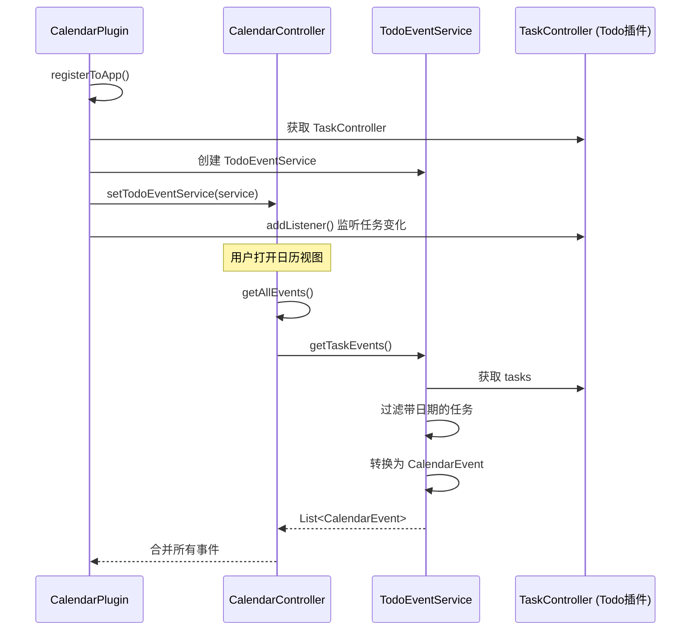
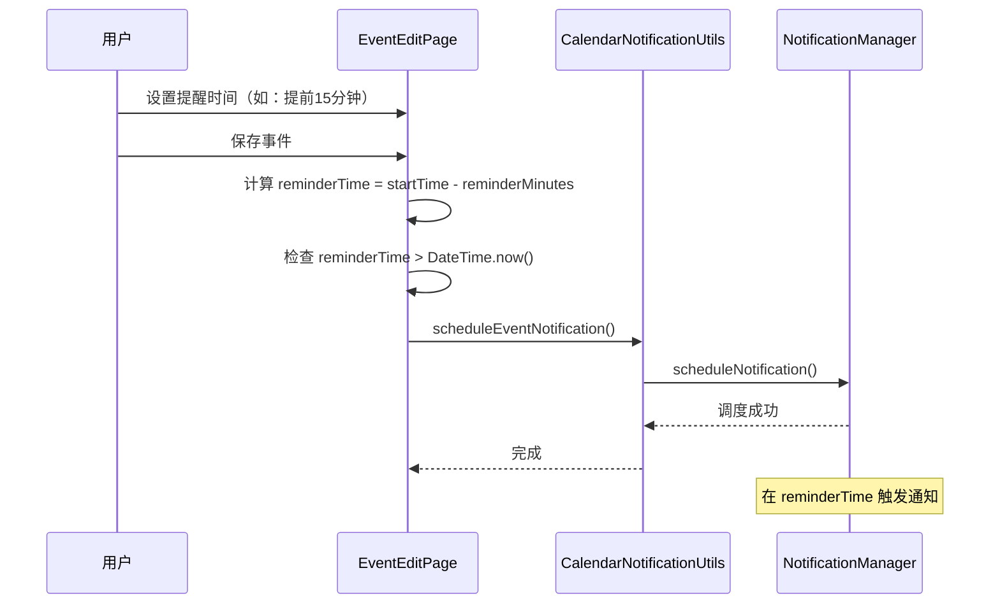

[根目录](../../../CLAUDE.md) > [lib](../../) > [plugins](../) > **calendar**

---

# 日历插件 (Calendar Plugin) - 模块文档

## 模块职责

日历插件是 Memento 的核心时间管理模块之一，提供：

- **多视图日历管理**：支持日、周、工作周、月、时间轴等 8 种视图模式
- **事件管理**：创建、编辑、删除、完成日历事件
- **Todo 任务集成**：自动展示 Todo 插件中的任务事件
- **通知提醒**：支持自定义提前提醒时间（5分钟到2天）
- **事件统计**：活动数量、7天内活动、过期活动统计
- **已完成事件**：独立管理已完成的事件记录
- **视图状态持久化**：记住上次使用的日历视图模式

---

## 入口与启动

### 插件主类

**文件**: `calendar_plugin.dart`

```dart
class CalendarPlugin extends BasePlugin {
    @override
    String get id => 'calendar';

    @override
    Future<void> initialize() async {
        // 初始化总控制器
        controller = CalendarController(storageManager);
        sfController = syncfusion.CalendarController();

        // 从存储中读取上次使用的视图
        final viewData = await storageManager.read('calendar/calendar_last_view');
        final String? lastView = viewData?['view'] as String?;
        if (lastView != null) {
            sfController.view = _getCalendarViewFromString(lastView);
        } else {
            sfController.view = syncfusion.CalendarView.month;
        }
    }

    @override
    Future<void> registerToApp(
        PluginManager pluginManager,
        ConfigManager configManager,
    ) async {
        // 插件已在 initialize() 中完成初始化
    // 这里可以添加额外的应用级注册逻辑

        // 获取Todo插件的TaskController实例
        final todoPlugin = pluginManager.getPlugin('todo') as TodoPlugin?;
        if (todoPlugin != null) {
            final taskController = todoPlugin.taskController;
            if (taskController != null) {
                // 创建TodoEventService并设置到总控制器
                final todoEventService = TodoEventService(taskController);
                controller.setTodoEventService(todoEventService);

                // 监听任务变化
                taskController.addListener(() {
                    controller.notifyListeners();
                });
            }
        }
    }
}
```

### 主界面入口

**文件**: `calendar_plugin.dart`

**路由**: 通过 `CalendarPlugin.buildMainView()` 返回 `CalendarMainView`，使用 Syncfusion 日历组件展示

---

## 对外接口

### 核心 API

#### 事件管理接口

**文件**: `controllers/calendar_controller.dart`

```dart
// 添加事件
void addEvent(CalendarEvent event);

// 更新事件
void updateEvent(CalendarEvent updatedEvent);

// 删除事件
void deleteEvent(CalendarEvent event);

// 完成事件
void completeEvent(CalendarEvent event);

// 获取所有事件（包括Todo任务事件）
List<CalendarEvent> getAllEvents();

// 获取已完成事件
List<CalendarEvent> get completedEvents;
```

#### UI 交互接口

```dart
// 显示事件详情对话框
void showEventDetails(BuildContext context, CalendarEvent event);

// 显示事件编辑页面
void showEventEditPage(BuildContext context, [CalendarEvent? event]);

// 显示所有事件列表
void showAllEvents(BuildContext context);

// 显示已完成事件列表
void showCompletedEvents(BuildContext context);

// 处理日历点击事件
void handleCalendarTap(BuildContext context, CalendarTapDetails details);
```

#### 统计接口

```dart
// 获取所有活动数量
int _getEventCount();

// 获取7天内的活动数量
int _getUpcomingEventCount();

// 获取过期活动数量
int _getExpiredEventCount();
```

---

## 关键依赖与配置

### 外部依赖

- `syncfusion_flutter_calendar`: Syncfusion 日历组件（核心依赖）
- `flutter_local_notifications`: 本地通知支持
- `intl`: 日期格式化
- `logging`: 日志记录

### 插件依赖

- **Todo Plugin**: 任务事件集成（通过 `TodoEventService`）
- **Core Event System**: 消息事件广播
- **StorageManager**: 数据存储
- **NotificationManager**: 通知管理

### 存储路径

**根目录**: `calendar/`

**存储结构**:
```
calendar/
├── calendar_events.json          # 事件数据文件
└── calendar_last_view.json       # 上次使用的视图模式
```

**事件文件格式** (`calendar_events.json`):
```json
{
  "events": [
    {
      "id": "1705300800000",
      "title": "项目会议",
      "description": "讨论Q1计划",
      "startTime": "2025-01-15T09:00:00.000Z",
      "endTime": "2025-01-15T10:00:00.000Z",
      "icon": 58050,
      "color": 4280391411,
      "source": "default",
      "reminderMinutes": 15
    }
  ],
  "completedEvents": [
    {
      "id": "1705214400000",
      "title": "周报",
      "description": "",
      "startTime": "2025-01-14T14:00:00.000Z",
      "endTime": "2025-01-14T15:00:00.000Z",
      "icon": 58050,
      "color": 4280391411,
      "source": "default",
      "completedTime": "2025-01-14T14:45:00.000Z"
    }
  ]
}
```

**视图状态格式** (`calendar_last_view.json`):
```json
{
  "view": "month"
}
```

---

## 数据模型

### CalendarEvent (日历事件)

**文件**: `models/event.dart`

```dart
class CalendarEvent {
  String id;                    // 唯一ID（时间戳）
  String title;                 // 事件标题
  String description;           // 事件描述
  DateTime startTime;           // 开始时间
  DateTime? endTime;            // 结束时间（可选）
  IconData icon;                // 事件图标
  Color color;                  // 事件颜色
  String source;                // 来源标识（'default' 或 'todo'）
  int? reminderMinutes;         // 提前提醒的分钟数
  DateTime? completedTime;      // 完成时间（已完成事件）

  Map<String, dynamic> toJson();
  factory CalendarEvent.fromJson(Map<String, dynamic> json);
  CalendarEvent copyWith({...});
}
```

**存储路径**: `calendar/calendar_events.json`

**示例数据**:
```json
{
  "id": "1705300800000",
  "title": "项目会议",
  "description": "讨论Q1计划",
  "startTime": "2025-01-15T09:00:00.000Z",
  "endTime": "2025-01-15T10:00:00.000Z",
  "icon": 58050,
  "color": 4280391411,
  "source": "default",
  "reminderMinutes": 15
}
```

**字段说明**:
- `id`: 使用事件创建时的毫秒级时间戳
- `icon`: Material Icons 的 codePoint 值
- `color`: Color.value 的整数表示
- `source`:
  - `'default'`: 普通日历事件，可编辑删除
  - `'todo'`: 来自 Todo 插件的任务事件，只读

---

## 界面层结构

### 主要界面组件

| 组件 | 文件 | 职责 |
|------|------|------|
| `CalendarMainView` | `calendar_plugin.dart` | 插件主视图容器 |
| `EventEditPage` | `pages/event_edit_page.dart` | 事件编辑界面 |
| `EventListPage` | `pages/event_list_page.dart` | 全部事件列表 |
| `CompletedEventsPage` | `pages/completed_events_page.dart` | 已完成事件列表 |
| `EventDetailCard` | `widgets/event_detail_card.dart` | 事件详情卡片 |

### CalendarMainView 布局

**布局结构**:
```
Scaffold
├── AppBar
│   ├── IconButton (返回主页)
│   ├── 标题 (日历)
│   └── Actions
│       ├── IconButton (跳转到今天)
│       ├── IconButton (查看所有事件)
│       └── IconButton (查看已完成事件)
└── Column
    └── Expanded
        └── SfCalendar (Syncfusion日历组件)
            ├── 8种视图模式
            ├── 月视图议程显示
            ├── 时间槽视图设置
            └── 事件数据源
└── FloatingActionButton (新建事件)
```

**关键特性**:
- 支持 8 种视图模式切换（日、周、工作周、月、时间轴日/周/工作周、日程）
- 月视图显示议程（下方 200px 高度）
- 时间槽视图显示 6:00-23:00，每 30 分钟一格
- 点击日历格子选中日期
- 点击事件显示详情对话框
- 点击"今天"按钮跳转到当前日期

### 支持的视图模式

| 视图模式 | 枚举值 | 存储标识 | 说明 |
|---------|--------|---------|------|
| 日视图 | `CalendarView.day` | `'day'` | 单日时间槽视图 |
| 周视图 | `CalendarView.week` | `'week'` | 一周时间槽视图 |
| 工作周视图 | `CalendarView.workWeek` | `'workWeek'` | 工作日时间槽视图 |
| 月视图 | `CalendarView.month` | `'month'` | 月度日历视图（默认） |
| 时间轴日视图 | `CalendarView.timelineDay` | `'timelineDay'` | 水平时间轴（单日） |
| 时间轴周视图 | `CalendarView.timelineWeek` | `'timelineWeek'` | 水平时间轴（一周） |
| 时间轴工作周视图 | `CalendarView.timelineWorkWeek` | `'timelineWorkWeek'` | 水平时间轴（工作周） |
| 日程视图 | `CalendarView.schedule` | `'schedule'` | 列表式日程视图 |

### EventEditPage 编辑界面

**核心组件**: 使用 `CircleIconPicker` + 表单字段

**功能**:
- 圆形图标选择器（图标+颜色）
- 事件标题输入
- 事件描述输入（多行）
- 日期范围选择器
- 开始/结束时间选择器
- 提醒时间选择器（8个预设选项）

**提醒时间选项**:
```dart
[
  {'label': '不提醒', 'value': null},
  {'label': '提前5分钟', 'value': 5},
  {'label': '提前15分钟', 'value': 15},
  {'label': '提前30分钟', 'value': 30},
  {'label': '提前1小时', 'value': 60},
  {'label': '提前2小时', 'value': 120},
  {'label': '提前1天', 'value': 1440},
  {'label': '提前2天', 'value': 2880},
]
```

**验证规则**:
- 标题不能为空
- 结束时间不能早于开始时间
- 如果未选择结束日期，默认为开始日期 + 1小时

**提醒设置**:
- 保存事件时自动调用 `CalendarNotificationUtils.scheduleEventNotification()`
- 仅当提醒时间在未来时才设置通知

### EventListPage 事件列表

**功能**:
- 按开始时间排序显示所有事件
- 支持滑动操作：
  - 右滑（绿色背景）：标记为完成
  - 左滑（红色背景）：删除事件
- 点击事件显示详情
- 显示事件图标、标题、时间、描述、提醒设置

**时间显示格式**:
- 同一天：`MM-dd HH:mm - HH:mm`
- 跨天：`MM-dd HH:mm - MM-dd HH:mm`

### EventDetailCard 详情卡片

**布局**:
```
Dialog
├── 标题栏 (图标 + 事件标题)
├── 时间信息 (开始时间 - 结束时间)
├── 提醒设置 (如果有)
├── 描述内容 (如果有)
└── 操作按钮（仅 source='default' 显示）
    ├── 编辑按钮 (蓝色)
    ├── 完成按钮 (绿色)
    └── 删除按钮 (红色)
```

**特性**:
- Todo 任务事件（`source='todo'`）不显示操作按钮
- 普通事件可以编辑、完成、删除

---

## 服务层结构

### CalendarController (总控制器)

**文件**: `controllers/calendar_controller.dart`

**职责**:
- 管理普通日历事件列表
- 管理已完成事件列表
- 管理选中日期和聚焦月份
- 集成 TodoEventService
- 处理事件的增删改操作
- 持久化事件数据

**关键方法**:
```dart
// 事件操作
void addEvent(CalendarEvent event)
void updateEvent(CalendarEvent updatedEvent)
void deleteEvent(CalendarEvent event)
void completeEvent(CalendarEvent event)

// 获取所有事件（合并普通事件 + Todo任务事件）
List<CalendarEvent> getAllEvents()

// 日期状态管理
void selectDate(DateTime date)
void setFocusedMonth(DateTime month)

// Todo集成
void setTodoEventService(TodoEventService service)
```

**状态字段**:
```dart
List<CalendarEvent> _events = [];              // 普通事件列表
List<CalendarEvent> _completedEvents = [];     // 已完成事件列表
TodoEventService? _todoEventService;            // Todo事件服务
DateTime _selectedDate = DateTime.now();        // 选中的日期
DateTime _focusedMonth = DateTime.now();        // 聚焦的月份
```

### TodoEventService (Todo任务集成服务)

**文件**: `services/todo_event_service.dart`

**职责**:
- 从 Todo 插件的 `TaskController` 获取任务数据
- 将 Task 转换为 CalendarEvent
- 根据任务优先级设置事件颜色

**工作流程**:


**任务过滤规则**:
- 仅处理**同时设置了开始日期和截止日期**的任务
- 任务 ID 添加 `'todo_'` 前缀以区分来源

**优先级颜色映射**:
```dart
TaskPriority.high   => Colors.red.shade300      // 高优先级：红色
TaskPriority.medium => Colors.orange.shade300   // 中优先级：橙色
TaskPriority.low    => Colors.blue.shade300     // 低优先级：蓝色
```

---

## 通知系统

### CalendarNotificationUtils (通知工具类)

**文件**: `utils/calendar_notification_utils.dart`

**核心功能**:
- 初始化通知通道
- 调度事件提醒通知
- 更新通知
- 取消通知
- 显示即时通知

**通知通道配置**:
```dart
channelId: 'calendar_channel'
channelName: '日历事件提醒'
channelDescription: '用于日历事件的提醒通知'
importance: Importance.max
enableVibration: true
enableSound: true
```

**调度通知流程**:


**调度逻辑**:
```dart
// 计算提醒时间
final reminderTime = startDateTime.subtract(
  Duration(minutes: _reminderMinutes!),
);

// 仅当提醒时间在未来时才设置通知
if (reminderTime.isAfter(DateTime.now())) {
  await CalendarNotificationUtils.scheduleEventNotification(
    id: int.parse(event.id),
    title: event.title,
    body: event.description,
    scheduledDateTime: reminderTime,
    payload: event.id,
  );
}
```

---

## 工具类

### CalendarDateUtils (日期工具类)

**文件**: `utils/date_utils.dart`

**核心方法**:

```dart
// 获取指定月份的所有日期（6周 × 7天 = 42天）
static List<DateTime> getDaysInMonth(DateTime month);

// 判断两个日期是否是同一天
static bool isSameDay(DateTime a, DateTime b);

// 判断日期是否在当前月份
static bool isInCurrentMonth(DateTime date, DateTime currentMonth);

// 获取指定日期的所有事件（支持跨天事件）
static List<CalendarEvent> getEventsForDay(
  List<CalendarEvent> events,
  DateTime day,
);

// 格式化时间范围显示
static String formatTimeRange(DateTime start, DateTime? end);
// 示例：
// - 同一天：'2025-01-15 09:00 - 10:00'
// - 跨天：'2025-01-15 09:00 - 2025-01-16 10:00'

// 格式化日期时间
static String formatDateTime(DateTime dateTime);
// 示例：'2025-01-15 09:00'
```

**跨天事件处理**:
```dart
// 检查day是否在事件的开始和结束日期之间
final bool isMultiDayEvent = event.endTime != null &&
                             !isSameDay(event.startTime, event.endTime!);

if (isMultiDayEvent) {
  return day.isAfter(event.startTime.subtract(const Duration(days: 1))) &&
         day.isBefore(event.endTime!.add(const Duration(days: 1)));
}
```

---

## 卡片视图

插件在主页提供卡片视图，展示：

**布局**:
```
┌─────────────────────────────┐
│ 📅 日历                    │
├─────────────────────────────┤
│  活动数量    │   7天活动   │
│      8      │      3       │
├─────────────────────────────┤
│        过期活动             │
│           2                 │
└─────────────────────────────┘
```

**实现**: `calendar_plugin.dart` 中的 `buildCardView()` 方法

**数据来源**:
```dart
// 活动数量：所有未完成事件
int _getEventCount() {
  return controller.getAllEvents().length;
}

// 7天活动：未来7天内的事件
int _getUpcomingEventCount() {
  final now = DateTime.now();
  final sevenDaysLater = now.add(const Duration(days: 7));
  return controller.getAllEvents().where((event) {
    return event.startTime.isAfter(now) &&
           event.startTime.isBefore(sevenDaysLater);
  }).length;
}

// 过期活动：开始时间早于现在的事件
int _getExpiredEventCount() {
  final now = DateTime.now();
  return controller.getAllEvents().where((event) {
    return event.startTime.isBefore(now);
  }).length;
}
```

**颜色提示**:
- 7天活动：橙色（提醒用户关注近期事项）
- 过期活动：红色（警告用户有逾期事项）

---

## 国际化

### 支持语言

- 简体中文 (zh)
- 英语 (en)

### 本地化文件

| 文件 | 语言 |
|------|------|
| `l10n/calendar_localizations.dart` | 本地化接口 |
| `l10n/calendar_localizations_zh.dart` | 中文翻译 |
| `l10n/calendar_localizations_en.dart` | 英文翻译 |

### 关键字符串

```dart
abstract class CalendarLocalizations {
  String get name;                      // 插件名称
  String get calendar;                  // 日历
  String get eventCount;                // 活动数量
  String get weekEvents;                // 7天活动
  String get expiredEvents;             // 过期活动
  String get allEvents;                 // 全部事件
  String get completedEvents;           // 已完成事件
  String get backToToday;               // 回到今天
  String get addEvent;                  // 添加事件
  String get editEvent;                 // 编辑事件
  String get deleteEvent;               // 删除事件
  String get completeEvent;             // 完成事件
  String get eventTitle;                // 事件标题
  String get eventDescription;          // 事件描述
  String get startTime;                 // 开始时间
  String get endTime;                   // 结束时间
  String get dateRange;                 // 日期范围
  String get reminderSettings;          // 提醒设置
  String get selectReminderTime;        // 选择提醒时间
  String get selectDateRangeFirst;      // 请先选择日期范围
  String get enterEventTitle;           // 请输入事件标题
  String get endTimeCannotBeEarlier;    // 结束时间不能早于开始时间
  String get confirmDeleteEvent;        // 确认删除事件
  String get noEvents;                  // 暂无事件
  String get noCompletedEvents;         // 暂无已完成事件

  // 视图模式
  String get dayView;                   // 日视图
  String get weekView;                  // 周视图
  String get workWeekView;              // 工作周视图
  String get monthView;                 // 月视图
  String get timelineDayView;           // 时间轴日视图
  String get timelineWeekView;          // 时间轴周视图
  String get timelineWorkWeekView;      // 时间轴工作周视图
  String get scheduleView;              // 日程视图
}
```

---

## 测试与质量

### 当前状态
- **单元测试**: 无
- **集成测试**: 无
- **已知问题**: 无明显问题

### 测试建议

1. **高优先级**：
   - `CalendarController.addEvent()` / `updateEvent()` / `deleteEvent()` - 测试事件管理逻辑
   - `TodoEventService.getTaskEvents()` - 测试任务转换逻辑
   - `CalendarNotificationUtils.scheduleEventNotification()` - 测试通知调度
   - 视图状态持久化 - 测试 `_getCalendarViewFromString()` 和 `_getStringFromCalendarView()`

2. **中优先级**：
   - `CalendarDateUtils.getEventsForDay()` - 测试跨天事件处理
   - `CalendarController.getAllEvents()` - 测试事件合并逻辑
   - 完成事件功能 - 测试 `completeEvent()` 的状态转换
   - 事件列表排序 - 测试 EventListPage 的排序逻辑

3. **低优先级**：
   - UI 交互逻辑
   - 国际化字符串完整性
   - 视图模式切换
   - 卡片视图统计展示

---

## 常见问题 (FAQ)

### Q1: 如何添加新的提醒时间选项？

在 `event_edit_page.dart` 中修改 `_selectReminderMinutes()` 方法的 `items` 列表：

```dart
final items = [
  {'label': '不提醒', 'value': null},
  {'label': '提前5分钟', 'value': 5},
  // ... 现有选项
  {'label': '提前3天', 'value': 4320},  // 新增选项
];
```

### Q2: 如何自定义视图模式列表？

修改 `calendar_plugin.dart` 中的 `allowedViews` 列表：

```dart
final List<syncfusion.CalendarView> allowedViews = <syncfusion.CalendarView>[
  syncfusion.CalendarView.day,
  syncfusion.CalendarView.week,
  syncfusion.CalendarView.month,
  // 移除不需要的视图模式
];
```

### Q3: Todo 任务事件为什么不能编辑？

Todo 任务事件的来源是 Todo 插件的 TaskController，日历插件仅作为展示。这些事件的 `source` 字段为 `'todo'`，在 `EventDetailCard` 中不会显示操作按钮。

如需编辑，应该在 Todo 插件中修改任务。

### Q4: 如何修改事件的默认时长？

在 `event_edit_page.dart` 中修改 `_saveEvent()` 方法：

```dart
// 当前默认为 1 小时
endDateTime = startDateTime.add(const Duration(hours: 1));

// 修改为 30 分钟
endDateTime = startDateTime.add(const Duration(minutes: 30));
```

### Q5: 如何导出日历事件？

当前未实现导出功能，建议添加：

```dart
Future<File> exportEventsToJson(DateTime startDate, DateTime endDate) async {
  final events = controller.getAllEvents().where((event) {
    return event.startTime.isAfter(startDate) &&
           event.startTime.isBefore(endDate);
  }).toList();

  final jsonData = {
    'exportDate': DateTime.now().toIso8601String(),
    'dateRange': {
      'start': startDate.toIso8601String(),
      'end': endDate.toIso8601String(),
    },
    'events': events.map((e) => e.toJson()).toList(),
  };

  final file = File('calendar_export_${DateTime.now().millisecondsSinceEpoch}.json');
  await file.writeAsString(jsonEncode(jsonData));
  return file;
}
```

### Q6: 如何禁用 Todo 任务事件的显示？

在 `CalendarController.getAllEvents()` 中移除 TodoEventService 的调用：

```dart
// 修改前
List<CalendarEvent> getAllEvents() {
  final List<CalendarEvent> allEvents = [
    ..._events,
    if (_todoEventService != null) ..._todoEventService!.getTaskEvents(),
  ];
  return allEvents;
}

// 修改后
List<CalendarEvent> getAllEvents() {
  return _events;
}
```

---

## 目录结构

```
calendar/
├── calendar_plugin.dart                          # 插件主类 + 主视图
├── models/
│   └── event.dart                                # 日历事件模型
├── controllers/
│   └── calendar_controller.dart                  # 日历总控制器
├── services/
│   └── todo_event_service.dart                   # Todo任务集成服务
├── pages/
│   ├── event_edit_page.dart                      # 事件编辑页面
│   ├── event_list_page.dart                      # 全部事件列表页面
│   └── completed_events_page.dart                # 已完成事件页面
├── widgets/
│   └── event_detail_card.dart                    # 事件详情卡片
├── utils/
│   ├── calendar_notification_utils.dart          # 通知工具类
│   └── date_utils.dart                           # 日期工具类
└── l10n/
    ├── calendar_localizations.dart               # 国际化接口
    ├── calendar_localizations_zh.dart            # 中文翻译
    └── calendar_localizations_en.dart            # 英文翻译
```

---

## 关键实现细节

### 视图状态持久化

日历插件会记住用户上次使用的视图模式：

```dart
// 保存视图状态（每次视图改变时）
void onViewChanged(syncfusion.ViewChangedDetails details) async {
  await storageManager.write('calendar/calendar_last_view', {
    'view': _getStringFromCalendarView(sfController.view!),
  });
}

// 加载视图状态（初始化时）
final viewData = await storageManager.read('calendar/calendar_last_view');
final String? lastView = viewData?['view'] as String?;
if (lastView != null) {
  sfController.view = _getCalendarViewFromString(lastView);
} else {
  sfController.view = syncfusion.CalendarView.month; // 默认月视图
}
```

### 事件源区分

通过 `source` 字段区分事件来源：

```dart
// 普通日历事件
if (eventId.startsWith('todo_')) {
  // Todo任务事件只显示，不允许编辑
  // ...
} else {
  // 普通日历事件
  // ...
}

// EventDetailCard 中根据 source 决定是否显示操作按钮
if (event.source == 'default')
  Row(
    mainAxisAlignment: MainAxisAlignment.spaceEvenly,
    children: [
      _buildActionButton(context, '编辑', Icons.edit, Colors.blue, onEdit),
      _buildActionButton(context, '完成', Icons.check_circle, Colors.green, onComplete),
      _buildActionButton(context, '删除', Icons.delete, Colors.red, onDelete),
    ],
  ),
```

### Todo 任务变化监听

监听 Todo 插件的 TaskController，实现实时同步：

```dart
// 注册时建立监听
final taskController = todoPlugin.taskController;
if (taskController != null) {
  final todoEventService = TodoEventService(taskController);
  controller.setTodoEventService(todoEventService);

  // 监听任务变化
  taskController.addListener(() {
    controller.notifyListeners();  // 触发日历视图更新
  });
}
```

**优势**:
- Todo 插件中任务的任何变化都会立即反映在日历中
- 无需手动刷新

### Syncfusion 日历配置

```dart
syncfusion.SfCalendar(
  // 月视图配置
  monthViewSettings: const syncfusion.MonthViewSettings(
    showAgenda: true,                    // 显示议程
    agendaViewHeight: 200,               // 议程高度
    appointmentDisplayMode:
      syncfusion.MonthAppointmentDisplayMode.appointment,  // 显示为横条
  ),

  // 时间槽视图配置
  timeSlotViewSettings: const syncfusion.TimeSlotViewSettings(
    startHour: 6,                        // 开始时间 6:00
    endHour: 23,                         // 结束时间 23:00
    timeInterval: Duration(minutes: 30), // 时间间隔 30 分钟
  ),

  // 今日高亮颜色
  todayHighlightColor: Theme.of(context).primaryColor,

  // 选中装饰
  selectionDecoration: BoxDecoration(
    border: Border.all(
      color: Theme.of(context).primaryColor,
      width: 2,
    ),
  ),
)
```

### 事件到 Appointment 转换

```dart
List<syncfusion.Appointment> getUserAppointments() {
  final List<CalendarEvent> allEvents = controller.getAllEvents();

  return allEvents
      .map((event) => syncfusion.Appointment(
        startTime: event.startTime,
        endTime: event.endTime ?? event.startTime.add(const Duration(hours: 1)),
        subject: event.title,
        notes: event.description,
        color: event.color,
        isAllDay: false,  // 设置为false，确保显示为横条而不是圆点
        id: event.id,
      ))
      .toList();
}
```

---

## 依赖关系

### 核心依赖

- **BasePlugin**: 插件基类
- **StorageManager**: 数据持久化
- **PluginManager**: 插件管理器
- **ConfigManager**: 配置管理器
- **NotificationManager**: 通知管理

### 第三方包依赖

- `syncfusion_flutter_calendar: ^latest` - Syncfusion 日历组件
- `flutter_local_notifications: ^latest` - 本地通知
- `intl: ^0.18.0` - 日期格式化
- `logging: ^latest` - 日志记录

### 其他插件依赖

- **Todo Plugin**: 可选依赖，用于任务事件集成

**依赖方向**: `calendar` → `todo`（通过 `PluginManager` 获取）

---

## 变更记录 (Changelog)

- **2025-11-13**: 初始化日历插件文档，识别 13 个文件、1 个数据模型、8 种视图模式、Todo 任务集成、通知系统、3 个主要页面

---

**上级目录**: [返回插件目录](../../../CLAUDE.md#模块索引) | [返回根文档](../../../CLAUDE.md)
