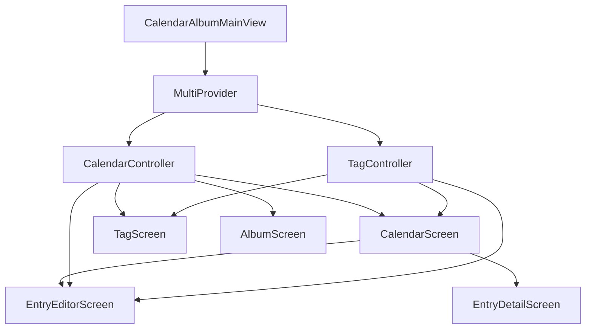

[根目录](../../../CLAUDE.md) > [lib](../../) > [plugins](../) > **calendar_album**

---

# 日历相册插件 (Calendar Album Plugin) - 模块文档

## 模块职责

日历相册插件是 Memento 的核心功能模块之一，提供：

- **日历日记管理**：基于日历展示和管理日记条目
- **标签系统**：支持多标签分类和标签组管理
- **图片相册**：集中展示所有日记中的图片
- **Markdown 编辑器**：支持富文本格式的日记内容
- **多视图模式**：日历视图、标签视图、相册视图
- **位置/心情/天气记录**：记录日记的附加信息
- **事件系统**：广播日记的创建、更新、删除事件

---

## 入口与启动

### 插件主类

**文件**: `calendar_album_plugin.dart`

```dart
class CalendarAlbumPlugin extends BasePlugin {
    @override
    String get id => 'calendar_album';

    @override
    Color get color => const Color.fromARGB(255, 245, 210, 52);

    @override
    IconData get icon => Icons.notes_rounded;

    @override
    Future<void> initialize() async {
        calendarController = CalendarController();
        tagController = TagController(onTagsChanged: () {});
        await initializeDefaultData();
    }

    @override
    Future<void> registerToApp(
        PluginManager pluginManager,
        ConfigManager configManager,
    ) async {
        // 插件已在 initialize() 中完成初始化
    // 这里可以添加额外的应用级注册逻辑
    }
}
```

### 主界面入口

**文件**: `screens/main_screen.dart`

**路由**: 通过 `CalendarAlbumPlugin.buildMainView()` 返回 `CalendarAlbumMainView`，其内部渲染 `MainScreen`

**界面结构**: 底部导航栏切换三个视图
- 日历视图 (`CalendarScreen`)
- 标签视图 (`TagScreen`)
- 相册视图 (`AlbumScreen`)

---

## 对外接口

### 核心 API

#### 统计接口

```dart
// 获取今日日记数
int getTodayEntriesCount();

// 获取最近7天的日记数
int getLast7DaysEntriesCount();

// 获取所有日记数
int getAllEntriesCount();

// 获取标签数量
int getTagsCount(); // 通过 tagController.tags.length 获取
```

#### CalendarController 控制器方法

**文件**: `controllers/calendar_controller.dart`

```dart
// ========== 日期选择与导航 ==========

// 选择日期
void selectDate(DateTime date);

// 设置当前月份
set currentMonth(DateTime month);

// 加载更多月份(向前或向后)
bool loadMoreMonths(bool isBefore);

// 切换展开/收起
void toggleExpanded();
void expandRange();
void collapseRange();

// ========== 日记管理 ==========

// 获取指定日期的日记列表
List<CalendarEntry> getEntriesForDate(DateTime date);

// 添加日记
Future<void> addEntry(CalendarEntry entry);

// 更新日记
Future<void> updateEntry(CalendarEntry entry);

// 删除日记
Future<void> deleteEntry(CalendarEntry entry);

// 根据ID获取日记
CalendarEntry? getEntryById(String id);

// ========== 标签与图片相关 ==========

// 获取所有标签
List<String> getAllTags();

// 根据标签获取日记
List<CalendarEntry> getEntriesByTag(String tag);

// 根据多标签获取日记(AND逻辑)
List<CalendarEntry> getEntriesByTags(List<String> tags);

// 获取所有图片URL
List<String> getAllImages();

// 根据图片URL获取日记
CalendarEntry? getDiaryEntryForImage(String imageUrl);

// ========== 统计功能 ==========

// 获取所有日记数
int getAllEntriesCount();

// 获取今日日记数
int getTodayEntriesCount();

// 获取最近7天日记数
int getLast7DaysEntriesCount();
```

#### TagController 控制器方法

**文件**: `controllers/tag_controller.dart`

```dart
// ========== 标签管理 ==========

// 初始化标签组
Future<void> initialize();

// 获取所有标签
List<String> get tags;

// 添加标签
Future<void> addTag(String tag, {String? groupName});

// 删除标签
Future<void> deleteTag(String tag);

// 检查标签是否存在
bool hasTag(String name);

// ========== 最近使用标签 ==========

// 更新最近使用的标签
Future<void> updateRecentTags(List<String> tags);

// ========== UI交互 ==========

// 显示标签管理对话框
Future<List<String>?> showTagManagerDialog(BuildContext context);
```

---

## 关键依赖与配置

### 外部依赖

- `table_calendar`: 日历组件
- `photo_view`: 图片查看器
- `intl`: 日期格式化
- `provider`: 状态管理

### 插件依赖

- **Core Event System**: 消息事件广播
- **StorageManager**: 数据存储
- **ImageUtils**: 图片工具类

### 存储路径

**根目录**: `calendar_album/`

**存储结构**:
```
calendar_album/
├── calendar_entries           # 日记条目数据
└── data/
    ├── calendar_tag_groups.json    # 标签组数据
    └── calendar_recent_tags.json   # 最近使用的标签
```

**calendar_entries 格式**:
```json
{
  "2025-01-15T00:00:00.000Z": [
    {
      "id": "1737004800000",
      "title": "美好的一天",
      "content": "今天天气很好...",
      "createdAt": "2025-01-15T08:30:00.000Z",
      "updatedAt": "2025-01-15T20:15:00.000Z",
      "tags": ["生活", "心情"],
      "location": "家",
      "mood": "😊",
      "weather": "晴天",
      "imageUrls": ["images/photo1.jpg"]
    }
  ]
}
```

**calendar_tag_groups.json 格式**:
```json
[
  {
    "name": "最近使用",
    "tags": ["生活", "工作"]
  },
  {
    "name": "地点",
    "tags": ["家", "工作", "旅行"]
  },
  {
    "name": "活动",
    "tags": ["生日", "聚会", "会议"]
  }
]
```

---

## 数据模型

### CalendarEntry (日记条目)

**文件**: `models/calendar_entry.dart`

```dart
class CalendarEntry {
  String id;                  // 唯一标识符(时间戳字符串)
  String title;               // 标题
  String content;             // 内容(Markdown 格式)
  DateTime createdAt;         // 创建时间
  DateTime updatedAt;         // 更新时间
  List<String> tags;          // 标签列表
  String? location;           // 位置
  String? mood;               // 心情表情
  String? weather;            // 天气
  List<String> imageUrls;     // 图片URL列表

  factory CalendarEntry.create({...});
  CalendarEntry copyWith({...});
  Map<String, dynamic> toJson();
  factory CalendarEntry.fromJson(Map<String, dynamic> json);

  int get wordCount;          // 字数统计
  List<String> extractImagesFromMarkdown(); // 从Markdown中提取图片
}
```

**存储路径**: `calendar_album/calendar_entries` (JSON Map, key为日期字符串)

**示例数据**:
```json
{
  "id": "1737004800000",
  "title": "美好的一天",
  "content": "# 美好的一天\n\n今天天气很好...",
  "createdAt": "2025-01-15T08:30:00.000Z",
  "updatedAt": "2025-01-15T20:15:00.000Z",
  "tags": ["生活", "心情"],
  "location": "家",
  "mood": "😊",
  "weather": "晴天",
  "imageUrls": ["images/photo1.jpg"]
}
```

---

## 界面层结构

### 主要界面组件

| 组件 | 文件 | 职责 |
|------|------|------|
| `CalendarAlbumMainView` | `calendar_album_plugin.dart` | 插件主视图容器 |
| `MainScreen` | `screens/main_screen.dart` | 主界面（底部导航） |
| `CalendarScreen` | `screens/calendar_screen.dart` | 日历视图 |
| `TagScreen` | `screens/tag_screen.dart` | 标签视图 |
| `AlbumScreen` | `screens/album_screen.dart` | 相册视图 |
| `EntryEditorScreen` | `screens/entry_editor_screen.dart` | 日记编辑界面 |
| `EntryDetailScreen` | `screens/entry_detail_screen.dart` | 日记详情界面 |
| `EntryList` | `widgets/entry_list.dart` | 日记列表组件 |

### MainScreen 布局

**布局结构**:
```
Scaffold
├── body: PageView (三个页面)
│   ├── CalendarScreen (日历视图)
│   ├── TagScreen (标签视图)
│   └── AlbumScreen (相册视图)
└── bottomNavigationBar: BottomNavigationBar
    ├── 日历 (calendar_today)
    ├── 标签 (tag)
    └── 相册 (photo_library)
```

**关键特性**:
- PageController 实现左右滑动切换
- PageStorageKey 保持页面状态
- Provider 多层级状态共享

### CalendarScreen 布局

**布局结构**:
```
Scaffold
├── AppBar
│   ├── leading: 返回主页按钮
│   ├── title: "日历日记"
│   └── actions: [回到今天按钮]
├── body: Column
│   ├── SizedBox(height: 360) - 日历区域
│   │   └── TableCalendar
│   │       ├── 日期单元格（显示日期）
│   │       └── markerBuilder（显示条目数量）
│   └── Expanded - 日记列表区域
│       └── EntryList (选中日期的日记)
└── floatingActionButton: 新建日记
```

**关键特性**:
- 点击日期选中并显示该日期的日记
- 日历单元格显示日记数量徽章
- 点击标题栏日期可快速跳转年月
- 自动跳转到当前日期

### TagScreen 布局

**布局结构**:
```
Scaffold
├── AppBar
│   ├── title: "标签管理"
│   └── actions: [标签管理按钮]
└── body: Column
    ├── Container(height: 50) - 标签筛选区域
    │   └── Horizontal ListView (FilterChip)
    ├── Divider
    └── Expanded - 日记列表区域
        └── EntryList (已选标签的日记)
```

**关键特性**:
- FilterChip 可选择/取消标签
- 支持多标签筛选（AND逻辑）
- 点击标签管理按钮打开标签管理对话框
- 标签颜色基于hashCode自动生成

### AlbumScreen 布局

**布局结构**:
```
Scaffold
├── AppBar
│   └── title: "所有照片"
└── body: GridView (3列)
    └── GestureDetector
        └── Hero + Image (图片缩略图)
```

**关键特性**:
- 点击图片进入全屏查看模式
- Hero动画过渡效果
- PhotoView支持缩放和滑动
- 可从图片跳转到对应日记

### EntryEditorScreen 结构

**架构设计**: 采用 Controller + UI 分离

**文件组织**:
```
entry_editor_screen.dart                # 主入口
├── entry_editor/
│   ├── entry_editor_controller.dart    # 控制器（状态管理）
│   ├── entry_editor_ui.dart            # UI层（布局渲染）
│   ├── entry_editor_image_handler.dart # 图片处理Mixin
│   └── entry_editor_tag_handler.dart   # 标签处理Mixin
```

**功能**:
- Markdown 格式编辑
- 标题和内容分离
- 标签选择（支持标签管理对话框）
- 图片上传和管理
- 位置/心情/天气选择
- 创建时间选择

---

## 卡片视图

插件在主页提供卡片视图，展示：

**布局**:
```
┌─────────────────────────────┐
│ 📝 日历相册                │
├─────────────────────────────┤
│  今日日记    │   七日日记   │
│      2      │       8       │
├─────────────────────────────┤
│  所有日记    │   标签数量   │
│     156     │      12       │
└─────────────────────────────┘
```

**实现**: `calendar_album_plugin.dart` 中的 `buildCardView()` 方法

---

## 国际化

### 支持语言

- 简体中文 (zh)
- 英语 (en)

### 本地化文件

| 文件 | 语言 |
|------|------|
| `l10n/calendar_album_localizations.dart` | 本地化接口 |
| `l10n/calendar_album_localizations_zh.dart` | 中文翻译 |
| `l10n/calendar_album_localizations_en.dart` | 英文翻译 |

### 关键字符串

```dart
abstract class CalendarAlbumLocalizations {
  String get name;                  // 插件名称
  String get calendar;              // 日历
  String get tags;                  // 标签
  String get album;                 // 相册
  String get todayDiary;            // 今日日记
  String get sevenDayDiary;         // 七日日记
  String get allDiaries;            // 所有日记
  String get tagCount;              // 标签数量
  String get calendarDiary;         // 日历日记
  String get newEntry;              // 新条目
  String get editEntry;             // 编辑条目
  String get deleteEntry;           // 删除条目
  String get title;                 // 标题
  String get content;               // 内容
  String get location;              // 位置
  String get mood;                  // 心情
  String get weather;               // 天气
  String get tagManagement;         // 标签管理
  String get selectTag;             // 选择标签
  String get noTags;                // 无标签
  String get noEntries;             // 无条目
  String get allPhotos;             // 所有照片
  String get noPhotos;              // 无照片
}
```

---

## 测试与质量

### 当前状态
- **单元测试**: 无
- **集成测试**: 无
- **已知问题**: 无明显问题

### 测试建议

1. **高优先级**：
   - `CalendarController.addEntry()` - 测试日记创建和日期归类
   - `CalendarController.getEntriesByTags()` - 测试多标签AND逻辑
   - `CalendarController.getAllImages()` - 测试图片提取
   - 日期标准化逻辑 - 确保无时区问题
   - 标签管理 - 测试标签组的增删改查

2. **中优先级**：
   - 图片路径处理 - 测试相对路径/绝对路径/网络URL
   - 最近使用标签 - 测试LRU逻辑
   - 日历范围加载 - 测试月份扩展逻辑
   - Markdown图片提取 - 测试正则表达式匹配

3. **低优先级**：
   - UI 交互逻辑
   - 国际化字符串完整性
   - 图片缩略图加载性能

---

## 常见问题 (FAQ)

### Q1: 如何添加新的心情/天气选项？

在 `EntryEditorController` 中修改对应的列表：

```dart
final List<String> moods = ['😊', '😢', '😡', '😴', '🤔', '😎', '😍'];
final List<String> weathers = ['晴天', '多云', '雨天', '雪天'];
```

### Q2: 如何修改日记存储格式？

当前使用 JSON 格式存储，以日期为key的Map结构：

```dart
// 修改 CalendarController._saveEntries() 和 _loadEntries()
final Map<String, dynamic> data = {};
_entries.forEach((key, value) {
  data[key.toIso8601String()] = value.map((e) => e.toJson()).toList();
});
await _storage.setString(_storageKey, json.encode(data));
```

### Q3: 如何实现标签的AND/OR逻辑切换？

当前使用AND逻辑（所有标签都匹配）：

```dart
List<CalendarEntry> getEntriesByTags(List<String> tags) {
  return taggedEntries.addAll(
    entries.where((entry) => tags.every((tag) => entry.tags.contains(tag))),
  );
}

// 改为OR逻辑（任一标签匹配）
List<CalendarEntry> getEntriesByTagsOr(List<String> tags) {
  return taggedEntries.addAll(
    entries.where((entry) => tags.any((tag) => entry.tags.contains(tag))),
  );
}
```

### Q4: 如何优化图片加载性能？

当前使用预加载机制（`AlbumScreen._preloadImages()`）：

**建议优化**:
- 使用 `CachedNetworkImage` 包缓存网络图片
- 生成缩略图而非加载原图
- 使用分页加载而非一次性加载所有图片

```dart
// 添加缩略图生成
Future<File> generateThumbnail(String imagePath) async {
  final image = img.decodeImage(File(imagePath).readAsBytesSync());
  final thumbnail = img.copyResize(image, width: 300);
  final thumbnailPath = '$imagePath.thumbnail.jpg';
  File(thumbnailPath).writeAsBytesSync(img.encodeJpg(thumbnail));
  return File(thumbnailPath);
}
```

### Q5: 如何导出日记数据？

当前未实现导出功能，建议添加：

```dart
Future<String> exportToMarkdown(DateTime startDate, DateTime endDate) async {
  final buffer = StringBuffer();

  _entries.forEach((date, entries) {
    if (date.isAfter(startDate) && date.isBefore(endDate)) {
      for (var entry in entries) {
        buffer.writeln('# ${entry.title}');
        buffer.writeln('');
        buffer.writeln('**日期**: ${DateFormat('yyyy-MM-dd').format(date)}');
        buffer.writeln('**标签**: ${entry.tags.join(', ')}');
        if (entry.location != null) {
          buffer.writeln('**位置**: ${entry.location}');
        }
        if (entry.mood != null) {
          buffer.writeln('**心情**: ${entry.mood}');
        }
        buffer.writeln('');
        buffer.writeln(entry.content);
        buffer.writeln('\n---\n');
      }
    }
  });

  return buffer.toString();
}
```

### Q6: 标签组的"最近使用"是如何实现的？

使用LRU（最近最少使用）算法：

```dart
Future<void> updateRecentTags(List<String> tags) async {
  for (final tag in tags) {
    recentTags.remove(tag);      // 移除旧位置
    recentTags.insert(0, tag);   // 插入到最前面
  }

  if (recentTags.length > 10) {
    recentTags.removeRange(10, recentTags.length); // 保持最多10个
  }

  _updateRecentTagGroup();
  await _saveRecentTags();
}
```

---

## 目录结构

```
calendar_album/
├── calendar_album_plugin.dart                # 插件主类
├── models/
│   └── calendar_entry.dart                   # 日记条目模型
├── controllers/
│   ├── calendar_controller.dart              # 日历控制器（日记CRUD）
│   └── tag_controller.dart                   # 标签控制器（标签管理）
├── screens/
│   ├── main_screen.dart                      # 主界面（底部导航）
│   ├── calendar_screen.dart                  # 日历视图
│   ├── tag_screen.dart                       # 标签视图
│   ├── album_screen.dart                     # 相册视图
│   ├── entry_editor_screen.dart              # 编辑器主入口
│   ├── entry_detail_screen.dart              # 详情页主入口
│   ├── entry_editor/                         # 编辑器模块
│   │   ├── entry_editor_controller.dart      # 编辑器控制器
│   │   ├── entry_editor_ui.dart              # 编辑器UI
│   │   ├── entry_editor_image_handler.dart   # 图片处理Mixin
│   │   └── entry_editor_tag_handler.dart     # 标签处理Mixin
│   └── entry_detail/                         # 详情页模块
│       ├── entry_detail_screen.dart          # 详情页
│       ├── entry_detail_app_bar.dart         # 详情页AppBar
│       ├── entry_detail_content.dart         # 详情页内容
│       ├── entry_detail_image_viewer.dart    # 图片查看器
│       └── entry_detail_editor_launcher.dart # 编辑器启动器
├── widgets/
│   ├── entry_list.dart                       # 日记列表组件
│   └── tag_manager_dialog.dart               # 标签管理对话框
├── utils/
│   └── date_utils.dart                       # 日期工具类
└── l10n/
    ├── calendar_album_localizations.dart     # 国际化接口
    ├── calendar_album_localizations_zh.dart  # 中文翻译
    └── calendar_album_localizations_en.dart  # 英文翻译
```

---

## 关键实现细节

### 1. 日期标准化

为避免时区问题，所有日期都进行标准化处理：

```dart
DateTime normalizeDate(DateTime date) {
  return DateTime(date.year, date.month, date.day);
}
```

**原因**: `DateTime.now()` 包含时分秒，导致相同日期的不同时间被视为不同的 key。

**应用场景**:
- `selectDate()` - 选择日期时标准化
- `getEntriesForDate()` - 查询时标准化
- `addEntry()` - 添加条目时标准化

### 2. 日历范围动态加载

支持动态加载更多月份，避免一次性加载所有数据：

```dart
bool loadMoreMonths(bool isBefore) {
  if (_displayMonths.isEmpty) return false;

  final newMonths = <DateTime>[];

  if (isBefore) {
    final firstMonth = _displayMonths.first;
    for (int i = 1; i <= 3; i++) {
      newMonths.add(DateTime(firstMonth.year, firstMonth.month - i));
    }
    _displayMonths.insertAll(0, newMonths);
    _rangeStart = _displayMonths.first;
  } else {
    final lastMonth = _displayMonths.last;
    for (int i = 1; i <= 3; i++) {
      newMonths.add(DateTime(lastMonth.year, lastMonth.month + i));
    }
    _displayMonths.addAll(newMonths);
    _rangeEnd = _displayMonths.last;
  }

  notifyListeners();
  return true;
}
```

**特性**:
- 初始加载当前月份
- 用户滚动到边界时自动加载3个月
- 支持展开/收起（1个月 ↔ 7个月）

### 3. 标签组管理

使用标签组（TagGroup）组织标签：

```dart
class TagGroup {
  String name;        // 组名
  List<String> tags;  // 标签列表
}

// 默认标签组
tagGroups = [
  TagGroup(name: '最近使用', tags: []),
  TagGroup(name: '地点', tags: ['家', '工作', '旅行']),
  TagGroup(name: '活动', tags: ['生日', '聚会', '会议']),
];
```

**特性**:
- "最近使用"组自动更新（LRU算法）
- 支持自定义标签组
- 标签可属于多个组

### 4. 图片提取逻辑

支持两种方式存储图片：

```dart
// 方式1: imageUrls 数组（直接存储）
List<String> imageUrls = ['images/photo1.jpg', 'images/photo2.jpg'];

// 方式2: Markdown 内容中的图片（正则提取）
List<String> extractImagesFromMarkdown() {
  final RegExp imgRegExp = RegExp(r'!\[.*?\]\((.*?)\)');
  final matches = imgRegExp.allMatches(content);
  return matches.map((match) => match.group(1)!).toList();
}

// 合并两种来源
List<String> getAllImages() {
  final Set<String> images = {};
  for (var entries in _entries.values) {
    for (var entry in entries) {
      images.addAll(entry.imageUrls);
      images.addAll(entry.extractImagesFromMarkdown());
    }
  }
  return images.toList();
}
```

### 5. 多标签筛选（AND逻辑）

```dart
List<CalendarEntry> getEntriesByTags(List<String> tags) {
  if (tags.isEmpty) return [];

  final List<CalendarEntry> taggedEntries = [];
  for (var entries in _entries.values) {
    taggedEntries.addAll(
      entries.where((entry) => tags.every((tag) => entry.tags.contains(tag))),
    );
  }
  return taggedEntries..sort((a, b) => b.createdAt.compareTo(a.createdAt));
}
```

**逻辑**: 使用 `every()` 确保所有标签都匹配（AND逻辑）

**排序**: 按创建时间倒序排列

### 6. TableCalendar 自定义单元格

```dart
Widget _dayCellBuilder(BuildContext context, DateTime date, _) {
  final entries = calendarController.getEntriesForDate(date);
  final isSelected = isSameDay(date, calendarController.selectedDate);

  return Container(
    decoration: BoxDecoration(
      borderRadius: BorderRadius.circular(8),
      color: isSelected ? Theme.of(context).primaryColor.withOpacity(0.3) : null,
    ),
    child: Stack(
      children: [
        Center(child: Text(date.day.toString())),
        if (entries.isNotEmpty)
          Positioned(
            top: 2,
            right: 2,
            child: Container(
              padding: const EdgeInsets.all(4),
              decoration: BoxDecoration(
                shape: BoxShape.circle,
                color: Theme.of(context).primaryColor,
              ),
              child: Text(
                entries.length.toString(),
                style: const TextStyle(color: Colors.white, fontSize: 10),
              ),
            ),
          ),
      ],
    ),
  );
}
```

**特性**:
- 选中日期高亮显示
- 有日记的日期显示数量徽章
- 区分当前月份和其他月份的日期颜色

---

## 数据流与状态管理

### Provider 架构



**特点**:
- 使用 `ChangeNotifierProvider.value()` 共享已存在的控制器实例
- 多个页面共享同一状态
- `notifyListeners()` 自动刷新所有订阅者

### 页面间数据传递

```dart
// 1. 通过构造函数传递数据
Navigator.push(
  context,
  MaterialPageRoute(
    builder: (context) => EntryEditorScreen(
      entry: entry,          // 传递日记对象
      isEditing: true,       // 传递编辑状态
      initialDate: date,     // 传递初始日期
    ),
  ),
);

// 2. 通过 Provider 共享状态
Navigator.push(
  context,
  MaterialPageRoute(
    builder: (context) => MultiProvider(
      providers: [
        ChangeNotifierProvider.value(value: calendarController),
        ChangeNotifierProvider.value(value: tagController),
      ],
      child: EntryDetailScreen(entry: entry),
    ),
  ),
);

// 3. 通过返回值传递结果
final result = await Navigator.push(...);
if (result != null) {
  setState(() {
    // 更新UI
  });
}
```

---

## 依赖关系

### 核心依赖

- **BasePlugin**: 插件基类
- **StorageManager**: 数据持久化
- **EventManager**: 事件广播系统
- **PluginManager**: 插件管理器
- **ImageUtils**: 图片工具类

### 第三方包依赖

- `table_calendar: ^3.0.0` - 日历组件
- `photo_view: ^0.14.0` - 图片查看器
- `provider: ^6.0.0` - 状态管理
- `intl: ^0.18.0` - 日期格式化

### 其他插件依赖

无直接依赖其他插件，完全独立运行。

---

## 变更记录 (Changelog)

- **2025-11-13**: 初始化日历相册插件文档，识别 24 个文件、1 个数据模型、3 个界面视图、22 个控制器方法

---

**上级目录**: [返回插件目录](../../../CLAUDE.md#模块索引) | [返回根文档](../../../CLAUDE.md)
