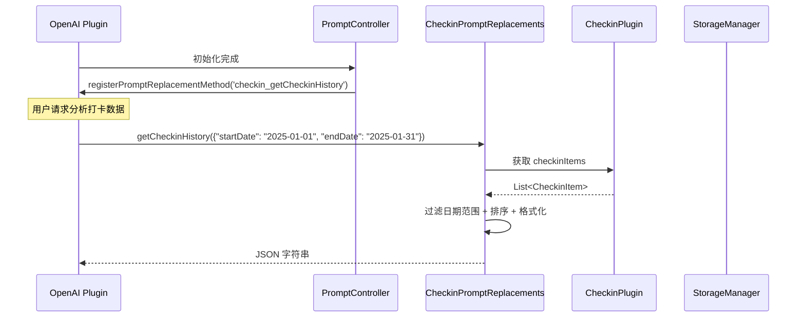

[根目录](../../CLAUDE.md) > [lib](../) > [plugins](./) > **checkin**

---

# 打卡插件 (Checkin Plugin) - 模块文档

## 模块职责

打卡插件是 Memento 的核心习惯养成模块,提供:

- **打卡列表管理**: 基于分组的打卡项目展示
- **打卡记录**: 支持时间段和备注的打卡记录
- **分组系统**: 支持自定义分组和拖拽排序
- **提醒设置**: 每周/每月/特定日期提醒功能
- **统计图表**: 打卡趋势、连续天数排行、分组占比分析
- **连续打卡追踪**: 计算连续打卡天数(连击)
- **AI 数据分析**: 注册到 OpenAI 插件,支持打卡历史分析
- **分组排序**: 按即将发生/频率/添加日期排序

---

## 入口与启动

### 插件主类

**文件**: `checkin_plugin.dart`

```dart
class CheckinPlugin extends BasePlugin {
    @override
    String get id => 'checkin';

    @override
    Future<void> initialize() async {
        // 初始化Prompt控制器
        _promptController = PromptController();
        _promptController.initialize();

        // 从存储加载打卡项目
        final pluginPath = 'checkin/$_storageKey';
        if (await storage.fileExists(pluginPath)) {
            final storedData = await storage.readJson(pluginPath);
            if (storedData != null && storedData.containsKey('items')) {
                _checkinItems = List.from(
                    (storedData['items'] as List).map(
                        (item) => CheckinItem.fromJson(item),
                    ),
                );
            }
        }
    }

    @override
    Future<void> registerToApp(
        PluginManager pluginManager,
        ConfigManager configManager,
    ) async {
        // 插件已在 initialize() 中完成初始化
    // 这里可以添加额外的应用级注册逻辑
    }
}
```

### 主界面入口

**文件**: `checkin_plugin.dart`

**路由**: 通过 `CheckinPlugin.buildMainView()` 返回 `CheckinMainView`,内部使用 `NavigationBar` 切换两个界面:
- **打卡列表** (`CheckinListScreen`): 主要的打卡管理界面
- **统计视图** (`CheckinStatsScreen`): 数据可视化和统计分析

---

## 对外接口

### 核心 API

#### 统计接口

```dart
// 获取总打卡数
int getTotalCheckins();

// 获取今日打卡数
int getTodayCheckins();

// 触发保存
Future<void> triggerSave();
```

#### CheckinItem 项目类

**文件**: `models/checkin_item.dart`

```dart
class CheckinItem {
    // 检查今天是否已打卡
    bool isCheckedToday();

    // 获取最后一次打卡日期
    DateTime? get lastCheckinDate;

    // 获取今天的打卡记录列表
    List<CheckinRecord> getTodayRecords();

    // 获取指定日期的打卡记录列表
    List<CheckinRecord> getDateRecords(DateTime date);

    // 添加打卡记录
    Future<void> addCheckinRecord(CheckinRecord record);

    // 取消打卡
    Future<void> cancelCheckinRecord(DateTime recordTime, {int? recordIndex});

    // 获取指定月份的打卡记录
    Map<DateTime, List<CheckinRecord>> getMonthlyRecords(int year, int month);

    // 获取连续打卡天数
    int getConsecutiveDays();

    // 重置所有打卡记录
    Future<void> resetRecords();
}
```

#### CheckinListController 控制器

**文件**: `controllers/checkin_list_controller.dart`

```dart
class CheckinListController {
    // 获取所有分组
    List<String> get groups;

    // 构建分组列表项
    List<Map<String, dynamic>> buildGroupListItems();

    // 按分组获取打卡项目
    Map<String, List<CheckinItem>> get groupedItems;

    // 获取统计信息
    Map<String, dynamic> getStatistics();

    // 显示分组排序对话框
    Future<void> showGroupSortDialog();

    // 显示打卡项目操作菜单
    void showItemOptionsDialog(CheckinItem item);

    // 显示分组管理对话框
    void showGroupManagementDialog();

    // 更新指定分组中项目的顺序
    Future<void> updateItemsOrder(String group, List<CheckinItem> newOrder);
}
```

### AI 集成接口

#### Prompt 替换方法

**文件**: `services/prompt_replacements.dart`

```dart
// 获取指定日期范围的打卡历史(供 OpenAI 插件调用)
Future<String> getCheckinHistory(Map<String, dynamic> params);
// params: { "startDate": "YYYY-MM-DD", "endDate": "YYYY-MM-DD" }
// 返回: JSON 字符串,包含打卡记录列表
```

**注册方式**: 通过 `PromptController` 在 OpenAI 插件中注册为 `checkin_getCheckinHistory` 方法

**返回数据格式**:
```json
[
  {
    "name": "早起",
    "group": "健康习惯",
    "done": "2025/01/15 06:30",
    "start": "2025/01/15 06:00",
    "end": "2025/01/15 06:30",
    "note": "今天起床很顺利"
  },
  {
    "name": "运动",
    "group": "健康习惯",
    "done": "2025/01/15 18:00"
  }
]
```

**字段说明**:
- `name`: 打卡项目名称
- `group`: 所属分组(可能为null)
- `done`: 打卡时间(格式: yyyy/MM/dd HH:mm)
- `start`: 开始时间(可选,仅当与结束时间相差至少1分钟时显示)
- `end`: 结束时间(可选)
- `note`: 备注(可选,非空时显示)

---

## 关键依赖与配置

### 外部依赖

- `intl`: 日期格式化
- `shared_preferences`: 存储排序设置
- `fl_chart`: 统计图表绘制

### 插件依赖

- **OpenAI Plugin**: AI 数据分析功能
- **Core Event System**: 消息事件广播
- **StorageManager**: 数据存储

### 存储路径

**根目录**: `checkin/`

**存储结构**:
```
checkin/
└── checkin_items.json              # 所有打卡项目数据
```

**数据格式** (`checkin_items.json`):
```json
{
  "items": [
    {
      "id": "1705308000000",
      "name": "早起",
      "icon": 59524,
      "color": 4280391411,
      "group": "健康习惯",
      "reminderSettings": {
        "type": 0,
        "weekdays": [1, 2, 3, 4, 5],
        "timeOfDay": {
          "hour": 6,
          "minute": 0
        }
      },
      "checkInRecords": {
        "2025-01-15": [
          {
            "startTime": "2025-01-15T06:00:00.000Z",
            "endTime": "2025-01-15T06:30:00.000Z",
            "checkinTime": "2025-01-15T06:30:00.000Z",
            "note": "今天起床很顺利"
          }
        ]
      }
    }
  ]
}
```

---

## 数据模型

### CheckinItem (打卡项目)

**文件**: `models/checkin_item.dart`

```dart
class CheckinItem {
  String id;                                    // 唯一ID(时间戳)
  String name;                                  // 项目名称
  IconData icon;                                // 图标
  Color color;                                  // 颜色
  String group;                                 // 分组名称
  String description;                           // 描述
  List<bool> frequency;                         // 每周频率(周日到周六,7个布尔值)
  ReminderSettings? reminderSettings;           // 提醒设置
  Map<String, List<CheckinRecord>> checkInRecords; // 打卡记录(key为yyyy-MM-dd格式)

  Map<String, dynamic> toJson();
  factory CheckinItem.fromJson(Map<String, dynamic> json);
}
```

**特性**:
- 使用时间戳作为唯一ID
- 图标以 codePoint 整数存储
- 颜色以整数值存储(Color.value)
- 打卡记录按日期(字符串格式)分组存储

### CheckinRecord (打卡记录)

**文件**: `models/checkin_item.dart`

```dart
class CheckinRecord {
  DateTime startTime;       // 开始时间
  DateTime endTime;         // 结束时间
  DateTime checkinTime;     // 打卡时间
  String? note;             // 备注(可选)

  Map<String, dynamic> toJson();
  factory CheckinRecord.fromJson(Map<String, dynamic> json);
}
```

**用途**: 记录单次打卡的详细信息,支持时间段和备注

### ReminderSettings (提醒设置)

**文件**: `models/checkin_item.dart`

```dart
class ReminderSettings {
  ReminderType type;            // 提醒类型
  List<int> weekdays;           // 每周提醒的星期(0-6,周日到周六)
  int? dayOfMonth;              // 每月提醒的日期(1-31)
  DateTime? specificDate;       // 特定日期提醒
  TimeOfDay timeOfDay;          // 提醒时间

  Map<String, dynamic> toJson();
  factory ReminderSettings.fromJson(Map<String, dynamic> json);
}

enum ReminderType {
  weekly,    // 每周特定日期提醒
  monthly,   // 每月特定日期提醒
  specific,  // 特定日期提醒
}
```

---

## 界面层结构

### 主要界面组件

| 组件 | 文件 | 职责 |
|------|------|------|
| `CheckinMainView` | `checkin_plugin.dart` | 插件主视图容器(双Tab导航) |
| `CheckinListScreen` | `screens/checkin_list_screen/checkin_list_screen.dart` | 打卡列表主界面 |
| `CheckinStatsScreen` | `screens/checkin_stats_screen/checkin_stats_screen.dart` | 统计分析界面 |
| `CheckinFormScreen` | `screens/checkin_form_screen.dart` | 打卡项目表单(创建/编辑) |
| `CheckinRecordScreen` | `screens/checkin_record_screen.dart` | 打卡记录历史界面 |
| `GroupListView` | `screens/checkin_list_screen/components/group_list_view.dart` | 分组列表视图 |
| `StatisticsSection` | `screens/checkin_list_screen/components/statistics_section.dart` | 统计信息卡片 |

### CheckinListScreen 布局

**布局结构**:
```
Scaffold
├── AppBar
│   ├── 排序按钮(Icons.sort)
│   └── 分组管理按钮(Icons.folder)
├── Column
│   ├── StatisticsSection (顶部统计卡片)
│   │   ├── 今日完成度(完成数/总数)
│   │   ├── 今日总打卡次数
│   │   └── 完成率百分比
│   └── Expanded
│       ├── EmptyState (无数据时)
│       └── GroupListView (分组列表)
│           └── 每个分组
│               ├── GroupCard (分组卡片)
│               │   ├── 展开/收起按钮
│               │   ├── 分组名称
│               │   ├── 完成进度(x/y)
│               │   └── WeeklyCheckinCircles (7天打卡状态)
│               └── CheckinItemList (可拖拽排序)
│                   └── CheckinItemCard (单个打卡项目)
│                       ├── 图标和名称
│                       ├── 连续天数徽章
│                       ├── 打卡按钮
│                       └── 更多选项菜单
```

**关键特性**:
- 分组可展开/收起
- 分组内项目支持拖拽排序
- 显示每周7天的打卡状态圈
- 长按打卡项目显示操作菜单(编辑/重置/删除)
- 点击打卡按钮快速打卡或查看记录

### CheckinFormScreen 表单

**核心功能**:
- 项目名称输入(必填,不允许重复)
- 图标和颜色选择(使用 `CircleIconPicker`)
- 分组选择(文本输入,支持现有分组)
- 提醒设置:
  - 无提醒
  - 每周提醒(选择星期几)
  - 每月提醒(选择几号)
  - 特定日期提醒(日期选择器)
  - 提醒时间设置

**验证规则**:
- 名称不能为空
- 名称不能与现有项目重复(编辑时除外)

### CheckinStatsScreen 统计界面

**图表类型**:

1. **打卡趋势图** (柱状图)
   - 组件: `DailyCheckinChart`
   - 支持周视图/月视图切换
   - X轴: 日期
   - Y轴: 打卡项目数量

2. **连续打卡排行榜**
   - 组件: `CheckinStreakRanking`
   - 显示所有打卡项目的连续天数
   - 按连续天数降序排列

3. **分组占比饼图**
   - 组件: `CheckinGroupPieChart`
   - 按分组统计打卡项目数量
   - 显示百分比和实际数量

---

## 分组排序系统

### GroupSortService

**文件**: `services/group_sort_service.dart`

**排序类型**:

```dart
enum GroupSortType {
  upcoming,   // 按即将发生排序
  frequency,  // 按打卡频率排序
  dateAdded,  // 按添加日期排序
}
```

**核心方法**:

```dart
// 对分组和分组内项目进行排序
static List<Map<String, dynamic>> sortGroups(
  List<Map<String, dynamic>> groups,
  GroupSortType sortType,
  bool isReversed,
);

// 对单个分组内的打卡项目进行排序
static List<CheckinItem> sortItems(
  List<CheckinItem> items,
  GroupSortType sortType,
  bool isReversed,
);
```

**排序逻辑**:

1. **按即将发生排序**:
   - 分组: 按未打卡项目数量降序(紧急程度)
   - 项目: 未打卡的排前面,已打卡的按最后打卡时间降序

2. **按打卡频率排序**:
   - 分组: 按平均每周打卡天数排序
   - 项目: 按每周需要打卡的天数排序

3. **按添加日期排序**:
   - 使用ID(时间戳)作为创建时间参考
   - 最早添加的排前面(可反向)

**排序设置持久化**:
- 使用 `SharedPreferences` 存储
- 键: `lastSortType`(int)、`isReversed`(bool)
- 自动恢复上次排序设置

---

## AI 数据分析集成

### 工作流程



### 注册流程

**文件**: `controls/prompt_controller.dart`

```dart
class PromptController {
  void initialize() {
    _promptReplacements.initialize();

    // 延迟注册,等待 OpenAI 插件初始化
    Future.delayed(const Duration(seconds: 1), () {
      _registerPromptMethods();
    });
  }

  void _registerPromptMethods() {
    final openaiPlugin = PluginManager.instance.getPlugin('openai') as OpenAIPlugin?;
    if (openaiPlugin != null) {
      openaiPlugin.registerPromptReplacementMethod(
        'checkin_getCheckinHistory',
        _promptReplacements.getCheckinHistory,
      );
    } else {
      // 重试机制
      Future.delayed(const Duration(seconds: 5), _registerPromptMethods);
    }
  }

  void unregisterPromptMethods() {
    final openaiPlugin = PluginManager.instance.getPlugin('openai') as OpenAIPlugin?;
    if (openaiPlugin != null) {
      openaiPlugin.unregisterPromptReplacementMethod('checkin_getCheckinHistory');
    }
    _promptReplacements.dispose();
  }
}
```

### 调用示例

在 OpenAI 插件的 Prompt 中可以使用:

```
请分析我在 {{checkin_getCheckinHistory(startDate: "2025-01-01", endDate: "2025-01-31")}} 的打卡数据,总结我这个月的习惯养成情况。
```

**日期格式支持**:
- `YYYY-MM-DD` (如: 2025-01-15)
- ISO 8601 格式 (如: 2025-01-15T00:00:00.000Z)

**数据优化**:
- 自动移除空字段(null值)
- 仅当时间段至少1分钟时才显示 start/end
- 按打卡时间排序

---

## 卡片视图

插件在主页提供卡片视图,展示:

**布局**:
```
┌─────────────────────────────┐
│ ✓ 打卡                     │
├─────────────────────────────┤
│  今日打卡    │   总打卡数   │
│     5/10     │     1,234    │
└─────────────────────────────┘
```

**实现**: `checkin_plugin.dart` 中的 `buildCardView()` 方法

**数据来源**:
- 今日打卡: `getTodayCheckins()` / `checkinItems.length`
- 总打卡数: `getTotalCheckins()`

---

## 国际化

### 支持语言

- 简体中文 (zh)
- 英语 (en)

### 本地化文件

| 文件 | 语言 |
|------|------|
| `l10n/checkin_localizations.dart` | 本地化接口 |
| `l10n/checkin_localizations_zh.dart` | 中文翻译 |
| `l10n/checkin_localizations_en.dart` | 英文翻译 |

### 关键字符串

```dart
abstract class CheckinLocalizations {
  String get name;                      // 插件名称
  String get todayCheckin;              // 今日打卡
  String get totalCheckinCount;         // 总打卡数
  String get checkinList;               // 打卡列表
  String get checkinStats;              // 打卡统计
  String get addCheckinItem;            // 添加打卡项目
  String get editCheckinItem;           // 编辑打卡项目
  String get deleteCheckinItemTitle;    // 删除打卡项目
  String get resetCheckinRecords;       // 重置打卡记录
  String get checkinSuccessTitle;       // 打卡成功
  String get consecutiveDaysLabel;      // 连续天数
  String get manageGroupsTitle;         // 管理分组
  String get reminderTypeLabel;         // 提醒类型
  String get weeklyReminder;            // 每周提醒
  String get monthlyReminder;           // 每月提醒
  String get specificDateReminder;      // 特定日期提醒
  String get upcoming;                  // 即将发生
  String get frequency;                 // 频率
  String get dateAdded;                 // 添加日期
  // ... 更多字符串
}
```

---

## 测试与质量

### 当前状态
- **单元测试**: 无
- **集成测试**: 无
- **已知问题**: 无明显问题

### 测试建议

1. **高优先级**:
   - `CheckinItem.addCheckinRecord()` - 测试记录添加和排序
   - `CheckinItem.getConsecutiveDays()` - 测试连续天数计算
   - `GroupSortService.sortGroups()` - 测试各种排序模式
   - `CheckinPromptReplacements.getCheckinHistory()` - 测试日期过滤和格式化

2. **中优先级**:
   - 打卡记录的保存和加载 - 测试数据持久化
   - 分组管理 - 测试分组增删改
   - AI 数据分析方法 - 测试空字段移除逻辑
   - 提醒设置 - 测试各种提醒类型

3. **低优先级**:
   - UI 交互逻辑
   - 国际化字符串完整性
   - 统计图表渲染
   - 卡片视图展示

---

## 常见问题 (FAQ)

### Q1: 如何自定义分组?

点击打卡列表界面的分组管理按钮(文件夹图标) → 添加/编辑/删除分组 → 拖拽项目到不同分组。

分组数据存储在 `checkin/checkin_items.json` 的 `items` 数组中,每个 `CheckinItem` 有 `group` 字段。

### Q2: 如何计算连续打卡天数?

```dart
int getConsecutiveDays() {
  int consecutiveDays = 0;
  final today = DateTime.now();
  final todayDate = DateTime(today.year, today.month, today.day);

  for (int i = 0; i < 365; i++) {
    final date = todayDate.subtract(Duration(days: i));
    final dateStr = _dateToString(date);

    if (checkInRecords.containsKey(dateStr) && checkInRecords[dateStr]!.isNotEmpty) {
      consecutiveDays++;
    } else {
      break; // 遇到未打卡的日期就停止计数
    }
  }

  return consecutiveDays;
}
```

**逻辑**: 从今天开始倒推,遇到第一个未打卡的日期停止,最多检查365天。

### Q3: 如何在 AI 分析中使用打卡数据?

在 OpenAI 插件的系统提示词或用户消息中使用:

```
{{checkin_getCheckinHistory(startDate: "2025-01-01", endDate: "2025-01-31")}}
```

OpenAI 插件会自动调用 `CheckinPromptReplacements.getCheckinHistory()` 并替换占位符。

### Q4: 打卡记录如何存储?

打卡记录存储在 `CheckinItem.checkInRecords` 中,类型为 `Map<String, List<CheckinRecord>>`:
- **Key**: 日期字符串(`yyyy-MM-dd`格式)
- **Value**: 该日期的打卡记录列表

**示例**:
```dart
{
  "2025-01-15": [
    CheckinRecord(startTime: ..., endTime: ..., checkinTime: ..., note: "..."),
    CheckinRecord(startTime: ..., endTime: ..., checkinTime: ..., note: null),
  ],
  "2025-01-16": [
    CheckinRecord(startTime: ..., endTime: ..., checkinTime: ...),
  ]
}
```

**优点**:
- 快速按日期查找
- 支持同一天多次打卡
- 自动按日期分组

### Q5: 提醒功能如何实现?

当前 `ReminderSettings` 只负责存储提醒配置,实际的系统通知需要在应用层实现。

**建议实现**:
1. 在 `CheckinPlugin.initialize()` 中遍历所有 `checkinItems`
2. 对于有 `reminderSettings` 的项目,使用 `flutter_local_notifications` 注册通知
3. 根据 `ReminderType` 计算下次提醒时间
4. 在用户打卡后更新或取消对应通知

### Q6: 如何导出打卡数据?

当前未实现导出功能,建议添加:

```dart
Future<File> exportCheckinToCSV(DateTime startDate, DateTime endDate) async {
  final buffer = StringBuffer();
  buffer.writeln('项目名称,分组,打卡时间,开始时间,结束时间,备注');

  for (final item in checkinItems) {
    for (final entry in item.checkInRecords.entries) {
      final date = _stringToDate(entry.key);
      if (date.isAfter(startDate) && date.isBefore(endDate)) {
        for (final record in entry.value) {
          buffer.writeln(
            '${item.name},${item.group},${record.checkinTime},'
            '${record.startTime},${record.endTime},"${record.note ?? ""}"'
          );
        }
      }
    }
  }

  final file = File('checkin_export_${DateTime.now().millisecondsSinceEpoch}.csv');
  await file.writeAsString(buffer.toString());
  return file;
}
```

---

## 目录结构

```
checkin/
├── checkin_plugin.dart                                   # 插件主类 + 主视图
├── models/
│   └── checkin_item.dart                                 # 打卡项目、记录、提醒设置模型
├── controllers/
│   └── checkin_list_controller.dart                      # 打卡列表控制器
├── controls/
│   └── prompt_controller.dart                            # Prompt 控制器(注册到 OpenAI)
├── services/
│   ├── prompt_replacements.dart                          # AI Prompt 替换方法
│   └── group_sort_service.dart                           # 分组排序服务
├── screens/
│   ├── checkin_list_screen/
│   │   ├── checkin_list_screen.dart                      # 打卡列表主界面
│   │   └── components/
│   │       ├── checkin_item_list.dart                    # 打卡项目列表(可拖拽)
│   │       ├── checkin_item_card.dart                    # 单个打卡项目卡片
│   │       ├── group_card.dart                           # 分组卡片
│   │       ├── group_list_view.dart                      # 分组列表视图
│   │       ├── stat_card.dart                            # 统计卡片
│   │       ├── statistics_section.dart                   # 统计信息区域
│   │       ├── weekly_checkin_circles.dart               # 每周打卡状态圈
│   │       └── empty_state.dart                          # 空状态视图
│   ├── checkin_stats_screen/
│   │   ├── checkin_stats_screen.dart                     # 统计主界面
│   │   └── widgets/
│   │       ├── daily_checkin_chart.dart                  # 每日打卡图表
│   │       ├── checkin_streak_ranking.dart               # 连续打卡排行榜
│   │       └── checkin_group_pie_chart.dart              # 分组占比饼图
│   ├── checkin_form_screen.dart                          # 打卡项目表单
│   ├── checkin_detail_screen.dart                        # 打卡详情界面
│   └── checkin_record_screen.dart                        # 打卡记录历史界面
├── widgets/
│   ├── checkin_card.dart                                 # 打卡卡片
│   ├── checkin_record_dialog.dart                        # 打卡记录对话框
│   └── group_sort_dialog.dart                            # 分组排序对话框
└── l10n/
    ├── checkin_localizations.dart                        # 国际化接口
    ├── checkin_localizations_zh.dart                     # 中文翻译
    └── checkin_localizations_en.dart                     # 英文翻译
```

---

## 关键实现细节

### 日期标准化

打卡记录使用字符串格式存储日期,避免时区问题:

```dart
String _dateToString(DateTime date) {
  return '${date.year}-${date.month.toString().padLeft(2, '0')}-${date.day.toString().padLeft(2, '0')}';
}

DateTime _stringToDate(String dateStr) {
  final parts = dateStr.split('-');
  return DateTime(
    int.parse(parts[0]),
    int.parse(parts[1]),
    int.parse(parts[2]),
  );
}
```

**原因**: `DateTime.now()` 包含时分秒,导致相同日期的不同时间被视为不同的 key。

### 打卡记录自动排序

添加打卡记录时自动按时间降序排序:

```dart
Future<void> addCheckinRecord(CheckinRecord record) async {
  final dateStr = _dateToString(record.checkinTime);
  if (!checkInRecords.containsKey(dateStr)) {
    checkInRecords[dateStr] = [];
  }
  checkInRecords[dateStr]!.add(record);
  checkInRecords[dateStr]!.sort((a, b) => b.checkinTime.compareTo(a.checkinTime));
  await CheckinPlugin.shared.triggerSave();
}
```

**原因**: 确保同一天的多次打卡按时间倒序显示,最新的打卡在最上面。

### 延迟注册到 OpenAI

由于插件初始化顺序不确定,使用延迟 + 重试机制:

```dart
Future.delayed(const Duration(seconds: 1), () {
  _registerPromptMethods();
});

// 失败时重试
if (openaiPlugin == null) {
  Future.delayed(const Duration(seconds: 5), _registerPromptMethods);
}
```

### 分组管理集成 TagManagerDialog

使用通用的 `TagManagerDialog` 组件管理分组:

```dart
void showGroupManagementDialog() {
  showDialog(
    context: context,
    builder: (dialogContext) => TagManagerDialog(
      groups: getCurrentTagGroups(),
      selectedTags: getSelectedTags(),
      onAddTag: (String group, {String? tag}) async {
        // 调用打卡项目表单
        return await showAddCheckinItemDialog(
          group: group,
          copyFromTag: tag,
          id: itemId,
        );
      },
      onGroupsChanged: (List<TagGroup> updatedGroups) async {
        // 更新分组结构
        // ...保存并刷新
      },
      config: TagManagerConfig(...),
    ),
  );
}
```

**优势**: 复用通用组件,保持一致的用户体验。

### 打卡记录的索引机制

使用 `recordIndex` 参数精确删除记录:

```dart
Future<void> cancelCheckinRecord(DateTime recordTime, {int? recordIndex}) async {
  final dateStr = _dateToString(recordTime);
  if (checkInRecords.containsKey(dateStr)) {
    if (recordIndex != null && recordIndex >= 0 && recordIndex < checkInRecords[dateStr]!.length) {
      // 使用索引精确删除
      checkInRecords[dateStr]!.removeAt(recordIndex);
    } else {
      // 找到第一个匹配时间的记录
      final index = checkInRecords[dateStr]!.indexWhere(
        (record) => record.checkinTime.isAtSameMomentAs(recordTime)
      );
      if (index >= 0) {
        checkInRecords[dateStr]!.removeAt(index);
      }
    }

    // 如果该日期下没有记录了,移除该日期
    if (checkInRecords[dateStr]!.isEmpty) {
      checkInRecords.remove(dateStr);
    }
  }
  await CheckinPlugin.shared.triggerSave();
}
```

**原因**: 同一天可能有多次打卡,使用时间戳匹配不够精确,索引更可靠。

---

## 依赖关系

### 核心依赖

- **BasePlugin**: 插件基类
- **StorageManager**: 数据持久化
- **PluginManager**: 插件管理器
- **ConfigManager**: 配置管理器
- **EventManager**: 事件广播系统(通过 `CheckinListController.notifyEvent`)

### 第三方包依赖

- `intl: ^0.18.0` - 日期格式化
- `shared_preferences: ^2.0.0` - 排序设置存储
- `fl_chart: ^0.65.0` - 图表绘制

### 其他插件依赖

- **OpenAI Plugin**: 可选依赖,用于 AI 数据分析

**依赖方向**: `checkin` → `openai`(通过 `PluginManager` 获取)

---

## 事件系统

### 事件类型

**文件**: `controllers/checkin_list_controller.dart`

| 事件名 | 触发时机 | 参数 |
|-------|---------|------|
| `checkin_deleted` | 删除打卡项目时 | `ItemEventArgs(itemId, title, action: 'deleted')` |

**事件广播示例**:

```dart
void notifyEvent(String action, CheckinItem item) {
  final eventArgs = ItemEventArgs(
    eventName: 'checkin_$action',
    itemId: item.id,
    title: item.name,
    action: action,
  );
  EventManager.instance.broadcast('checkin_$action', eventArgs);
}
```

**用途**: 通知其他模块(如活动记录、日记等)打卡项目的变更。

---

## 变更记录 (Changelog)

- **2025-11-13**: 初始化打卡插件文档,识别 26 个文件、3 个数据模型、分组排序系统、AI 集成、统计图表、核心功能包括打卡记录管理、连续天数追踪、提醒设置

---

**上级目录**: [返回插件目录](../../CLAUDE.md#模块索引) | [返回根文档](../../CLAUDE.md)
