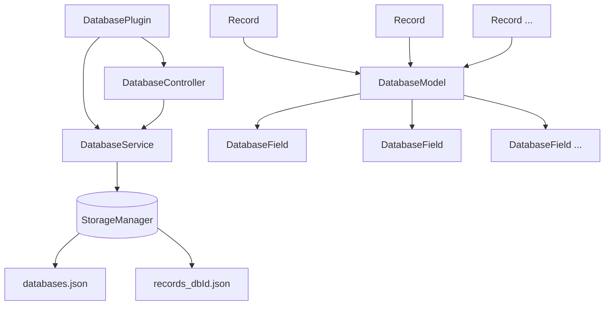
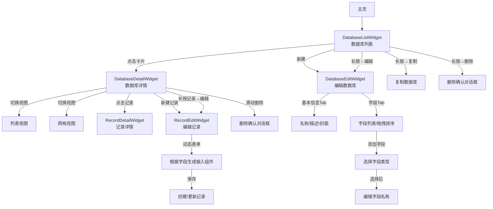

[根目录](../../../CLAUDE.md) > [lib](../../) > [plugins](../) > **database**

---

# 数据库插件 (Database Plugin) - 模块文档

## 模块职责

数据库插件是 Memento 的核心功能模块之一,提供:

- **自定义数据库结构**:用户可自定义数据库名称、描述、封面图片
- **灵活的字段系统**:支持 11 种字段类型(文本、数字、日期、图片、密码等)
- **记录管理**:支持创建、编辑、删除数据库记录
- **多视图模式**:列表视图和网格视图两种展示方式
- **字段可视化编辑**:支持字段拖拽排序、动态添加/编辑字段
- **数据持久化**:基于 JSON 的本地存储机制
- **数据库复制**:支持一键复制现有数据库

---

## 入口与启动

### 插件主类

**文件**: `database_plugin.dart`

```dart
class DatabasePlugin extends BasePlugin {
    @override
    String get id => 'database';

    @override
    Color get color => Colors.deepPurple;

    @override
    IconData get icon => Icons.storage;

    late final DatabaseService service = DatabaseService(this);

    @override
    Future<void> initialize() async {
        await service.initializeDefaultData();
    }

    @override
    Future<void> registerToApp(pluginManager, configManager) async {
        await initialize();
    }
}
```

### 主界面入口

**文件**: `database_plugin.dart`

**路由**: 通过 `DatabasePlugin.buildMainView()` 返回 `DatabaseMainView`

**启动流程**:
1. `DatabasePlugin.initialize()` - 初始化默认数据库
2. `DatabaseService.initializeDefaultData()` - 创建 'default_db' 默认数据库
3. `DatabaseMainView` → `DatabaseListWidget` - 显示数据库列表

---

## 对外接口

### 核心 API

#### DatabaseService 服务方法

**文件**: `services/database_service.dart`

```dart
// ========== 数据库管理 ==========

// 获取所有数据库
Future<List<DatabaseModel>> getAllDatabases();

// 创建新数据库
Future<void> createDatabase(DatabaseModel database);

// 更新数据库
Future<void> updateDatabase(DatabaseModel database);

// 删除数据库
Future<void> deleteDatabase(String databaseId);

// 初始化默认数据
Future<void> initializeDefaultData();

// 获取数据库数量
Future<int> getDatabaseCount();
```

#### DatabaseController 控制器方法

**文件**: `controllers/database_controller.dart`

```dart
// ========== 数据库操作 ==========

// 加载指定数据库
Future<void> loadDatabase(String databaseId);

// 更新当前数据库
Future<void> updateDatabase(DatabaseModel database);

// 创建数据库
Future<void> createDatabase(DatabaseModel database);

// 删除当前数据库
Future<void> deleteDatabase();

// ========== 记录管理 ==========

// 获取数据库的所有记录
Future<List<Record>> getRecords(String databaseId);

// 创建新记录
Future<void> createRecord(Record record);

// 更新记录
Future<void> updateRecord(Record record);

// 删除记录
Future<void> deleteRecord(String recordId);
```

#### FieldController 字段控制器

**文件**: `controllers/field_controller.dart`

```dart
// ========== 字段类型管理 ==========

// 获取所有支持的字段类型
static List<String> getFieldTypes();
// 返回: ['Text', 'Long Text', 'Integer', 'Checkbox', 'Dropdown',
//        'Date', 'Time', 'Date/Time', 'Image', 'URL', 'Rating', 'Password']

// 构建字段输入组件
static Widget buildFieldWidget({
  required BuildContext context,
  required DatabaseField field,
  required dynamic initialValue,
  required ValueChanged<dynamic> onChanged,
});

// 构建字段类型选择项
static Widget buildFieldTypeTile({
  required String type,
  required VoidCallback onTap,
});
```

### 统计接口

```dart
// 获取数据库总数(供卡片视图使用)
Future<int> getDatabaseCount();
```

---

## 关键依赖与配置

### 外部依赖

- `flutter/material.dart`: UI 组件库
- `uuid`: UUID 生成(用于数据库复制)
- `image_picker`: 图片选择器(字段类型:Image)
- `Memento/widgets/image_picker_dialog.dart`: 自定义图片选择对话框
- `Memento/utils/image_utils.dart`: 图片工具类

### 插件依赖

- **Core Storage Manager**: 数据持久化
- **Core Plugin Manager**: 插件管理与导航

### 存储路径

**存储键名**:
- `databases/databases` - 所有数据库元数据
- `records_{databaseId}` - 各数据库的记录数据

**存储结构**:
```
storage/
├── databases/
│   └── databases.json              # 所有数据库的元数据
└── records_<databaseId>.json       # 每个数据库的记录数据
```

**databases.json 格式**:
```json
[
  {
    "id": "default_db",
    "name": "Default Database",
    "description": "示例数据库描述",
    "coverImage": "/path/to/image.jpg",
    "fields": [
      {
        "id": "1234567890",
        "name": "标题",
        "type": "Text",
        "isRequired": false
      },
      {
        "id": "1234567891",
        "name": "创建日期",
        "type": "Date",
        "isRequired": true
      }
    ],
    "createdAt": "2025-01-15T10:30:00.000Z",
    "updatedAt": "2025-01-15T10:30:00.000Z"
  }
]
```

**records_{databaseId}.json 格式**:
```json
[
  {
    "id": "1234567890123",
    "tableId": "default_db",
    "fields": {
      "标题": "我的第一条记录",
      "创建日期": "2025-01-15T08:30:00.000Z",
      "数量": 42,
      "完成": true
    },
    "createdAt": "2025-01-15T08:30:00.000Z",
    "updatedAt": "2025-01-15T20:15:00.000Z"
  }
]
```

---

## 数据模型

### DatabaseModel (数据库)

**文件**: `models/database_model.dart`

```dart
class DatabaseModel {
  String id;                        // 唯一标识符
  String name;                      // 数据库名称
  String? description;              // 数据库描述(可选)
  String? coverImage;               // 封面图片路径(可选)
  List<DatabaseField> fields;       // 字段定义列表
  DateTime createdAt;               // 创建时间
  DateTime updatedAt;               // 更新时间

  Map<String, dynamic> toMap();
  factory DatabaseModel.fromMap(Map<String, dynamic> map);
  DatabaseModel copyWith({...});
}
```

**示例数据**:
```json
{
  "id": "1234567890",
  "name": "项目管理",
  "description": "用于跟踪项目进度",
  "coverImage": "images/project_cover.jpg",
  "fields": [
    {"id": "f1", "name": "项目名称", "type": "Text", "isRequired": true},
    {"id": "f2", "name": "截止日期", "type": "Date", "isRequired": false},
    {"id": "f3", "name": "优先级", "type": "Rating", "isRequired": false}
  ],
  "createdAt": "2025-01-15T10:30:00.000Z",
  "updatedAt": "2025-01-16T14:20:00.000Z"
}
```

### DatabaseField (数据库字段)

**文件**: `models/database_field.dart`

```dart
@immutable
class DatabaseField {
  String id;               // 字段唯一标识符
  String name;             // 字段名称
  String type;             // 字段类型(Text/Integer/Date等)
  bool isRequired;         // 是否必填

  Map<String, dynamic> toMap();
  factory DatabaseField.fromMap(Map<String, dynamic> map);
  DatabaseField copyWith({...});
}
```

**支持的字段类型**:

| 类型 | 描述 | 图标 | 输入组件 |
|------|------|------|---------|
| `Text` | 单行文本 | `Icons.text_fields` | `TextField` |
| `Long Text` | 多行文本 | `Icons.notes` | `TextField(maxLines: 3)` |
| `Integer` | 整数 | `Icons.numbers` | `TextField(keyboardType: number)` |
| `Checkbox` | 复选框 | `Icons.check_box` | `CheckboxListTile` |
| `Dropdown` | 下拉选择 | `Icons.arrow_drop_down` | `DropdownButton` |
| `Date` | 日期 | `Icons.calendar_today` | `DatePicker` |
| `Time` | 时间 | `Icons.access_time` | `TimePicker` |
| `Date/Time` | 日期时间 | `Icons.date_range` | `DateTimePicker` |
| `Image` | 图片 | `Icons.image` | `ImagePicker` |
| `URL` | 网址 | `Icons.link` | `TextField` |
| `Rating` | 评分 | `Icons.star` | `Rating Widget` |
| `Password` | 密码 | `Icons.lock` | `TextField(obscureText: true)` |

### Record (记录)

**文件**: `models/record.dart`

```dart
class Record {
  String id;                        // 记录唯一标识符
  String tableId;                   // 所属数据库ID
  Map<String, dynamic> fields;      // 字段数据(键=字段名,值=字段值)
  DateTime createdAt;               // 创建时间
  DateTime updatedAt;               // 更新时间

  Map<String, dynamic> toMap();
  factory Record.fromMap(Map<String, dynamic> map);
  Record copyWith({...});
}
```

**示例数据**:
```json
{
  "id": "1234567890123",
  "tableId": "1234567890",
  "fields": {
    "项目名称": "Memento 应用开发",
    "截止日期": "2025-03-01T00:00:00.000Z",
    "优先级": 5,
    "负责人": "张三",
    "完成状态": true
  },
  "createdAt": "2025-01-15T08:30:00.000Z",
  "updatedAt": "2025-01-16T10:15:00.000Z"
}
```

### FieldModel (字段模型)

**文件**: `models/field_model.dart`

```dart
class FieldModel {
  String id;               // 字段ID
  String name;             // 字段名称
  String type;             // 字段类型
  String? description;     // 字段描述(用于存储默认值等)

  FieldModel copyWith({...});
}
```

**注**: `FieldModel` 是 `DatabaseField` 的扩展版本,在编辑界面使用,支持额外的 `description` 字段。

---

## 界面层结构

### 主要界面组件

| 组件 | 文件 | 职责 |
|------|------|------|
| `DatabaseMainView` | `database_plugin.dart` | 插件主视图容器 |
| `DatabaseListWidget` | `widgets/database_list_widget.dart` | 数据库列表(网格视图) |
| `DatabaseDetailWidget` | `widgets/database_detail_widget.dart` | 数据库详情与记录列表 |
| `DatabaseEditWidget` | `widgets/database_edit_widget.dart` | 数据库编辑界面(双Tab) |
| `RecordEditWidget` | `widgets/record_edit_widget.dart` | 记录编辑界面 |
| `RecordDetailWidget` | `widgets/record_detail_widget.dart` | 记录详情界面 |

### DatabaseListWidget 布局

**布局结构**:
```
Scaffold
├── AppBar
│   ├── leading: 返回主页按钮
│   └── title: "数据库列表"
├── body: GridView
│   └── GridView.builder (2列网格)
│       └── Card - 数据库卡片
│           ├── 封面图片或默认图标
│           ├── 数据库名称
│           ├── onTap: 进入数据库详情
│           └── onLongPress: 显示操作菜单(编辑/复制/删除)
└── FloatingActionButton: 创建新数据库
```

**关键特性**:
- 网格布局(2列)
- 支持封面图片显示(网络/本地)
- 下拉刷新
- 长按显示操作菜单
- 空状态提示
- 错误处理与重试

### DatabaseDetailWidget 布局

**布局结构**:
```
Scaffold
├── AppBar
│   ├── title: 数据库名称
│   └── actions: [视图切换按钮(列表/网格), 编辑按钮]
├── body: 动态视图
│   ├── ListView (列表模式)
│   │   └── Dismissible - 记录列表项
│   │       ├── 左滑删除
│   │       ├── onTap: 查看记录详情
│   │       └── onLongPress: 显示操作菜单
│   └── GridView (网格模式)
│       └── Card - 记录卡片
└── FloatingActionButton: 创建新记录
```

**关键特性**:
- 列表/网格双视图模式切换
- 支持滑动删除记录
- 记录标题显示(取 `fields['title']` 或显示"未命名")
- 实时刷新数据

### DatabaseEditWidget 布局

**布局结构**:
```
Scaffold
├── AppBar
│   ├── title: "编辑数据库"
│   ├── bottom: TabBar
│   │   ├── Tab: "基本信息"
│   │   └── Tab: "字段"
│   └── actions: [保存按钮]
└── body: TabBarView
    ├── 基本信息 Tab
    │   ├── TextFormField: 数据库名称
    │   ├── Button: 上传封面图片
    │   └── TextFormField: 描述(多行)
    └── 字段 Tab
        ├── ReorderableListView: 字段列表(支持拖拽排序)
        │   └── ListTile: 字段名称、类型
        └── FloatingActionButton: 添加新字段
```

**关键特性**:
- 双Tab布局(基本信息/字段)
- 字段拖拽排序
- 图片裁剪功能(纵横比 1:1)
- 字段类型选择对话框
- 字段编辑对话框(支持默认值设置)

### RecordEditWidget 布局

**布局结构**:
```
Scaffold
├── AppBar
│   ├── title: "编辑记录"
│   └── actions: [保存按钮]
└── body: Form
    └── ListView
        └── 动态生成字段组件
            ├── Text → TextFormField
            ├── Integer → TextFormField(number)
            ├── Checkbox → CheckboxListTile
            ├── Date → DatePicker
            ├── Image → ImagePicker + Image.file
            └── ...
```

**关键特性**:
- 根据数据库字段定义动态生成表单
- 不同字段类型使用不同输入组件
- 自动初始化字段默认值
- 表单验证

---

## 事件系统

**当前状态**: 未实现事件广播系统

**建议添加**:

```dart
// 在 DatabaseService 中
void _notifyEvent(String action, DatabaseModel database) {
  final eventArgs = ItemEventArgs(
    eventName: 'database_$action',
    itemId: database.id,
    title: database.name,
    action: action,
  );
  EventManager.instance.broadcast('database_$action', eventArgs);
}

// 建议的事件类型:
// - database_created  - 创建数据库时
// - database_updated  - 更新数据库时
// - database_deleted  - 删除数据库时
// - record_created    - 创建记录时
// - record_updated    - 更新记录时
// - record_deleted    - 删除记录时
```

---

## 卡片视图

插件在主页提供卡片视图,展示:

**布局**:
```
┌─────────────────────────────┐
│ 💾 数据库                   │
├─────────────────────────────┤
│    总数据库数               │
│        5                    │
└─────────────────────────────┘
```

**实现**: `database_plugin.dart` 中的 `buildCardView()` 方法

**数据来源**: `DatabaseService.getDatabaseCount()`

---

## 国际化

### 支持语言

- 简体中文 (zh)
- 英语 (en)

### 本地化文件

| 文件 | 语言 |
|------|------|
| `l10n/database_localizations.dart` | 本地化接口 |
| `l10n/database_localizations_zh.dart` | 中文翻译 |
| `l10n/database_localizations_en.dart` | 英文翻译 |

### 关键字符串

```dart
abstract class DatabaseLocalizations {
  String get name;                      // 插件名称
  String get pluginDescription;         // 插件描述

  // 数据库操作
  String get databaseListTitle;         // 数据库列表
  String get editDatabaseTitle;         // 编辑数据库
  String get newDatabaseDefaultName;    // 新建数据库
  String get databaseNameLabel;         // 数据库名称
  String get descriptionLabel;          // 描述
  String get totalDatabasesCount;       // 总数据库数

  // 字段操作
  String get fieldsTabTitle;            // 字段
  String get informationTabTitle;       // 基本信息
  String get fieldNameLabel;            // 字段名称
  String get selectFieldTypeTitle;      // 选择字段类型
  String get newFieldTitle;             // 新建字段
  String get defaultValueLabel;         // 默认值

  // 记录操作
  String get editRecordTitle;           // 编辑记录
  String get deleteRecordTitle;         // 删除记录
  String get deleteRecordMessage;       // 删除确认消息
  String get untitledRecord;            // 未命名

  // 通用操作
  String get edit;                      // 编辑
  String get delete;                    // 删除
  String get cancel;                    // 取消
  String get confirmDeleteTitle;        // 确认删除
  String get confirmDeleteMessage;      // 删除确认消息
  String get uploadCoverImage;          // 上传封面图片
  String get selectImage;               // 选择图片

  // 消息提示
  String get loadFailedMessage;         // 加载失败
  String get saveFailedMessage;         // 保存失败
  String get deleteSuccessMessage;      // 删除成功
  String get deleteFailedMessage;       // 删除失败
  String get copySuccess;               // 复制成功
  String get noDatabasesMessage;        // 暂无数据库
  String get addDatabaseHint;           // 添加提示
}
```

---

## 测试与质量

### 当前状态
- **单元测试**: 无
- **集成测试**: 无
- **已知问题**: 无明显问题

### 测试建议

1. **高优先级**:
   - `DatabaseService.createDatabase()` - 测试数据库创建和存储
   - `DatabaseService.deleteDatabase()` - 测试删除逻辑
   - `DatabaseController.getRecords()` - 测试记录读取
   - `FieldController.buildFieldWidget()` - 测试所有 11 种字段类型组件
   - 数据库复制功能 - 测试 UUID 生成和数据复制

2. **中优先级**:
   - 字段拖拽排序 - 测试排序逻辑
   - 图片上传与裁剪 - 测试图片处理流程
   - 记录编辑 - 测试动态表单生成
   - 数据持久化 - 测试 JSON 序列化/反序列化
   - 默认数据初始化 - 测试 `initializeDefaultData()`

3. **低优先级**:
   - UI 交互逻辑
   - 国际化字符串完整性
   - 空状态显示
   - 错误处理与重试

---

## 常见问题 (FAQ)

### Q1: 如何添加新的字段类型?

在 `FieldController` 中添加新字段类型:

```dart
// 1. 在 fieldTypes Map 中添加类型定义
static const Map<String, IconData> fieldTypes = {
  'Text': Icons.text_fields,
  // ... 现有类型
  'Color': Icons.color_lens,  // 新增颜色字段
};

// 2. 在 buildFieldWidget() 中添加对应的组件
case 'Color':
  return ListTile(
    title: Text(field.name),
    trailing: Container(
      width: 40,
      height: 40,
      color: Color(initialValue ?? 0xFF000000),
    ),
    onTap: () async {
      final color = await showDialog<Color>(
        context: context,
        builder: (context) => ColorPickerDialog(),
      );
      if (color != null) onChanged(color.value);
    },
  );
```

### Q2: 数据库的ID是如何生成的?

使用时间戳作为唯一标识符:

```dart
// 创建数据库时
_editedDatabase = _editedDatabase.copyWith(
  id: DateTime.now().millisecondsSinceEpoch.toString(),
);

// 复制数据库时使用 UUID
final newDatabase = database.copyWith(id: Uuid().v4());
```

**优点**: 简单、递增、无需额外依赖(时间戳)/全局唯一(UUID)
**缺点**: 高并发下时间戳可能重复(当前场景下无问题)

### Q3: 如何实现数据导入导出功能?

建议添加导入导出方法:

```dart
// 导出数据库(包含结构和记录)
Future<String> exportDatabase(String databaseId) async {
  final database = await getAllDatabases()
      .then((dbs) => dbs.firstWhere((db) => db.id == databaseId));
  final records = await controller.getRecords(databaseId);

  final exportData = {
    'database': database.toMap(),
    'records': records.map((r) => r.toMap()).toList(),
  };

  return jsonEncode(exportData);
}

// 导入数据库
Future<void> importDatabase(String jsonData) async {
  final data = jsonDecode(jsonData);
  final database = DatabaseModel.fromMap(data['database']);
  final records = (data['records'] as List)
      .map((r) => Record.fromMap(r))
      .toList();

  // 生成新ID避免冲突
  final newDatabase = database.copyWith(
    id: Uuid().v4(),
  );

  await createDatabase(newDatabase);
  for (var record in records) {
    await controller.createRecord(
      record.copyWith(
        id: Uuid().v4(),
        tableId: newDatabase.id,
      ),
    );
  }
}
```

### Q4: 如何实现字段默认值功能?

当前 `FieldModel.description` 字段可用于存储默认值:

```dart
// 在 RecordEditWidget 中初始化字段时
for (final field in widget.database.fields) {
  _fields.putIfAbsent(field.name, () {
    // 如果字段有描述(默认值),使用它
    if (field is FieldModel && field.description != null) {
      return field.description;
    }

    // 否则使用类型默认值
    switch (field.type) {
      case 'Text':
      case 'Long Text':
        return '';
      case 'Integer':
        return 0;
      case 'Checkbox':
        return false;
      default:
        return null;
    }
  });
}
```

### Q5: 如何实现记录搜索功能?

建议在 `DatabaseController` 中添加:

```dart
Future<List<Record>> searchRecords({
  required String databaseId,
  required String query,
  List<String>? fieldNames,  // 指定搜索字段
}) async {
  final allRecords = await getRecords(databaseId);

  return allRecords.where((record) {
    // 如果指定了字段,仅搜索这些字段
    final fieldsToSearch = fieldNames ?? record.fields.keys.toList();

    for (var fieldName in fieldsToSearch) {
      final value = record.fields[fieldName];
      if (value != null &&
          value.toString().toLowerCase().contains(query.toLowerCase())) {
        return true;
      }
    }
    return false;
  }).toList();
}
```

### Q6: 如何实现字段验证功能?

在 `DatabaseField` 中添加验证规则:

```dart
class DatabaseField {
  // ... 现有字段
  Map<String, dynamic>? validation;  // 验证规则

  // 示例验证规则:
  // {
  //   'required': true,
  //   'minLength': 5,
  //   'maxLength': 100,
  //   'pattern': r'^[a-zA-Z0-9]+$',
  //   'min': 0,
  //   'max': 100
  // }
}

// 在 FieldController.buildFieldWidget() 中应用验证
case 'Text':
  return TextFormField(
    // ...
    validator: (value) {
      if (field.validation?['required'] == true &&
          (value == null || value.isEmpty)) {
        return '${field.name} 为必填项';
      }

      if (field.validation?['minLength'] != null &&
          value!.length < field.validation!['minLength']) {
        return '${field.name} 最少需要 ${field.validation!['minLength']} 个字符';
      }

      // 更多验证逻辑...
      return null;
    },
  );
```

---

## 目录结构

```
database/
├── database_plugin.dart                # 插件主类
├── models/
│   ├── database_model.dart             # 数据库模型
│   ├── database_field.dart             # 数据库字段模型
│   ├── field_model.dart                # 字段模型(编辑用)
│   └── record.dart                     # 记录模型
├── services/
│   └── database_service.dart           # 数据库服务(CRUD)
├── controllers/
│   ├── database_controller.dart        # 数据库控制器
│   └── field_controller.dart           # 字段控制器(字段类型管理)
├── widgets/
│   ├── database_list_widget.dart       # 数据库列表组件
│   ├── database_detail_widget.dart     # 数据库详情组件
│   ├── database_edit_widget.dart       # 数据库编辑组件
│   ├── record_edit_widget.dart         # 记录编辑组件
│   └── record_detail_widget.dart       # 记录详情组件
└── l10n/
    ├── database_localizations.dart     # 国际化接口
    ├── database_localizations_zh.dart  # 中文翻译
    └── database_localizations_en.dart  # 英文翻译
```

---

## 关键实现细节

### 1. 动态字段组件生成

**核心机制**: 根据字段类型动态生成输入组件

```dart
// FieldController.buildFieldWidget() 的工作原理
switch (field.type) {
  case 'Text':
    return TextFormField(...);
  case 'Integer':
    return TextFormField(keyboardType: TextInputType.number, ...);
  case 'Checkbox':
    return CheckboxListTile(...);
  case 'Date':
    return ListTile(onTap: () => showDatePicker(...));
  // ... 其他类型
}

// 在 RecordEditWidget 中使用
ListView(
  children: [
    for (final field in widget.database.fields)
      FieldController.buildFieldWidget(
        context: context,
        field: field,
        initialValue: _fields[field.name],
        onChanged: (value) => _fields[field.name] = value,
      ),
  ],
)
```

### 2. 字段拖拽排序实现

使用 `ReorderableListView` 实现:

```dart
ReorderableListView(
  onReorder: (oldIndex, newIndex) {
    setState(() {
      if (newIndex > oldIndex) newIndex--;
      final item = _fields.removeAt(oldIndex);
      _fields.insert(newIndex, item);
    });
  },
  children: _fields.map((field) => ListTile(
    key: ValueKey(field.id),  // 必须提供唯一 key
    title: Text(field.name),
    trailing: Icon(Icons.drag_handle),
  )).toList(),
)
```

### 3. 数据库复制功能

```dart
// 在 DatabaseListWidget._showBottomSheet() 中
ListTile(
  leading: Icon(Icons.copy),
  title: Text('复制'),
  onTap: () async {
    // 1. 生成新的UUID
    final newDatabase = database.copyWith(id: Uuid().v4());

    // 2. 创建副本
    await widget.service.createDatabase(newDatabase);

    // 3. 刷新列表
    setState(() {
      _databasesFuture = widget.service.getAllDatabases();
    });
  },
)
```

**注意**: 当前仅复制数据库结构,不复制记录。如需复制记录,需同时复制 `records_{databaseId}` 数据。

### 4. 图片处理流程

```dart
// 1. 在 DatabaseEditWidget 中上传封面
Future<void> _pickImage() async {
  final result = await showDialog<Map<String, dynamic>>(
    context: context,
    builder: (context) => ImagePickerDialog(
      enableCrop: true,
      cropAspectRatio: 1.0,  // 正方形裁剪
    ),
  );

  if (result != null && result['url'] != null) {
    _editedDatabase = _editedDatabase.copyWith(
      coverImage: result['url'],  // 存储图片路径
    );
  }
}

// 2. 在 DatabaseListWidget 中显示
FutureBuilder<String>(
  future: ImageUtils.getAbsolutePath(database.coverImage!),
  builder: (context, snapshot) {
    if (snapshot.hasData) {
      return _buildImageWidget(snapshot.data!);
    }
    return _buildIcon();  // 默认图标
  },
)

// 3. 图片显示处理(支持网络/本地)
Widget _buildImageWidget(String imageUrl) {
  if (imageUrl.startsWith('http://') || imageUrl.startsWith('https://')) {
    return Image.network(imageUrl, fit: BoxFit.cover);
  } else {
    return Image.file(File(imageUrl), fit: BoxFit.cover);
  }
}
```

### 5. 双视图模式切换

```dart
// 在 DatabaseDetailWidget 中
class _DatabaseDetailWidgetState extends State<DatabaseDetailWidget> {
  bool _isGridView = false;  // 视图状态

  @override
  Widget build(BuildContext context) {
    return Scaffold(
      appBar: AppBar(
        actions: [
          IconButton(
            icon: Icon(_isGridView ? Icons.list : Icons.grid_view),
            onPressed: () {
              setState(() {
                _isGridView = !_isGridView;
              });
            },
          ),
        ],
      ),
      body: _isGridView ? _buildGridView() : _buildListView(),
    );
  }
}
```

---

## 层级结构可视化

### 数据关系图



### UI 导航流程



---

## 依赖关系

### 核心依赖

- **BasePlugin**: 插件基类
- **StorageManager**: 数据持久化
- **PluginManager**: 插件管理器与导航

### 第三方包依赖

- `uuid: ^4.x.x` - UUID 生成(数据库复制)
- `image_picker: ^1.x.x` - 图片选择器

### 内部依赖

- `Memento/widgets/image_picker_dialog.dart` - 图片选择与裁剪
- `Memento/utils/image_utils.dart` - 图片路径处理
- `Memento/l10n/app_localizations.dart` - 应用级国际化

---

## 扩展建议

### 1. 数据验证系统

在 `DatabaseField` 中添加 `validation` 字段:

```dart
class DatabaseField {
  // ...
  Map<String, dynamic>? validation;
}

// 示例验证规则
{
  'required': true,
  'minLength': 5,
  'maxLength': 100,
  'pattern': r'^[a-zA-Z0-9]+$',
  'customValidator': 'isEmail'  // 预定义验证器
}
```

### 2. 数据导入导出

添加 CSV/JSON/Excel 格式的导入导出:

```dart
// 导出为 CSV
Future<String> exportToCSV(String databaseId);

// 导入 CSV
Future<void> importFromCSV(String databaseId, String csvData);
```

### 3. 关系字段

支持多数据库之间的关联:

```dart
// 新增字段类型: 'Relation'
{
  'type': 'Relation',
  'targetDatabaseId': 'other_db_id',
  'displayField': 'title',  // 显示目标记录的哪个字段
  'multiple': false         // 是否多选
}
```

### 4. 视图与过滤

为数据库添加自定义视图:

```dart
class DatabaseView {
  String id;
  String name;
  List<String> visibleFields;     // 可见字段
  Map<String, dynamic> filters;   // 过滤条件
  String sortField;                // 排序字段
  bool sortAscending;              // 排序方向
}
```

### 5. 公式字段

支持计算字段:

```dart
// 新增字段类型: 'Formula'
{
  'type': 'Formula',
  'formula': 'SUM({field1}, {field2}) * 0.1',
  'resultType': 'Number'
}
```

---

## 变更记录 (Changelog)

- **2025-11-13**: 初始化数据库插件文档,识别 15 个文件、4 个数据模型(DatabaseModel/DatabaseField/Record/FieldModel)、11 种字段类型、6 个主要界面组件

---

**上级目录**: [返回插件目录](../CLAUDE.md) | [返回根文档](../../../CLAUDE.md)
