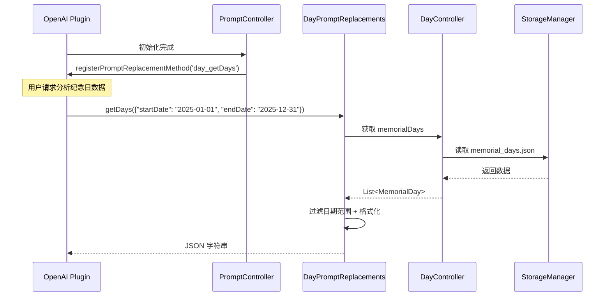

[根目录](../../../CLAUDE.md) > [lib](../../) > [plugins](../) > **day**

---

# 纪念日插件 (Day Plugin) - 模块文档

## 模块职责

纪念日插件是 Memento 的核心功能模块之一,提供:

- **纪念日管理**: 创建、编辑、删除纪念日事件
- **倒计时功能**: 自动计算剩余天数或已过天数
- **多视图展示**: 支持卡片视图和列表视图
- **灵活排序**: 即将发生、最近添加、手动拖拽排序
- **自定义外观**: 背景颜色、背景图片、笔记备注
- **AI 数据集成**: 注册到 OpenAI 插件,支持纪念日数据分析
- **主页卡片**: 展示纪念日总数和即将到来的事件

---

## 入口与启动

### 插件主类

**文件**: `day_plugin.dart`

```dart
class DayPlugin extends BasePlugin {
    @override
    String get id => 'day';

    @override
    Future<void> initialize() async {
        // 确保纪念日数据目录存在
        await storage.createDirectory('day');

        // 初始化控制器
        _controller = DayController();
        await _controller.initialize();

        // 初始化 prompt 控制器
        _promptController = PromptController();
        _promptController.initialize();
    }

    @override
    Widget buildMainView(BuildContext context) {
        return DayMainView();
    }
}
```

### 主界面入口

**文件**: `screens/day_home_screen.dart`

**路由**: 通过 `DayPlugin.buildMainView()` 返回 `DayMainView`,其内部渲染 `DayHomeScreen`

---

## 对外接口

### 核心 API

#### 统计接口

```dart
// 获取纪念日总数
int getMemorialDayCount();

// 获取即将到来的纪念日(7天内)
List<String> getUpcomingMemorialDays();
```

#### DayController (控制器)

**文件**: `controllers/day_controller.dart`

```dart
// 获取所有纪念日
List<MemorialDay> get memorialDays;

// 添加纪念日
Future<void> addMemorialDay(MemorialDay memorialDay);

// 更新纪念日
Future<void> updateMemorialDay(MemorialDay memorialDay);

// 删除纪念日
Future<void> deleteMemorialDay(String id);

// 手动重新排序
Future<void> reorderMemorialDays(int oldIndex, int newIndex);

// 设置排序模式
Future<void> setSortMode(SortMode mode);

// 切换视图模式(卡片/列表)
void toggleView();
```

### AI 集成接口

#### Prompt 替换方法

**文件**: `services/prompt_replacements.dart`

```dart
// 获取指定日期范围的纪念日数据(供 OpenAI 插件调用)
Future<String> getDays(Map<String, dynamic> params);
// params: { "startDate": "YYYY-MM-DD", "endDate": "YYYY-MM-DD" }
// 返回: JSON 字符串,包含纪念日列表
```

**注册方式**: 通过 `PromptController` 在 OpenAI 插件中注册为 `day_getDays` 方法

---

## 关键依赖与配置

### 外部依赖

- `uuid`: 生成唯一 ID
- `provider`: 状态管理
- `reorderable_grid_view`: 可拖拽网格视图
- `intl`: 日期格式化(间接依赖)

### 插件依赖

- **OpenAI Plugin**: AI 数据分析功能
- **Core Event System**: 消息事件广播
- **StorageManager**: 数据存储
- **ImageUtils**: 图片路径处理

### 存储路径

**根目录**: `day/`

**存储结构**:
```
day/
├── memorial_days.json           # 所有纪念日数据
└── view_preference.json         # 视图偏好设置
```

**memorial_days.json 格式**:
```json
[
  {
    "id": "uuid-1234",
    "title": "生日",
    "creationDate": "2025-01-01T08:00:00.000Z",
    "targetDate": "2025-06-15T00:00:00.000Z",
    "notes": ["准备礼物", "订餐厅"],
    "backgroundColor": 4294198070,
    "backgroundImageUrl": "https://example.com/image.jpg",
    "sortIndex": 0
  }
]
```

**view_preference.json 格式**:
```json
{
  "isCardView": true,
  "sortMode": "SortMode.upcoming"
}
```

---

## 数据模型

### MemorialDay (纪念日)

**文件**: `models/memorial_day.dart`

```dart
class MemorialDay {
  String id;                    // UUID
  String title;                 // 标题
  DateTime creationDate;        // 创建时间
  DateTime targetDate;          // 目标日期
  List<String> notes;           // 笔记列表
  Color backgroundColor;        // 背景颜色
  String? backgroundImageUrl;   // 背景图片 URL
  int sortIndex;                // 手动排序索引

  // 计算属性
  int get daysRemaining;        // 剩余天数(负数表示已过期)
  bool get isExpired;           // 是否已过期
  int get daysPassed;           // 已过天数
  bool get isToday;             // 是否是今天
  String get formattedTargetDate; // 格式化日期字符串

  // 序列化
  Map<String, dynamic> toJson();
  factory MemorialDay.fromJson(Map<String, dynamic> json);
  MemorialDay copyWith({...});
}
```

**存储路径**: `day/memorial_days.json` (数组形式)

**示例数据**:
```json
{
  "id": "550e8400-e29b-41d4-a716-446655440000",
  "title": "结婚纪念日",
  "creationDate": "2025-01-01T08:00:00.000Z",
  "targetDate": "2025-08-20T00:00:00.000Z",
  "notes": ["准备惊喜", "订餐厅"],
  "backgroundColor": 4283215696,
  "backgroundImageUrl": null,
  "sortIndex": 0
}
```

---

## 界面层结构

### 主要界面组件

| 组件 | 文件 | 职责 |
|------|------|------|
| `DayMainView` | `day_plugin.dart` | 插件主视图容器 |
| `DayHomeScreen` | `screens/day_home_screen.dart` | 纪念日列表主界面 |
| `EditMemorialDayDialog` | `widgets/edit_memorial_day_dialog/` | 编辑对话框(标签页) |
| `MemorialDayCard` | `widgets/memorial_day_card.dart` | 卡片视图组件 |
| `MemorialDayListItem` | `widgets/memorial_day_list_item.dart` | 列表视图组件 |

### DayHomeScreen 布局

**布局结构**:
```
Scaffold
├── AppBar (标题栏)
│   ├── 排序菜单 (PopupMenuButton)
│   ├── 视图切换按钮 (卡片/列表)
│   └── 添加按钮
└── Body (内容区域)
    ├── 卡片视图 (GridView / ReorderableGridView)
    │   └── MemorialDayCard x N
    └── 列表视图 (ListView / ReorderableListView)
        └── MemorialDayListItem x N
```

**关键特性**:
- 支持三种排序模式:即将发生、最近添加、手动排序
- 手动排序模式下支持拖拽重排序
- 点击卡片/列表项打开编辑对话框
- 空状态提示用户添加纪念日

### EditMemorialDayDialog (编辑对话框)

**文件**: `widgets/edit_memorial_day_dialog/edit_memorial_day_dialog.dart`

**标签页结构**:
```
AlertDialog
├── Title (标题 + TabBar)
│   ├── 信息 (Information)
│   ├── 笔记 (Notes)
│   └── 外观 (Appearance)
└── Content (TabBarView)
    ├── InformationTab
    │   ├── 标题输入框
    │   └── 日期选择器
    ├── NotesTab
    │   └── 笔记列表(可添加/编辑/删除)
    └── AppearanceTab
        ├── 颜色选择器
        └── 背景图片选择器
```

**操作按钮**:
- 取消: 返回 `DialogAction.cancel`
- 删除: 返回 `DialogAction.delete` (仅编辑模式)
- 保存: 返回 `DialogAction.save` + 纪念日数据

---

## 排序系统

### SortMode (排序模式)

**文件**: `controllers/day_controller.dart`

```dart
enum SortMode {
  upcoming,  // 按剩余天数排序(即将发生的在前)
  recent,    // 按创建时间排序(最近添加的在前)
  manual,    // 手动排序(按 sortIndex)
}
```

### 排序逻辑

**实现**: `DayController._sortMemorialDays()`

```dart
switch (_sortMode) {
  case SortMode.upcoming:
    _memorialDays.sort((a, b) => a.daysRemaining.compareTo(b.daysRemaining));
    break;
  case SortMode.recent:
    _memorialDays.sort((a, b) => b.creationDate.compareTo(a.creationDate));
    break;
  case SortMode.manual:
    _memorialDays.sort((a, b) => a.sortIndex.compareTo(b.sortIndex));
    break;
}
```

### 拖拽重排序

**条件**: 仅在 `SortMode.manual` 模式下可用

**实现**: 使用 `ReorderableGridView` 和 `ReorderableListView`

**排序索引更新策略**:
- 移动到开头: `newSortIndex = nextItem.sortIndex - 1.0`
- 移动到末尾: `newSortIndex = prevItem.sortIndex + 1.0`
- 移动到中间: `newSortIndex = (prevItem.sortIndex + nextItem.sortIndex) / 2.0`

---

## AI 数据分析集成

### 工作流程



### 注册流程

**文件**: `controls/prompt_controller.dart`

```dart
class PromptController {
  void initialize() {
    _promptReplacements.initialize();

    // 延迟注册,等待 OpenAI 插件初始化
    Future.delayed(const Duration(seconds: 1), () {
      _registerPromptMethods();
    });
  }

  void _registerPromptMethods() {
    final openaiPlugin = PluginManager.instance.getPlugin('openai') as OpenAIPlugin?;
    if (openaiPlugin != null) {
      openaiPlugin.registerPromptReplacementMethod(
        'day_getDays',
        _promptReplacements.getDays,
      );
    } else {
      // 重试机制
      Future.delayed(const Duration(seconds: 5), _registerPromptMethods);
    }
  }
}
```

### 调用示例

在 OpenAI 插件的 Prompt 中可以使用:

```
请分析我在 {{day_getDays(startDate: "2025-01-01", endDate: "2025-12-31")}} 的纪念日,总结哪些事件最重要。
```

### 返回格式

**成功时**:
```json
{
  "records": [
    {
      "date": "2025-06-15",
      "title": "生日",
      "daysRemaining": 120,
      "notes": ["准备礼物"]
    }
  ]
}
```

**无数据时**:
```json
{
  "status": "empty",
  "msg": "在指定时间段内没有找到纪念日记录。"
}
```

---

## 卡片视图

插件在主页提供卡片视图,展示:

**布局**:
```
┌─────────────────────────────┐
│ 📅 纪念日                   │
├─────────────────────────────┤
│  纪念日数    │   即将到来    │
│      5      │   生日,结婚    │
└─────────────────────────────┘
```

**实现**: `day_plugin.dart` 中的 `buildCardView()` 方法

**数据源**:
- `getMemorialDayCount()`: 总数
- `getUpcomingMemorialDays()`: 7天内的纪念日标题

---

## 国际化

### 支持语言

- 简体中文 (zh)
- 英语 (en)

### 本地化文件

| 文件 | 语言 |
|------|------|
| `l10n/day_localizations.dart` | 本地化接口 + 中英文实现 |

### 关键字符串

```dart
abstract class DayLocalizations {
  String get name;                      // 插件名称
  String get memorialDays;              // 纪念日
  String get addMemorialDay;            // 添加纪念日
  String get editMemorialDay;           // 编辑纪念日
  String get deleteMemorialDay;         // 删除纪念日
  String get deleteConfirmation;        // 删除确认
  String get title;                     // 标题
  String get targetDate;                // 目标日期
  String get notes;                     // 笔记
  String get backgroundColor;           // 背景颜色
  String get backgroundImage;           // 背景图片
  String daysRemaining(int count);      // 剩余天数
  String daysPassed(int count);         // 已过天数
  String get cardView;                  // 卡片视图
  String get listView;                  // 列表视图
  String get manualSort;                // 手动排序
  String get upcomingSort;              // 即将发生
  String get recentSort;                // 最近添加
  String get sortOptions;               // 排序选项
  String get information;               // 信息
  String get appearance;                // 外观
}
```

---

## 工具类

### DayDateUtils

**文件**: `utils/date_utils.dart`

```dart
class DayDateUtils {
  // 格式化日期为 YYYY-MM-DD
  static String formatDate(DateTime date);

  // 格式化日期为本地化格式
  static String formatDateLocalized(DateTime date, Locale locale);

  // 计算两个日期之间的天数
  static int daysBetween(DateTime from, DateTime to);

  // 判断日期是否为今天
  static bool isToday(DateTime date);

  // 判断日期是否为过去
  static bool isPast(DateTime date);

  // 判断日期是否为未来
  static bool isFuture(DateTime date);

  // 获取下一个周年日期
  static DateTime getNextAnniversary(DateTime originalDate);
}
```

---

## 测试与质量

### 当前状态
- **单元测试**: 无
- **集成测试**: 无
- **已知问题**: 无明显问题

### 测试建议

1. **高优先级**:
   - `DayController.addMemorialDay()` - 测试添加逻辑和排序
   - `DayController.reorderMemorialDays()` - 测试手动排序
   - `DayController._sortMemorialDays()` - 测试三种排序模式
   - `MemorialDay.daysRemaining` - 测试日期计算准确性

2. **中优先级**:
   - AI 数据分析方法 - 测试日期范围过滤
   - 视图偏好持久化 - 测试保存/加载
   - 背景图片加载 - 测试本地/网络图片

3. **低优先级**:
   - UI 交互逻辑
   - 国际化字符串完整性
   - 拖拽交互体验

---

## 常见问题 (FAQ)

### Q1: 如何添加新的排序模式?

1. 在 `controllers/day_controller.dart` 的 `SortMode` 枚举中添加类型
2. 在 `_sortMemorialDays()` 中添加排序逻辑
3. 在 `day_home_screen.dart` 的排序菜单中添加选项
4. 在本地化文件中添加对应字符串

### Q2: 如何自定义卡片样式?

修改 `widgets/memorial_day_card.dart`:

```dart
Container(
  decoration: BoxDecoration(
    color: widget.memorialDay.backgroundColor,
    borderRadius: BorderRadius.circular(16), // 自定义圆角
    boxShadow: [
      BoxShadow(
        color: Colors.black.withOpacity(0.2),
        blurRadius: 8,
      ),
    ],
  ),
  child: ...,
)
```

### Q3: 如何在 AI 分析中使用纪念日数据?

在 OpenAI 插件的系统提示词或用户消息中使用:

```
{{day_getDays(startDate: "2025-01-01", endDate: "2025-12-31")}}
```

OpenAI 插件会自动调用 `DayPromptReplacements.getDays()` 并替换占位符。

### Q4: 纪念日的状态颜色含义?

**卡片视图**: 使用背景颜色显示

**列表视图**: 使用文本颜色区分状态
- 绿色: 今天
- 灰色: 已过期
- 橙色: 7天内
- 蓝色: 其他

**实现**: `MemorialDayListItem._getStatusColor()`

### Q5: 如何导出纪念日数据?

当前未实现导出功能,建议添加:

```dart
Future<File> exportMemorialDaysToJson() async {
  final controller = DayController();
  await controller.initialize();

  final jsonData = controller.memorialDays.map((m) => m.toJson()).toList();
  final file = File('memorial_days_export.json');
  await file.writeAsString(jsonEncode(jsonData));
  return file;
}
```

---

## 目录结构

```
day/
├── day_plugin.dart                      # 插件主类 + 卡片视图
├── models/
│   └── memorial_day.dart                # 纪念日模型
├── services/
│   └── prompt_replacements.dart         # AI Prompt 替换方法
├── screens/
│   └── day_home_screen.dart             # 主界面(列表/卡片)
├── controllers/
│   └── day_controller.dart              # 业务逻辑控制器
├── controls/
│   └── prompt_controller.dart           # Prompt 控制器(注册到 OpenAI)
├── widgets/
│   ├── memorial_day_card.dart           # 卡片视图组件
│   ├── memorial_day_list_item.dart      # 列表视图组件
│   └── edit_memorial_day_dialog/        # 编辑对话框(标签页)
│       ├── edit_memorial_day_dialog.dart
│       ├── index.dart
│       ├── information_tab.dart
│       ├── notes_tab.dart
│       ├── appearance_tab.dart
│       └── color_picker.dart
├── utils/
│   └── date_utils.dart                  # 日期工具类
└── l10n/
    └── day_localizations.dart           # 国际化(中英文)
```

---

## 关键实现细节

### 日期计算

**文件**: `models/memorial_day.dart`

```dart
int get daysRemaining {
  final now = DateTime.now();
  final today = DateTime(now.year, now.month, now.day);
  final target = DateTime(targetDate.year, targetDate.month, targetDate.day);
  return target.difference(today).inDays;
}
```

**特点**: 标准化日期(去除时分秒),避免时区问题

### 随机颜色生成

**文件**: `models/memorial_day.dart`

```dart
static Color _getRandomColor() {
  final random = Random();
  final colors = [
    Colors.red[300], Colors.pink[300], Colors.purple[300],
    Colors.blue[300], Colors.green[300], Colors.orange[300],
    // ... 更多颜色
  ];
  return colors[random.nextInt(colors.length)]!;
}
```

**作用**: 为新纪念日自动分配背景颜色

### 视图偏好持久化

**文件**: `controllers/day_controller.dart`

**存储内容**:
- `isCardView`: 当前视图模式(卡片/列表)
- `sortMode`: 当前排序模式

**时机**:
- 加载: `initialize()` 时读取
- 保存: `toggleView()` 和 `setSortMode()` 时写入

### 延迟注册到 OpenAI

由于插件初始化顺序不确定,使用延迟 + 重试机制:

```dart
Future.delayed(const Duration(seconds: 1), () {
  _registerPromptMethods();
});

// 失败时重试
if (openaiPlugin == null) {
  Future.delayed(const Duration(seconds: 5), _registerPromptMethods);
}
```

### 拖拽装饰优化

**文件**: `screens/day_home_screen.dart`

```dart
// 卡片视图拖拽装饰
dragWidgetBuilder: (index, child) {
  return Material(
    color: Colors.transparent,
    elevation: 0,
    child: Transform.scale(scale: 1.05, child: child),
  );
}

// 列表视图拖拽装饰
proxyDecorator: (child, index, animation) {
  return Material(
    elevation: 0,           // 无阴影
    color: Colors.transparent, // 透明背景
    borderRadius: BorderRadius.zero, // 无圆角
    child: child,
  );
}
```

**目的**: 移除默认边框,保持视觉一致性

---

## 依赖关系

### 核心依赖

- **BasePlugin**: 插件基类
- **StorageManager**: 数据持久化
- **PluginManager**: 插件管理器
- **ImageUtils**: 图片路径处理

### 第三方包依赖

- `uuid: ^3.0.0` - UUID 生成
- `provider: ^6.0.0` - 状态管理
- `reorderable_grid_view: ^2.0.0` - 可拖拽网格
- `intl: ^0.18.0` - 日期格式化

### 其他插件依赖

- **OpenAI Plugin**: 可选依赖,用于 AI 数据分析
- **Database Plugin**: 用于获取插件名称(通过 DatabaseLocalizations)

**依赖方向**: `day` → `openai`(通过 `PluginManager` 获取)

---

## 变更记录 (Changelog)

- **2025-11-13**: 初始化纪念日插件文档,识别 16 个文件、1 个数据模型、3 个排序模式、10+ 工具方法

---

**上级目录**: [返回插件目录](../../../CLAUDE.md#模块索引) | [返回根文档](../../../CLAUDE.md)
