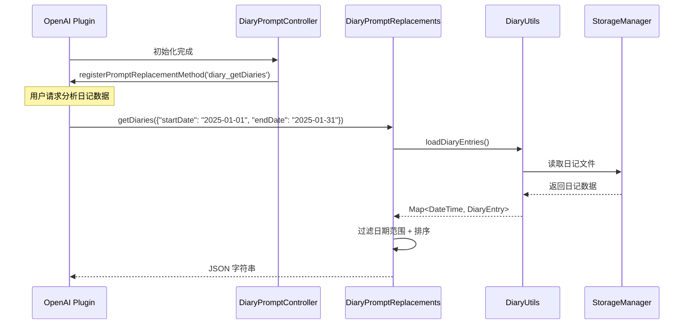

[根目录](../../../CLAUDE.md) > [lib](../../) > [plugins](../) > **diary**

---

# 日记插件 (Diary Plugin) - 模块文档

## 模块职责

日记插件是 Memento 的核心功能模块之一，提供：

- **日历视图管理**：基于日历展示日记条目
- **Markdown 编辑器**：支持 Markdown 格式的日记编写
- **心情记录**：通过表情符号记录每日心情
- **统计功能**：今日字数、本月字数、完成进度
- **AI 数据分析**：注册到 OpenAI 插件，支持日记数据分析
- **事件系统**：广播日记的创建、更新、删除事件

---

## 入口与启动

### 插件主类

**文件**: `diary_plugin.dart`

```dart
class DiaryPlugin extends BasePlugin {
    @override
    String get id => 'diary';

    @override
    Future<void> initialize() async {
        // 确保日记数据目录存在
        await storage.createDirectory('diary');

        // 初始化 prompt 控制器
        _promptController.initialize();
    }

    @override
    Future<void> registerToApp(
        PluginManager pluginManager,
        ConfigManager configManager,
    ) async {
        // 插件已在 initialize() 中完成初始化
    // 这里可以添加额外的应用级注册逻辑
    }
}
```

### 主界面入口

**文件**: `screens/diary_calendar_screen.dart`

**路由**: 通过 `DiaryPlugin.buildMainView()` 返回 `DiaryMainView`，其内部渲染 `DiaryCalendarScreen`

---

## 对外接口

### 核心 API

#### 统计接口

```dart
// 获取今日文字数
Future<int> getTodayWordCount();

// 获取本月文字数
Future<int> getMonthWordCount();

// 获取本月完成进度（已完成天数/总天数）
Future<(int, int)> getMonthProgress();
```

#### DiaryUtils 工具类

**文件**: `utils/diary_utils.dart`

```dart
// 加载所有日记条目
Future<Map<DateTime, DiaryEntry>> loadDiaryEntries();

// 保存日记条目
Future<void> saveDiaryEntry(
  DateTime date,
  String content, {
  String title = '',
  String? mood,
});

// 加载特定日期的日记
Future<DiaryEntry?> loadDiaryEntry(DateTime date);

// 删除特定日期的日记
Future<bool> deleteDiaryEntry(DateTime date);

// 检查特定日期是否有日记
Future<bool> hasEntryForDate(DateTime date);

// 获取日记统计信息
Future<Map<String, dynamic>> getDiaryStats();
// 返回: {'totalCharCount': int, 'entryCount': int, 'averageCharCount': int}
```

### AI 集成接口

#### Prompt 替换方法

**文件**: `services/prompt_replacements.dart`

```dart
// 获取指定日期范围的日记数据（供 OpenAI 插件调用）
Future<String> getDiaries(Map<String, dynamic> params);
// params: { "startDate": "YYYY-MM-DD", "endDate": "YYYY-MM-DD" }
// 返回: JSON 字符串，包含日记列表和总数
```

**注册方式**: 通过 `DiaryPromptController` 在 OpenAI 插件中注册为 `diary_getDiaries` 方法

---

## 关键依赖与配置

### 外部依赖

- `table_calendar`: 日历组件
- `intl`: 日期格式化
- `path`: 路径处理
- `flutter_quill`: Markdown 渲染（通过 MarkdownEditor 组件）

### 插件依赖

- **OpenAI Plugin**: AI 数据分析功能
- **Core Event System**: 消息事件广播
- **StorageManager**: 数据存储

### 存储路径

**根目录**: `diary/`

**存储结构**:
```
diary/
├── diary_index.json              # 索引文件（包含 totalCharCount 统计）
├── 2025-01-15.json              # 具体日期的日记文件
├── 2025-01-16.json
└── ...
```

**索引文件格式**:
```json
{
  "totalCharCount": 12345,
  "2025-01-15": {
    "lastUpdated": "2025-01-15T10:30:00.000Z"
  },
  "2025-01-16": {
    "lastUpdated": "2025-01-16T09:00:00.000Z"
  }
}
```

---

## 数据模型

### DiaryEntry (日记条目)

**文件**: `models/diary_entry.dart`

```dart
class DiaryEntry {
  DateTime date;           // 日期（仅日期部分，无时间）
  String title;            // 标题（可选）
  String content;          // 日记内容（Markdown 格式）
  DateTime createdAt;      // 创建时间
  DateTime updatedAt;      // 更新时间
  String? mood;            // 心情表情符号（如 😊, 😢 等）

  Map<String, dynamic> toJson();
  factory DiaryEntry.fromJson(Map<String, dynamic> json);
  DiaryEntry copyWith({...});
}
```

**存储路径**: `diary/<YYYY-MM-DD>.json`

**示例数据**:
```json
{
  "date": "2025-01-15",
  "title": "美好的一天",
  "content": "今天天气很好，完成了很多工作...",
  "createdAt": "2025-01-15T08:30:00.000Z",
  "updatedAt": "2025-01-15T20:15:00.000Z",
  "mood": "😊"
}
```

---

## 界面层结构

### 主要界面组件

| 组件 | 文件 | 职责 |
|------|------|------|
| `DiaryMainView` | `diary_plugin.dart` | 插件主视图容器 |
| `DiaryCalendarScreen` | `screens/diary_calendar_screen.dart` | 日历视图主界面 |
| `DiaryEditorScreen` | `screens/diary_editor_screen.dart` | 日记编辑界面 |

### DiaryCalendarScreen 布局

**布局结构**:
```
Scaffold
├── AppBar (标题栏)
└── Column
    ├── Expanded (flex: 2) - 日历区域
    │   └── TableCalendar
    │       ├── 日期单元格（显示日期）
    │       └── markerBuilder（显示心情 + 字数）
    └── Expanded (flex: 1) - 预览区域
        └── 显示选中日期的日记预览
```

**关键特性**:
- 双击日期打开编辑器
- 单击选中日期显示预览
- 日历格子显示心情表情和字数统计
- 禁止选择未来日期

### DiaryEditorScreen

**核心组件**: 使用 `MarkdownEditor` 组件

**功能**:
- Markdown 格式编写
- 标题和内容分离
- 心情选择器（10种表情）
- 自动保存到存储

**心情表情列表**:
```dart
['😊', '😢', '😡', '😴', '🤔', '😎', '😍', '🤮', '😱', '🥳']
```

---

## 事件系统

### 事件类型

**文件**: `diary_plugin.dart`

| 事件名 | 事件类 | 触发时机 | 参数 |
|-------|--------|---------|------|
| `diary_entry_created` | `DiaryEntryCreatedEventArgs` | 新建日记时 | `DiaryEntry entry` |
| `diary_entry_updated` | `DiaryEntryUpdatedEventArgs` | 更新日记时 | `DiaryEntry entry` |
| `diary_entry_deleted` | `DiaryEntryDeletedEventArgs` | 删除日记时 | `DateTime date` |

### 事件广播示例

```dart
// 在 DiaryUtils.saveDiaryEntry() 中
if (await storage.fileExists(entryPath)) {
  EventManager.instance.broadcast(
    'diary_entry_updated',
    DiaryEntryUpdatedEventArgs(newEntry),
  );
} else {
  EventManager.instance.broadcast(
    'diary_entry_created',
    DiaryEntryCreatedEventArgs(newEntry),
  );
}
```

---

## AI 数据分析集成

### 工作流程



### 注册流程

**文件**: `controls/prompt_controller.dart`

```dart
class DiaryPromptController {
  void initialize() {
    _promptReplacements.initialize();

    // 延迟注册，等待 OpenAI 插件初始化
    Future.delayed(const Duration(seconds: 1), () {
      _registerPromptMethods();
    });
  }

  void _registerPromptMethods() {
    final openaiPlugin = PluginManager.instance.getPlugin('openai') as OpenAIPlugin?;
    if (openaiPlugin != null) {
      openaiPlugin.registerPromptReplacementMethod(
        'diary_getDiaries',
        _promptReplacements.getDiaries,
      );
    } else {
      // 重试机制
      Future.delayed(const Duration(seconds: 5), _registerPromptMethods);
    }
  }
}
```

### 调用示例

在 OpenAI 插件的 Prompt 中可以使用：

```
请分析我在 {{diary_getDiaries(startDate: "2025-01-01", endDate: "2025-01-31")}} 的日记内容，总结我这个月的心情变化。
```

---

## 卡片视图

插件在主页提供卡片视图，展示：

**布局**:
```
┌─────────────────────────────┐
│ 📖 日记                    │
├─────────────────────────────┤
│  今日字数    │   本月字数   │
│     520     │    15,000    │
├─────────────────────────────┤
│        本月进度             │
│         15/31               │
└─────────────────────────────┘
```

**实现**: `diary_plugin.dart` 中的 `buildCardView()` 方法

---

## 国际化

### 支持语言

- 简体中文 (zh)
- 英语 (en)

### 本地化文件

| 文件 | 语言 |
|------|------|
| `l10n/diary_localizations.dart` | 本地化接口 |
| `l10n/diary_localizations_zh.dart` | 中文翻译 |
| `l10n/diary_localizations_en.dart` | 英文翻译 |

### 关键字符串

```dart
abstract class DiaryLocalizations {
  String get name;                      // 插件名称
  String get todayWordCount;            // 今日字数
  String get monthWordCount;            // 本月字数
  String get monthProgress;             // 本月进度
  String get titleHint;                 // 标题提示
  String get contentHint;               // 内容提示
  String get selectMood;                // 选择心情
  String get clearSelection;            // 清除选择
  String get cannotSelectFutureDate;    // 不能选择未来日期
  String get myDiary;                   // 我的日记
  String get moodSelectorTooltip;       // 心情选择器提示
}
```

---

## 测试与质量

### 当前状态
- **单元测试**: 无
- **集成测试**: 无
- **已知问题**: 无明显问题

### 测试建议

1. **高优先级**：
   - `DiaryUtils.saveDiaryEntry()` - 测试创建、更新逻辑
   - `DiaryUtils.loadDiaryEntries()` - 测试批量加载和索引
   - 日期标准化逻辑 - 确保无时区问题
   - 索引文件更新 - 确保 totalCharCount 准确

2. **中优先级**：
   - AI 数据分析方法 - 测试日期范围过滤
   - 事件广播 - 测试事件是否正确触发
   - 删除功能 - 测试文件和索引同步删除

3. **低优先级**：
   - UI 交互逻辑
   - 国际化字符串完整性
   - 心情选择器界面

---

## 常见问题 (FAQ)

### Q1: 如何添加新的心情表情？

在 `diary_editor_screen.dart` 中修改 `_moods` 列表：

```dart
final List<String> _moods = [
  '😊', '😢', '😡', '😴', '🤔', '😎', '😍', '🤮', '😱', '🥳',
  '🤗', '😇', // 新增表情
];
```

### Q2: 如何修改日记存储格式？

当前使用 JSON 格式存储。如果要改为 Markdown 文件：

1. 修改 `DiaryUtils._getEntryPath()` 返回 `.md` 路径
2. 修改 `saveDiaryEntry()` 使用 `storage.writeFile()` 而非 `writeJson()`
3. 修改 `loadDiaryEntry()` 解析 Markdown 文件头部的元数据

### Q3: 如何在 AI 分析中使用日记数据？

在 OpenAI 插件的系统提示词或用户消息中使用：

```
{{diary_getDiaries(startDate: "2025-01-01", endDate: "2025-01-31")}}
```

OpenAI 插件会自动调用 `DiaryPromptReplacements.getDiaries()` 并替换占位符。

### Q4: 日记的字数统计在哪里？

- **实时统计**: `DiaryPlugin.getTodayWordCount()` / `getMonthWordCount()`
- **索引缓存**: `diary_index.json` 中的 `totalCharCount` 字段
- **显示位置**: 插件卡片视图、日历日期格子

### Q5: 如何导出日记数据？

当前未实现导出功能，建议添加：

```dart
Future<File> exportDiariesToMarkdown(DateTime startDate, DateTime endDate) async {
  final entries = await DiaryUtils.loadDiaryEntries();
  final buffer = StringBuffer();

  entries.forEach((date, entry) {
    if (date.isAfter(startDate) && date.isBefore(endDate)) {
      buffer.writeln('# ${entry.title.isEmpty ? DateFormat('yyyy-MM-dd').format(date) : entry.title}');
      buffer.writeln('');
      buffer.writeln(entry.content);
      buffer.writeln('\n---\n');
    }
  });

  final file = File('diary_export.md');
  await file.writeAsString(buffer.toString());
  return file;
}
```

---

## 目录结构

```
diary/
├── diary_plugin.dart                    # 插件主类 + 事件定义
├── models/
│   └── diary_entry.dart                 # 日记条目模型
├── services/
│   └── prompt_replacements.dart         # AI Prompt 替换方法
├── screens/
│   ├── diary_calendar_screen.dart       # 日历视图界面
│   └── diary_editor_screen.dart         # 编辑器界面
├── controls/
│   └── prompt_controller.dart           # Prompt 控制器（注册到 OpenAI）
├── utils/
│   └── diary_utils.dart                 # 工具类（CRUD + 统计）
└── l10n/
    ├── diary_localizations.dart         # 国际化接口
    ├── diary_localizations_zh.dart      # 中文翻译
    └── diary_localizations_en.dart      # 英文翻译
```

---

## 关键实现细节

### 日期标准化

为避免时区问题，所有日期都进行标准化处理：

```dart
static DateTime _normalizeDate(DateTime date) {
  return DateTime(date.year, date.month, date.day);
}
```

**原因**: `DateTime.now()` 包含时分秒，导致相同日期的不同时间被视为不同的 key。

### 索引文件机制

使用 `diary_index.json` 维护日记列表，避免每次遍历目录：

**优点**:
- 快速获取所有日记日期
- 缓存总字数统计
- 记录最后更新时间

**更新时机**:
- `saveDiaryEntry()` 时更新
- `deleteDiaryEntry()` 时移除

### 延迟注册到 OpenAI

由于插件初始化顺序不确定，使用延迟 + 重试机制：

```dart
Future.delayed(const Duration(seconds: 1), () {
  _registerPromptMethods();
});

// 失败时重试
if (openaiPlugin == null) {
  Future.delayed(const Duration(seconds: 5), _registerPromptMethods);
}
```

---

## 依赖关系

### 核心依赖

- **BasePlugin**: 插件基类
- **StorageManager**: 数据持久化
- **EventManager**: 事件广播系统
- **PluginManager**: 插件管理器

### 第三方包依赖

- `table_calendar: ^3.0.0` - 日历组件
- `intl: ^0.18.0` - 日期格式化
- `path: ^1.8.0` - 路径处理

### 其他插件依赖

- **OpenAI Plugin**: 可选依赖，用于 AI 数据分析

**依赖方向**: `diary` → `openai`（通过 `PluginManager` 获取）

---

## 变更记录 (Changelog)

- **2025-11-13**: 初始化日记插件文档，识别 10 个文件、1 个数据模型、3 个事件类型、9 个工具方法

---

**上级目录**: [返回插件目录](../../../CLAUDE.md#模块索引) | [返回根文档](../../../CLAUDE.md)
