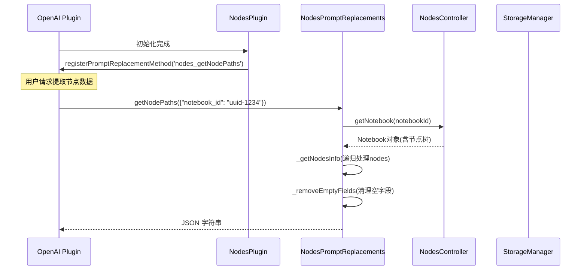
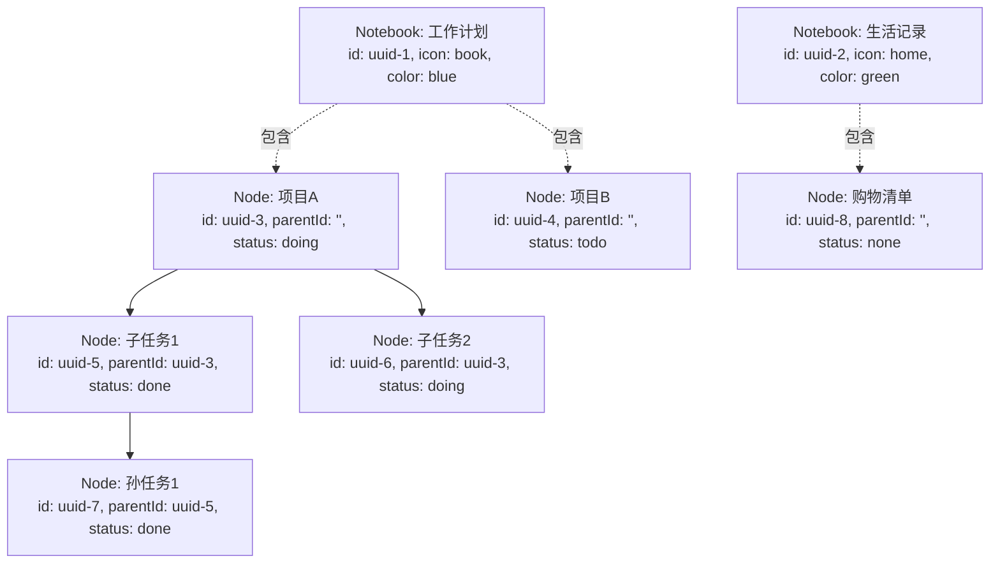
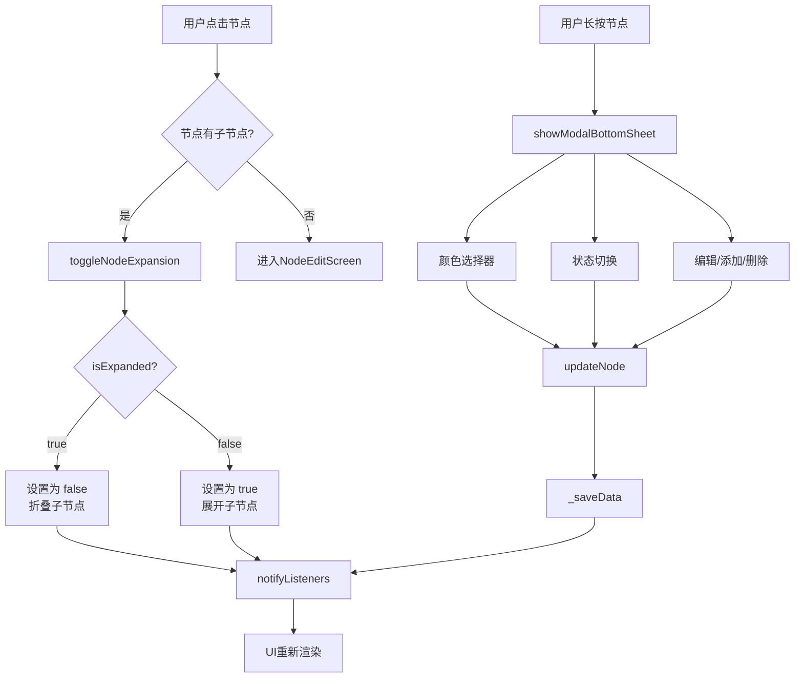

[根目录](../../../CLAUDE.md) > [lib](../../) > [plugins](../) > **nodes**

---

# 节点笔记本插件 (Nodes Plugin) - 模块文档

## 模块职责

节点笔记本插件是 Memento 的核心功能模块之一，提供:

- **笔记本管理**:支持多个笔记本，每个笔记本独立管理节点树
- **无限层级节点树**:支持父子节点的树形结构，可无限嵌套
- **节点状态管理**:TODO、DOING、DONE、NONE 四种状态
- **节点属性**:标题、标签、自定义字段、日期范围、笔记内容、颜色标识
- **节点操作**:添加子节点、添加同级节点、编辑、删除、展开/折叠
- **复制导出**:将整个笔记本的节点树复制为文本格式
- **AI 数据提取**:注册到 OpenAI 插件，支持节点数据提取
- **可视化定制**:笔记本图标/颜色、节点颜色标识

---

## 入口与启动

### 插件主类

**文件**: `nodes_plugin.dart`

```dart
class NodesPlugin extends PluginBase {
    @override
    String get id => 'nodes';

    @override
    Color get color => Colors.amber;

    @override
    IconData get icon => Icons.account_tree;

    @override
    Future<void> initialize() async {
        _controller = NodesController(storage);
        _promptReplacements.initialize();

        // 延迟注册 prompt 替换方法，等待 OpenAI 插件初始化完成
        Future.delayed(const Duration(seconds: 1), () {
            _registerPromptMethods();
        });

        _isInitialized = true;
    }

    @override
    Future<void> registerToApp(pluginManager, configManager) async {
        await initialize();
    }
}
```

### 主界面入口

**文件**: `screens/notebooks_screen.dart`

**路由**: 通过 `NodesPlugin.buildMainView()` 返回 `NodesMainView`

**界面层级**:
```
NodesMainView (笔记本主视图)
  → NotebooksScreen (笔记本列表)
    → NodesScreen (节点树列表)
      → NodeEditScreen (节点编辑)
```

---

## 对外接口

### 核心 API

#### 统计接口

```dart
// 在 buildCardView() 中计算并显示
int notebookCount;  // 笔记本数量
int totalNodes;     // 所有节点总数
int todoNodes;      // 待办节点数量
```

#### NodesController 控制器方法

**文件**: `controllers/nodes_controller.dart`

```dart
// ========== 笔记本管理 ==========

// 获取笔记本
Notebook? getNotebook(String notebookId);

// 获取所有笔记本
List<Notebook> get notebooks;

// 选择笔记本
void selectNotebook(Notebook notebook);
Notebook? get selectedNotebook;

// 添加笔记本
Future<void> addNotebook(String title, IconData icon, {Color color});

// 更新笔记本
Future<void> updateNotebook(Notebook notebook);

// 删除笔记本
Future<void> deleteNotebook(String notebookId);

// 重排序笔记本
Future<void> reorderNotebooks(int oldIndex, int newIndex);

// 清空笔记本的所有节点
Future<void> clearNodes(String notebookId);

// ========== 节点管理 ==========

// 添加节点(支持指定父节点)
Future<void> addNode(String notebookId, Node node, {String? parentId});

// 更新节点(保留子节点和展开状态)
Future<void> updateNode(String notebookId, Node updatedNode);

// 删除节点(递归删除子节点)
Future<void> deleteNode(String notebookId, String nodeId);

// 切换节点展开/折叠状态
Future<void> toggleNodeExpansion(String notebookId, String nodeId);

// ========== 节点查询 ==========

// 通过ID查找节点
Node? findNodeById(String notebookId, String nodeId);

// 获取节点路径(节点标题列表)
List<String> getNodePath(String notebookId, String nodeId);

// 获取节点路径(节点ID列表)
List<String> getNodePathIds(String notebookId, String nodeId);

// 获取节点的所有同级节点
List<Node> getSiblingNodes(String notebookId, String nodeId);
```

### AI 集成接口

#### Prompt 替换方法

**文件**: `services/prompt_replacements.dart`

```dart
// 获取指定笔记本的节点路径数据(供 OpenAI 插件调用)
Future<String> getNodePaths(Map<String, dynamic> params);
// params: {
//   "notebook_id": "notebook-uuid"  // 必需
// }
// 返回: JSON 字符串,包含节点树结构
// 示例: {
//   "notebook_title": "工作计划",
//   "nodes": [
//     {
//       "title": "项目A",
//       "status": "doing",
//       "tags": ["重要"],
//       "date_range": {"start": "2025/1/10 9:0", "end": "2025/1/20 18:0"},
//       "notes": "项目详细说明...",
//       "custom_fields": [{"key": "优先级", "value": "高"}],
//       "children": [
//         {"title": "子任务1", "status": "done", ...}
//       ]
//     }
//   ]
// }
```

**注册方式**: 通过 `NodesPromptReplacements` 在 OpenAI 插件中注册为 `nodes_getNodePaths` 方法

**数据格式特性**:
- 自动移除所有空字段(null、空字符串、空列表、空Map)
- 日期格式化为 `y/m/d h:m` 格式
- 递归包含所有子节点
- 状态值转换为字符串: `todo`, `doing`, `done`, `none`

---

## 关键依赖与配置

### 外部依赖

- `flutter/material.dart`: UI 组件库
- `provider`: 状态管理
- `uuid`: 生成节点唯一ID
- `dart:convert`: JSON 序列化

### 插件依赖

- **OpenAI Plugin**: AI 数据分析功能
- **StorageManager**: 数据存储

### 存储路径

**根目录**: `nodes/`

**存储结构**:
```
nodes/
└── nodes_notebooks  # 所有笔记本和节点数据
```

**数据格式**:
```json
{
  "notebooks": [
    {
      "id": "uuid-1234",
      "title": "工作计划",
      "icon": 57415,
      "color": 4280391411,
      "nodes": [
        {
          "id": "uuid-5678",
          "title": "项目A",
          "createdAt": "2025-01-15T10:30:00.000Z",
          "tags": ["重要"],
          "status": 1,
          "startDate": "2025-01-10T09:00:00.000Z",
          "endDate": "2025-01-20T18:00:00.000Z",
          "customFields": [
            {"key": "优先级", "value": "高"}
          ],
          "notes": "项目详细说明...",
          "parentId": "",
          "children": [
            {
              "id": "uuid-9012",
              "title": "子任务1",
              "createdAt": "2025-01-15T10:35:00.000Z",
              "tags": [],
              "status": 2,
              "customFields": [],
              "notes": "",
              "parentId": "uuid-5678",
              "children": [],
              "pathValue": "项目A/子任务1",
              "color": 4278190080
            }
          ],
          "pathValue": "项目A",
          "color": 4278190080
        }
      ]
    }
  ]
}
```

---

## 数据模型

### Notebook (笔记本)

**文件**: `models/notebook.dart`

```dart
class Notebook {
  String id;               // 唯一标识符(UUID)
  String title;            // 笔记本标题
  IconData icon;           // 笔记本图标(默认 Icons.book)
  Color color;             // 笔记本颜色(默认 Colors.blue)
  List<Node> nodes;        // 根节点列表

  Map<String, dynamic> toJson();
  factory Notebook.fromJson(Map<String, dynamic> json);
}
```

**图标存储**:
- 存储为 `icon.codePoint` (int)
- 反序列化时使用预定义常用图标映射表
- 未匹配的 codePoint 默认为 `Icons.book`

**示例数据**:
```json
{
  "id": "uuid-1234",
  "title": "工作计划",
  "icon": 57415,
  "color": 4280391411,
  "nodes": [...]
}
```

### Node (节点)

**文件**: `models/node.dart`

```dart
class Node {
  String id;               // 唯一标识符(UUID)
  String title;            // 节点标题
  DateTime createdAt;      // 创建时间
  List<String> tags;       // 标签列表
  NodeStatus status;       // 状态: todo, doing, done, none
  DateTime? startDate;     // 开始日期(可选)
  DateTime? endDate;       // 结束日期(可选)
  List<CustomField> customFields; // 自定义字段列表
  String notes;            // 笔记内容
  String parentId;         // 父节点ID(空字符串表示根节点)
  List<Node> children;     // 子节点列表
  bool isExpanded;         // 是否展开子节点(UI状态)
  String pathValue;        // 节点完整路径(如 "项目A/子任务1")
  Color color;             // 节点颜色标识(默认 Colors.grey)

  Map<String, dynamic> toJson();
  factory Node.fromJson(Map<String, dynamic> json);
}

enum NodeStatus { todo, doing, done, none }

class CustomField {
  String key;              // 字段键
  String value;            // 字段值

  Map<String, dynamic> toJson();
  factory CustomField.fromJson(Map<String, dynamic> json);
}
```

**树形结构实现**:
- 使用 `parentId` 字段建立父子关系
- `parentId = ""` 表示根节点
- `children` 列表直接存储子节点对象
- 通过 `pathValue` 存储完整路径(便于 AI 分析)

**状态存储**:
- 存储为 `status.index` (int): 0=todo, 1=doing, 2=done, 3=none
- 反序列化使用 `NodeStatus.values[index]`

**示例数据**:
```json
{
  "id": "uuid-5678",
  "title": "项目A",
  "createdAt": "2025-01-15T10:30:00.000Z",
  "tags": ["重要", "紧急"],
  "status": 1,
  "startDate": "2025-01-10T09:00:00.000Z",
  "endDate": "2025-01-20T18:00:00.000Z",
  "customFields": [
    {"key": "优先级", "value": "高"},
    {"key": "负责人", "value": "张三"}
  ],
  "notes": "项目详细说明...",
  "parentId": "",
  "children": [...],
  "pathValue": "项目A",
  "color": 4278190080
}
```

---

## 界面层结构

### 主要界面组件

| 组件 | 文件 | 职责 |
|------|------|------|
| `NodesMainView` | `nodes_plugin.dart` | 笔记本主界面容器 |
| `NotebooksScreen` | `screens/notebooks_screen.dart` | 笔记本列表(支持拖拽排序) |
| `NodesScreen` | `screens/nodes_screen.dart` | 节点树列表(单个笔记本) |
| `NodeEditScreen` | `screens/node_edit_screen/node_edit_screen.dart` | 节点编辑界面 |
| `NodeItem` | `widgets/node_item.dart` | 节点列表项(支持递归展示) |
| `NodeBreadcrumbs` | `screens/node_edit_screen/components/breadcrumbs.dart` | 节点路径面包屑 |
| `TagsSection` | `screens/node_edit_screen/components/tags_section.dart` | 标签编辑组件 |
| `StatusDropdown` | `screens/node_edit_screen/components/status_dropdown.dart` | 状态下拉选择 |
| `DateSection` | `screens/node_edit_screen/components/date_section.dart` | 日期范围选择 |
| `CustomFieldsSection` | `screens/node_edit_screen/components/custom_fields_section.dart` | 自定义字段编辑 |

### NotebooksScreen 布局

**布局结构**:
```
Scaffold
├── AppBar
│   ├── leading: 返回主页按钮
│   ├── title: "笔记本"
│   └── actions: [添加笔记本按钮]
└── body: ReorderableListView (支持拖拽排序)
    └── Dismissible + Card (支持左滑删除)
        └── ListTile
            ├── leading: 拖拽手柄 + 笔记本图标
            ├── title: 笔记本标题
            ├── subtitle: 节点数量统计
            └── trailing: 更多操作菜单(编辑/删除)
```

**关键特性**:
- 拖拽排序笔记本
- 左滑删除笔记本(需二次确认)
- 点击笔记本进入节点树
- 添加笔记本时可选图标和颜色

### NodesScreen 布局

**布局结构**:
```
Scaffold
├── AppBar
│   ├── title: 笔记本标题
│   └── actions: 菜单(复制为文本/清空节点)
├── body: ListView.builder
│   └── NodeItem (递归渲染节点树)
└── floatingActionButton: 添加根节点
```

**关键特性**:
- 无节点时显示空状态提示
- 复制为文本:递归生成缩进格式的文本(包含标题和笔记)
- 清空节点:清空所有根节点(需二次确认)

### NodeItem 交互设计

**视觉层级**:
```
NodeItem
├── 缩进(depth * 24px)
├── 展开/折叠图标(有子节点时)
├── 颜色圆点(节点颜色)
├── 节点标题
├── 状态徽章(TODO/DOING/DONE)
└── 标签列表
```

**交互行为**:
- **点击节点**:
  - 有子节点:切换展开/折叠状态
  - 无子节点:进入编辑界面
- **长按节点**:显示操作菜单(底部弹窗)
  - 颜色选择器(13种常用颜色)
  - 状态快速切换(TODO/DOING/DONE)
  - 编辑节点
  - 添加子节点
  - 添加同级节点
  - 删除节点

**状态徽章样式**:
- TODO: 灰色背景 + 黄色文字
- DOING: 蓝色背景 + 深蓝文字
- DONE: 绿色背景 + 深绿文字

### NodeEditScreen 布局

**布局结构**:
```
Scaffold
├── AppBar
│   ├── leading: 关闭按钮
│   ├── title: "添加节点" / "编辑节点"
│   └── actions: [保存按钮]
└── body: SingleChildScrollView
    └── Column
        ├── NodeBreadcrumbs (节点路径)
        ├── TextField (标题)
        ├── TagsSection (标签)
        ├── ColorPickerSection (颜色)
        ├── StatusDropdown (状态)
        ├── DateSection (日期范围)
        ├── CustomFieldsSection (自定义字段)
        └── TextField (笔记内容)
```

**关键特性**:
- 面包屑导航显示节点路径(Notebook > Parent > Current)
- 标签支持添加/删除
- 颜色选择器支持自定义颜色
- 状态下拉框显示中英文标签
- 日期选择器支持清空日期
- 自定义字段支持添加/编辑/删除
- 保存时自动计算 `pathValue`

---

## AI 数据分析集成

### 工作流程



### 注册流程

**文件**: `nodes_plugin.dart`

```dart
void _registerPromptMethods() {
  try {
    final openaiPlugin =
        PluginManager.instance.getPlugin('openai') as OpenAIPlugin?;
    if (openaiPlugin != null) {
      openaiPlugin.registerPromptReplacementMethod(
        'nodes_getNodePaths',
        _promptReplacements.getNodePaths,
      );
    } else {
      // 如果 OpenAI 插件还未准备好，5 秒后重试
      Future.delayed(const Duration(seconds: 5), _registerPromptMethods);
    }
  } catch (e) {
    // 发生错误时，5 秒后重试
    Future.delayed(const Duration(seconds: 5), _registerPromptMethods);
  }
}
```

### 调用示例

在 OpenAI 插件的 Prompt 中可以使用:

```
分析我的"工作计划"笔记本中的节点结构:
{{nodes_getNodePaths(notebook_id: "uuid-1234")}}
```

### 返回数据示例

```json
{
  "notebook_title": "工作计划",
  "nodes": [
    {
      "title": "项目A",
      "status": "doing",
      "tags": ["重要"],
      "date_range": {
        "start": "2025/1/10 9:0",
        "end": "2025/1/20 18:0"
      },
      "notes": "项目详细说明...",
      "custom_fields": [
        {"key": "优先级", "value": "高"}
      ],
      "children": [
        {
          "title": "子任务1",
          "status": "done"
        }
      ]
    }
  ]
}
```

---

## 卡片视图

插件在主页提供卡片视图，展示:

**布局**:
```
┌─────────────────────────────┐
│ 🌳 节点                    │
├─────────────────────────────┤
│  笔记本数量  │   节点数量   │
│      3      │      42      │
├─────────────────────────────┤
│       待办节点数            │
│           8                 │
└─────────────────────────────┘
```

**实现**: `nodes_plugin.dart` 中的 `buildCardView()` 方法

**统计逻辑**:
```dart
// 递归计算所有节点总数
int _countAllNodes(List<Node> nodes) {
  int count = nodes.length;
  for (var node in nodes) {
    count += _countAllNodes(node.children);
  }
  return count;
}

// 递归计算待办节点数量
int _countTodoNodes(List<Node> nodes) {
  int count = 0;
  for (var node in nodes) {
    if (node.status == NodeStatus.todo) {
      count++;
    }
    count += _countTodoNodes(node.children);
  }
  return count;
}
```

---

## 国际化

### 支持语言

- 简体中文 (zh)
- 英语 (en)

### 本地化文件

| 文件 | 语言 |
|------|------|
| `l10n/nodes_localizations.dart` | 本地化接口 |
| `l10n/nodes_localizations_zh.dart` | 中文翻译 |
| `l10n/nodes_localizations_en.dart` | 英文翻译 |

### 关键字符串

```dart
abstract class NodesLocalizations {
  String get name;                  // 插件名称: "节点"
  String get nodesSettings;         // 节点设置
  String get notebooksCount;        // 笔记本数量
  String get nodesCount;            // 节点数量
  String get pendingNodesCount;     // 待办节点数
  String get notebooks;             // 笔记本
  String get addNotebook;           // 添加笔记本
  String get editNotebook;          // 编辑笔记本
  String get deleteNotebook;        // 删除笔记本
  String get deleteNotebookConfirmation; // 删除笔记本确认
  String get notebookTitle;         // 笔记本标题
  String get nodes;                 // 节点
  String get addNode;               // 添加节点
  String get editNode;              // 编辑节点
  String get deleteNode;            // 删除节点
  String get deleteNodeConfirmation; // 删除节点确认
  String get addChildNode;          // 添加子节点
  String get addSiblingNode;        // 添加同级节点
  String get nodeTitle;             // 节点标题
  String get tags;                  // 标签
  String get status;                // 状态
  String get none;                  // 无
  String get todo;                  // 待办
  String get doing;                 // 进行中
  String get done;                  // 已完成
  String get startDate;             // 开始日期
  String get endDate;               // 结束日期
  String get customFields;          // 自定义字段
  String get addCustomField;        // 添加自定义字段
  String get key;                   // 键
  String get value;                 // 值
  String get notes;                 // 笔记
  String get copyToText;            // 复制为文本
  String get clearNodes;            // 清空节点
  String get clearNodesTitle;       // 清空节点标题
  String get clearNodesConfirm;     // 清空节点确认
  String get nodesCleared;          // 节点已清空
  String get copiedToClipboard;     // 已复制到剪贴板
  String get noNodesYet;            // 暂无节点
  String get cancel;                // 取消
  String get save;                  // 保存
  String get delete;                // 删除
  String get clear;                 // 清空
}
```

---

## 测试与质量

### 当前状态
- **单元测试**: 无
- **集成测试**: 无
- **已知问题**: 无明显问题

### 测试建议

1. **高优先级**:
   - `NodesController.addNode()` - 测试父子关系建立逻辑
   - `NodesController.deleteNode()` - 测试递归删除子节点
   - `NodesController.updateNode()` - 测试保留子节点和展开状态
   - `NodesController.getNodePath()` - 测试路径计算
   - 节点树递归遍历 - 测试深层嵌套场景
   - `pathValue` 计算 - 测试路径拼接逻辑

2. **中优先级**:
   - AI 数据提取方法 - 测试空字段过滤和日期格式化
   - 笔记本排序功能 - 测试边界条件
   - 节点展开/折叠状态 - 测试状态持久化
   - 复制为文本 - 测试缩进格式和内容完整性

3. **低优先级**:
   - UI 交互逻辑
   - 国际化字符串完整性
   - 颜色选择器功能

---

## 常见问题 (FAQ)

### Q1: 如何实现无限层级节点树?

使用 `parentId` 和 `children` 字段建立树形结构:

```dart
class Node {
  String id;
  String parentId;         // 父节点ID(空字符串=根节点)
  List<Node> children;     // 子节点列表
}

// 添加子节点
bool _addChildNode(List<Node> nodes, String parentId, Node newNode) {
  for (int i = 0; i < nodes.length; i++) {
    if (nodes[i].id == parentId) {
      newNode.parentId = parentId;
      nodes[i].children.add(newNode);
      return true;
    }

    // 递归查找子节点
    if (nodes[i].children.isNotEmpty) {
      if (_addChildNode(nodes[i].children, parentId, newNode)) {
        return true;
      }
    }
  }
  return false;
}

// 递归删除节点
bool _deleteNodeFromList(List<Node> nodes, String nodeId) {
  for (int i = 0; i < nodes.length; i++) {
    if (nodes[i].id == nodeId) {
      nodes.removeAt(i);  // 删除节点会同时删除其所有子节点
      return true;
    }

    if (nodes[i].children.isNotEmpty) {
      if (_deleteNodeFromList(nodes[i].children, nodeId)) {
        return true;
      }
    }
  }
  return false;
}
```

### Q2: 如何计算节点的完整路径?

使用递归回溯获取路径:

```dart
// 获取路径(节点标题列表)
List<String> getNodePath(String notebookId, String nodeId) {
  final notebook = getNotebook(notebookId);
  if (notebook == null) return [];

  List<String> path = [];
  _findNodePath(notebook.nodes, nodeId, path);
  return path.reversed.toList();  // 反转得到从根到当前节点的路径
}

bool _findNodePath(List<Node> nodes, String nodeId, List<String> path) {
  for (final node in nodes) {
    if (node.id == nodeId) {
      path.add(node.title);
      return true;
    }

    if (node.children.isNotEmpty) {
      if (_findNodePath(node.children, nodeId, path)) {
        path.add(node.title);  // 回溯时添加父节点
        return true;
      }
    }
  }
  return false;
}
```

### Q3: 节点更新时如何保留子节点?

在更新节点时保存原子节点和展开状态:

```dart
bool _updateNodeInList(List<Node> nodes, Node updatedNode) {
  for (int i = 0; i < nodes.length; i++) {
    if (nodes[i].id == updatedNode.id) {
      // 保留原节点的子节点和展开状态
      final List<Node> originalChildren = nodes[i].children;
      final bool originalExpandedState = nodes[i].isExpanded;

      // 更新节点，但保留位置、子节点和展开状态
      updatedNode.children = originalChildren;
      updatedNode.isExpanded = originalExpandedState;
      nodes[i] = updatedNode;
      return true;
    }

    if (nodes[i].children.isNotEmpty) {
      if (_updateNodeInList(nodes[i].children, updatedNode)) {
        return true;
      }
    }
  }
  return false;
}
```

### Q4: 如何在 AI 分析中使用节点数据?

在 OpenAI 插件的系统提示词或用户消息中使用:

```
分析我的"工作计划"笔记本中的节点结构，给出完成进度建议:
{{nodes_getNodePaths(notebook_id: "uuid-1234")}}
```

OpenAI 插件会自动调用 `NodesPromptReplacements.getNodePaths()` 并替换占位符。

### Q5: 自定义字段的使用场景?

自定义字段允许用户为节点添加任意键值对数据:

```dart
// 示例:项目管理场景
customFields: [
  CustomField(key: "优先级", value: "高"),
  CustomField(key: "负责人", value: "张三"),
  CustomField(key: "预算", value: "10万"),
  CustomField(key: "进度", value: "70%"),
]

// 示例:学习计划场景
customFields: [
  CustomField(key: "难度", value: "中等"),
  CustomField(key: "时长", value: "2小时"),
  CustomField(key: "资料链接", value: "https://..."),
]
```

在 AI 分析时，这些字段会被提取到 JSON 中，方便 AI 理解节点的详细信息。

### Q6: 节点的颜色如何使用?

节点颜色用于视觉标识和分类:

```dart
// 常用颜色列表(在 NodeItem 中定义)
final List<Color> commonColors = [
  Colors.grey,    // 默认/未分类
  Colors.red,     // 紧急/重要
  Colors.orange,  // 警告
  Colors.amber,   // 待定
  Colors.yellow,  // 关注
  Colors.lime,    // 进行中
  Colors.green,   // 正常/健康
  Colors.teal,    // 完成
  Colors.cyan,    // 信息
  Colors.blue,    // 计划
  Colors.indigo,  // 长期
  Colors.purple,  // 创意
  Colors.pink,    // 个人
];
```

颜色在界面中显示为节点标题左侧的圆点，用户可以通过长按节点快速更改颜色。

### Q7: 如何导出笔记本数据?

当前提供"复制为文本"功能:

```dart
void _copyToText(BuildContext context, Notebook notebook) {
  final buffer = StringBuffer();

  // 递归处理节点
  void processNode(Node node, int depth) {
    buffer.writeln('${'  ' * depth}${node.title}');
    if (node.notes.isNotEmpty) {
      buffer.writeln('${'  ' * (depth + 1)}${node.notes}');
    }
    for (var child in node.children) {
      processNode(child, depth + 1);
    }
  }

  for (var node in notebook.nodes) {
    processNode(node, 0);
  }

  Clipboard.setData(ClipboardData(text: buffer.toString()));
}
```

输出格式示例:
```
项目A
  项目详细说明...
  子任务1
    子任务1的说明...
  子任务2
项目B
```

---

## 目录结构

```
nodes/
├── nodes_plugin.dart                    # 插件主类
├── models/
│   ├── node.dart                        # 节点模型(Node, NodeStatus, CustomField)
│   └── notebook.dart                    # 笔记本模型
├── controllers/
│   └── nodes_controller.dart            # 核心控制器(笔记本和节点CRUD)
├── services/
│   └── prompt_replacements.dart         # AI Prompt 替换方法
├── screens/
│   ├── notebooks_screen.dart            # 笔记本列表界面
│   ├── nodes_screen.dart                # 节点树列表界面
│   ├── node_edit_screen.dart            # 节点编辑界面(重定向)
│   └── node_edit_screen/               # 节点编辑界面组件
│       ├── index.dart
│       ├── node_edit_screen.dart        # 编辑界面主体
│       ├── components/
│       │   ├── breadcrumbs.dart         # 面包屑导航
│       │   ├── tags_section.dart        # 标签编辑组件
│       │   ├── status_dropdown.dart     # 状态下拉选择
│       │   ├── date_section.dart        # 日期范围选择
│       │   └── custom_fields_section.dart # 自定义字段编辑
│       └── dialogs/
│           ├── add_tag_dialog.dart      # 添加标签对话框
│           └── add_custom_field_dialog.dart # 添加自定义字段对话框
├── widgets/
│   └── node_item.dart                   # 节点列表项(递归渲染)
└── l10n/
    ├── nodes_localizations.dart         # 国际化接口
    ├── nodes_localizations_zh.dart      # 中文翻译
    └── nodes_localizations_en.dart      # 英文翻译
```

---

## 关键实现细节

### 1. 节点树的递归渲染

**文件**: `widgets/node_item.dart`

```dart
@override
Widget build(BuildContext context) {
  return Column(
    crossAxisAlignment: CrossAxisAlignment.start,
    children: [
      // 当前节点
      GestureDetector(
        onLongPress: () => _showNodeActions(),
        child: InkWell(
          onTap: () {
            if (node.children.isNotEmpty) {
              // 有子节点:切换折叠状态
              controller.toggleNodeExpansion(notebookId, node.id);
            } else {
              // 无子节点:进入编辑界面
              Navigator.push(...NodeEditScreen...);
            }
          },
          child: Padding(
            padding: EdgeInsets.only(left: depth * 24.0),  // 缩进显示层级
            child: Row(
              children: [
                if (node.children.isNotEmpty)
                  Icon(node.isExpanded ? Icons.expand_more : Icons.chevron_right),
                Container(/* 颜色圆点 */),
                Text(node.title),
                if (node.status != NodeStatus.none) _buildStatusBadge(),
                if (node.tags.isNotEmpty) _buildTags(),
              ],
            ),
          ),
        ),
      ),

      // 递归渲染子节点
      if (node.isExpanded && node.children.isNotEmpty)
        ...node.children.map(
          (child) => NodeItem(
            node: child,
            notebookId: notebookId,
            depth: depth + 1,  // 增加缩进层级
          ),
        ),
    ],
  );
}
```

### 2. 数据持久化机制

**单文件存储**:
- `nodes/nodes_notebooks`: 所有笔记本和节点数据的 JSON 对象
- 笔记本包含完整的节点树结构

**优点**:
- 简单易维护
- 一次读取所有数据，内存操作快速
- 适合中小规模数据(<100个笔记本，<1000个节点)

**保存逻辑**:
```dart
Future<void> _saveData() async {
  try {
    final Map<String, dynamic> data = {
      'notebooks': _notebooks.map((notebook) => notebook.toJson()).toList(),
    };
    await _storageManager.write('nodes/nodes_notebooks', data);
  } catch (e) {
    debugPrint('Error saving notebooks: $e');
  }
}
```

**加载逻辑**:
```dart
Future<void> _loadData() async {
  try {
    final notebooksData = await _storageManager.read('nodes/nodes_notebooks');
    if (notebooksData.isNotEmpty) {
      final List<dynamic> notebooks = notebooksData['notebooks'] as List<dynamic>;
      _notebooks = notebooks
          .map((data) => Notebook.fromJson(data as Map<String, dynamic>))
          .toList();

      if (_notebooks.isNotEmpty && _selectedNotebook == null) {
        _selectedNotebook = _notebooks.first;
      }
    }
    notifyListeners();
  } catch (e) {
    debugPrint('Error loading notebooks: $e');
    notifyListeners();
  }
}
```

### 3. 延迟注册到 OpenAI

由于插件初始化顺序不确定，使用延迟 + 重试机制:

```dart
// 在 initialize() 中
Future.delayed(const Duration(seconds: 1), () {
  _registerPromptMethods();
});

void _registerPromptMethods() {
  try {
    final openaiPlugin =
        PluginManager.instance.getPlugin('openai') as OpenAIPlugin?;
    if (openaiPlugin != null) {
      openaiPlugin.registerPromptReplacementMethod(
        'nodes_getNodePaths',
        _promptReplacements.getNodePaths,
      );
    } else {
      // 如果 OpenAI 插件还未准备好，5 秒后重试
      Future.delayed(const Duration(seconds: 5), _registerPromptMethods);
    }
  } catch (e) {
    // 发生错误时，5 秒后重试
    Future.delayed(const Duration(seconds: 5), _registerPromptMethods);
  }
}
```

### 4. AI 数据提取的空字段过滤

为了减少 AI 处理的 token 数量，自动移除所有空字段:

```dart
Map<String, dynamic> _removeEmptyFields(Map<String, dynamic> map) {
  return Map.fromEntries(
    map.entries.where((entry) {
      if (entry.value == null) return false;
      if (entry.value is String && entry.value.toString().isEmpty) return false;
      if (entry.value is List && (entry.value as List).isEmpty) return false;
      if (entry.value is Map && (entry.value as Map).isEmpty) return false;
      return true;
    }),
  );
}

List<Map<String, dynamic>> _getNodesInfo(List<Node> nodes) {
  return nodes.map((node) {
    final Map<String, dynamic> nodeInfo = {
      'title': node.title,
      'status': node.status.toString().split('.').last,
      'tags': node.tags,
      'date_range': _removeEmptyFields({
        'start': _formatDate(node.startDate),
        'end': _formatDate(node.endDate),
      }),
      'notes': node.notes,
    };

    if (node.customFields.isNotEmpty) {
      nodeInfo['custom_fields'] = node.customFields
          .map((field) => _removeEmptyFields({
                'key': field.key,
                'value': field.value,
              }))
          .where((field) => field.isNotEmpty)
          .toList();
    }

    final children = _getNodesInfo(node.children);
    if (children.isNotEmpty) {
      nodeInfo['children'] = children;
    }

    return _removeEmptyFields(nodeInfo);
  }).toList();
}
```

### 5. 节点路径计算

在保存节点时自动计算完整路径:

```dart
void _saveNode(BuildContext context, NodesController controller) {
  // 计算节点的完整路径值
  String pathValue = _titleController.text;
  if (widget.node.parentId.isNotEmpty) {
    final parentNode = controller.findNodeById(
      widget.notebookId,
      widget.node.parentId,
    );
    if (parentNode != null) {
      pathValue = '${parentNode.pathValue}/$pathValue';
    }
  }

  final updatedNode = Node(
    // ...
    pathValue: pathValue,
  );

  // ...
}
```

---

## 层级结构可视化

### 数据关系图



### 节点树遍历流程



---

## 依赖关系

### 核心依赖

- **PluginBase**: 插件基类
- **StorageManager**: 数据持久化
- **PluginManager**: 插件管理器

### 第三方包依赖

- `provider`: 状态管理
- `uuid`: 生成节点唯一ID

### 其他插件依赖

- **OpenAI Plugin**: 可选依赖，用于 AI 数据分析

**依赖方向**: `nodes` → `openai`(通过 `PluginManager` 获取)

---

## 变更记录 (Changelog)

- **2025-01-13**: 初始化节点笔记本插件文档，识别 20 个文件、3 个数据模型(Notebook/Node/CustomField)、21 个控制器方法、1 个 AI 接口方法

---

**上级目录**: [返回插件目录](../../../CLAUDE.md#模块索引) | [返回根文档](../../../CLAUDE.md)
