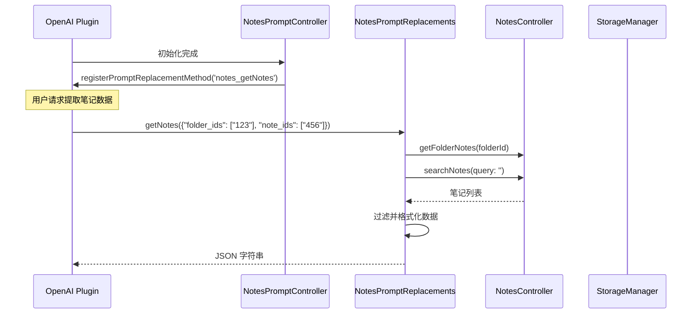
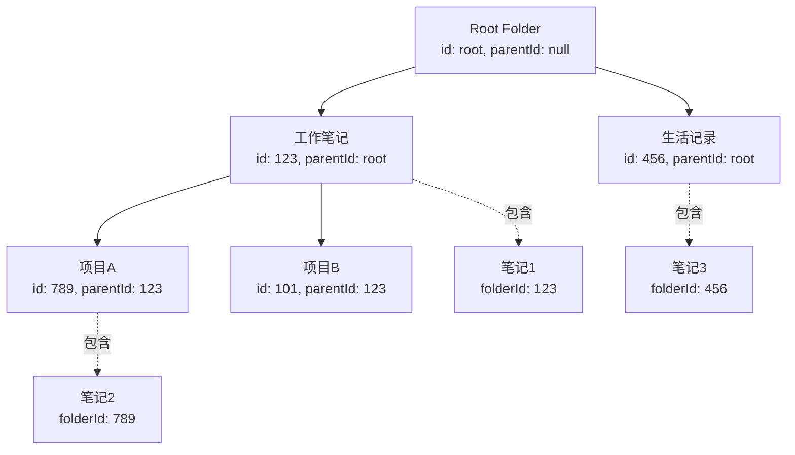
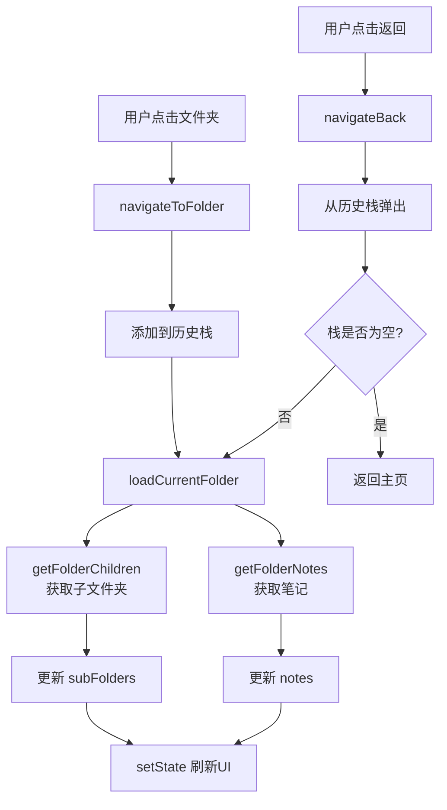

[根目录](../../../CLAUDE.md) > [lib](../../) > [plugins](../) > **notes**

---

# 笔记插件 (Notes Plugin) - 模块文档

## 模块职责

笔记插件是 Memento 的核心功能模块之一,提供:

- **无限层级文件夹**:支持任意深度的文件夹树形结构
- **Markdown 笔记编辑**:支持富文本格式的笔记内容
- **标签系统**:为笔记添加多个标签以便分类
- **全文搜索**:支持标题、内容、标签、日期范围的复合搜索
- **笔记移动**:在文件夹之间自由移动笔记
- **AI 数据分析**:注册到 OpenAI 插件,支持笔记数据提取
- **事件系统**:广播笔记的创建、更新、删除事件

---

## 入口与启动

### 插件主类

**文件**: `notes_plugin.dart`

```dart
class NotesPlugin extends BasePlugin {
    @override
    String get id => 'notes';

    @override
    Color get color => const Color.fromARGB(255, 61, 204, 185);

    @override
    IconData get icon => Icons.note_alt_outlined;

    @override
    Future<void> initialize() async {
        controller = NotesController(storage);
        _promptController = NotesPromptController();
        await controller.initialize();
        _promptController.initialize(controller);
        _isInitialized = true;
    }

    @override
    Future<void> registerToApp(pluginManager, configManager) async {
        await initialize();
    }
}
```

### 主界面入口

**文件**: `screens/notes_screen.dart`

**路由**: 通过 `NotesPlugin.buildMainView()` 返回 `NotesMainView`

---

## 对外接口

### 核心 API

#### 统计接口

```dart
// 获取总笔记数
int getTotalNotesCount();

// 获取最近7天的笔记数
int getRecentNotesCount();
```

#### NotesController 控制器方法

**文件**: `controllers/notes_controller.dart`

```dart
// ========== 文件夹管理 ==========

// 获取文件夹
Folder? getFolder(String id);

// 获取所有文件夹
List<Folder> getAllFolders();

// 获取指定文件夹的子文件夹
List<Folder> getFolderChildren(String parentId);

// 创建新文件夹
Future<Folder> createFolder(String name, String? parentId);

// 重命名文件夹
Future<void> renameFolder(String folderId, String newName);

// 删除文件夹(递归删除子文件夹和笔记)
Future<void> deleteFolder(String folderId);

// ========== 笔记管理 ==========

// 获取文件夹中的笔记
List<Note> getFolderNotes(String folderId);

// 创建新笔记
Future<Note> createNote(String title, String content, String folderId);

// 更新笔记
Future<void> updateNote(Note note);

// 删除笔记
Future<void> deleteNote(String noteId);
Future<void> deleteNoteObject(Note note);

// 移动笔记到其他文件夹
Future<void> moveNote(String noteId, String targetFolderId);

// ========== 搜索功能 ==========

// 搜索笔记(支持标题/内容/标签/日期范围)
List<Note> searchNotes({
  required String query,
  List<String>? tags,
  DateTime? startDate,
  DateTime? endDate,
});
```

### AI 集成接口

#### Prompt 替换方法

**文件**: `services/prompt_replacements.dart`

```dart
// 获取指定文件夹或笔记ID的笔记数据(供 OpenAI 插件调用)
Future<String> getNotes(Map<String, dynamic> params);
// params: {
//   "folder_ids": ["folder1", "folder2"],  // 可选
//   "note_ids": ["note1", "note2"]         // 可选
// }
// 返回: JSON 字符串,包含笔记列表
// 示例: {"notes": [{"id": "...", "title": "...", "content": "...", "folder_name": "..."}]}
```

**注册方式**: 通过 `NotesPromptController` 在 OpenAI 插件中注册为 `notes_getNotes` 方法

---

## 关键依赖与配置

### 外部依赖

- `flutter/material.dart`: UI 组件库
- `dart:convert`: JSON 序列化

### 插件依赖

- **OpenAI Plugin**: AI 数据分析功能
- **Core Event System**: 消息事件广播
- **StorageManager**: 数据存储

### 存储路径

**根目录**: `notes/`

**存储结构**:
```
notes/
├── folders.json              # 所有文件夹数据
└── notes.json                # 所有笔记数据
```

**folders.json 格式**:
```json
[
  {
    "id": "root",
    "name": "Root",
    "parentId": null,
    "createdAt": "2025-01-15T10:30:00.000Z",
    "updatedAt": "2025-01-15T10:30:00.000Z",
    "color": 4280391411,
    "icon": 57415
  },
  {
    "id": "1234567890",
    "name": "工作笔记",
    "parentId": "root",
    "createdAt": "2025-01-16T09:00:00.000Z",
    "updatedAt": "2025-01-16T09:00:00.000Z",
    "color": 4280391411,
    "icon": 57415
  }
]
```

**notes.json 格式**:
```json
[
  {
    "id": "1234567890123",
    "title": "项目计划",
    "content": "# 项目计划\n\n本周目标:\n- 完成设计稿\n- 开发核心功能",
    "folderId": "1234567890",
    "createdAt": "2025-01-15T08:30:00.000Z",
    "updatedAt": "2025-01-15T20:15:00.000Z",
    "tags": ["工作", "计划"]
  }
]
```

---

## 数据模型

### Folder (文件夹)

**文件**: `models/folder.dart`

```dart
class Folder {
  String id;               // 唯一标识符(时间戳字符串)
  String name;             // 文件夹名称
  String? parentId;        // 父文件夹ID(null 表示根文件夹)
  DateTime createdAt;      // 创建时间
  DateTime updatedAt;      // 更新时间
  Color color;             // 文件夹颜色(默认蓝色)
  IconData icon;           // 文件夹图标(默认 folder 图标)

  Map<String, dynamic> toJson();
  factory Folder.fromJson(Map<String, dynamic> json);
}
```

**层级结构实现**:
- 使用 `parentId` 字段建立父子关系
- `parentId = null` 表示根文件夹
- 通过 `getFolderChildren(parentId)` 获取子文件夹
- 支持无限层级嵌套

**示例数据**:
```json
{
  "id": "1234567890",
  "name": "工作笔记",
  "parentId": "root",
  "createdAt": "2025-01-15T10:30:00.000Z",
  "updatedAt": "2025-01-15T10:30:00.000Z",
  "color": 4280391411,
  "icon": 57415
}
```

### Note (笔记)

**文件**: `models/note.dart`

```dart
class Note {
  String id;               // 唯一标识符(时间戳字符串)
  String title;            // 笔记标题
  String content;          // 笔记内容(Markdown 格式)
  String folderId;         // 所属文件夹ID
  DateTime createdAt;      // 创建时间
  DateTime updatedAt;      // 更新时间
  List<String> tags;       // 标签列表

  Map<String, dynamic> toJson();
  factory Note.fromJson(Map<String, dynamic> json);
  Note copyWith({...});
}
```

**示例数据**:
```json
{
  "id": "1234567890123",
  "title": "项目计划",
  "content": "# 项目计划\n\n本周目标:\n- 完成设计稿",
  "folderId": "1234567890",
  "createdAt": "2025-01-15T08:30:00.000Z",
  "updatedAt": "2025-01-15T20:15:00.000Z",
  "tags": ["工作", "计划"]
}
```

---

## 界面层结构

### 主要界面组件

| 组件 | 文件 | 职责 |
|------|------|------|
| `NotesMainView` | `screens/notes_screen.dart` | 笔记主界面容器 |
| `NotesMainViewState` | `screens/notes_screen/notes_screen_state.dart` | 状态管理基类 |
| `FolderOperations` | `screens/notes_screen/folder_operations.dart` | 文件夹操作逻辑 Mixin |
| `NoteOperations` | `screens/notes_screen/note_operations.dart` | 笔记操作逻辑 Mixin |
| `FolderItem` | `screens/notes_screen/folder_item.dart` | 文件夹列表项 Mixin |
| `NoteItem` | `screens/notes_screen/note_item.dart` | 笔记列表项 Mixin |
| `FolderSelectionDialog` | `screens/notes_screen/folder_selection_dialog.dart` | 文件夹选择对话框 Mixin |
| `NoteEditScreen` | `screens/note_edit_screen.dart` | 笔记编辑界面 |
| `SearchScreen` | `screens/search_screen.dart` | 搜索界面 |

### NotesMainView 布局

**布局结构**:
```
Scaffold
├── AppBar
│   ├── leading: 返回按钮(返回上级文件夹或主页)
│   ├── title: 当前文件夹名称或搜索框
│   └── actions: [搜索按钮, 菜单(新建文件夹/新建笔记)]
├── body: ListView
│   ├── 文件夹列表区域(subFolders)
│   │   └── ListView.builder - FolderItem
│   ├── 笔记列表区域(notes)
│   │   └── ListView.builder - NoteItem
│   └── 空状态提示
└── floatingActionButton: 快速新建笔记
```

**关键特性**:
- 点击文件夹进入下级文件夹
- 点击笔记打开编辑界面
- 长按显示操作菜单(编辑/移动/删除)
- 搜索模式实时过滤结果
- 支持文件夹导航历史

### Mixin 架构设计

使用 Mixin 模式将功能模块化:

```dart
class _NotesMainViewState extends NotesMainViewState
    with
        FolderOperations,    // 文件夹增删改查
        NoteOperations,      // 笔记增删改查移动
        FolderSelectionDialog, // 文件夹选择弹窗
        FolderItem,          // 文件夹UI渲染
        NoteItem {           // 笔记UI渲染
  // 组合所有功能
}
```

**优点**:
- 代码模块化、职责清晰
- 易于维护和扩展
- 避免单一文件过大

---

## 事件系统

### 事件类型

**文件**: `controllers/notes_controller.dart`

| 事件名 | 事件类 | 触发时机 | 参数 |
|-------|--------|---------|------|
| `note_added` | `ItemEventArgs` | 创建笔记时 | `itemId`, `title`, `action` |
| `note_deleted` | `ItemEventArgs` | 删除笔记时 | `itemId`, `title`, `action` |

### 事件广播示例

```dart
// 在 NotesController.createNote() 中
void _notifyEvent(String action, Note note) {
  final eventArgs = ItemEventArgs(
    eventName: 'note_$action',
    itemId: note.id,
    title: note.title,
    action: action,
  );
  EventManager.instance.broadcast('note_$action', eventArgs);
}

// 创建笔记时
await _saveNotes();
_notifyEvent('added', note);

// 删除笔记时
notes.removeAt(noteIndex);
_notifyEvent('deleted', note);
await _saveNotes();
```

---

## AI 数据分析集成

### 工作流程



### 注册流程

**文件**: `controls/prompt_controller.dart`

```dart
class NotesPromptController {
  void initialize(NotesController controller) {
    _promptReplacements.initialize(controller);

    // 延迟注册,等待 OpenAI 插件初始化
    Future.delayed(const Duration(seconds: 1), () {
      _registerPromptMethods();
    });
  }

  void _registerPromptMethods() {
    final openaiPlugin = PluginManager.instance.getPlugin('openai') as OpenAIPlugin?;
    if (openaiPlugin != null) {
      openaiPlugin.registerPromptReplacementMethod(
        'notes_getNotes',
        _promptReplacements.getNotes,
      );
    } else {
      // 重试机制
      Future.delayed(const Duration(seconds: 5), _registerPromptMethods);
    }
  }
}
```

### 调用示例

在 OpenAI 插件的 Prompt 中可以使用:

```
分析我在"工作笔记"文件夹中的笔记内容:
{{notes_getNotes(folder_ids: ["1234567890"])}}
```

或指定笔记ID:

```
总结这些笔记的要点:
{{notes_getNotes(note_ids: ["123", "456", "789"])}}
```

---

## 卡片视图

插件在主页提供卡片视图,展示:

**布局**:
```
┌─────────────────────────────┐
│ 📝 笔记                    │
├─────────────────────────────┤
│  总笔记数    │   最近笔记   │
│     128     │      15      │
│             │   (7天内)    │
└─────────────────────────────┘
```

**实现**: `notes_plugin.dart` 中的 `buildCardView()` 方法

---

## 国际化

### 支持语言

- 简体中文 (zh)
- 英语 (en)

### 本地化文件

| 文件 | 语言 |
|------|------|
| `l10n/notes_localizations.dart` | 本地化接口 |
| `l10n/notes_localizations_zh.dart` | 中文翻译 |
| `l10n/notes_localizations_en.dart` | 英文翻译 |

### 关键字符串

```dart
abstract class NotesLocalizations {
  String get name;                  // 插件名称
  String get totalNotes;            // 总笔记数
  String get recentNotes;           // 最近笔记
  String get newNote;               // 新建笔记
  String get newFolder;             // 新建文件夹
  String get editNote;              // 编辑
  String get moveNote;              // 移动到
  String get deleteNote;            // 删除
  String get deleteNoteConfirm;     // 删除确认
  String get renameFolder;          // 重命名文件夹
  String get deleteFolder;          // 删除文件夹
  String get deleteFolderConfirm;   // 删除文件夹确认
  String get search;                // 搜索
  String get emptyFolder;           // 空文件夹提示
  String get folders;               // 文件夹
  String get notes;                 // 笔记
  String get tags;                  // 标签
  String get dateRange;             // 日期范围
}
```

---

## 测试与质量

### 当前状态
- **单元测试**: 无
- **集成测试**: 无
- **已知问题**: 无明显问题

### 测试建议

1. **高优先级**:
   - `NotesController.createFolder()` - 测试文件夹创建和父子关系
   - `NotesController.deleteFolder()` - 测试递归删除逻辑
   - `NotesController.moveNote()` - 测试跨文件夹移动
   - `NotesController.searchNotes()` - 测试复合搜索条件
   - 层级文件夹导航 - 确保无死循环

2. **中优先级**:
   - AI 数据提取方法 - 测试参数解析和数据格式
   - 事件广播 - 测试事件是否正确触发
   - 文件夹重命名 - 测试更新时间戳
   - 标签搜索 - 测试多标签匹配逻辑

3. **低优先级**:
   - UI 交互逻辑
   - 国际化字符串完整性
   - 搜索界面实时过滤

---

## 常见问题 (FAQ)

### Q1: 如何实现无限层级文件夹?

使用 `parentId` 字段建立树形结构:

```dart
class Folder {
  String id;
  String name;
  String? parentId;  // null = 根文件夹
}

// 获取子文件夹
List<Folder> getFolderChildren(String parentId) {
  return _folders.values
      .where((folder) => folder.parentId == parentId)
      .toList();
}

// 递归删除文件夹及其子文件夹
Future<void> deleteFolder(String folderId) async {
  final children = getFolderChildren(folderId);
  for (var child in children) {
    await deleteFolder(child.id);  // 递归
  }
  _notes.remove(folderId);
  _folders.remove(folderId);
  await _saveFolders();
  await _saveNotes();
}
```

### Q2: 如何添加新的搜索条件?

在 `searchNotes()` 方法中添加过滤逻辑:

```dart
List<Note> searchNotes({
  required String query,
  List<String>? tags,
  DateTime? startDate,
  DateTime? endDate,
  String? folderId,  // 新增: 仅搜索特定文件夹
}) {
  final allNotes = _notes.values.expand((notes) => notes).toList();
  return allNotes.where((note) {
    // 现有过滤逻辑...

    // 新增文件夹过滤
    if (folderId != null && note.folderId != folderId) {
      return false;
    }

    return true;
  }).toList();
}
```

### Q3: 如何在 AI 分析中使用笔记数据?

在 OpenAI 插件的系统提示词或用户消息中使用:

```
{{notes_getNotes(folder_ids: ["1234567890"])}}
```

OpenAI 插件会自动调用 `NotesPromptReplacements.getNotes()` 并替换占位符。

### Q4: 笔记内容支持哪些格式?

当前支持 Markdown 格式,存储在 `content` 字段。建议在编辑界面集成:
- `flutter_markdown` - Markdown 渲染
- `markdown_editable_textinput` - Markdown 编辑器
- 或自定义富文本编辑器

### Q5: 如何导出笔记数据?

当前未实现导出功能,建议添加:

```dart
Future<String> exportNotesToMarkdown(String folderId) async {
  final notes = getFolderNotes(folderId);
  final buffer = StringBuffer();

  for (var note in notes) {
    buffer.writeln('# ${note.title}');
    buffer.writeln('');
    buffer.writeln('**创建时间**: ${note.createdAt}');
    buffer.writeln('**标签**: ${note.tags.join(', ')}');
    buffer.writeln('');
    buffer.writeln(note.content);
    buffer.writeln('\n---\n');
  }

  return buffer.toString();
}
```

### Q6: 文件夹和笔记的ID是如何生成的?

使用时间戳作为唯一标识符:

```dart
final folder = Folder(
  id: DateTime.now().millisecondsSinceEpoch.toString(),
  // ...
);
```

**优点**: 简单、递增、无需额外依赖
**缺点**: 高并发下可能重复(当前场景下无问题)

如需更安全的ID生成,建议使用 `uuid` 包。

---

## 目录结构

```
notes/
├── notes_plugin.dart                    # 插件主类
├── notes_plugin_entry.dart              # 插件入口点
├── models/
│   ├── folder.dart                      # 文件夹模型
│   └── note.dart                        # 笔记模型
├── controllers/
│   └── notes_controller.dart            # 核心控制器(CRUD + 搜索)
├── services/
│   └── prompt_replacements.dart         # AI Prompt 替换方法
├── controls/
│   └── prompt_controller.dart           # Prompt 控制器(注册到 OpenAI)
├── screens/
│   ├── notes_screen.dart                # 主界面
│   ├── note_edit_screen.dart            # 编辑界面
│   ├── search_screen.dart               # 搜索界面
│   ├── folder_list_screen.dart          # 文件夹列表界面
│   ├── notes_screen/                    # 主界面模块化组件
│   │   ├── notes_screen_state.dart      # 状态基类
│   │   ├── folder_operations.dart       # 文件夹操作 Mixin
│   │   ├── note_operations.dart         # 笔记操作 Mixin
│   │   ├── folder_item.dart             # 文件夹项 Mixin
│   │   ├── note_item.dart               # 笔记项 Mixin
│   │   └── folder_selection_dialog.dart # 文件夹选择对话框 Mixin
│   └── note_screen/                     # 笔记界面组件(备用)
│       ├── index.dart
│       ├── notes_screen.dart
│       ├── notes_list_view.dart
│       ├── notes_app_bar.dart
│       ├── folder_list_tile.dart
│       ├── note_list_tile.dart
│       ├── folder_selection_dialog.dart
│       ├── folder_operations.dart
│       └── note_operations.dart
├── widgets/
│   ├── folder_item.dart                 # 文件夹列表项组件
│   ├── note_item.dart                   # 笔记列表项组件
│   ├── search_note_item.dart            # 搜索结果项组件
│   └── tag_input.dart                   # 标签输入组件
├── utils/
│   └── text_highlight.dart              # 文本高亮工具
└── l10n/
    ├── notes_localizations.dart         # 国际化接口
    ├── notes_localizations_zh.dart      # 中文翻译
    └── notes_localizations_en.dart      # 英文翻译
```

---

## 关键实现细节

### 1. 无限层级文件夹实现

**核心数据结构**:
```dart
class Folder {
  String id;
  String? parentId;  // 指向父文件夹
}

// 内存存储: Map<String, Folder>
Map<String, Folder> _folders = {};
```

**树形遍历**:
```dart
// 获取子文件夹
List<Folder> getFolderChildren(String parentId) {
  return _folders.values
      .where((folder) => folder.parentId == parentId)
      .toList();
}

// 递归删除
Future<void> deleteFolder(String folderId) async {
  final children = getFolderChildren(folderId);
  for (var child in children) {
    await deleteFolder(child.id);  // 深度优先删除
  }
  _folders.remove(folderId);
  _notes.remove(folderId);
}
```

**导航历史**:
```dart
// 在 NotesMainViewState 中
List<String> _folderHistory = ['root'];

void navigateToFolder(Folder folder) {
  _folderHistory.add(folder.id);
  loadCurrentFolder();
}

void navigateBack() {
  if (_folderHistory.length > 1) {
    _folderHistory.removeLast();
    loadCurrentFolder();
  }
}
```

### 2. 数据持久化机制

**单文件存储**:
- `folders.json`: 所有文件夹数据的 JSON 数组
- `notes.json`: 所有笔记数据的 JSON 数组

**优点**:
- 简单易维护
- 一次读取所有数据,内存操作快速
- 适合中小规模数据(<1000条)

**缺点**:
- 每次保存需要序列化全部数据
- 大数据量下性能下降

**优化建议**(数据量>5000):
```dart
// 改为分文件存储
notes/
├── folders/
│   ├── root.json
│   ├── 123.json
│   └── 456.json
└── notes/
    ├── 001.json
    ├── 002.json
    └── 003.json
```

### 3. 延迟注册到 OpenAI

由于插件初始化顺序不确定,使用延迟 + 重试机制:

```dart
Future.delayed(const Duration(seconds: 1), () {
  _registerPromptMethods();
});

void _registerPromptMethods() {
  final openaiPlugin = PluginManager.instance.getPlugin('openai') as OpenAIPlugin?;
  if (openaiPlugin != null) {
    openaiPlugin.registerPromptReplacementMethod(
      'notes_getNotes',
      _promptReplacements.getNotes,
    );
  } else {
    // 失败时重试
    Future.delayed(const Duration(seconds: 5), _registerPromptMethods);
  }
}
```

### 4. Mixin 架构设计

将界面逻辑拆分为多个 Mixin,组合使用:

```dart
// 基类 - 提供状态字段
abstract class NotesMainViewState extends State<NotesMainView> {
  late NotesController controller;
  Folder? currentFolder;
  List<Folder> subFolders = [];
  List<Note> notes = [];
  bool isSearching = false;
  TextEditingController searchController = TextEditingController();
}

// Mixin - 文件夹操作
mixin FolderOperations on NotesMainViewState {
  Future<void> createNewFolder() async { /* ... */ }
  Future<void> renameFolder(Folder folder) async { /* ... */ }
  Future<void> deleteFolder(Folder folder) async { /* ... */ }
}

// Mixin - 笔记操作
mixin NoteOperations on NotesMainViewState {
  void createNewNote() { /* ... */ }
  void editNote(Note note) { /* ... */ }
  Future<void> moveNote(Note note) async { /* ... */ }
  Future<void> deleteNote(Note note) async { /* ... */ }
}

// 最终组合
class _NotesMainViewState extends NotesMainViewState
    with FolderOperations, NoteOperations, FolderItem, NoteItem {
  // 拥有所有 Mixin 的方法
}
```

**优点**:
- 职责分离,代码清晰
- 易于单独测试每个 Mixin
- 避免单文件过长(>1000行)

### 5. 搜索复合条件实现

```dart
List<Note> searchNotes({
  required String query,
  List<String>? tags,
  DateTime? startDate,
  DateTime? endDate,
}) {
  final allNotes = _notes.values.expand((notes) => notes).toList();
  return allNotes.where((note) {
    // 条件1: 标题或内容匹配
    if (!note.title.toLowerCase().contains(query.toLowerCase()) &&
        !note.content.toLowerCase().contains(query.toLowerCase())) {
      return false;
    }

    // 条件2: 标签匹配(任一标签匹配即可)
    if (tags != null && tags.isNotEmpty) {
      if (!tags.any((tag) => note.tags.contains(tag))) {
        return false;
      }
    }

    // 条件3: 日期范围匹配
    if (startDate != null && note.createdAt.isBefore(startDate)) {
      return false;
    }
    if (endDate != null) {
      final endOfDay = DateTime(
        endDate.year,
        endDate.month,
        endDate.day,
        23, 59, 59,
      );
      if (note.createdAt.isAfter(endOfDay)) {
        return false;
      }
    }

    return true;
  }).toList();
}
```

---

## 层级结构可视化

### 数据关系图



### 文件夹遍历流程



---

## 依赖关系

### 核心依赖

- **BasePlugin**: 插件基类
- **StorageManager**: 数据持久化
- **EventManager**: 事件广播系统
- **PluginManager**: 插件管理器

### 第三方包依赖

无外部第三方包依赖(仅使用 Flutter SDK)

### 其他插件依赖

- **OpenAI Plugin**: 可选依赖,用于 AI 数据分析

**依赖方向**: `notes` → `openai`(通过 `PluginManager` 获取)

---

## 变更记录 (Changelog)

- **2025-11-13**: 初始化笔记插件文档,识别 33 个文件、2 个数据模型(Note/Folder)、16 个控制器方法、1 个 AI 接口方法

---

**上级目录**: [返回插件目录](../../../CLAUDE.md#模块索引) | [返回根文档](../../../CLAUDE.md)
