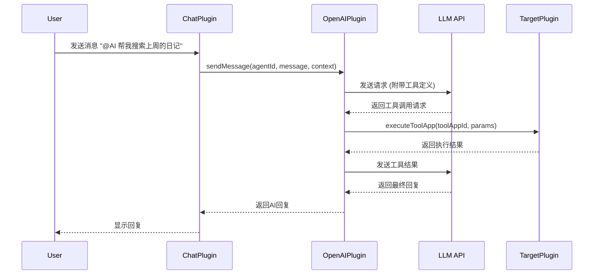

[根目录](../../../CLAUDE.md) > [lib](../../) > [plugins](../) > **openai**

---

# OpenAI 插件 (AI 助手管理) - 模块文档

## 模块职责

OpenAI 插件是 Memento 的 AI 核心，提供：

- **多服务商支持**：OpenAI、Anthropic、Google、本地模型等
- **AI 助手管理**：创建多个具有不同人格/专长的 AI 助手
- **数据分析应用**：根据提示分析指定插件数据
- **工具调用 (Tool App)**：AI 可调用其他插件功能
- **插件数据提示词生成**：自动为各插件生成数据摘要提示词
- **对话管理**：维护对话上下文与历史

---

## 入口与启动

### 插件主类

**文件**: `openai_plugin.dart`

```dart
class OpenAIPlugin extends BasePlugin {
    @override
    String get id => 'openai';

    @override
    Future<void> initialize() async {
        // 加载 AI 助手列表
        await loadAgents();

        // 初始化服务商配置
        await loadServiceProviders();

        // 注册工具应用
        await loadToolApps();
    }
}
```

### 主界面入口

**路由**: `Navigator.pushNamed(context, '/openai')`

---

## 对外接口

### 核心 API

#### 发送消息

```dart
Future<String> sendMessage({
  required String agentId,
  required String message,
  List<Message>? context,  // 上下文消息
  Map<String, dynamic>? metadata,
}) async {
  final agent = await getAgent(agentId);
  final provider = await getServiceProvider(agent.providerId);

  // 调用 LLM API
  final response = await requestService.sendRequest(
    provider: provider,
    model: agent.model,
    messages: [
      ...buildContextMessages(context),
      {'role': 'user', 'content': message},
    ],
  );

  return response;
}
```

#### 数据分析

```dart
Future<String> analyzePluginData({
  required String pluginId,
  required String query,
  String? agentId,
}) async {
  // 1. 获取插件数据提示词
  final dataPrompt = await pluginAnalysisService.getPluginDataPrompt(pluginId);

  // 2. 构建分析请求
  final fullPrompt = '''
$dataPrompt

用户查询: $query
请基于以上数据进行分析并给出结论。
''';

  // 3. 调用 AI
  return await sendMessage(
    agentId: agentId ?? defaultAgentId,
    message: fullPrompt,
  );
}
```

#### 工具调用

```dart
Future<dynamic> executeToolApp({
  required String toolAppId,
  required Map<String, dynamic> parameters,
}) async {
  final toolApp = await getToolApp(toolAppId);

  // 调用对应插件的功能
  final targetPlugin = PluginManager.instance.getPlugin(toolApp.pluginId);
  return await toolApp.execute(targetPlugin, parameters);
}
```

---

## 关键依赖与配置

### 外部依赖

- `openai_dart`: OpenAI API 客户端
- `dio`: HTTP 请求（用于其他服务商）
- `http`: 备用 HTTP 客户端

### 配置文件

**路径**: `configs/openai/settings.json`

```json
{
  "defaultAgentId": "agent_uuid",
  "enableToolCalling": true,
  "maxContextMessages": 10,
  "temperature": 0.7
}
```

---

## 数据模型

### AIAgent (AI 助手)

**文件**: `models/ai_agent.dart`

```dart
class AIAgent {
  String id;                    // UUID
  String name;                  // 助手名称
  String? avatar;               // 头像
  String providerId;            // 服务商ID
  String model;                 // 模型名称 (gpt-4, claude-3, etc.)
  String systemPrompt;          // 系统提示词
  double temperature;           // 温度参数 (0.0-2.0)
  int maxTokens;                // 最大生成token数
  bool enableToolCalling;       // 是否启用工具调用
  List<String> toolAppIds;      // 可用的工具应用ID列表
  DateTime createdAt;

  Map<String, dynamic> toJson();
  factory AIAgent.fromJson(Map<String, dynamic> json);
}
```

**存储路径**: `openai/agents/<agentId>.json`

**示例数据**：
```json
{
  "id": "agent_123",
  "name": "数据分析专家",
  "providerId": "openai",
  "model": "gpt-4-turbo",
  "systemPrompt": "你是一个专业的数据分析师，擅长从个人数据中发现模式和洞察。",
  "temperature": 0.5,
  "maxTokens": 4096,
  "enableToolCalling": true,
  "toolAppIds": ["tool_diary_search", "tool_activity_stats"]
}
```

---

### ServiceProvider (服务商)

**文件**: `models/service_provider.dart`

```dart
class ServiceProvider {
  String id;                    // 唯一标识
  String name;                  // 显示名称
  ProviderType type;            // 服务商类型
  String apiKey;                // API密钥
  String? baseUrl;              // 自定义API端点
  List<String> availableModels; // 可用模型列表
  Map<String, dynamic>? config; // 额外配置

  Map<String, dynamic> toJson();
  factory ServiceProvider.fromJson(Map<String, dynamic> json);
}

enum ProviderType {
  openai,       // OpenAI
  anthropic,    // Claude
  google,       // Gemini
  local,        // 本地模型 (Ollama等)
  custom,       // 自定义
}
```

**存储路径**: `openai/providers/<providerId>.json`

---

### ToolApp (工具应用)

**文件**: `models/tool_app.dart`

```dart
class ToolApp {
  String id;                    // UUID
  String name;                  // 工具名称
  String description;           // 功能描述
  String pluginId;              // 目标插件ID
  String functionName;          // 调用的函数名
  Map<String, ParameterSchema> parameters; // 参数定义
  DateTime createdAt;

  // 执行工具
  Future<dynamic> execute(PluginBase plugin, Map<String, dynamic> params);

  Map<String, dynamic> toJson();
  factory ToolApp.fromJson(Map<String, dynamic> json);
}
```

**示例**：
```json
{
  "id": "tool_diary_search",
  "name": "搜索日记",
  "description": "在日记中搜索包含指定关键词的条目",
  "pluginId": "diary",
  "functionName": "searchEntries",
  "parameters": {
    "keyword": {
      "type": "string",
      "description": "搜索关键词",
      "required": true
    },
    "startDate": {
      "type": "date",
      "description": "开始日期",
      "required": false
    }
  }
}
```

---

### LLMModel (模型定义)

**文件**: `models/llm_models.dart`

```dart
class LLMModel {
  String id;                    // 模型ID (gpt-4, claude-3-opus, etc.)
  String name;                  // 显示名称
  String providerId;            // 所属服务商
  int contextWindow;            // 上下文窗口大小
  double costPer1kTokens;       // 每1k tokens成本
  bool supportsVision;          // 是否支持图片
  bool supportsFunctionCalling; // 是否支持函数调用

  factory LLMModel.fromJson(Map<String, dynamic> json);
}
```

---

## 服务层

### RequestService (请求服务)

**文件**: `services/request_service.dart`

**职责**：
- 统一封装不同服务商的 API 调用
- 处理流式响应
- 错误重试与降级
- 成本追踪

**关键方法**：

```dart
Future<String> sendRequest({
  required ServiceProvider provider,
  required String model,
  required List<Map<String, dynamic>> messages,
  double? temperature,
  int? maxTokens,
  bool stream = false,
}) async {
  switch (provider.type) {
    case ProviderType.openai:
      return await _sendOpenAIRequest(...);
    case ProviderType.anthropic:
      return await _sendAnthropicRequest(...);
    case ProviderType.google:
      return await _sendGoogleRequest(...);
    default:
      throw UnsupportedError('未支持的服务商');
  }
}
```

---

### PluginAnalysisService (插件分析服务)

**文件**: `services/plugin_analysis_service.dart`

**职责**：
- 为各插件生成数据摘要提示词
- 注册插件数据分析方法
- 执行数据分析查询

**关键方法**：

```dart
// 获取插件数据提示词
Future<String> getPluginDataPrompt(String pluginId) async {
  final method = _analysisMethodRegistry[pluginId];
  if (method == null) return '';

  // 调用插件注册的数据摘要方法
  final data = await method.generatePrompt();
  return data;
}

// 注册插件分析方法
void registerPluginAnalysis(String pluginId, PluginAnalysisMethod method) {
  _analysisMethodRegistry[pluginId] = method;
}
```

**插件端实现示例** (在 diary 插件中):

```dart
// diary_plugin.dart
@override
Future<void> registerToApp(PluginManager pm, ConfigManager cm) async {
  // 插件已在 initialize() 中完成初始化
    // 这里可以添加额外的应用级注册逻辑

  // 注册数据分析方法
  final openAIPlugin = pm.getPlugin('openai') as OpenAIPlugin;
  openAIPlugin.pluginAnalysisService.registerPluginAnalysis(
    'diary',
    DiaryAnalysisMethod(this),
  );
}

// services/prompt_replacements.dart
class DiaryAnalysisMethod extends PluginAnalysisMethod {
  final DiaryPlugin plugin;

  DiaryAnalysisMethod(this.plugin);

  @override
  Future<String> generatePrompt() async {
    final entries = await plugin.getAllEntries();
    final summary = entries.map((e) =>
      '${e.date.toString()}: ${e.content.substring(0, 100)}...'
    ).join('\n');

    return '用户日记数据（最近30条）:\n$summary';
  }
}
```

---

## 界面层

### 主要界面

| 界面 | 文件 | 功能 |
|------|------|------|
| AI助手列表 | `screens/agent_list_screen.dart` | 查看、创建、编辑助手 |
| 助手设置 | `screens/agent_settings_screen.dart` | 配置助手参数、工具 |
| 服务商管理 | `screens/provider_settings_screen.dart` | 添加/编辑服务商 |
| 数据分析应用 | `screens/data_analysis_screen.dart` | 选择插件、输入查询 |
| 工具应用管理 | `screens/tool_apps_screen.dart` | 创建/编辑工具应用 |

---

## 工具调用 (Function Calling)

### 工作流程



### 实现示例

```dart
// 1. 定义工具
final toolDefinition = {
  'type': 'function',
  'function': {
    'name': 'search_diary',
    'description': '搜索日记内容',
    'parameters': {
      'type': 'object',
      'properties': {
        'keyword': {'type': 'string', 'description': '搜索关键词'},
      },
      'required': ['keyword'],
    },
  },
};

// 2. 发送请求
final response = await requestService.sendRequest(
  provider: provider,
  model: agent.model,
  messages: messages,
  tools: [toolDefinition],
);

// 3. 处理工具调用
if (response.containsKey('tool_calls')) {
  for (final call in response['tool_calls']) {
    final result = await executeToolApp(
      toolAppId: call['function']['name'],
      parameters: jsonDecode(call['function']['arguments']),
    );

    // 将结果返回给 LLM
    final finalResponse = await requestService.sendRequest(
      provider: provider,
      model: agent.model,
      messages: [
        ...messages,
        response,
        {'role': 'tool', 'content': jsonEncode(result)},
      ],
    );
  }
}
```

---

## 测试与质量

### 测试服务

**文件**: `services/test_service.dart`

提供 API 连接测试功能：

```dart
Future<bool> testProviderConnection(ServiceProvider provider) async {
  try {
    final response = await requestService.sendRequest(
      provider: provider,
      model: provider.availableModels.first,
      messages: [{'role': 'user', 'content': 'Hello'}],
      maxTokens: 10,
    );
    return response.isNotEmpty;
  } catch (e) {
    return false;
  }
}
```

### 已知问题

- 流式响应在某些服务商上不稳定
- 工具调用的错误处理待完善
- 成本追踪功能未实现

---

## 常见问题 (FAQ)

### Q1: 如何添加新的服务商？

1. 在 `ProviderType` 枚举中添加类型
2. 在 `RequestService._sendRequest` 中实现对应的 API 调用逻辑
3. 在 UI 中添加配置表单

### Q2: 如何让 AI 访问我的插件数据？

方式1：数据分析（无工具调用）
```dart
// 在插件中注册分析方法
openAIPlugin.pluginAnalysisService.registerPluginAnalysis(
  'my_plugin',
  MyPluginAnalysisMethod(this),
);
```

方式2：工具调用（需要 LLM 支持 Function Calling）
```dart
// 创建 ToolApp
final toolApp = ToolApp(
  id: 'tool_my_function',
  name: '我的功能',
  description: '执行XX操作',
  pluginId: 'my_plugin',
  functionName: 'myFunction',
  parameters: {...},
);
await openAIPlugin.createToolApp(toolApp);
```

### Q3: 如何控制 AI 的回复质量？

调整 Agent 的参数：
- `temperature`: 0.0-1.0 (越低越确定，越高越随机)
- `systemPrompt`: 详细描述角色和任务
- `maxTokens`: 限制回复长度
- `model`: 选择更强大的模型

### Q4: 支持哪些 LLM 服务商？

当前支持：
- ✅ OpenAI (GPT-3.5, GPT-4)
- ✅ Anthropic (Claude)
- ✅ Google (Gemini)
- ✅ 自定义端点（兼容 OpenAI API 格式的服务）
- ⚠️ 本地模型（Ollama 等，需自行配置）

---

## 相关文件清单

### 核心文件
- `openai_plugin.dart` - 插件主类
- `models/ai_agent.dart` - AI助手模型
- `models/service_provider.dart` - 服务商模型
- `models/tool_app.dart` - 工具应用模型
- `models/llm_models.dart` - LLM模型定义
- `models/plugin_analysis_method.dart` - 插件分析方法接口

### 服务层
- `services/request_service.dart` - API请求服务
- `services/plugin_analysis_service.dart` - 插件分析服务
- `services/test_service.dart` - 测试服务

### 国际化
- `l10n/openai_localizations.dart`
- `l10n/openai_localizations_zh.dart`
- `l10n/openai_localizations_en.dart`

---

## 变更记录 (Changelog)

- **2025-11-13T04:06:10+00:00**: 初始化 OpenAI 插件文档，识别 6 个模型、3 个服务

---

**上级目录**: [返回插件目录](../../../CLAUDE.md#模块索引) | [返回根文档](../../../CLAUDE.md)
