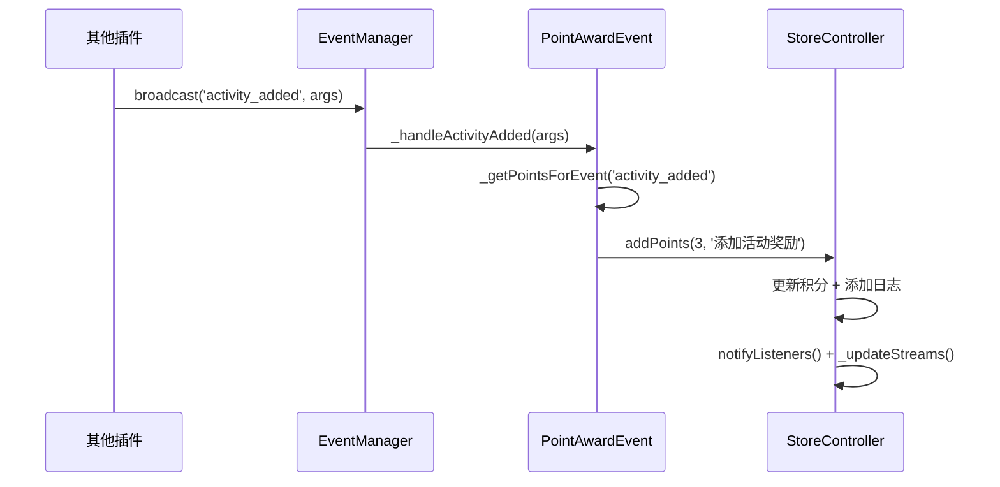

[根目录](../../../CLAUDE.md) > [lib](../../) > [plugins](../) > **store**

---

# 积分商店插件 (Store Plugin) - 模块文档

## 模块职责

积分商店插件是 Memento 的核心功能模块之一，提供：

- **积分系统**：通过应用内行为自动获得积分奖励
- **商品管理**：添加、编辑、归档虚拟商品
- **物品兑换**：使用积分兑换商品，生成用户物品
- **物品使用**：跟踪用户物品的使用次数和过期状态
- **积分历史**：记录所有积分获得和消耗的日志
- **事件集成**：监听应用内多个插件的事件（活动、签到、日记等）

---

## 入口与启动

### 插件主类

**文件**: `store_plugin.dart`

```dart
class StorePlugin extends BasePlugin {
    @override
    String get id => 'store';

    @override
    Future<void> initialize() async {
        await loadSettings(defaultPointSettings);
        _controller = StoreController(this);
        await _controller!.loadFromStorage();
        _isInitialized = true;
    }

    @override
    Future<void> registerToApp(
        PluginManager pluginManager,
        ConfigManager configManager,
    ) async {
        // 插件已在 initialize() 中完成初始化
    // 这里可以添加额外的应用级注册逻辑
    }
}
```

### 主界面入口

**文件**: `widgets/store_view/store_main.dart`

**路由**: 通过 `StorePlugin.buildMainView()` 返回 `StoreMainView`

---

## 对外接口

### 控制器架构

插件采用 **Controller 模式**，业务逻辑集中在 `StoreController` 中：

**文件**: `controllers/store_controller.dart`

| 职责 | 说明 |
|------|------|
| 商品管理 | 添加、删除、归档、恢复商品 |
| 积分管理 | 增减积分、查询积分余额 |
| 物品管理 | 兑换物品、使用物品、查询物品 |
| 数据持久化 | 保存/加载商品、积分、物品数据 |
| 流式通知 | 提供 Stream 供 UI 监听数据变化 |

### 核心 API

#### StoreController - 商品管理

```dart
// 添加商品
Future<void> addProduct(Product product);

// 从 JSON 添加商品
Future<void> addProductFromJson(Map<String, dynamic> json);

// 归档商品（移至存档列表）
Future<void> archiveProduct(Product product);

// 恢复存档商品
Future<void> restoreProduct(Product product);

// 排序商品（按库存、价格、过期时间）
Future<void> sortProducts(String field, {bool ascending = true});

// 获取商品列表
List<Product> get products;

// 获取存档商品列表
List<Product> get archivedProducts;
```

#### StoreController - 积分管理

```dart
// 添加积分（正数增加，负数减少）
Future<void> addPoints(int value, String reason);

// 获取当前积分
int get currentPoints;

// 获取积分记录
List<PointsLog> get pointsLogs;

// 清空积分记录
Future<void> clearPointsLogs();
```

#### StoreController - 物品管理

```dart
// 兑换商品（扣除积分，生成用户物品）
Future<bool> exchangeProduct(Product product);

// 使用物品（减少剩余次数）
Future<bool> useItem(UserItem item);

// 获取用户物品列表
List<UserItem> get userItems;

// 获取已使用物品历史
List<UsedItem> get usedItems;

// 获取按过期时间排序的物品
List<UserItem> get sortedUserItems;

// 清空用户物品
Future<void> clearUserItems();

// 排序用户物品（按剩余次数、过期时间）
Future<void> sortUserItems(String field, {bool ascending = true});
```

#### StoreController - 统计查询

```dart
// 获取商品总数
int getGoodsCount();

// 获取用户物品总数
int getItemsCount();

// 获取七天内到期的物品数量
int getExpiringItemsCount();
```

#### StoreController - 流式数据

```dart
// 商品数量变化流
Stream<int> get productsStream;

// 用户物品数量变化流
Stream<int> get userItemsStream;

// 积分变化流
Stream<int> get pointsStream;
```

---

## 关键依赖与配置

### 外部依赖

- `flutter/material.dart`: Flutter UI 框架
- `path`: 路径处理
- `image_picker`: 图片选择（用于商品图片）

### 插件依赖

- **Core Event System**: 监听应用事件获得积分
- **StorageManager**: 数据持久化
- **PluginManager**: 插件管理器

### 积分配置

**默认配置**: `StorePlugin.defaultPointSettings`

```dart
{
  'point_awards': {
    'activity_added': 3,       // 添加活动
    'checkin_completed': 10,   // 完成签到
    'task_completed': 20,      // 完成任务
    'note_added': 10,          // 添加笔记
    'goods_added': 5,          // 添加物品
    'onMessageSent': 1,        // 发送消息
    'onRecordAdded': 2,        // 添加记录
    'onDiaryAdded': 5,         // 添加日记
    'bill_added': 10,          // 添加账单
  }
}
```

**配置修改**: 通过设置界面 `PointSettingsView` 可动态修改各事件的积分值

### 存储路径

**根目录**: `store/`

**存储结构**:
```
store/
├── products.json              # 商品列表
├── archived_products.json     # 存档商品列表
├── points.json                # 积分余额 + 积分日志
├── user_items.json            # 用户物品列表
└── used_items.json            # 已使用物品历史
```

---

## 数据模型

### Product (商品)

**文件**: `models/product.dart`

```dart
class Product {
  String id;                    // UUID
  String name;                  // 商品名称
  String description;           // 商品描述
  String image;                 // 图片路径（本地或网络）
  int stock;                    // 库存数量
  int price;                    // 价格（积分）
  DateTime exchangeStart;       // 兑换开始时间
  DateTime exchangeEnd;         // 兑换结束时间
  int useDuration;              // 使用期限（天数）

  // 序列化
  Map<String, dynamic> toJson();
  factory Product.fromJson(Map<String, dynamic> json);
}
```

**存储路径**: `store/products.json`

**示例数据**:
```json
{
  "products": [
    {
      "id": "1705123456789",
      "name": "免作业卡",
      "description": "可免除一次作业",
      "image": "assets/card.png",
      "stock": 10,
      "price": 50,
      "exchange_start": "2025-01-01T00:00:00.000Z",
      "exchange_end": "2025-12-31T23:59:59.999Z",
      "use_duration": 30
    }
  ]
}
```

---

### UserItem (用户物品)

**文件**: `models/user_item.dart`

```dart
class UserItem {
  String id;                    // UUID
  String productId;             // 关联的商品ID
  int remaining;                // 剩余使用次数
  DateTime expireDate;          // 过期时间
  DateTime purchaseDate;        // 购买时间
  int purchasePrice;            // 购买价格（快照）
  Map<String, dynamic> productSnapshot;  // 商品快照（防止商品修改后信息丢失）

  // 序列化
  Map<String, dynamic> toJson();
  factory UserItem.fromJson(Map<String, dynamic> json);

  // 使用物品（减少剩余次数）
  void use();

  // 获取商品名称/图片（从快照）
  String get productName;
  String get productImage;
}
```

**存储路径**: `store/user_items.json`

**设计要点**:
- `productSnapshot` 保存购买时的商品完整信息，避免商品修改或删除后用户物品信息丢失
- `remaining` 初始值为 1，每次使用减 1，归零后自动移除
- `expireDate` 根据购买时间 + `useDuration` 自动计算

---

### PointsLog (积分记录)

**文件**: `models/points_log.dart`

```dart
class PointsLog {
  String id;                    // UUID
  String type;                  // '获得' 或 '消耗'
  int value;                    // 积分值（正数或负数）
  String reason;                // 原因描述
  DateTime timestamp;           // 记录时间

  // 序列化
  Map<String, dynamic> toJson();
  factory PointsLog.fromJson(Map<String, dynamic> json);
}
```

**存储路径**: `store/points.json`

**示例数据**:
```json
{
  "value": 150,
  "logs": [
    {
      "id": "1705123456789",
      "type": "获得",
      "value": 10,
      "reason": "完成签到奖励",
      "timestamp": "2025-01-15T08:30:00.000Z"
    },
    {
      "id": "1705123456790",
      "type": "消耗",
      "value": 50,
      "reason": "兑换商品: 免作业卡",
      "timestamp": "2025-01-15T10:15:00.000Z"
    }
  ]
}
```

---

### UsedItem (已使用物品)

**文件**: `models/used_item.dart`

```dart
class UsedItem {
  String id;                    // 关联 UserItem 的 ID
  String productId;             // 关联的商品ID
  DateTime useDate;             // 使用时间
  Map<String, dynamic> productSnapshot;  // 商品快照

  // 序列化
  Map<String, dynamic> toJson();
  factory UsedItem.fromJson(Map<String, dynamic> json);
}
```

**存储路径**: `store/used_items.json`

**用途**: 记录物品使用历史，供统计和回溯查看

---

## 事件系统

### 事件处理器

**文件**: `events/point_award_event.dart`

插件通过 `PointAwardEvent` 类监听应用内事件并自动发放积分：

```dart
class PointAwardEvent {
  void _initializeEventHandlers() {
    final eventManager = EventManager.instance;

    // 监听 9 种事件
    eventManager.subscribe('activity_added', _handleActivityAdded);
    eventManager.subscribe('checkin_completed', _handleCheckinCompleted);
    eventManager.subscribe('task_completed', _handleTaskCompleted);
    eventManager.subscribe('note_added', _handleNoteAdded);
    eventManager.subscribe('goods_item_added', _handleGoodsAdded);
    eventManager.subscribe('onMessageSent', _handleMessageSent);
    eventManager.subscribe('onRecordAdded', _handleRecordAdded);
    eventManager.subscribe('diary_entry_created', _handleDiaryAdded);
    eventManager.subscribe('bill_added', _handleBillAdded);
  }

  Future<void> _awardPoints(int points, String reason) async {
    if (points > 0) {
      await _storePlugin.controller.addPoints(points, reason);
    }
  }
}
```

### 监听的事件

| 事件名 | 来源插件 | 默认积分 | 说明 |
|-------|---------|---------|------|
| `activity_added` | activity | 3 | 添加活动 |
| `checkin_completed` | checkin | 10 | 完成签到 |
| `task_completed` | todo | 20 | 完成任务 |
| `note_added` | notes | 10 | 添加笔记 |
| `goods_item_added` | goods | 5 | 添加物品 |
| `onMessageSent` | chat | 1 | 发送消息 |
| `onRecordAdded` | tracker | 2 | 添加记录 |
| `diary_entry_created` | diary | 5 | 添加日记 |
| `bill_added` | bill | 10 | 添加账单 |

### 事件流程



---

## 界面层结构

### 主界面组件树

```
StoreMainView
├── AppBar (顶栏)
│   ├── 返回按钮
│   ├── 标题（根据选中页切换）
│   └── 操作按钮（排序、筛选、归档、清空）
├── PageView (三个页面)
│   ├── ProductList (商品列表)
│   │   └── GridView
│   │       └── ProductCard (商品卡片)
│   ├── UserItems (我的物品)
│   │   └── ListView
│   │       └── UserItemCard (物品卡片)
│   └── PointsHistory (积分历史)
│       └── ListView
│           └── PointsLogItem (积分记录条目)
└── BottomNavigationBar (底栏)
    ├── 商品列表 (带 Badge 显示数量)
    ├── 我的物品 (带 Badge 显示数量)
    └── 积分历史 (带 Badge 显示积分)
```

### 关键界面文件

| 文件路径 | 职责 |
|---------|------|
| `widgets/store_view/store_main.dart` | 主界面容器（三页切换） |
| `widgets/store_view/product_list.dart` | 商品列表页 |
| `widgets/store_view/user_items.dart` | 用户物品页 |
| `widgets/store_view/points_history.dart` | 积分历史页 |
| `widgets/store_view/archived_products.dart` | 存档商品页 |
| `widgets/store_view/badge_icon.dart` | 带徽章的图标组件 |
| `widgets/product_card.dart` | 商品卡片组件 |
| `widgets/user_item_card.dart` | 用户物品卡片 |
| `widgets/add_product_page.dart` | 添加/编辑商品页 |
| `widgets/user_item_detail_page.dart` | 物品详情页 |
| `widgets/point_settings_view.dart` | 积分配置页 |

---

## 卡片视图

插件在主页提供卡片视图，展示统计信息：

**布局**:
```
┌─────────────────────────────┐
│ 🛍️ 物品兑换                │
├─────────────────────────────┤
│  商品数量    │   物品数量   │
│      5       │      3       │
├─────────────────────────────┤
│  我的积分    │  七天到期    │
│     150      │      2       │
└─────────────────────────────┘
```

**实现**: `store_plugin.dart` 中的 `buildCardView()` 方法

**数据来源**:
- 商品数量: `controller.getGoodsCount()`
- 物品数量: `controller.getItemsCount()`
- 我的积分: `controller.currentPoints`
- 七天到期: `controller.getExpiringItemsCount()`

---

## 核心业务流程

### 1. 商品兑换流程

```dart
Future<bool> exchangeProduct(Product product) async {
  // 1. 校验条件
  if (_userPoints < product.price) return false;  // 积分不足
  if (product.stock <= 0) return false;           // 库存不足
  if (DateTime.now().isBefore(product.exchangeStart) ||
      DateTime.now().isAfter(product.exchangeEnd)) {
    return false;  // 不在兑换期内
  }

  // 2. 执行兑换
  _userPoints -= product.price;                   // 扣除积分
  _products[index] = product.copyWith(stock: product.stock - 1); // 减库存

  // 3. 生成用户物品（保存商品快照）
  final newItem = UserItem(
    id: DateTime.now().millisecondsSinceEpoch.toString(),
    productId: product.id,
    remaining: 1,
    expireDate: DateTime.now().add(Duration(days: product.useDuration)),
    purchaseDate: DateTime.now(),
    purchasePrice: product.price,
    productSnapshot: product.toJson(),  // 关键：保存快照
  );
  _userItems.add(newItem);

  // 4. 添加积分记录
  _pointsLogs.add(
    PointsLog(
      id: DateTime.now().millisecondsSinceEpoch.toString(),
      type: '消耗',
      value: product.price,
      reason: '兑换商品: ${product.name}',
      timestamp: DateTime.now(),
    ),
  );

  // 5. 保存数据并通知 UI
  await saveProducts();
  await savePoints();
  await saveUserItems();
  _updateStreams();
  notifyListeners();
  return true;
}
```

### 2. 物品使用流程

```dart
Future<bool> useItem(UserItem item) async {
  // 1. 校验是否过期
  if (DateTime.now().isAfter(item.expireDate)) return false;

  // 2. 记录使用历史
  _usedItems.add(
    UsedItem(
      id: item.id,
      productId: item.productId,
      useDate: DateTime.now(),
      productSnapshot: item.productSnapshot,
    ),
  );

  // 3. 减少剩余次数
  item.use();  // remaining--

  // 4. 次数归零则移除物品
  if (item.remaining <= 0) {
    _userItems.remove(item);
  }

  // 5. 保存数据并通知 UI
  await saveProducts();
  await savePoints();
  await saveUserItems();
  _updateStreams();
  notifyListeners();
  return true;
}
```

### 3. 积分发放流程

```dart
Future<void> addPoints(int value, String reason) async {
  // 1. 更新积分余额
  _userPoints += value;

  // 2. 添加积分记录
  _pointsLogs.add(
    PointsLog(
      id: DateTime.now().millisecondsSinceEpoch.toString(),
      type: value > 0 ? '获得' : '失去',
      value: value,
      reason: reason,
      timestamp: DateTime.now(),
    ),
  );

  // 3. 保存数据并通知 UI
  await savePoints();
  _updateStreams();
  notifyListeners();
}
```

---

## 国际化

### 支持语言

- 简体中文 (zh)
- 英语 (en)

### 本地化文件

| 文件 | 语言 |
|------|------|
| `l10n/store_localizations.dart` | 本地化接口 |
| `l10n/store_localizations_zh.dart` | 中文翻译 |
| `l10n/store_localizations_en.dart` | 英文翻译 |

### 关键字符串

```dart
abstract class StoreLocalizations {
  String get name;                      // 插件名称
  String get productQuantity;           // 商品数量
  String get itemQuantity;              // 物品数量
  String get myPoints;                  // 我的积分
  String get expiringIn7Days;           // 七天到期
  String get productList;               // 商品列表
  String get myItems;                   // 我的物品
  String get pointsHistory;             // 积分历史
  String get redeemConfirmation;        // 兑换确认
  String get useSuccess;                // 使用成功
  String get itemExpired;               // 物品已过期
  String get pointSettingsTitle;        // 积分设置标题
}
```

---

## 测试与质量

### 当前状态
- **单元测试**: 无
- **集成测试**: 无
- **已知问题**:
  - 事件订阅未在插件卸载时取消（可能导致内存泄漏）
  - 商品快照机制占用存储空间较大

### 测试建议

1. **高优先级**：
   - `StoreController.exchangeProduct()` - 测试兑换逻辑（积分扣除、库存减少、物品生成）
   - `StoreController.useItem()` - 测试使用逻辑（过期校验、次数递减）
   - `PointAwardEvent` - 测试事件监听和积分发放
   - 商品快照机制 - 测试商品修改后用户物品信息不变

2. **中优先级**：
   - 数据序列化/反序列化 - 测试存储和加载
   - 排序和筛选功能 - 测试准确性
   - 积分历史记录 - 测试完整性

3. **低优先级**：
   - UI 交互逻辑
   - 国际化字符串完整性
   - 图片加载和显示

---

## 常见问题 (FAQ)

### Q1: 如何添加新的积分奖励事件？

1. 在 `StorePlugin.defaultPointSettings` 中添加事件配置：
```dart
'point_awards': {
  'new_event': 15,  // 新事件默认积分
}
```

2. 在 `PointAwardEvent._initializeEventHandlers()` 中订阅事件：
```dart
eventManager.subscribe('new_event', _handleNewEvent);
```

3. 添加事件处理方法：
```dart
Future<void> _handleNewEvent(EventArgs args) async {
  await _awardPoints(_getPointsForEvent('new_event'), '新事件奖励');
}
```

4. 在 `StorePlugin.getEventDisplayName()` 中添加显示名称：
```dart
case 'new_event':
  return '新事件';
```

### Q2: 为什么使用商品快照（productSnapshot）？

**问题场景**:
- 用户兑换了"免作业卡"（50 积分）
- 后来管理员将价格改为 100 积分
- 如果不保存快照，用户物品显示的购买价格会变成 100

**解决方案**:
- 在兑换时保存完整的商品 JSON
- 用户物品从快照读取名称、图片、价格等信息
- 即使商品被删除或修改，用户物品信息依然完整

### Q3: 如何导出积分历史？

当前未实现导出功能，建议添加：

```dart
Future<File> exportPointsHistory() async {
  final buffer = StringBuffer();
  buffer.writeln('时间,类型,积分,原因');

  for (final log in _pointsLogs) {
    buffer.writeln(
      '${log.timestamp.toIso8601String()},${log.type},${log.value},${log.reason}',
    );
  }

  final file = File('points_history.csv');
  await file.writeAsString(buffer.toString());
  return file;
}
```

### Q4: 如何防止用户刷积分？

当前实现对事件频率无限制，建议添加防刷机制：

```dart
// 在 PointAwardEvent 中添加冷却时间
final _lastAwardTime = <String, DateTime>{};

Future<void> _awardPoints(int points, String eventKey) async {
  // 检查冷却时间（例如同一事件 10 秒内只能奖励一次）
  final lastTime = _lastAwardTime[eventKey];
  if (lastTime != null &&
      DateTime.now().difference(lastTime).inSeconds < 10) {
    return;  // 在冷却期内，跳过奖励
  }

  if (points > 0) {
    await _storePlugin.controller.addPoints(points, reason);
    _lastAwardTime[eventKey] = DateTime.now();
  }
}
```

### Q5: 商品库存为 0 后如何处理？

当前实现：库存为 0 时仍显示在商品列表，但无法兑换

建议改进：
- 自动归档库存为 0 的商品
- 或添加"已售罄"标签
- 或支持负库存（无限库存模式）

---

## 目录结构

```
store/
├── store_plugin.dart                    # 插件主类 + 积分配置
├── controllers/
│   └── store_controller.dart            # 核心控制器（商品/积分/物品管理）
├── models/
│   ├── product.dart                     # 商品模型
│   ├── user_item.dart                   # 用户物品模型
│   ├── points_log.dart                  # 积分记录模型
│   └── used_item.dart                   # 已使用物品模型
├── events/
│   └── point_award_event.dart           # 积分奖励事件处理器
├── widgets/
│   ├── store_view/
│   │   ├── store_main.dart              # 主界面容器
│   │   ├── product_list.dart            # 商品列表页
│   │   ├── user_items.dart              # 用户物品页
│   │   ├── points_history.dart          # 积分历史页
│   │   ├── archived_products.dart       # 存档商品页
│   │   └── badge_icon.dart              # 徽章图标组件
│   ├── product_card.dart                # 商品卡片
│   ├── user_item_card.dart              # 用户物品卡片
│   ├── add_product_page.dart            # 添加/编辑商品页
│   ├── user_item_detail_page.dart       # 物品详情页
│   └── point_settings_view.dart         # 积分配置页
└── l10n/
    ├── store_localizations.dart         # 国际化接口
    ├── store_localizations_zh.dart      # 中文翻译
    └── store_localizations_en.dart      # 英文翻译
```

---

## 关键实现细节

### 1. 流式数据更新

使用 `StreamController` 实现 UI 的实时更新：

```dart
class StoreController {
  final _productsStreamController = StreamController<int>.broadcast();
  final _userItemsStreamController = StreamController<int>.broadcast();
  final _pointsStreamController = StreamController<int>.broadcast();

  Stream<int> get productsStream => _productsStreamController.stream;
  Stream<int> get userItemsStream => _userItemsStreamController.stream;
  Stream<int> get pointsStream => _pointsStreamController.stream;

  void _updateStreams() {
    _productsStreamController.add(_products.length);
    _userItemsStreamController.add(_userItems.length);
    _pointsStreamController.add(_userPoints);
  }
}
```

**UI 监听示例**:
```dart
StreamBuilder<int>(
  stream: _plugin.controller.productsStream,
  initialData: _plugin.controller.products.length,
  builder: (context, snapshot) {
    return BadgeIcon(
      icon: const Icon(Icons.shopping_bag),
      count: snapshot.data ?? 0,
    );
  },
)
```

### 2. 归档机制

商品支持"归档"而非"删除"，保留历史数据：

```dart
Future<void> archiveProduct(Product product) async {
  // 从产品列表中移除
  _products.removeWhere((p) => p.id == product.id);
  // 添加到存档列表
  _archivedProducts.add(product);
  await saveProducts();
  await saveArchivedProducts();
  notifyListeners();
}
```

**优点**:
- 避免误删除
- 保留历史商品信息
- 支持恢复操作

### 3. 筛选和排序

支持多维度筛选：

```dart
void applyFilters({
  String? name,
  String? priceRange,
  DateTimeRange? dateRange,
}) {
  // 名称筛选
  if (name != null && name.isNotEmpty) {
    _products = _products
        .where((p) => p.name.toLowerCase().contains(name.toLowerCase()))
        .toList();
  }

  // 价格区间筛选
  if (priceRange != null && priceRange.isNotEmpty) {
    final parts = priceRange.split('-');
    if (parts.length == 2) {
      final min = int.tryParse(parts[0]);
      final max = int.tryParse(parts[1]);
      if (min != null && max != null) {
        _products = _products.where((p) => p.price >= min && p.price <= max).toList();
      }
    }
  }

  // 日期范围筛选
  if (dateRange != null) {
    _products = _products
        .where(
          (p) =>
              !p.exchangeEnd.isBefore(dateRange.start) &&
              !p.exchangeStart.isAfter(dateRange.end),
        )
        .toList();
  }
  notifyListeners();
}
```

---

## 依赖关系

### 核心依赖

- **BasePlugin**: 插件基类
- **StorageManager**: 数据持久化
- **EventManager**: 事件监听和广播
- **PluginManager**: 插件管理器

### 第三方包依赖

无特殊第三方包依赖，仅使用 Flutter 标准库

### 被依赖的插件

Store 插件监听以下插件的事件：
- **activity**: 活动添加事件
- **checkin**: 签到完成事件
- **todo**: 任务完成事件
- **notes**: 笔记添加事件
- **goods**: 物品添加事件
- **chat**: 消息发送事件
- **tracker**: 记录添加事件
- **diary**: 日记添加事件
- **bill**: 账单添加事件

**依赖方向**: 单向依赖，Store 监听其他插件事件，但其他插件不感知 Store

---

## 性能优化建议

### 1. 数据分页加载

当前实现一次性加载所有数据，建议改进：

```dart
Future<List<Product>> loadProducts({int offset = 0, int limit = 20}) async {
  // 分页加载商品
  final allProducts = await storage.read('store/products');
  return allProducts.skip(offset).take(limit).toList();
}
```

### 2. 图片缓存

商品图片每次重建 Widget 都会重新加载，建议添加缓存：

```dart
class ImageCache {
  static final _cache = <String, ImageProvider>{};

  static ImageProvider getImage(String path) {
    if (_cache.containsKey(path)) {
      return _cache[path]!;
    }
    final provider = FileImage(File(path));
    _cache[path] = provider;
    return provider;
  }
}
```

### 3. 积分日志清理

积分日志无限增长会占用大量存储，建议定期清理：

```dart
Future<void> cleanOldPointsLogs({int keepDays = 90}) async {
  final cutoffDate = DateTime.now().subtract(Duration(days: keepDays));
  _pointsLogs.removeWhere((log) => log.timestamp.isBefore(cutoffDate));
  await savePoints();
}
```

---

## 变更记录 (Changelog)

- **2025-11-13**: 初始化积分商店插件文档，识别 20 个文件、4 个数据模型、1 个事件处理器、9 个监听事件

---

**上级目录**: [返回插件目录](../../../CLAUDE.md#模块索引) | [返回根文档](../../../CLAUDE.md)
