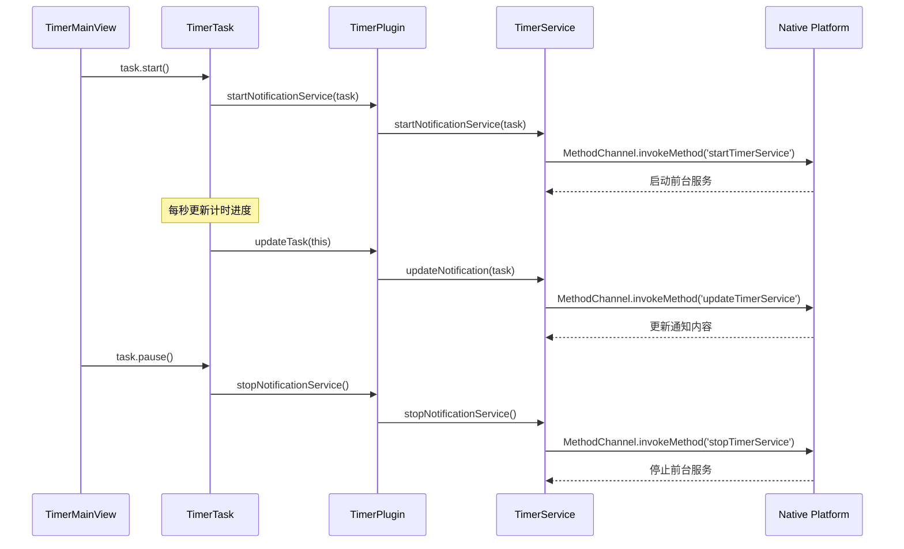

[根目录](../../../CLAUDE.md) > [lib](../../) > [plugins](../) > **timer**

---

# 计时器插件 (Timer Plugin) - 模块文档

## 模块职责

计时器插件是 Memento 的核心时间追踪模块,提供:

- **计时任务管理**: 创建、编辑、删除计时器任务
- **多种计时器类型**: 正计时、倒计时、番茄钟三种类型
- **多阶段计时**: 一个任务可包含多个顺序执行的计时器
- **重复执行**: 支持任务和计时器的重复执行
- **前台通知服务**: Android/iOS 平台的前台通知显示(保持服务运行)
- **任务分组**: 支持自定义分组管理任务
- **状态持久化**: 计时状态和进度的持久化存储
- **事件系统**: 广播任务和计时器的状态变化事件

---

## 入口与启动

### 插件主类

**文件**: `timer_plugin.dart`

```dart
class TimerPlugin extends BasePlugin {
    @override
    String get id => 'timer';

    @override
    Future<void> initialize() async {
        timerController = TimerController(storage);
        await _loadTasks();

        // 如果没有任何任务,添加默认示例任务
        if (_tasks.isEmpty) {
            _tasks.addAll(TimerController.createDefaultTasks());
            await saveTasks();
        }
    }

    @override
    Future<void> registerToApp(
        PluginManager pluginManager,
        ConfigManager configManager,
    ) async {
        // 插件已在 initialize() 中完成初始化
    // 这里可以添加额外的应用级注册逻辑
    }
}
```

### 主界面入口

**文件**: `views/timer_main_view.dart`

**路由**: 通过 `TimerPlugin.buildMainView()` 返回 `TimerMainView`,使用分组标签页展示任务

---

## 对外接口

### 核心 API

#### 任务管理接口

**文件**: `timer_plugin.dart`

```dart
// 获取所有计时器任务
List<TimerTask> getTasks();

// 添加新任务
Future<void> addTask(TimerTask task);

// 删除任务
Future<void> removeTask(String taskId);

// 更新任务
Future<void> updateTask(TimerTask task);

// 保存任务到存储
Future<void> saveTasks();
```

#### 前台通知服务接口

```dart
// 启动前台通知服务(任务开始时)
Future<void> startNotificationService(TimerTask task);

// 停止前台通知服务(任务停止时)
Future<void> stopNotificationService([String? taskId]);

// 更新前台通知(计时器进度更新时)
Future<void> _updateNotification(TimerTask task);
```

#### 统计接口

```dart
// 获取总计时器数量
int getTotalTimerCount() => _tasks.length;
```

---

## 关键依赖与配置

### 外部依赖

- `uuid`: 生成唯一任务ID
- `flutter_staggered_grid_view`: 瀑布流布局
- `collection`: 分组功能(groupBy)

### 插件依赖

- **Core Event System**: 事件广播系统
- **Core Notification Manager**: 通知管理器
- **StorageManager**: 数据持久化

### 平台通道

**通道名称**: `github.hunmer.memento/timer_service`

**方法**:
- `startTimerService`: 启动前台通知服务
- `updateTimerService`: 更新前台通知
- `stopTimerService`: 停止前台通知服务

### 存储路径

**根目录**: `timer/`

**存储结构**:
```
timer/
└── tasks.json              # 所有任务数据
```

**存储文件格式** (`tasks.json`):
```json
{
  "tasks": [
    {
      "id": "550e8400-e29b-41d4-a716-446655440000",
      "name": "测试多计时器",
      "color": 4284513675,
      "icon": 58223,
      "timerItems": [
        {
          "id": "1705300800000",
          "name": "正计时10秒",
          "description": null,
          "type": 0,
          "duration": 10,
          "completedDuration": 0,
          "workDuration": null,
          "breakDuration": null,
          "cycles": null,
          "currentCycle": null,
          "isWorkPhase": null,
          "repeatCount": 1,
          "intervalAlertDuration": null,
          "enableNotification": false
        },
        {
          "id": "1705300801000",
          "name": "倒计时10秒",
          "description": null,
          "type": 1,
          "duration": 10,
          "completedDuration": 0,
          "repeatCount": 1,
          "enableNotification": false
        }
      ],
      "createdAt": "2025-01-15T08:00:00.000Z",
      "isRunning": false,
      "group": "测试",
      "repeatCount": 1,
      "enableNotification": false
    }
  ]
}
```

---

## 数据模型

### TimerTask (计时任务)

**文件**: `models/timer_task.dart`

```dart
enum RepeatingPattern { daily, weekly, monthly }

class TimerTask {
  String id;                    // 唯一ID(UUID v4)
  String name;                  // 任务名称
  Color color;                  // 任务颜色
  IconData icon;                // 任务图标
  List<TimerItem> timerItems;   // 计时器列表(顺序执行)
  DateTime createdAt;           // 创建时间
  int repeatCount;              // 配置的重复次数
  int _currentRepeatCount;      // 当前剩余的重复次数
  bool isRunning;               // 是否正在运行
  String group;                 // 分组名称
  Duration _elapsedDuration;    // 已经过去的时长
  bool enableNotification;      // 是否启用消息提醒

  // 核心方法
  void start();                 // 启动任务
  void pause();                 // 暂停任务
  void resume();                // 恢复任务
  void reset();                 // 重置任务
  void toggle();                // 切换运行/暂停状态

  // 计算属性
  TimerItem? get activeTimer;   // 获取当前活动的计时器
  Duration get elapsedDuration; // 获取已经过去的时长
  int getCurrentIndex();        // 获取当前计时器索引
  bool get isCompleted;         // 检查任务是否已完成
  int get remainingRepeatCount; // 获取剩余重复次数

  Map<String, dynamic> toJson();
  factory TimerTask.fromJson(Map<String, dynamic> json);
  factory TimerTask.create({...});
  TimerTask copyWith({...});
}
```

**任务状态机**:
```
                   start()
   待机状态 ──────────────────> 运行状态
      ^                           │
      │         pause()           │
      └───────────────────────────┘

   运行状态 ────> 计时器1 ────> 计时器2 ────> ... ────> 完成
                    │              │                    │
                    └──────────────┴────────────────────┘
                            重复次数 > 1 时循环
```

**工作流程**:
1. `start()`: 启动任务,开始执行第一个计时器
2. 计时器完成时自动启动下一个计时器
3. 所有计时器完成后:
   - 如果 `_currentRepeatCount > 1`: 重置所有计时器,重新开始
   - 否则: 任务完成,停止前台通知

### TimerItem (计时器项)

**文件**: `models/timer_item.dart`

```dart
enum TimerType {
  countUp,      // 正计时 - 从0开始向上计时
  countDown,    // 倒计时 - 从设定时间开始向下计时
  pomodoro,     // 番茄钟 - 工作和休息交替的计时方式
}

class TimerItem {
  String id;                      // 唯一ID(时间戳)
  String name;                    // 计时器名称
  String? description;            // 计时器描述
  TimerType type;                 // 计时器类型
  Duration duration;              // 设定的时长
  Duration completedDuration;     // 已完成的时长
  bool isRunning;                 // 是否正在运行
  DateTime? startTime;            // 开始计时的时间
  Timer? _timer;                  // 内部定时器
  Function? onComplete;           // 完成回调
  Function? onIntervalAlert;      // 间隔提示回调
  Function(Duration)? onUpdate;   // 更新回调

  // 间隔提示设置
  Duration? intervalAlertDuration; // 间隔提示时长
  Duration? _lastAlertTime;        // 上次提示的时间点

  // 番茄钟特有属性
  Duration? workDuration;         // 工作时长
  Duration? breakDuration;        // 休息时长
  int? cycles;                    // 循环次数
  int? currentCycle;              // 当前循环
  bool? isWorkPhase;              // 是否处于工作阶段

  // 重复执行
  int repeatCount;                // 配置的重复次数
  int _currentRepeatCount;        // 当前剩余的重复次数
  bool enableNotification;        // 是否启用消息提醒

  // 核心方法
  void start();                   // 启动计时器
  void pause();                   // 暂停计时器
  void reset();                   // 重置计时器
  void resetRepeatCount();        // 重置重复次数

  // 计算属性
  Duration get remainingDuration; // 获取剩余时间
  bool get isCompleted;           // 检查是否已完成
  String get currentPhase;        // 获取当前阶段(番茄钟)
  String get formattedRemainingTime; // 格式化剩余时间
  bool get hasRemainingRepeats;   // 是否还有剩余重复次数
  int getCurrentRepeatCount();    // 获取当前重复次数

  // 工厂方法
  factory TimerItem.countUp({...});
  factory TimerItem.countDown({...});
  factory TimerItem.pomodoro({...});

  Map<String, dynamic> toJson();
  factory TimerItem.fromJson(Map<String, dynamic> json);
}
```

**计时器类型详解**:

1. **正计时 (countUp)**:
   - 从 0 开始向上计时
   - 达到 `duration` 时完成
   - 用途: 追踪任务耗时

2. **倒计时 (countDown)**:
   - 从 `duration` 开始向下计时
   - 到达 0 时完成
   - 用途: 限时任务

3. **番茄钟 (pomodoro)**:
   - 工作/休息交替循环
   - 配置: `workDuration`、`breakDuration`、`cycles`
   - 自动切换阶段
   - 总时长 = 工作时长 × 循环次数 + 休息时长 × (循环次数 - 1)

**计时器状态机**:
```
                  start()
   待机状态 ──────────────────> 运行状态
      ^                           │
      │         pause()           │
      └───────────────────────────┘
      │                           │
      │         reset()           │
      └───────────────────────────┘

   完成状态 <────────────────── 运行状态
                duration 达到
```

---

## 界面层结构

### 主要界面组件

| 组件 | 文件 | 职责 |
|------|------|------|
| `TimerMainView` | `views/timer_main_view.dart` | 插件主视图(分组标签页) |
| `TimerTaskCard` | `views/timer_task_card.dart` | 任务卡片组件 |
| `TimerTaskDetailsPage` | `views/timer_task_details_page.dart` | 任务详情页(步进器展示) |
| `AddTimerTaskDialog` | `views/add_timer_task_dialog.dart` | 添加/编辑任务对话框 |
| `AddTimerItemDialog` | `views/add_timer_item_dialog.dart` | 添加/编辑计时器对话框 |

### TimerMainView 布局

**布局结构**:
```
DefaultTabController
└── Scaffold
    ├── AppBar
    │   ├── 标题 (计时器)
    │   ├── TabBar (分组标签)
    │   └── Actions
    │       └── IconButton (添加任务)
    └── TabBarView (分组任务列表)
        └── MasonryGridView (每个分组)
            └── TimerTaskCard (任务卡片)
```

**关键特性**:
- 动态分组标签页(基于任务的 `group` 字段)
- 瀑布流布局展示任务卡片
- 支持点击卡片进入详情页
- 支持编辑、重置、删除任务

### TimerTaskCard 卡片

**布局**:
```
Card
├── 标题栏 (图标 + 任务名称 + 菜单按钮)
├── 计时器进度列表
│   ├── LinearProgressIndicator (每个计时器)
│   └── 时间显示 (已完成/总时长)
└── 控制按钮
    ├── 播放/暂停按钮
    ├── 重置按钮 (选项菜单)
    ├── 编辑按钮 (选项菜单)
    └── 删除按钮 (选项菜单)
```

**状态显示**:
- 正在运行: 播放图标变为暂停图标
- 已完成: 进度条填满,显示完成图标
- 当前计时器: 高亮显示

### TimerTaskDetailsPage 详情页

**核心组件**: 使用 `Stepper` 横向步进器

**功能**:
- 大字号显示当前计时器进度 (已完成/总时长)
- 播放/暂停/重置按钮
- 横向步进器展示所有计时器
- 实时更新计时进度
- 监听事件系统更新 UI

**事件监听**:
```dart
// 监听任务状态变化
EventManager.instance.subscribe('timer_task_changed', onTimerTaskChanged);

// 监听计时器进度更新(每秒)
EventManager.instance.subscribe('timer_item_progress', onTimerItemProgress);

// 监听计时器状态变化
EventManager.instance.subscribe('timer_item_changed', onTimerItemChanged);
```

### AddTimerTaskDialog 任务编辑

**核心组件**: 使用 `CircleIconPicker` + 表单字段

**功能**:
- 圆形图标选择器(图标+颜色)
- 任务名称输入
- 重复次数设置(1-100次)
- 分组选择(支持新建、重命名、删除分组)
- 计时器列表管理(添加、编辑、删除)
- 启用/禁用消息提醒开关

**验证规则**:
- 任务名称不能为空
- 重复次数必须 >= 1
- 至少要有一个计时器

### AddTimerItemDialog 计时器编辑

**功能**:
- 计时器名称输入
- 计时器描述输入(可选)
- 计时器类型选择(正计时/倒计时/番茄钟)
- 时长设置(小时、分钟、秒)
- 番茄钟专用设置:
  - 工作时长(分钟)
  - 休息时长(分钟)
  - 循环次数
- 重复次数设置
- 启用/禁用消息提醒开关

**动态表单**:
- 根据选择的计时器类型显示不同的配置字段
- 正计时/倒计时: 仅显示时长设置
- 番茄钟: 显示工作/休息时长和循环次数

---

## 控制器层

### TimerController

**文件**: `storage/timer_controller.dart`

**职责**:
- 任务数据的加载和保存
- 提供默认示例任务
- 分组管理

**核心方法**:

```dart
// 从存储加载任务
Future<Map<String, dynamic>> loadTasks() async {
  try {
    final data = await storage.read('timer/tasks');
    _tasks = data['tasks'] != null
        ? (data['tasks'] as List)
            .map((data) => TimerTask.fromJson(data as Map<String, dynamic>))
            .toList()
        : <TimerTask>[];
    return {'tasks': _tasks};
  } catch (e) {
    _tasks = <TimerTask>[];
    return {'tasks': _tasks};
  }
}

// 保存任务到存储
Future<void> saveTasks(List<TimerTask> tasks) async {
  final tasksData = tasks.map((task) => task.toJson()).toList();
  await storage.write('timer/tasks', {'tasks': tasksData});
}

// 获取所有分组名称
List<String> getGroups() {
  final groups = _tasks.map((task) => task.group).toSet().toList();
  return groups;
}

// 更新分组名称
void updateTaskGroups(String oldName, String newName) {
  for (var task in _tasks) {
    if (task.group == oldName) {
      task.group = newName;
    }
  }
  saveTasks(_tasks);
}

// 删除分组(将相关任务移到默认分组)
void deleteGroup(String groupName) {
  for (var task in _tasks) {
    if (task.group == groupName) {
      task.group = '默认';
    }
  }
  saveTasks(_tasks);
}

// 创建默认示例任务
static List<TimerTask> createDefaultTasks() {
  return [
    // 1. 测试正计时器: 3秒
    TimerTask.create(
      id: Uuid().v4(),
      name: '测试正计时器',
      color: Colors.blue,
      icon: Icons.timer,
      group: '测试',
      timerItems: [
        TimerItem.countUp(
          name: '正计时',
          targetDuration: const Duration(seconds: 3),
        ),
      ],
    ),

    // 2. 测试倒计时器: 3秒
    TimerTask.create(
      id: Uuid().v4(),
      name: '测试倒计时器',
      color: Colors.red,
      icon: Icons.hourglass_empty,
      group: '测试',
      timerItems: [
        TimerItem.countDown(
          name: '倒计时',
          duration: const Duration(seconds: 3),
        ),
      ],
    ),

    // 3. 测试番茄钟: 5秒工作 5秒休息 4循环
    TimerTask.create(
      id: Uuid().v4(),
      name: '测试番茄钟',
      color: Colors.green,
      icon: Icons.local_cafe,
      group: '工作效率',
      timerItems: [
        TimerItem.pomodoro(
          name: '番茄工作法',
          workDuration: const Duration(seconds: 5),
          breakDuration: const Duration(seconds: 5),
          cycles: 4,
        ),
      ],
    ),

    // 4. 测试多计时器: 3秒正计时 + 3秒倒计时
    TimerTask.create(
      id: Uuid().v4(),
      name: '测试多计时器',
      color: Colors.purple,
      icon: Icons.timer_outlined,
      group: '测试',
      timerItems: [
        TimerItem.countUp(
          name: '正计时3秒',
          targetDuration: const Duration(seconds: 3),
        ),
        TimerItem.countDown(
          name: '倒计时3秒',
          duration: const Duration(seconds: 3),
        ),
      ],
    ),
  ];
}
```

---

## 服务层结构

### TimerService (前台通知服务)

**文件**: `services/timer_service.dart`

**职责**:
- 启动 Android/iOS 前台通知服务
- 更新前台通知内容
- 停止前台通知服务

**平台通道**: `github.hunmer.memento/timer_service`

**核心方法**:

```dart
// 启动前台通知服务
static Future<void> startNotificationService(TimerTask task) async {
  try {
    await _channel.invokeMethod('startTimerService', {
      'taskId': task.id,
      'taskName': task.name,
      'subTimers': task.timerItems.map((st) => {
        'name': st.name,
        'current': st.completedDuration.inSeconds,
        'duration': st.duration.inSeconds,
        'completed': st.isCompleted,
      }).toList(),
      'currentSubTimerIndex': task.getCurrentIndex(),
    });
  } catch (e) {
    print('Error starting notification service: $e');
  }
}

// 更新前台通知
static Future<void> updateNotification(TimerTask task) async {
  try {
    await _channel.invokeMethod('updateTimerService', {
      'taskId': task.id,
      'taskName': task.name,
      'subTimers': task.timerItems.map((st) => {
        'name': st.name,
        'current': st.completedDuration.inSeconds,
        'duration': st.duration.inSeconds,
        'completed': st.isCompleted,
      }).toList(),
      'currentSubTimerIndex': task.getCurrentIndex(),
    });
  } catch (e) {
    print('Error updating notification: $e');
  }
}

// 停止前台通知服务
static Future<void> stopNotificationService([String? taskId]) async {
  try {
    await _channel.invokeMethod('stopTimerService', {'taskId': taskId ?? ''});
  } catch (e) {
    print('Error stopping notification service: $e');
  }
}
```

**工作流程**:


---

## 事件系统

### 事件类型

| 事件名 | 触发时机 | 参数类型 | 参数说明 |
|-------|---------|----------|----------|
| `timer_task_changed` | 任务状态变化时 | `TimerTaskEventArgs` | 包含 `TimerTask` 对象 |
| `timer_item_changed` | 计时器状态变化时 | `TimerItemEventArgs` | 包含 `TimerItem` 对象 |
| `timer_item_progress` | 计时器进度更新时(每秒) | `TimerItemEventArgs` | 包含 `TimerItem` 对象 |

### 事件参数定义

**文件**: `models/timer_task.dart` 和 `models/timer_item.dart`

```dart
// 任务事件参数
class TimerTaskEventArgs extends EventArgs {
  final TimerTask task;
  TimerTaskEventArgs(this.task, [String eventName = 'timer_task_changed'])
    : super(eventName);
}

// 计时器事件参数
class TimerItemEventArgs extends EventArgs {
  final TimerItem timer;
  TimerItemEventArgs(this.timer, [String eventName = 'timer_item_changed'])
    : super(eventName);
}
```

### 事件广播示例

```dart
// 在 TimerTask 中
void start() {
  if (!isRunning) {
    isRunning = true;
    _startNextTimer();
    TimerPlugin.instance.startNotificationService(this);

    // 广播任务状态变化事件
    EventManager.instance.broadcast(
      'timer_task_changed',
      TimerTaskEventArgs(this),
    );
  }
}

// 在 TimerItem 中
void _onTick(Timer timer) {
  // ... 处理计时逻辑

  // 广播进度更新事件(每秒)
  EventManager.instance.broadcast(
    'timer_item_progress',
    TimerItemEventArgs(this),
  );

  // 通知父级任务更新
  onUpdate?.call(completedDuration);
}
```

### 事件订阅示例

```dart
// 在 TimerTaskDetailsPage 中
@override
void initState() {
  super.initState();

  // 订阅任务变更事件
  EventManager.instance.subscribe('timer_task_changed', onTimerTaskChanged);

  // 订阅计时器进度更新事件
  EventManager.instance.subscribe('timer_item_progress', onTimerItemProgress);

  // 订阅计时器状态变化事件
  EventManager.instance.subscribe('timer_item_changed', onTimerItemChanged);
}

void onTimerItemProgress(EventArgs args) {
  if (args is TimerItemEventArgs &&
      _currentTask.timerItems.contains(args.timer)) {
    setState(() {});  // 更新 UI
  }
}

@override
void dispose() {
  // 取消所有订阅
  EventManager.instance.unsubscribe('timer_task_changed', onTimerTaskChanged);
  EventManager.instance.unsubscribe('timer_item_progress', onTimerItemProgress);
  EventManager.instance.unsubscribe('timer_item_changed', onTimerItemChanged);
  super.dispose();
}
```

---

## 卡片视图

插件在主页提供卡片视图,展示:

**布局**:
```
┌─────────────────────────────┐
│ ⏱️ 计时器                   │
├─────────────────────────────┤
│        总计时器             │
│           4                 │
└─────────────────────────────┘
```

**实现**: `timer_plugin.dart` 中的 `buildCardView()` 方法

**数据来源**:
```dart
// 总计时器数量
int getTotalTimerCount() => _tasks.length;
```

---

## 国际化

### 支持语言

- 简体中文 (zh)
- 英语 (en)

### 本地化文件

| 文件 | 语言 |
|------|------|
| `l10n/timer_localizations.dart` | 本地化接口 |
| `l10n/timer_localizations_zh.dart` | 中文翻译 |
| `l10n/timer_localizations_en.dart` | 英文翻译 |

### 关键字符串

```dart
abstract class TimerLocalizations {
  String get name;                      // 插件名称
  String get totalTimer;                // 总计时器
  String get deleteTimer;               // 删除计时器
  String get deleteTimerConfirmation;   // 删除确认消息
  String get countUpTimer;              // 正计时
  String get countDownTimer;            // 倒计时
  String get pomodoroTimer;             // 番茄钟
  String get enableNotification;        // 启用消息提醒
  String get addTimer;                  // 添加计时器
  String get reset;                     // 重置
  String get timerName;                 // 计时器名称
  String get timerDescription;          // 计时器描述
  String get timerType;                 // 计时器类型
  String get repeatCount;               // 重复次数
  String get hours;                     // 小时
  String get minutes;                   // 分钟
  String get seconds;                   // 秒
  String get workDuration;              // 工作时长
  String get breakDuration;             // 休息时长
  String get cycleCount;                // 循环次数
  String get taskName;                  // 任务名称
  String get selectGroup;               // 选择分组
}
```

---

## 测试与质量

### 当前状态
- **单元测试**: 无
- **集成测试**: 无
- **已知问题**: 无明显问题

### 测试建议

1. **高优先级**:
   - `TimerTask.start()` / `pause()` / `reset()` - 测试任务状态管理
   - `TimerItem._onTick()` - 测试三种计时器类型的计时逻辑
   - 多阶段计时器顺序执行 - 测试 `_startNextTimer()` 逻辑
   - 重复执行 - 测试任务和计时器的重复次数处理
   - 前台通知服务 - 测试平台通道调用

2. **中优先级**:
   - 番茄钟阶段切换 - 测试工作/休息阶段的自动切换
   - 事件广播 - 测试事件是否正确触发
   - 数据持久化 - 测试任务保存和加载
   - 分组管理 - 测试分组的创建、重命名、删除

3. **低优先级**:
   - UI 交互逻辑
   - 国际化字符串完整性
   - 卡片视图统计展示

---

## 常见问题 (FAQ)

### Q1: 如何实现多阶段计时器的顺序执行?

通过 `TimerTask._startNextTimer()` 方法实现:

```dart
void _startNextTimer() {
  if (!isRunning || timerItems.isEmpty) return;

  // 确保所有计时器都停止
  for (var timer in timerItems) {
    if (timer.isRunning) {
      timer.pause();
    }
  }

  // 查找下一个未完成的计时器
  final currentIndex = getCurrentIndex();
  if (currentIndex == -1) {
    // 所有计时器都完成了
    if (_currentRepeatCount > 1) {
      _currentRepeatCount--;
      // 重置所有计时器,重新开始
      for (var timer in timerItems) {
        timer.reset();
        timer.resetRepeatCount();
      }
      _startNextTimer();
      return;
    }

    // 任务完成
    isRunning = false;
    TimerPlugin.instance.stopNotificationService();

    if (enableNotification) {
      NotificationManager.showInstantNotification(
        title: '计时任务完成',
        body: '计时任务"$name"已完成',
      );
    }
    return;
  }

  // 启动下一个计时器
  final nextTimer = timerItems[currentIndex];
  nextTimer.onComplete = () {
    if (isRunning) {
      _startNextTimer();
    }
  };
  nextTimer.onUpdate = (elapsed) {
    updateElapsedDuration(elapsed);
    TimerPlugin.instance.updateTask(this);
  };
  nextTimer.start();
}
```

### Q2: 番茄钟如何实现工作/休息阶段的自动切换?

在 `TimerItem._handlePomodoro()` 中实现:

```dart
void _handlePomodoro() {
  // ... 计算当前阶段进度

  final currentPhaseDuration = isWorkPhase! ? workDuration! : breakDuration!;
  final currentPhaseElapsed = completedDuration - phaseCompleted;

  // 检查当前阶段是否已完成
  if (currentPhaseElapsed >= currentPhaseDuration) {
    // 切换阶段
    isWorkPhase = !isWorkPhase!;

    // 如果从休息切换到工作,增加循环计数
    if (isWorkPhase!) {
      currentCycle = currentCycle! + 1;
    }

    // 如果已完成所有循环,停止计时
    if (currentCycle! > cycles!) {
      pause();

      if (hasRemainingRepeats) {
        decrementRepeatCount();
        start();
      } else {
        if (enableNotification) {
          NotificationManager.showInstantNotification(
            title: '番茄钟计时器完成',
            body: '番茄钟计时器"$name"已完成',
          );
        }
        onComplete?.call();
      }
      return;
    }
  }
}
```

### Q3: 如何实现前台通知服务?

通过平台通道调用原生代码:

**Flutter 端**:
```dart
// 启动前台服务
await TimerService.startNotificationService(task);

// 每秒更新通知内容
timer.onUpdate = (elapsed) {
  await TimerService.updateNotification(task);
};

// 停止前台服务
await TimerService.stopNotificationService(task.id);
```

**Android 端** (需要在原生代码中实现):
- 创建前台服务 (Foreground Service)
- 显示持久化通知
- 处理通知点击事件
- 在服务中更新通知内容

### Q4: 如何添加新的计时器类型?

1. 在 `models/timer_item.dart` 中扩展 `TimerType` 枚举:
```dart
enum TimerType {
  countUp,
  countDown,
  pomodoro,
  intervalTimer,  // 新增: 间隔计时器
}
```

2. 添加工厂方法:
```dart
factory TimerItem.interval({
  required String name,
  required Duration workDuration,
  required Duration restDuration,
  required int rounds,
}) {
  return TimerItem(
    id: DateTime.now().millisecondsSinceEpoch.toString(),
    name: name,
    type: TimerType.intervalTimer,
    duration: (workDuration + restDuration) * rounds,
    // ... 其他字段
  );
}
```

3. 在 `_onTick()` 中添加处理逻辑:
```dart
void _onTick(Timer timer) {
  switch (type) {
    case TimerType.intervalTimer:
      _handleInterval();
      break;
    // ... 其他类型
  }
}

void _handleInterval() {
  // 实现间隔计时逻辑
}
```

4. 更新 UI 组件以支持新类型的配置

### Q5: 如何自定义分组?

使用 `GroupSelectorDialog` 组件:

```dart
final selectedGroup = await showDialog<String>(
  context: context,
  builder: (context) => GroupSelectorDialog(
    groups: plugin.timerController.getGroups(),
    initialSelectedGroup: currentGroup,
    onGroupRenamed: (oldName, newName) {
      // 更新所有相关任务的分组名称
      plugin.timerController.updateTaskGroups(oldName, newName);
    },
    onGroupDeleted: (groupName) {
      // 将相关任务移到默认分组
      plugin.timerController.deleteGroup(groupName);
    },
  ),
);
```

### Q6: 如何实现间隔提示功能?

设置 `intervalAlertDuration` 和 `onIntervalAlert` 回调:

```dart
final timer = TimerItem.countUp(
  name: '长时间工作',
  targetDuration: Duration(hours: 2),
  intervalAlertDuration: Duration(minutes: 30),  // 每30分钟提示
  enableNotification: true,
);

// 在 _checkIntervalAlert() 中会自动检查并触发提示
void _checkIntervalAlert() {
  if (intervalAlertDuration == null || onIntervalAlert == null) return;

  _lastAlertTime ??= Duration.zero;
  final timeFromLastAlert = completedDuration - _lastAlertTime!;

  if (timeFromLastAlert >= intervalAlertDuration!) {
    onIntervalAlert?.call();

    // 更新上次提示时间
    final intervals = completedDuration.inSeconds ~/ intervalAlertDuration!.inSeconds;
    _lastAlertTime = Duration(seconds: intervals * intervalAlertDuration!.inSeconds);
  }
}
```

---

## 目录结构

```
timer/
├── timer_plugin.dart                             # 插件主类
├── models/
│   ├── timer_task.dart                           # 任务模型(含状态管理)
│   └── timer_item.dart                           # 计时器模型(含三种类型实现)
├── storage/
│   └── timer_controller.dart                     # 存储控制器
├── services/
│   └── timer_service.dart                        # 前台通知服务
├── views/
│   ├── timer_main_view.dart                      # 主视图(分组标签页)
│   ├── timer_task_card.dart                      # 任务卡片组件
│   ├── timer_task_details_page.dart              # 任务详情页(步进器)
│   ├── add_timer_task_dialog.dart                # 添加/编辑任务对话框
│   └── add_timer_item_dialog.dart                # 添加/编辑计时器对话框
└── l10n/
    ├── timer_localizations.dart                  # 国际化接口
    ├── timer_localizations_zh.dart               # 中文翻译
    └── timer_localizations_en.dart               # 英文翻译
```

---

## 关键实现细节

### 计时器精确度

使用 `DateTime.now()` 计算时间差,而非累加定时器触发次数:

```dart
void _onTick(Timer timer) {
  if (startTime == null) return;

  final now = DateTime.now();
  final elapsed = now.difference(startTime!);  // 计算实际经过的时间
  completedDuration += elapsed;
  startTime = now;  // 更新起始时间

  // ... 检查是否完成
}
```

**优势**: 避免累计误差,确保长时间计时的准确性

### 重复执行机制

**任务级重复**:
- 所有计时器完成后,检查 `_currentRepeatCount > 1`
- 重置所有计时器,重新开始

**计时器级重复**:
- 单个计时器完成后,检查 `hasRemainingRepeats`
- 重置该计时器,继续执行

```dart
// 计时器完成时
if (completedDuration >= duration) {
  completedDuration = duration;
  pause();

  if (hasRemainingRepeats) {
    decrementRepeatCount();
    start();  // 重新启动
  } else {
    onComplete?.call();  // 触发完成回调
  }
}
```

### 前台通知更新优化

仅在计时器状态变化或进度更新时才更新通知:

```dart
// 在 TimerPlugin 中
Future<void> updateTask(TimerTask task) async {
  final index = _tasks.indexWhere((t) => t.id == task.id);
  if (index != -1) {
    final oldTask = _tasks[index];
    _tasks[index] = task;

    // 仅在运行状态变化时启动/停止通知
    if (!oldTask.isRunning && task.isRunning) {
      await startNotificationService(task);
    } else if (oldTask.isRunning && !task.isRunning) {
      await stopNotificationService(task.id);
    } else if (task.isRunning) {
      await _updateNotification(task);  // 运行中才更新通知
    }
  }
}
```

### 事件驱动 UI 更新

使用事件系统解耦计时器逻辑和 UI 更新:

```dart
// 计时器每秒广播进度事件
void _onTick(Timer timer) {
  // ... 更新进度

  // 广播进度更新事件
  EventManager.instance.broadcast(
    'timer_item_progress',
    TimerItemEventArgs(this),
  );

  // 通过回调通知父任务
  onUpdate?.call(completedDuration);
}

// UI 组件订阅事件并更新
void onTimerItemProgress(EventArgs args) {
  if (args is TimerItemEventArgs &&
      _currentTask.timerItems.contains(args.timer)) {
    setState(() {});  // 触发 UI 重建
  }
}
```

---

## 依赖关系

### 核心依赖

- **BasePlugin**: 插件基类
- **StorageManager**: 数据持久化
- **PluginManager**: 插件管理器
- **ConfigManager**: 配置管理器
- **EventManager**: 事件广播系统
- **NotificationManager**: 通知管理器

### 第三方包依赖

- `uuid: ^4.0.0` - UUID 生成
- `flutter_staggered_grid_view: ^0.7.0` - 瀑布流布局
- `collection: ^1.18.0` - 集合工具(groupBy)

### 平台依赖

- Android: 需要实现前台服务 (Foreground Service)
- iOS: 需要实现后台任务 (Background Task)

---

## 性能优化建议

### 1. 减少 UI 重建

使用 `ValueListenableBuilder` 替代 `setState`:

```dart
// 当前实现
void onTimerItemProgress(EventArgs args) {
  setState(() {});  // 重建整个 widget
}

// 优化方案
final ValueNotifier<Duration> _progress = ValueNotifier(Duration.zero);

ValueListenableBuilder<Duration>(
  valueListenable: _progress,
  builder: (context, value, child) {
    return Text(_formatDuration(value));
  },
)
```

### 2. 批量更新通知

避免每秒都调用平台通道:

```dart
// 当前实现: 每秒更新一次
onUpdate?.call(completedDuration);  // 触发 updateNotification

// 优化方案: 每5秒更新一次
int _tickCount = 0;
void _onTick(Timer timer) {
  _tickCount++;
  if (_tickCount % 5 == 0) {  // 每5秒才更新通知
    onUpdate?.call(completedDuration);
  }
}
```

### 3. 延迟加载任务详情

仅在打开详情页时订阅事件:

```dart
@override
void initState() {
  super.initState();
  // 延迟订阅,避免所有任务卡片都监听事件
  Future.delayed(Duration.zero, () {
    EventManager.instance.subscribe('timer_item_progress', onTimerItemProgress);
  });
}
```

---

## 变更记录 (Changelog)

- **2025-11-13**: 初始化计时器插件文档,识别 13 个文件、2 个数据模型、3 种计时器类型、前台通知服务、多阶段计时、重复执行、事件系统

---

**上级目录**: [返回插件目录](../../../CLAUDE.md#模块索引) | [返回根文档](../../../CLAUDE.md)
