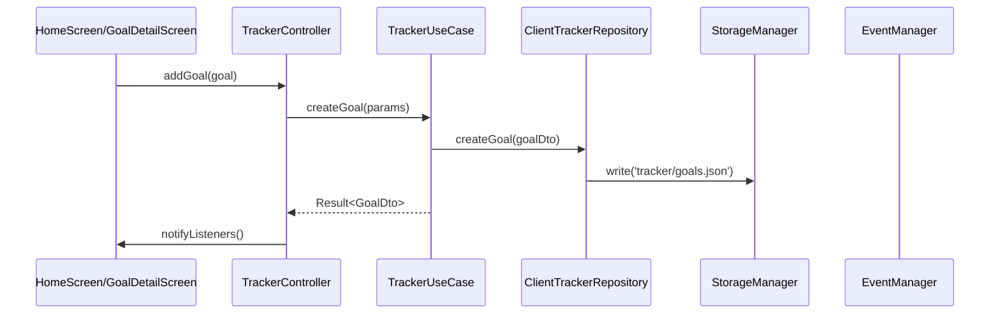
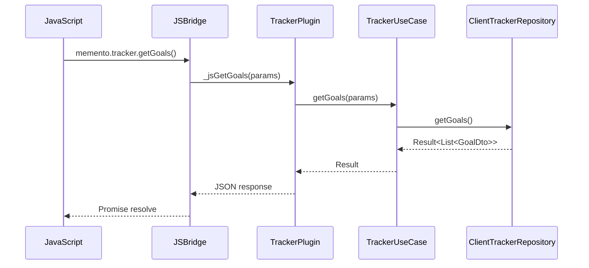
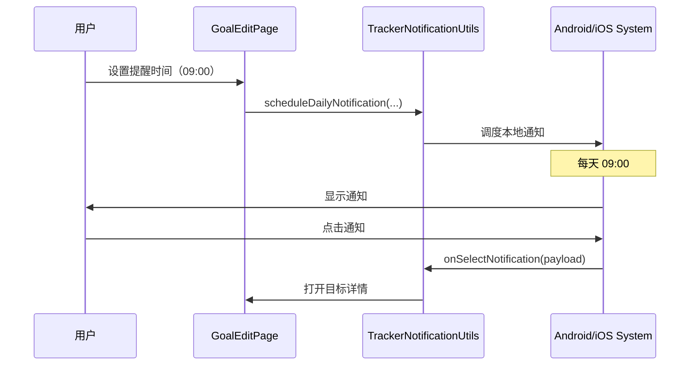

[根目录](../../../CLAUDE.md) > [lib](../../) > [plugins](../) > **tracker**

---

# 目标追踪插件 (Tracker Plugin) - 模块文档

> **变更记录 (Changelog)**
> - **2025-12-17T12:10:45+08:00**: 增量更新 - 新增 JS Bridge API、Repository 模式、UseCase 架构等功能的详细说明

## 模块职责

目标追踪插件是 Memento 的核心目标管理模块，提供：

- **目标管理系统**：创建、编辑、删除目标，支持多种时间周期
- **进度追踪**：实时跟踪目标完成进度，支持自定义目标值和单位
- **记录管理**：添加、查看、删除完成记录，支持备注和时间戳
- **分组功能**：按自定义分组组织目标，支持多分组管理
- **视图切换**：列表视图和网格视图双模式展示
- **提醒系统**：支持每日定时提醒，通知用户完成目标
- **计时器功能**：内置计时器，适合时间类目标记录
- **统计展示**：今日完成数、本月完成数、整体进度统计
- **事件系统**：广播记录添加事件，支持插件间协作
- **JS Bridge API**：提供 JavaScript 接口供 WebView 和脚本调用
- **Repository 模式**：使用仓储模式管理数据访问
- **UseCase 架构**：业务逻辑与数据分离

---

## 入口与启动

### 插件主类

**文件**: `tracker_plugin.dart`

```dart
class TrackerPlugin extends PluginBase with ChangeNotifier, JSBridgePlugin {
    @override
    String get id => 'tracker';

    @override
    Future<void> initialize() async {
        // 初始化 UseCase（需要 storage）
        _trackerUseCase = TrackerUseCase(
            ClientTrackerRepository(storage: storage, pluginId: id),
        );

        // 加载目标和记录数据
        await _controller.loadInitialData();

        // 注册 JS API
        await registerJSAPI();

        // 注册数据选择器
        _registerDataSelectors();
    }
}
```

**特性**：
- 单例模式（通过 `TrackerPlugin.instance` 获取）
- 使用 `ChangeNotifier` 支持状态通知
- 集成 `JSBridgePlugin` 提供 JavaScript API
- 使用 Repository + UseCase 架构模式

### 主界面入口

**文件**: `tracker_plugin.dart`

**路由**: 通过 `TrackerPlugin.buildMainView()` 返回 `TrackerMainView`，内部使用 `Provider` 注入 `TrackerController` 并渲染 `HomeScreen`

---

## 对外接口

### 核心 API

#### 统计接口

```dart
// 获取今日完成的目标数
int getTodayCompletedGoals();

// 获取本月完成的目标数
int getMonthCompletedGoals();

// 获取本月新增的目标数
int getMonthAddedGoals();

// 获取今日记录数
int getTodayRecordCount();

// 小组件统计接口
int getGoalCount();
int getActiveGoalCount();
int getTodayRecordCount();
```

#### TrackerController 控制器类

**文件**: `controllers/tracker_controller.dart`

```dart
// 目标管理
Future<void> addGoal(Goal goal);
Future<void> updateGoal(String id, Goal newGoal);
Future<void> deleteGoal(String id);
Future<void> toggleGoalCompletion(String id);

// 目标查询
Future<List<Goal>> getAllGoals();
Future<List<Goal>> getGoalsByStatus(String status); // 'active'/'completed'
List<String> getAllGroups();

// 记录管理
Future<void> addRecord(Record record, Goal goal);
Future<void> deleteRecord(String recordId);
Future<void> clearRecordsForGoal(String goalId);
Future<List<Record>> getRecordsForGoal(String goalId);
Stream<List<Record>> watchRecordsForGoal(String goalId);

// 进度计算
double calculateProgress(Goal goal);
double calculateOverallProgress();
int getGoalCount();
```

### JS Bridge API

**文件**: `tracker_plugin.dart` (defineJSAPI 方法)

Tracker 插件通过 JS Bridge 提供以下 JavaScript API：

#### 目标相关 API

```javascript
// 获取所有目标（支持分页和筛选）
memento.tracker.getGoals({
    status: 'active',    // 可选：'active'/'completed'
    group: '学习',       // 可选：分组名称
    offset: 0,          // 可选：分页偏移
    count: 100          // 可选：分页大小
});

// 获取单个目标
memento.tracker.getGoal({
    goalId: '1234567890'
});

// 创建目标
memento.tracker.createGoal({
    name: '每日阅读',
    icon: '57455',
    unitType: '分钟',
    targetValue: 30,
    group: '学习',
    dateSettings: {
        type: 'daily'
    },
    isLoopReset: true
});

// 更新目标
memento.tracker.updateGoal({
    goalId: '1234567890',
    updateJson: {
        name: '每日阅读2小时',
        targetValue: 120
    }
});

// 删除目标
memento.tracker.deleteGoal({
    goalId: '1234567890'
});
```

#### 记录相关 API

```javascript
// 记录数据
memento.tracker.recordData({
    goalId: '1234567890',
    value: 30,
    note: '阅读技术文档',
    recordedAt: '2025-01-15T09:30:00.000Z',  // 可选
    durationSeconds: 1800                     // 可选
});

// 获取记录列表（支持分页）
memento.tracker.getRecords({
    goalId: '1234567890',
    offset: 0,
    count: 50
});

// 删除记录
memento.tracker.deleteRecord({
    recordId: '1736950800123'
});
```

#### 统计相关 API

```javascript
// 获取目标进度
memento.tracker.getProgress({
    goalId: '1234567890'
});
// 返回：{ goalId, currentValue, targetValue, progress, percentage, isCompleted }

// 获取统计信息
memento.tracker.getStats();  // 全局统计
// 或
memento.tracker.getStats({
    goalId: '1234567890'    // 单个目标统计
});
```

### 数据选择器 API

插件注册了数据选择器，供其他插件选择追踪目标：

```dart
SelectorDefinition(
    id: 'tracker.goal',
    pluginId: 'tracker',
    name: '选择追踪目标',
    selectionMode: SelectionMode.single,
    // ... 配置
)
```

### 通知系统接口

#### TrackerNotificationUtils 工具类

**文件**: `utils/tracker_notification_utils.dart`

```dart
// 初始化通知系统
static Future<void> initialize({
  Function(String?)? onSelectNotification,
});

// 调度每日通知
static Future<void> scheduleDailyNotification({
  required int id,
  required String title,
  required String body,
  required int hour,
  required int minute,
  String? payload,
});

// 取消通知
static Future<void> cancelNotification(int id);

// 更新通知
static Future<void> updateNotification({
  required int id,
  required String title,
  required String body,
  required int hour,
  required int minute,
  String? payload,
});

// 显示即时通知
static Future<void> showInstantNotification({
  required String title,
  required String body,
  String? payload,
});
```

---

## 关键依赖与配置

### 外部依赖

- `provider`: 状态管理和依赖注入
- `flutter_local_notifications`: 本地通知
- `memento_notifications`: 通知封装库（AwesomeNotifications）
- `logging`: 日志记录
- `get`: 状态管理（GetX）
- `animations`: 动画效果
- `shared_models`: 共享数据模型

### 插件依赖

- **Core Event System**: 事件广播（`onRecordAdded` 事件）
- **NotificationManager**: 通知管理
- **StorageManager**: 数据存储
- **JS Bridge**: JavaScript 桥接
- **Plugin Data Selector**: 数据选择器服务

### 存储路径

**根目录**: `tracker/`

**存储结构**:
```
tracker/
├── goals.json              # 所有目标数据
└── records.json            # 所有记录数据
```

**目标文件格式** (`goals.json`):
```json
{
  "goals": [
    {
      "id": "1234567890",
      "name": "每日阅读",
      "icon": "57455",
      "iconColor": 4294198070,
      "unitType": "分钟",
      "targetValue": 30,
      "currentValue": 15,
      "dateSettings": {
        "type": "daily",
        "startDate": null,
        "endDate": null,
        "selectedDays": null,
        "monthDay": null
      },
      "reminderTime": "09:00",
      "isLoopReset": true,
      "createdAt": "2025-01-15T08:30:00.000Z",
      "group": "学习",
      "imagePath": "/storage/tracker/images/reading.jpg",
      "progressColor": 4283215696
    }
  ],
  "lastUpdated": "2025-01-15T20:15:00.000Z"
}
```

**记录文件格式** (`records.json`):
```json
{
  "records": [
    {
      "id": "1736950800123",
      "goalId": "1234567890",
      "value": 15,
      "note": "阅读技术文档",
      "recordedAt": "2025-01-15T09:30:00.000Z",
      "durationSeconds": 900
    }
  ],
  "lastUpdated": "2025-01-15T09:30:00.000Z"
}
```

---

## 数据模型

### Goal (目标)

**文件**: `models/goal.dart`

```dart
class Goal {
  String id;                    // 唯一ID（时间戳字符串）
  String name;                  // 目标名称
  String icon;                  // 图标（MaterialIcons 代码点字符串）
  int? iconColor;               // 图标颜色（Color.value）
  String unitType;              // 单位类型（如：次、分钟、页）
  String group;                 // 分组名称
  String? imagePath;            // 背景图片路径（可选）
  int? progressColor;           // 进度条颜色（Color.value）
  double targetValue;           // 目标值
  double currentValue;          // 当前值
  DateSettings dateSettings;    // 日期设置
  String? reminderTime;         // 提醒时间（HH:mm 格式）
  bool isLoopReset;             // 是否循环重置
  DateTime createdAt;           // 创建时间

  bool get isCompleted;         // 计算属性：是否完成

  Map<String, dynamic> toJson();
  factory Goal.fromJson(Map<String, dynamic> json);
  Goal copyWith({...});
}
```

### DateSettings (日期设置)

**文件**: `models/goal.dart`

```dart
class DateSettings {
  String type;                  // 类型：daily/weekly/monthly/custom
  DateTime? startDate;          // 开始日期（custom 类型）
  DateTime? endDate;            // 结束日期（custom 类型）
  List<String>? selectedDays;   // 选中的星期（weekly 类型）
  int? monthDay;                // 月份日期（monthly 类型）

  Map<String, dynamic> toJson();
  factory DateSettings.fromJson(Map<String, dynamic> json);
}
```

**类型说明**:
- `daily`: 每日目标
- `weekly`: 每周目标（指定星期几）
- `monthly`: 每月目标（指定日期）
- `custom`: 自定义日期范围

### Record (记录)

**文件**: `models/record.dart`

```dart
class Record {
  String id;                    // 唯一ID（时间戳字符串）
  String goalId;                // 关联的目标ID
  double value;                 // 记录值
  String? note;                 // 备注（可选）
  DateTime recordedAt;          // 记录时间
  int? durationSeconds;         // 持续时间（秒，计时器使用）

  Map<String, dynamic> toJson();
  factory Record.fromJson(Map<String, dynamic> json);
  static void validate(Record record, Goal goal);
}
```

**验证规则**:
- `value` 必须为正数
- `goalId` 必须与目标匹配

---

## Repository 架构

### ClientTrackerRepository

**文件**: `repositories/client_tracker_repository.dart`

Tracker 插件使用 Repository 模式管理数据访问，`ClientTrackerRepository` 实现了 `ITrackerRepository` 接口：

```dart
class ClientTrackerRepository extends ITrackerRepository {
  final dynamic storage; // StorageManager 实例
  final String pluginId;

  // 目标管理
  Future<Result<List<GoalDto>>> getGoals({...});
  Future<Result<GoalDto>> getGoalById({...});
  Future<Result<GoalDto>> createGoal({...});
  Future<Result<GoalDto>> updateGoal({...});
  Future<Result<void>> deleteGoal({...});

  // 记录管理
  Future<Result<List<RecordDto>>> getRecordsForGoal({...});
  Future<Result<RecordDto>> addRecord({...});
  Future<Result<void>> deleteRecord({...});

  // 统计功能
  Future<Result<Map<String, dynamic>>> getStats({...});
}
```

**特性**：
- 使用 Result 模式处理成功/失败
- 支持分页查询（PaginationParams）
- 统一错误处理
- DTO（Data Transfer Object）模式

### UseCase 层

插件使用 UseCase 模式封装业务逻辑：

```dart
// 在 tracker_plugin.dart 中
late final TrackerUseCase _trackerUseCase;

// JS API 通过 UseCase 调用
final result = await _trackerUseCase.getGoals(params);
```

---

## 界面层结构

### 主要界面组件

| 组件 | 文件 | 职责 |
|------|------|------|
| `TrackerMainView` | `tracker_plugin.dart` | 插件主视图容器 |
| `HomeScreen` | `screens/home_screen.dart` | 目标列表主界面 |
| `GoalDetailScreen` | `screens/goal_detail_screen.dart` | 目标详情和记录历史 |
| `TrackerGoalSelectorScreen` | `screens/tracker_goal_selector_screen.dart` | 目标选择器 |
| `TrackerGoalProgressSelectorScreen` | `screens/tracker_goal_progress_selector_screen.dart` | 目标进度选择器 |
| `SearchResultsScreen` | `screens/search_results_screen.dart` | 搜索结果页面 |
| `GoalCard` | `widgets/goal_card.dart` | 目标卡片组件 |
| `GoalEditPage` | `widgets/goal_edit_page.dart` | 目标编辑对话框 |
| `GoalDetailPage` | `widgets/goal_detail_page.dart` | 目标详情页面 |
| `RecordDialog` | `widgets/record_dialog.dart` | 记录添加对话框 |
| `TimerDialog` | `widgets/timer_dialog.dart` | 计时器对话框 |
| `TrackerSummaryCard` | `widgets/tracker_summary_card.dart` | 统计卡片组件 |

### HomeScreen 布局

**布局结构**:
```
SuperCupertinoNavigationWrapper
├── AppBar
│   ├── 搜索栏
│   ├── 添加按钮
│   └── 视图切换按钮（列表/网格）
├── 搜索结果（SearchResultsScreen，搜索时显示）
└── HomeScreen（主内容）
    ├── 分组切换器（ChoiceChip 横向滚动）
    ├── 状态筛选菜单（全部/进行中/已完成）
    └── 目标列表
        ├── ListView（列表模式）
        │   └── Dismissible（滑动删除）
        │       └── GoalCard
        └── GridView（网格模式，2列）
            └── GoalCard
```

**关键特性**:
- 搜索功能：实时搜索目标名称和分组
- 双视图模式：列表视图和网格视图（2列）
- 分组筛选：横向滚动的分组切换器
- 状态筛选：全部/进行中/已完成
- 滑动删除：列表模式支持滑动删除（需确认）

### 目标选择器界面

**文件**: `screens/tracker_goal_selector_screen.dart`

用于其他插件选择追踪目标：
- 显示所有目标列表
- 展示目标进度和分组信息
- 支持搜索功能
- 使用 Provider 注入控制器状态

### 目标进度选择器

**文件**: `screens/tracker_goal_progress_selector_screen.dart`

用于选择特定目标的进度值：
- 显示目标详情
- 提供进度值选择界面
- 支持快速选择和自定义输入

### GoalCard 组件

**核心功能**:
- 显示目标进度条
- 背景图片或纯色背景
- 图标圆形容器（带阴影）
- 渐变蒙版（增强文字可读性）
- 快速操作按钮：
  - ➕ 快速记录
  - ⏱ 计时器
  - ☑️ 完成复选框
- 剩余天数显示（custom 类型目标）

**布局**:
```
Card
└── Stack
    ├── 背景层（图片或纯色）
    └── InkWell
        └── Container（渐变蒙版）
            └── Padding
                ├── 顶部区域
                │   ├── 图标 + 名称
                │   └── 操作按钮行
                └── 底部区域
                    ├── 进度条
                    └── 进度文本 + 剩余天数
```

### GoalDetailScreen

**功能**:
- 显示目标详细信息和当前进度
- 线性进度条可视化
- 记录历史列表（使用 `StreamBuilder` 实时更新）
- 记录管理：删除单条记录
- 目标管理：编辑目标、清空所有记录

**数据流**:
```
FutureBuilder (初始加载)
└── StreamBuilder (实时更新)
    └── watchRecordsForGoal(goalId)
        └── ListView (记录列表)
```

### RecordDialog（记录对话框）

**功能**:
- 选择记录时间（DatePicker + TimePicker）
- 输入记录值（支持数字验证）
- 计算差值功能：输入目标值自动计算需要的增量
- 添加备注（可选）

**验证规则**:
- 记录值必须为正数
- 记录时间不能晚于当前时间

### TimerDialog（计时器对话框）

**功能**:
- 倒计时或正计时
- 暂停/继续
- 完成后自动创建记录（`durationSeconds` 字段）

---

## 事件系统

### 事件类型

**文件**: `controllers/tracker_controller.dart`

| 事件名 | 事件类 | 触发时机 | 参数 |
|-------|--------|---------|------|
| `onRecordAdded` | `Value<Record>` | 添加记录时 | `Record` 对象 |

### 事件广播示例

```dart
// 在 TrackerController.addRecord() 中
await _saveRecords();
await updateGoal(goal.id, updatedGoal);

// 广播记录添加事件
eventManager.broadcast('onRecordAdded', Value<Record>(record));

notifyListeners();
```

**用途**: 其他插件可以监听此事件，实现联动功能（如自动生成日记、活动记录等）

---

## 小组件集成

### Android 小组件支持

Tracker 插件支持 Android 桌面小组件，通过以下方法提供统计数据：

```dart
// 在 tracker_plugin.dart 中
int getGoalCount();              // 总目标数
int getActiveGoalCount();        // 进行中的目标数
int getTodayRecordCount();       // 今日记录数
```

**实现位置**: `home_widgets.dart` 文件（通过 `lib/core/services/plugin_widget_sync_helper.dart` 同步）

---

## 国际化

### 支持语言

- 简体中文 (zh)
- 英语 (en)

### 本地化文件

| 文件 | 语言 |
|------|------|
| `l10n/tracker_translations.dart` | 本地化接口 |
| `l10n/tracker_translations_zh.dart` | 中文翻译 |
| `l10n/tracker_translations_en.dart` | 英文翻译 |

### 关键字符串

```dart
abstract class TrackerTranslations {
  String get name;                      // 插件名称
  String get goalTracking;              // 目标追踪
  String get searchPlaceholder;         // 搜索占位符
  String get todayComplete;             // 今日完成
  String get thisMonthComplete;         // 本月完成
  // ... 更多翻译
}
```

---

## 路由处理

### 路由注册

**文件**: `tracker_route_handler.dart`

插件注册了以下路由：
- `/tracker/goal`: 目标详情页
- `/tracker/select`: 目标选择器
- `/tracker/select/progress`: 目标进度选择器

---

## 测试与质量

### 当前状态
- **单元测试**: 无
- **集成测试**: 无
- **已知问题**:
  - 卡片视图创建独立 `TrackerController` 实例，不共享状态
  - 时间筛选功能（最近/本周/本月）未实现

### 测试建议

1. **高优先级**：
   - `TrackerController.addRecord()` - 测试记录添加和目标值更新
   - `TrackerController.deleteRecord()` - 测试记录删除和目标值回退
   - `TrackerController.clearRecordsForGoal()` - 测试批量删除和目标重置
   - `Goal.validate()` / `Record.validate()` - 测试数据验证逻辑
   - JS Bridge API 测试 - 验证所有 API 接口

2. **中优先级**：
   - 通知调度逻辑 - 测试每日提醒
   - 分组管理 - 测试分组创建和筛选
   - 进度计算 - 测试边界条件（超过目标值、负值等）
   - 事件广播 - 测试事件是否正确触发

3. **低优先级**：
   - UI 交互逻辑
   - 国际化字符串完整性
   - 视图模式切换
   - 卡片背景图片加载

---

## 常见问题 (FAQ)

### Q1: 如何使用 JS API？

参考 `JS_API_GUIDE.md` 和 `JS_API_README.md` 文件，包含完整的 API 文档和使用示例。

### Q2: Repository 模式如何工作？

Tracker 插件使用 Repository + UseCase 架构：
- `ClientTrackerRepository`: 负责数据持久化
- `TrackerUseCase`: 封装业务逻辑
- `TrackerController`: UI 层控制器

### Q3: 如何添加新的日期设置类型？

在 `DateSettings` 模型中添加新类型：

```dart
class DateSettings {
  final String type; // daily/weekly/monthly/custom/custom_interval

  // 添加新字段
  final int? intervalDays; // 自定义间隔天数
}
```

然后在 `GoalEditPage` 中添加对应的 UI 选项。

### Q4: 如何集成数据选择器？

其他插件可以通过以下方式使用 Tracker 的数据选择器：

```dart
// 选择一个追踪目标
final result = await pluginDataSelectorService.select(
  context: context,
  selectorId: 'tracker.goal',
);

// 使用选择的结果
if (result != null) {
  final goal = result.rawData as Goal;
  // ...
}
```

### Q5: 计时器功能如何与记录关联？

`TimerDialog` 完成后创建 `Record` 对象，设置 `durationSeconds` 字段：

```dart
final record = Record(
  id: DateTime.now().millisecondsSinceEpoch.toString(),
  goalId: goal.id,
  value: elapsedSeconds / 60, // 转换为分钟
  recordedAt: DateTime.now(),
  durationSeconds: elapsedSeconds,
);
```

### Q6: 如何实现目标模板功能？

建议添加模板系统：

```dart
class GoalTemplate {
  String name;
  String icon;
  String unitType;
  double targetValue;
  DateSettings dateSettings;

  Goal createGoal() {
    return Goal(
      id: DateTime.now().millisecondsSinceEpoch.toString(),
      name: name,
      icon: icon,
      unitType: unitType,
      targetValue: targetValue,
      currentValue: 0,
      dateSettings: dateSettings,
      isLoopReset: true,
      createdAt: DateTime.now(),
      group: '默认',
    );
  }
}
```

存储在 `tracker/templates.json` 中。

---

## 目录结构

```
tracker/
├── tracker_plugin.dart                          # 插件主类 + 主视图
├── tracker_route_handler.dart                   # 路由处理器
├── home_widgets.dart                            # 小组件支持
├── models/
│   ├── goal.dart                                # 目标模型 + 日期设置模型
│   └── record.dart                              # 记录模型
├── controllers/
│   └── tracker_controller.dart                  # 目标和记录控制器
├── repositories/
│   └── client_tracker_repository.dart           # 数据访问层（Repository）
├── screens/
│   ├── home_screen.dart                         # 目标列表主界面
│   ├── goal_detail_screen.dart                  # 目标详情界面
│   ├── tracker_goal_selector_screen.dart         # 目标选择器
│   ├── tracker_goal_progress_selector_screen.dart # 目标进度选择器
│   └── search_results_screen.dart               # 搜索结果页面
├── widgets/
│   ├── goal_card.dart                           # 目标卡片组件
│   ├── goal_edit_page.dart                      # 目标编辑对话框
│   ├── goal_detail_page.dart                    # 目标详情页面
│   ├── record_dialog.dart                       # 记录添加对话框
│   ├── timer_dialog.dart                        # 计时器对话框
│   └── tracker_summary_card.dart                # 统计卡片组件
├── utils/
│   ├── date_utils.dart                          # 日期工具类
│   └── tracker_notification_utils.dart          # 通知工具类
├── l10n/
│   ├── tracker_translations.dart               # 国际化接口
│   ├── tracker_translations_zh.dart            # 中文翻译
│   └── tracker_translations_en.dart            # 英文翻译
├── JS_API_GUIDE.md                              # JS API 使用指南
└── JS_API_README.md                             # JS API 说明文档
```

---

## 关键实现细节

### 单例模式实现

```dart
class TrackerPlugin extends PluginBase with ChangeNotifier {
  static TrackerPlugin? _instance;

  TrackerPlugin() {
    _instance = this;
  }

  static TrackerPlugin get instance {
    _instance ??= TrackerPlugin();
    return _instance!;
  }
}
```

**注意**: 每次调用构造函数都会更新 `_instance`，依赖 `PluginManager` 确保单例。

### JS Bridge 集成

插件通过 `JSBridgePlugin` mixin 提供 JavaScript API：

```dart
class TrackerPlugin extends PluginBase with ChangeNotifier, JSBridgePlugin {
  @override
  Map<String, Function> defineJSAPI() {
    return {
      'getGoals': _jsGetGoals,
      'getGoal': _jsGetGoal,
      'createGoal': _jsCreateGoal,
      // ... 更多 API
    };
  }
}
```

### 目标进度计算

```dart
double calculateProgress(Goal goal) {
  return goal.currentValue / goal.targetValue;
}
```

**边界情况**:
- `targetValue == 0`: 返回 `Infinity`（需要添加保护）
- `currentValue > targetValue`: 进度条可能超过 100%

### 记录值验证

```dart
static void validate(Record record, Goal goal) {
  if (record.value <= 0) {
    throw ArgumentError('Record value must be positive');
  }
  if (record.goalId != goal.id) {
    throw ArgumentError('Record does not belong to the specified goal');
  }
}
```

**调用时机**: 在 `TrackerController.addRecord()` 中调用

### 通知通道创建

```dart
static Future<void> initialize({
  Function(String?)? onSelectNotification,
}) async {
  await AwesomeNotifications().initialize(null, [
    NotificationChannel(
      channelKey: _channelKey,
      channelName: _channelName,
      channelDescription: _channelDescription,
      importance: NotificationImportance.High,
      enableVibration: true,
      playSound: true,
    ),
  ]);
}
```

**通道配置**:
- 通道 ID: `tracker_channel`
- 重要性: `NotificationImportance.High`（显示浮动通知）
- 振动和声音: 已启用

---

## 数据流架构

### 目标和记录管理流程



### JS API 调用流程



### 通知调度流程



---

## 依赖关系

### 核心依赖

- **BasePlugin**: 插件基类
- **JSBridgePlugin**: JavaScript 桥接
- **StorageManager**: 数据持久化
- **PluginManager**: 插件管理器
- **ConfigManager**: 配置管理器
- **EventManager**: 事件广播系统
- **NotificationManager**: 通知管理
- **Plugin Data Selector**: 数据选择器服务

### 第三方包依赖

- `provider: ^6.0.0` - 状态管理
- `get: ^11.0.0` - GetX 状态管理
- `animations: ^2.0.0` - 动画效果
- `shared_models: ^0.0.1` - 共享数据模型
- `memento_notifications: ^0.0.1` - 通知封装
- `logging: ^1.2.0` - 日志记录

### 插件间依赖

- **无直接插件依赖**: Tracker 插件独立运行
- **事件订阅者**: 其他插件可监听 `onRecordAdded` 事件
- **数据选择器**: 其他插件可使用 Tracker 的目标选择器

**依赖方向**: 单向输出事件和数据选择器

---

## 性能优化建议

### 1. 数据加载优化

**当前问题**: `loadInitialData()` 一次性加载所有目标和记录

**优化方案**:
- 分页加载记录（按日期分文件）
- 延迟加载历史记录（仅在 `GoalDetailScreen` 打开时加载）
- 使用 Repository 的分页功能

### 2. 卡片视图优化

**当前问题**: `buildCardView()` 创建独立 `TrackerController` 实例

**优化方案**:
```dart
@override
Widget buildCardView(BuildContext context) {
  return ChangeNotifierProvider.value(
    value: _controller, // 使用单例 controller
    child: Consumer<TrackerController>(
      builder: (context, controller, child) {
        // 使用共享状态
      },
    ),
  );
}
```

### 3. JS API 性能优化

**建议**:
- 使用 Result 模式的异步处理
- 实现适当的缓存机制
- 批量操作支持（如批量创建记录）

---

## 扩展功能建议

### 1. 目标模板系统

支持预定义常用目标模板：

```dart
final templates = [
  GoalTemplate(name: '每日阅读', icon: '📚', unitType: '分钟', targetValue: 30),
  GoalTemplate(name: '每日运动', icon: '🏃', unitType: '分钟', targetValue: 30),
  GoalTemplate(name: '每日喝水', icon: '💧', unitType: '杯', targetValue: 8),
];
```

### 2. 数据可视化

添加统计图表：
- 进度趋势图（折线图）
- 完成率日历（热力图）
- 分组饼图

### 3. 目标标签系统

支持多标签分类：

```dart
class Goal {
  List<String> tags; // ['健康', '学习', '工作']
}
```

### 4. 目标依赖

支持目标间依赖关系：

```dart
class Goal {
  String? parentGoalId; // 父目标ID
  List<String> subGoalIds; // 子目标ID列表
}
```

### 5. JS API 扩展

- WebSocket 支持实时更新
- 批量操作 API
- 高级统计和分析 API
- 导入/导出功能

---

## 变更记录 (Changelog)

- **2025-12-17T12:10:45+08:00**: 增量更新 - 新增 JS Bridge API、Repository 模式、UseCase 架构、路由处理、数据选择器、小组件集成等功能的详细说明
- **2025-11-13**: 初始化目标追踪插件文档，识别 16 个文件、3 个数据模型、20+ 个控制器接口、核心功能包括目标管理、记录追踪、通知系统、事件广播

---

**上级目录**: [返回插件目录](../../../CLAUDE.md#模块索引) | [返回根文档](../../../CLAUDE.md)