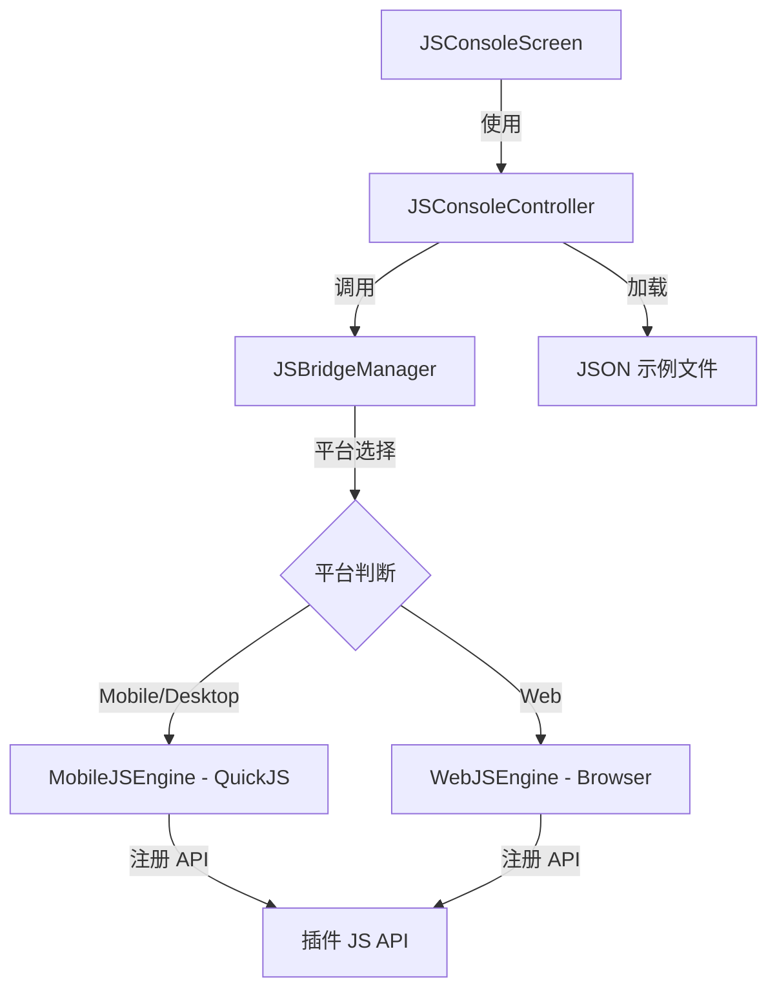

[根目录](../../../CLAUDE.md) > [screens](../CLAUDE.md) > **js_console**

---

# JS 控制台 (JS Console) - 模块文档

## 模块职责

JS 控制台是 Memento 应用中的开发调试工具，提供交互式 JavaScript 运行环境，主要功能：

- **实时代码执行**：在移动端（QuickJS）和 Web 端（浏览器引擎）运行 JavaScript 代码
- **API 测试**：快速测试 Memento.* 全局 API（chat、openai 等插件 API）
- **代码示例库**：内置多种示例代码，支持从 JSON 文件动态加载
- **异步操作支持**：自动包装用户代码以处理 Promise 和 async/await
- **调试输出**：捕获 `console.log` 和 `console.error` 输出

---

## 架构概览

### 目录结构

```
lib/screens/js_console/
├── controllers/
│   └── js_console_controller.dart      # 控制器：代码执行、示例加载
├── examples/                            # 示例代码 JSON 文件
│   ├── basic_examples.json              # 基础 JavaScript 示例
│   └── chat_examples.json               # Chat 插件 API 示例
├── screens/
│   └── js_console_screen.dart           # UI 界面（代码编辑器 + 输出）
└── CLAUDE.md                            # 本文档
```

### 依赖关系



---

## 核心工作原理

### 1. 代码包装机制

控制器会自动将用户代码包装在异步函数中，以处理 Promise 和返回值：

```javascript
// 用户输入的代码
var result = await Memento.chat.testSync();
return result;

// ⬇️ 控制器自动包装为 ⬇️

await (async function() {
  // 1. 挂载 setResult 函数（用户可选）
  globalThis.setResult = function(value) {
    globalThis.__EVAL_RESULTS__['executionId'] = JSON.stringify(value);
  };

  try {
    // 2. 执行用户代码
    var result = await (async function() {
      var result = await Memento.chat.testSync();
      return result;
    })();

    // 3. 如果用户未调用 setResult，自动捕获 return 值
    if (!globalThis.__EVAL_RESULTS__['executionId']) {
      globalThis.setResult(result);
    }
  } finally {
    // 4. 清理 setResult 函数
    delete globalThis.setResult;
  }
})();
```

**关键点**：
- ✅ 外层自动 `await`，确保所有异步操作完成
- ✅ 用户可使用 `return` 或 `setResult()` 返回结果
- ⚠️ `setResult` 在 `finally` 中被删除，未 await 的异步函数会找不到它

### 2. 常见错误与正确写法

#### ❌ 错误示例

```javascript
// 错误 1：未 await 的 async IIFE
(async function() {
  var result = await Memento.chat.testSync();
  setResult(result);  // ❌ ReferenceError: setResult is not defined
})();  // ⬅️ 外层立即执行 finally，删除 setResult
```

```javascript
// 错误 2：定义函数但未 await 调用
async function test() {
  return await Memento.chat.testSync();
}
test();  // ❌ 外层无法捕获 Promise 结果
```

#### ✅ 正确写法

```javascript
// 写法 1：直接顶层 await（最推荐）
var result = await Memento.chat.testSync();
console.log('结果:', result);
return result;  // 外层自动捕获
```

```javascript
// 写法 2：定义函数并 await 调用
async function run() {
  return await Memento.chat.testSync();
}
return await run();
```

```javascript
// 写法 3：await IIFE
return await (async function() {
  var result = await Memento.chat.testSync();
  return result;
})();
```

```javascript
// 写法 4：使用 setResult（适合中途返回）
var channels = await Memento.chat.getChannels();
console.log('频道数量:', channels.length);

var processed = {
  total: channels.length,
  names: channels.map(c => c.name)
};

setResult(processed);  // ✅ 显式设置返回值
console.log('处理完成');  // 可以继续执行其他代码
```

### 3. 核心原则

**编写代码时的黄金法则**：
1. ✅ **所有异步操作必须被正确 await**
2. ✅ **优先使用 `return` 而不是 `setResult`**
3. ✅ **如果使用 IIFE，必须 `await` 或 `return`**
4. ❌ **绝不使用未等待的 async IIFE**

---

## 示例代码管理

### JSON 文件格式

示例代码存储在 `examples/` 目录下的 JSON 文件中，格式如下：

```json
{
  "category": "分类名称",
  "description": "分类描述",
  "examples": [
    {
      "title": "示例标题",
      "code": "示例代码（字符串）"
    }
  ]
}
```

**示例：** `examples/chat_examples.json`

```json
{
  "category": "Chat 插件示例",
  "description": "聊天插件相关的 JS API 调用示例",
  "examples": [
    {
      "title": "获取所有频道",
      "code": "var channels = await Memento.chat.getChannels();\nconsole.log('频道列表:', channels);\nreturn channels;"
    }
  ]
}
```

### 添加新示例的步骤

#### 1. 创建或编辑 JSON 文件

在 `lib/screens/js_console/examples/` 目录下创建新的 JSON 文件（或编辑现有文件）：

```bash
# 例如添加 OpenAI 插件示例
lib/screens/js_console/examples/openai_examples.json
```

#### 2. 编写示例内容

```json
{
  "category": "OpenAI 插件示例",
  "description": "AI 助手相关的 JS API 调用示例",
  "examples": [
    {
      "title": "发送聊天请求",
      "code": "var response = await Memento.openai.sendMessage('你好，世界');\nreturn response;"
    },
    {
      "title": "列出助手",
      "code": "var assistants = await Memento.openai.listAssistants();\nreturn assistants;"
    }
  ]
}
```

#### 3. 注册到控制器

编辑 `controllers/js_console_controller.dart:83-86`，在 `exampleFiles` 列表中添加新文件：

```dart
final exampleFiles = [
  'lib/screens/js_console/examples/basic_examples.json',
  'lib/screens/js_console/examples/chat_examples.json',
  'lib/screens/js_console/examples/openai_examples.json',  // ✅ 新增
];
```

#### 4. 验证加载

重启应用后，控制器会自动加载新示例。在控制台日志中查看：

```
✓ 已加载示例文件: lib/screens/js_console/examples/openai_examples.json (2 个)
✓ 示例加载完成，共 15 个示例
```

### 示例命名规则

控制器会自动组合 `category` 和 `title` 作为示例的键：

```dart
final key = category == '未分类' ? title : '$category - $title';
// 示例：
// "Chat 插件示例 - 获取所有频道"
// "基础示例 - Hello World"
```

**建议**：
- `category` 使用插件名称或功能分类
- `title` 使用简短的操作描述（3-6 个汉字）
- 避免重复命名

---

## 对外接口

### JSConsoleController

**路径**: `lib/screens/js_console/controllers/js_console_controller.dart`

#### 属性

| 属性 | 类型 | 说明 |
|------|------|------|
| `code` | `String` | 当前编辑器中的代码 |
| `output` | `String` | 代码执行输出结果 |
| `isRunning` | `bool` | 是否正在执行代码 |
| `examples` | `Map<String, String>` | 已加载的示例代码映射 |
| `examplesLoaded` | `bool` | 示例是否已加载完成 |

#### 方法

| 方法 | 签名 | 说明 |
|------|------|------|
| `loadExamples()` | `Future<void> loadExamples()` | 从 JSON 文件加载所有示例（仅执行一次） |
| `runCode()` | `Future<void> runCode()` | 执行当前代码并更新输出 |
| `setCode(code)` | `void setCode(String code)` | 设置编辑器代码 |
| `clearOutput()` | `void clearOutput()` | 清空输出 |
| `loadExample(key)` | `void loadExample(String exampleKey)` | 加载指定示例到编辑器 |

#### 使用示例

```dart
// 在 UI 组件中使用
class JSConsoleScreen extends StatefulWidget {
  @override
  void initState() {
    super.initState();

    // 创建控制器
    _controller = JSConsoleController();

    // 加载示例
    _controller.loadExamples();
  }

  void _runExample(String exampleKey) {
    // 加载并运行示例
    _controller.loadExample(exampleKey);
    _controller.runCode();
  }
}
```

---

## 平台差异

### QuickJS (移动端 / 桌面端)

**特点**：
- 轻量级 JavaScript 引擎
- 不支持浏览器 API（如 `window`、`document`）
- `setTimeout` / `setInterval` **不稳定**，避免使用

**限制**：
```javascript
// ❌ 不支持
setTimeout(() => console.log('delayed'), 1000);  // 可能不工作
window.location.href;                             // undefined
document.getElementById('foo');                   // ReferenceError
```

**替代方案**：
- 使用 Dart 侧 API（如定时器、UI 操作）
- 通过 Memento.* API 调用 Flutter 功能

### Web (浏览器引擎)

**特点**：
- 完整的浏览器 JavaScript 引擎
- 支持所有标准 Web API
- 性能较好

**额外功能**：
```javascript
// ✅ 支持浏览器 API
console.log(navigator.userAgent);
console.log(window.innerWidth);

// ✅ 支持 ES6+ 特性
const arr = [1, 2, 3];
const doubled = arr.map(n => n * 2);
```

---

## 调试技巧

### 1. 查看变量内容

```javascript
var data = await Memento.chat.getChannels();
console.log('类型:', typeof data);
console.log('内容:', data);
return data;  // 会格式化为 JSON 显示
```

### 2. 错误处理

```javascript
try {
  var result = await Memento.chat.testSync();
  return result;
} catch (error) {
  console.error('错误:', error.message);
  return { error: error.message };
}
```

### 3. 多步骤调试

```javascript
console.log('步骤 1: 获取频道');
var channels = await Memento.chat.getChannels();
console.log('步骤 2: 频道数量:', channels.length);

console.log('步骤 3: 发送消息');
var message = await Memento.chat.sendMessage(
  channels[0].id,
  'Test',
  'text'
);
console.log('步骤 4: 完成');

return { channels, message };
```

### 4. 使用 setResult 中途返回

```javascript
// 场景：处理大量数据时提前返回部分结果
var channels = await Memento.chat.getChannels();

if (channels.length === 0) {
  setResult({ error: '没有频道' });
  return;  // 提前退出
}

// 继续处理...
var messages = await Memento.chat.getMessages(channels[0].id, 10);
setResult({ channels, messages });
```

---

## 常见问题 (FAQ)

### Q1: 为什么 `setResult` 提示未定义？

**原因**：你使用了未 await 的 async IIFE，外层包装器已经执行完 `finally` 并删除了 `setResult`。

**解决方案**：
```javascript
// ❌ 错误
(async function() {
  setResult(await Memento.chat.testSync());
})();

// ✅ 正确
return await (async function() {
  return await Memento.chat.testSync();
})();

// ✅ 更好（推荐）
var result = await Memento.chat.testSync();
return result;
```

### Q2: 如何返回多个值？

**方案 1：返回对象**
```javascript
var channels = await Memento.chat.getChannels();
var user = await Memento.chat.getCurrentUser();

return {
  channels: channels,
  user: user,
  timestamp: new Date().toISOString()
};
```

**方案 2：返回数组**
```javascript
var channels = await Memento.chat.getChannels();
var user = await Memento.chat.getCurrentUser();

return [channels, user];
```

### Q3: setTimeout 不工作怎么办？

QuickJS 的 `setTimeout` 不稳定。替代方案：

```javascript
// ❌ 不推荐（可能不工作）
setTimeout(() => console.log('delayed'), 1000);

// ✅ 使用 Promise.resolve（立即执行）
await Promise.resolve();
console.log('executed');

// ✅ 或者通过 Dart 侧实现定时功能
// 例如创建一个 Memento.utils.delay(ms) API
```

### Q4: 如何测试新的插件 API？

**步骤**：
1. 确保插件已注册 JS API（参考 `lib/core/js_bridge/js_bridge_manager.dart`）
2. 在控制台中直接调用：
   ```javascript
   var result = await Memento.yourPlugin.yourMethod();
   console.log(result);
   return result;
   ```
3. 创建示例 JSON 文件保存常用测试代码

### Q5: 如何查看可用的 API？

```javascript
// 列出所有已注册的插件命名空间
console.log('可用插件:', Object.keys(Memento));
return Object.keys(Memento);

// 输出示例：["version", "chat", "openai", ...]
```

```javascript
// 查看特定插件的方法
console.log('Chat API:', Object.keys(Memento.chat));
return Object.keys(Memento.chat);

// 输出示例：["getChannels", "sendMessage", "getCurrentUser", ...]
```

---

## 最佳实践

### 1. 代码组织

```javascript
// ✅ 推荐：清晰的步骤划分
console.log('=== 开始测试 ===');

// 步骤 1：准备数据
var channels = await Memento.chat.getChannels();
console.log('频道数量:', channels.length);

// 步骤 2：执行操作
var message = await Memento.chat.sendMessage(
  channels[0].id,
  'Hello',
  'text'
);
console.log('消息已发送:', message);

// 步骤 3：返回结果
return {
  success: true,
  channelId: channels[0].id,
  messageId: message.id
};
```

### 2. 错误处理

```javascript
// ✅ 推荐：使用 try-catch
try {
  var result = await Memento.chat.testSync();
  return { success: true, data: result };
} catch (error) {
  console.error('发生错误:', error);
  return { success: false, error: error.message };
}
```

### 3. 日志输出

```javascript
// ✅ 推荐：结构化日志
console.log('====================');
console.log('操作:', 'getChannels');
console.log('参数:', { limit: 10 });
console.log('====================');

var channels = await Memento.chat.getChannels();

console.log('结果:', {
  count: channels.length,
  first: channels[0]
});

return channels;
```

### 4. 代码复用

对于常用操作，创建辅助函数：

```javascript
// 定义辅助函数
async function getFirstChannel() {
  var channels = await Memento.chat.getChannels();
  if (channels.length === 0) {
    throw new Error('没有可用频道');
  }
  return channels[0];
}

// 使用辅助函数
var channel = await getFirstChannel();
var messages = await Memento.chat.getMessages(channel.id, 5);

return { channel, messages };
```

---

## 相关文件清单

### 核心文件
- `controllers/js_console_controller.dart` (133 行) - 控制器：代码执行与示例加载
- `screens/js_console_screen.dart` - UI 界面（需查看具体实现）

### 示例文件
- `examples/basic_examples.json` (7 个基础示例) - JavaScript 语法示例
- `examples/chat_examples.json` (8 个聊天示例) - Chat 插件 API 示例

### 依赖模块
- `lib/core/js_bridge/js_bridge_manager.dart` - JS 引擎管理器
- `lib/core/js_bridge/platform/mobile_js_engine.dart` - QuickJS 实现
- `lib/core/js_bridge/platform/web_js_engine.dart` - 浏览器引擎实现

---

## 变更记录 (Changelog)

- **2025-11-13**: 初始化 JS 控制台文档，说明包装器机制、示例管理和最佳实践

---

**上级目录**: [返回 screens 目录](../CLAUDE.md) | [返回根文档](../../../CLAUDE.md)
