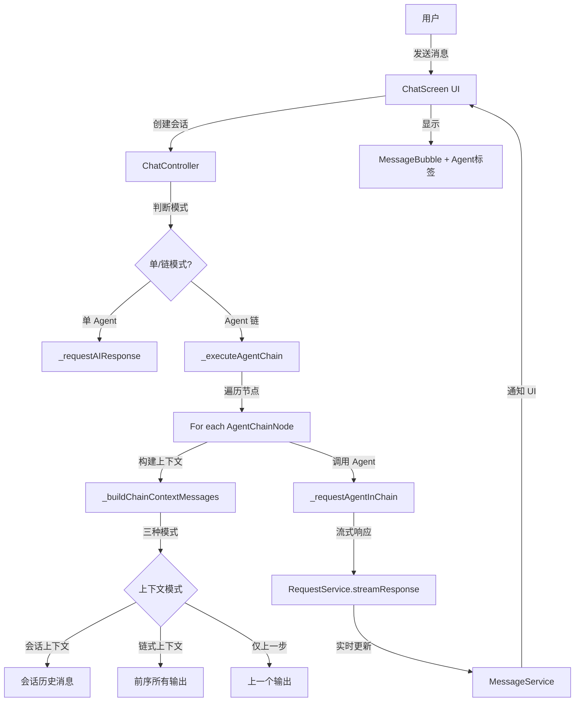

# Agent Chat 链式调用功能技术文档

> **文档版本**：1.0
> **创建时间**：2025-12-21
> **功能状态**：✅ 已完成并通过编译测试

---

## 📋 目录

1. [功能概述](#功能概述)
2. [用户需求](#用户需求)
3. [架构设计](#架构设计)
4. [数据模型](#数据模型)
5. [核心实现](#核心实现)
6. [UI 实现](#ui-实现)
7. [使用指南](#使用指南)
8. [技术细节](#技术细节)
9. [测试建议](#测试建议)

---

## 功能概述

### 背景

在原有的 agent_chat 插件中，每个会话只能绑定一个 Agent。为了支持更复杂的处理流程，需要实现 **Agent 链式调用**功能，允许将多个 Agent 按顺序执行，每个 Agent 的输出作为下一个 Agent 的输入。

### 核心特性

- ✅ **多 Agent 顺序执行**：配置 2+ 个 Agent 形成处理链
- ✅ **三种上下文模式**：灵活选择每个 Agent 的输入来源
- ✅ **错误即停止**：任一 Agent 失败则中断链式调用
- ✅ **可视化反馈**：显示每个 Agent 的中间输出
- ✅ **向后兼容**：现有单 Agent 会话无缝迁移

### 应用场景

**示例1：内容生成流水线**
```
用户输入："写一篇关于 AI 的科普文章"
  ↓
Agent 1 (大纲生成): 生成文章结构
  ↓
Agent 2 (内容填充): 基于大纲撰写详细内容
  ↓
Agent 3 (风格润色): 优化语言风格
  ↓
最终输出：完整的科普文章
```

**示例2：数据分析流程**
```
用户输入："分析这段文本的情感"
  ↓
Agent 1 (情感识别): 识别情感倾向和强度
  ↓
Agent 2 (原因分析): 分析情感产生的原因
  ↓
Agent 3 (报告生成): 生成可视化分析报告
```

---

## 用户需求

### 需求确认（来自用户）

1. **配置级别**：会话级（每个会话绑定一个 agent 链）
2. **上下文模式**：三种可选模式
   - 会话上下文：使用历史消息（遵循 contextMessageCount）
   - 链式上下文：传递所有前序 agent 的输出
   - 仅上一步：仅传递上一个 agent 的输出
3. **错误处理**：任一 agent 失败则立即停止
4. **UI 展示**：显示每个 agent 的中间输出

### 非功能需求

- **性能**：支持流式响应，实时更新 UI
- **兼容性**：向后兼容旧的单 agent 数据
- **可维护性**：代码结构清晰，易于扩展

---

## 架构设计

### 系统架构图



### 数据流图

```
用户输入 → 保存用户消息 → 判断模式
  ↓
[链式模式]
  ↓
遍历 AgentChainNode (按 order 排序)
  ↓
  [步骤 i]
    1. 创建 AI 消息占位符
    2. 根据 contextMode 构建消息列表
    3. 调用 Agent (流式响应)
    4. 保存输出到 chainMessages[i]
    5. 检查是否失败或取消 → 是则停止
  ↓
下一个节点
```

---

## 数据模型

### 1. AgentChainNode（新增）

**文件位置**：`lib/plugins/agent_chat/models/agent_chain_node.dart`

```dart
/// Agent 链节点的上下文模式
enum AgentContextMode {
  conversationContext,  // 会话上下文
  chainContext,         // 链式上下文
  previousOnly,         // 仅上一步
}

/// Agent 链中的单个节点配置
class AgentChainNode {
  final String agentId;              // Agent ID
  final AgentContextMode contextMode; // 上下文模式
  final int order;                    // 执行顺序（从0开始）

  // 序列化/反序列化方法
  Map<String, dynamic> toJson();
  factory AgentChainNode.fromJson(Map<String, dynamic> json);
  AgentChainNode copyWith({...});
}
```

**设计要点**：
- `order` 字段确保执行顺序可控
- `contextMode` 为每个节点独立配置上下文策略
- 支持完整的序列化以持久化配置

### 2. Conversation（扩展）

**文件位置**：`lib/plugins/agent_chat/models/conversation.dart`

```dart
class Conversation {
  // 原有字段
  final String id;
  String title;
  final String? agentId;  // 单 agent 模式（向后兼容）

  // 新增字段
  final List<AgentChainNode>? agentChain;  // agent 链配置

  // 新增 getter
  bool get isChainMode => agentChain != null && agentChain!.isNotEmpty;
  List<String> get effectiveAgentIds => isChainMode
      ? agentChain!.map((n) => n.agentId).toList()
      : (agentId != null ? [agentId!] : []);
}
```

**向后兼容策略**：
- 保留 `agentId` 字段用于旧数据
- `isChainMode` 自动判断使用哪种模式
- `toJson()` 仅在链非空时序列化 `agentChain`

### 3. ChatMessage（扩展）

**文件位置**：`lib/plugins/agent_chat/models/chat_message.dart`

```dart
class ChatMessage {
  // 原有字段...

  // 新增字段（链式模式专用）
  String? generatedByAgentId;  // 生成此消息的 Agent ID
  int? chainStepIndex;         // 在链中的步骤索引
}
```

**用途**：
- `generatedByAgentId`：用于在 UI 中显示 Agent 标签
- `chainStepIndex`：标识消息在链中的位置（0-based）

---

## 核心实现

### 1. ChatController 修改

**文件位置**：`lib/plugins/agent_chat/controllers/chat_controller.dart`

#### 新增字段

```dart
class ChatController {
  // 原有
  AIAgent? _currentAgent;

  // 新增
  List<AIAgent>? _agentChain;

  // getter
  bool get isChainMode => conversation.isChainMode;
  List<AIAgent> get agentChain => _agentChain ?? [];
}
```

#### 初始化流程

```dart
Future<void> initialize() async {
  // ...

  // 判断模式并加载
  if (conversation.isChainMode) {
    await _loadAgentChain(conversation.agentChain!);
  } else if (conversation.agentId != null) {
    await _loadAgentInBackground(conversation.agentId!);
  }

  // ...
}
```

#### 加载 Agent 链

```dart
Future<void> _loadAgentChain(List<AgentChainNode> chainNodes) async {
  final openAIPlugin = PluginManager.instance.getPlugin('openai') as OpenAIPlugin?;
  if (openAIPlugin == null) return;

  _agentChain = [];

  // 按 order 排序
  final sortedNodes = List<AgentChainNode>.from(chainNodes)
    ..sort((a, b) => a.order.compareTo(b.order));

  // 依次加载每个 agent
  for (final node in sortedNodes) {
    final agent = await openAIPlugin.controller.getAgent(node.agentId);
    if (agent != null) {
      _agentChain!.add(agent);
    }
  }

  // 设置当前 agent 为第一个
  if (_agentChain!.isNotEmpty) {
    _currentAgent = _agentChain!.first;
  }
}
```

### 2. 链式执行核心逻辑

#### 入口：sendMessage()

```dart
Future<void> sendMessage() async {
  // 验证
  if (!isChainMode && _currentAgent == null) {
    throw Exception('未选择Agent');
  }
  if (isChainMode && _agentChain!.isEmpty) {
    throw Exception('Agent链为空');
  }

  // 保存用户消息...

  // 模式分发
  if (isChainMode) {
    await _executeAgentChain(userInput, files, selectedTemplate);
  } else {
    // 原有单 agent 逻辑
    await _requestAIResponse(aiMessage.id, userInput, files);
  }
}
```

#### 核心：_executeAgentChain()

```dart
Future<void> _executeAgentChain(
  String userInput,
  List<File> files,
  SavedToolTemplate? selectedTemplate,
) async {
  final chainNodes = conversation.agentChain!;
  final sortedNodes = List<AgentChainNode>.from(chainNodes)
    ..sort((a, b) => a.order.compareTo(b.order));

  // 存储每个 agent 的输出
  final chainMessages = <ChatMessage>[];

  // 遍历执行
  for (int i = 0; i < sortedNodes.length; i++) {
    final node = sortedNodes[i];
    final agent = _agentChain![i];

    // 1. 创建 AI 消息占位符
    final aiMessage = ChatMessage.ai(
      conversationId: conversation.id,
      content: '',
      isGenerating: true,
      generatedByAgentId: agent.id,
      chainStepIndex: i,
    );
    await messageService.addMessage(aiMessage);
    chainMessages.add(aiMessage);

    try {
      // 2. 构建上下文消息
      final contextMessages = _buildChainContextMessages(
        node: node,
        stepIndex: i,
        userInput: userInput,
        previousMessages: chainMessages,
      );

      // 3. 调用 agent
      await _requestAgentInChain(
        agent: agent,
        aiMessageId: aiMessage.id,
        contextMessages: contextMessages,
        files: i == 0 ? files : [], // 只有第一个处理文件
        enableToolCalling: agent.enableFunctionCalling,
      );

      // 4. 检查是否取消
      if (_isCancelling) break;

      // 5. 更新消息
      final updatedMessage = messageService.getMessage(conversation.id, aiMessage.id);
      if (updatedMessage != null) {
        chainMessages[i] = updatedMessage;
      }

    } catch (e) {
      // 错误处理：标记失败并停止
      final errorMessage = messageService.getMessage(conversation.id, aiMessage.id);
      if (errorMessage != null) {
        final updated = errorMessage.copyWith(
          content: '❌ 执行失败: $e',
          isGenerating: false,
        );
        await messageService.updateMessage(updated);
      }
      break; // 停止后续执行
    }
  }
}
```

### 3. 上下文构建逻辑

```dart
List<ChatCompletionMessage> _buildChainContextMessages({
  required AgentChainNode node,
  required int stepIndex,
  required String userInput,
  required List<ChatMessage> previousMessages,
}) {
  final messages = <ChatCompletionMessage>[];
  final agent = _agentChain![stepIndex];

  // 添加系统提示词
  if (agent.systemPrompt.isNotEmpty) {
    messages.add(ChatCompletionMessage.system(content: agent.systemPrompt));
  }

  switch (node.contextMode) {
    case AgentContextMode.conversationContext:
      // 使用会话历史（复用现有 _buildContextMessages）
      final historyMessages = _buildContextMessages(userInput);
      messages.addAll(historyMessages);
      break;

    case AgentContextMode.chainContext:
      // 用户输入 + 所有前序输出
      messages.add(ChatCompletionMessage.user(
        content: ChatCompletionUserMessageContent.string(userInput),
      ));

      for (int i = 0; i < stepIndex; i++) {
        final prevMsg = previousMessages[i];
        if (prevMsg.content.isNotEmpty) {
          final prevAgent = _agentChain![i];
          messages.add(ChatCompletionMessage.assistant(
            content: '[${prevAgent.name}]: ${prevMsg.content}',
          ));
        }
      }
      break;

    case AgentContextMode.previousOnly:
      // 仅上一步的输出（或用户输入）
      final inputContent = stepIndex == 0
          ? userInput
          : previousMessages[stepIndex - 1].content;

      messages.add(ChatCompletionMessage.user(
        content: ChatCompletionUserMessageContent.string(inputContent),
      ));
      break;
  }

  return messages;
}
```

**关键点**：
- `conversationContext` 模式复用现有的 `_buildContextMessages`，保持一致性
- `chainContext` 模式将前序 agent 的输出标记为 assistant 角色，保持对话结构
- `previousOnly` 模式简化输入，适合流水线式处理

### 4. 单个 Agent 调用

```dart
Future<void> _requestAgentInChain({
  required AIAgent agent,
  required String aiMessageId,
  required List<ChatCompletionMessage> contextMessages,
  required List<File> files,
  required bool enableToolCalling,
}) async {
  final buffer = StringBuffer();
  int tokenCount = 0;

  try {
    final imageFiles = files.where((f) => FilePickerHelper.isImageFile(f)).toList();

    // 流式请求
    await RequestService.streamResponse(
      agent: agent,
      prompt: null,
      contextMessages: contextMessages,
      vision: imageFiles.isNotEmpty,
      filePath: imageFiles.isNotEmpty ? imageFiles.first.path : null,
      shouldCancel: () => _isCancelling,
      onToken: (token) {
        buffer.write(token);
        tokenCount++;

        // 实时更新 UI
        messageService.updateAIMessageContent(
          conversation.id,
          aiMessageId,
          buffer.toString(),
          tokenCount,
        );
      },
      onComplete: () async {
        messageService.completeAIMessage(conversation.id, aiMessageId);
      },
      onError: (error) {
        messageService.updateAIMessageContent(
          conversation.id,
          aiMessageId,
          error == '已取消发送' ? '🛑 用户已取消操作' : '❌ 错误: $error',
          0,
        );
        messageService.completeAIMessage(conversation.id, aiMessageId);
      },
    );

    // 保存上下文（用于详情查看）
    _contextMessagesCache[aiMessageId] = List.from(contextMessages);
  } catch (e) {
    debugPrint('❌ 请求Agent响应失败: $e');
    rethrow;
  }
}
```

**复用性**：
- 完全复用现有的 `RequestService.streamResponse`
- 流式响应机制保持一致
- 错误处理统一

### 5. 模式切换方法

```dart
/// 配置 Agent 链
Future<void> selectAgentChain(List<AgentChainNode> chainNodes) async {
  await _ensureConversationServiceReady();

  // 加载 agent
  await _loadAgentChain(chainNodes);

  // 更新会话
  final updatedConversation = (_currentConversation ?? conversation).copyWith(
    agentChain: chainNodes,
    clearAgentChain: false,
  );
  await conversationService.updateConversation(updatedConversation);

  _currentConversation = updatedConversation;
  notifyListeners();
}

/// 切换回单 Agent
Future<void> switchToSingleAgent(String agentId) async {
  await _ensureConversationServiceReady();

  final openAIPlugin = PluginManager.instance.getPlugin('openai') as OpenAIPlugin?;
  if (openAIPlugin != null) {
    _currentAgent = await openAIPlugin.controller.getAgent(agentId);
    _agentChain = null;  // 清空链

    final updatedConversation = (_currentConversation ?? conversation).copyWith(
      agentId: agentId,
      clearAgentChain: true,  // 清除链配置
    );
    await conversationService.updateConversation(updatedConversation);

    _currentConversation = updatedConversation;
    notifyListeners();
  }
}
```

---

## UI 实现

### 1. Agent 链配置对话框

**文件位置**：`lib/plugins/agent_chat/screens/chat_screen/components/agent_chain_config_dialog.dart`

#### 功能特性

- ✅ 添加/删除节点
- ✅ Agent 选择（下拉列表）
- ✅ 上下文模式选择（下拉列表）
- ✅ 拖拽排序（ReorderableListView）
- ✅ 上/下移动按钮
- ✅ 实时预览配置

#### 核心代码

```dart
class AgentChainConfigDialog extends StatefulWidget {
  final List<AgentChainNode>? initialChain;
  final Function(List<AgentChainNode>) onSave;

  @override
  State<AgentChainConfigDialog> createState() => _AgentChainConfigDialogState();
}

class _AgentChainConfigDialogState extends State<AgentChainConfigDialog> {
  late List<AgentChainNode> _chain;
  List<AIAgent> _availableAgents = [];

  @override
  void initState() {
    super.initState();
    _chain = widget.initialChain != null ? List.from(widget.initialChain!) : [];
    _loadAgents();
  }

  Future<void> _loadAgents() async {
    final openAIPlugin = PluginManager.instance.getPlugin('openai') as OpenAIPlugin?;
    if (openAIPlugin != null) {
      _availableAgents = await openAIPlugin.controller.loadAgents();
    }
    setState(() => _isLoading = false);
  }

  void _addNode() {
    setState(() {
      _chain.add(AgentChainNode(
        agentId: _availableAgents.first.id,
        contextMode: AgentContextMode.conversationContext,
        order: _chain.length,
      ));
    });
  }

  // ... 删除、移动等方法

  @override
  Widget build(BuildContext context) {
    return Dialog(
      child: Container(
        // ReorderableListView 实现拖拽排序
        child: ReorderableListView.builder(
          itemCount: _chain.length,
          onReorder: (oldIndex, newIndex) {
            setState(() {
              if (newIndex > oldIndex) newIndex--;
              final item = _chain.removeAt(oldIndex);
              _chain.insert(newIndex, item);

              // 重新排序
              for (int i = 0; i < _chain.length; i++) {
                _chain[i] = _chain[i].copyWith(order: i);
              }
            });
          },
          itemBuilder: (context, index) {
            final node = _chain[index];

            return Card(
              key: ValueKey(index),
              child: Column(
                children: [
                  // Agent 选择器
                  DropdownButtonFormField<String>(...),

                  // 上下文模式选择器
                  DropdownButtonFormField<AgentContextMode>(...),

                  // 说明文字
                  Text(_getContextModeDescription(node.contextMode)),
                ],
              ),
            );
          },
        ),
      ),
    );
  }
}
```

### 2. ChatScreen 修改

**文件位置**：`lib/plugins/agent_chat/screens/chat_screen/chat_screen.dart`

#### AppBar 显示

```dart
appBar: AppBar(
  title: InkWell(
    onTap: _showAgentSelector,
    child: Column(
      crossAxisAlignment: CrossAxisAlignment.start,
      children: [
        Text(widget.conversation.title),
        Row(
          children: [
            // 模式图标
            Icon(
              _controller.isChainMode ? Icons.link : Icons.smart_toy,
              size: 14,
            ),
            SizedBox(width: 4),

            // Agent 信息
            Text(_getAgentDisplayText()),

            Icon(Icons.arrow_drop_down, size: 16),
          ],
        ),
      ],
    ),
  ),
),
```

#### 辅助方法

```dart
String _getAgentDisplayText() {
  if (_controller.isChainMode) {
    final chainLength = _controller.agentChain.length;
    if (chainLength == 0) return '配置 Agent 链';
    return '$chainLength 个 Agent 链';
  } else {
    return _controller.currentAgent?.name ?? 'agent_chat_selectAgent'.tr;
  }
}

bool _hasValidAgent() {
  if (_controller.isChainMode) {
    return _controller.agentChain.isNotEmpty;
  } else {
    return _controller.currentAgent != null;
  }
}
```

#### Agent 选择器

```dart
Future<void> _showAgentSelector() async {
  // 1. 显示模式选择对话框
  final mode = await showDialog<String>(
    context: context,
    builder: (context) => SimpleDialog(
      title: const Text('选择配置模式'),
      children: [
        SimpleDialogOption(
          onPressed: () => Navigator.pop(context, 'single'),
          child: ListTile(
            leading: Icon(Icons.smart_toy),
            title: Text('单 Agent 模式'),
          ),
        ),
        SimpleDialogOption(
          onPressed: () => Navigator.pop(context, 'chain'),
          child: ListTile(
            leading: Icon(Icons.link),
            title: Text('Agent 链模式'),
          ),
        ),
      ],
    ),
  );

  // 2. 根据选择打开对应的界面
  if (mode == 'single') {
    await _showSingleAgentSelector();
  } else if (mode == 'chain') {
    await _showAgentChainConfig();
  }
}

Future<void> _showAgentChainConfig() async {
  await showDialog(
    context: context,
    builder: (context) => AgentChainConfigDialog(
      initialChain: _controller.conversation.agentChain,
      onSave: (chain) async {
        try {
          await _controller.selectAgentChain(chain);
          toastService.showToast('Agent 链配置成功');
        } catch (e) {
          toastService.showToast('配置失败: $e');
        }
      },
    ),
  );
}
```

### 3. MessageBubble 增强

**文件位置**：`lib/plugins/agent_chat/screens/chat_screen/components/message_bubble.dart`

#### 新增参数

```dart
class MessageBubble extends StatelessWidget {
  // 原有参数...
  final String? Function(String agentId)? getAgentName;  // 新增

  const MessageBubble({
    // ...
    this.getAgentName,
  });
}
```

#### Agent 标签显示

```dart
@override
Widget build(BuildContext context) {
  return Container(
    child: Column(
      children: [
        // Agent 标签（链式模式下显示）
        if (!isUser &&
            message.generatedByAgentId != null &&
            message.chainStepIndex != null)
          _buildAgentLabel(context),

        // 消息内容
        // ...
      ],
    ),
  );
}

Widget _buildAgentLabel(BuildContext context) {
  final agentName = getAgentName?.call(message.generatedByAgentId!) ?? 'Agent';
  final stepIndex = message.chainStepIndex!;

  return Container(
    padding: EdgeInsets.symmetric(horizontal: 8, vertical: 4),
    decoration: BoxDecoration(
      color: Theme.of(context).colorScheme.primary.withOpacity(0.1),
      borderRadius: BorderRadius.circular(4),
      border: Border.all(
        color: Theme.of(context).colorScheme.primary.withOpacity(0.3),
      ),
    ),
    child: Row(
      mainAxisSize: MainAxisSize.min,
      children: [
        Icon(Icons.link, size: 14),
        SizedBox(width: 4),
        Text(
          '步骤 ${stepIndex + 1}: $agentName',
          style: TextStyle(
            fontSize: 11,
            fontWeight: FontWeight.bold,
            color: Theme.of(context).colorScheme.primary,
          ),
        ),
      ],
    ),
  );
}
```

#### 回调传递（在 ChatScreen 中）

```dart
MessageBubble(
  message: message,
  // ...
  getAgentName: (agentId) {
    if (_controller.isChainMode) {
      final agent = _controller.agentChain.firstWhere(
        (a) => a.id == agentId,
        orElse: () => _controller.agentChain.first,
      );
      return agent.name;
    }
    return _controller.currentAgent?.name;
  },
)
```

---

## 使用指南

### 配置 Agent 链

1. **打开聊天界面**
2. **点击顶部 Agent 区域**（显示当前 agent 名称或链状态）
3. **选择"Agent 链模式"**
4. **添加节点**：
   - 点击"添加 Agent"按钮
   - 选择 Agent
   - 选择上下文模式
   - 重复添加更多节点
5. **调整顺序**：
   - 拖拽节点卡片
   - 或使用上/下箭头
6. **保存配置**

### 上下文模式选择指南

| 模式 | 适用场景 | 示例 |
|------|---------|------|
| **会话上下文** | 需要完整对话历史 | 多轮对话、需要记住前面讨论的内容 |
| **链式上下文** | 多步推理、需要所有中间结果 | 复杂分析任务、多层次处理 |
| **仅上一步** | 流水线式处理、每步独立 | 翻译 → 润色 → 排版 |

### 切换回单 Agent

1. 点击顶部 Agent 区域
2. 选择"单 Agent 模式"
3. 选择一个 Agent
4. 原有的链配置会被清除

---

## 技术细节

### 1. 数据持久化

**存储格式（JSON）**：

```json
{
  "id": "conv_123",
  "title": "测试会话",
  "agentId": null,
  "agentChain": [
    {
      "agentId": "agent_001",
      "contextMode": "conversationContext",
      "order": 0
    },
    {
      "agentId": "agent_002",
      "contextMode": "previousOnly",
      "order": 1
    }
  ],
  "contextMessageCount": 10,
  // ...
}
```

**向后兼容处理**：
```dart
// 读取时
factory Conversation.fromJson(Map<String, dynamic> json) {
  return Conversation(
    agentId: json['agentId'] as String?,  // 可能为 null
    agentChain: (json['agentChain'] as List<dynamic>?)  // 可能不存在
        ?.map((e) => AgentChainNode.fromJson(e))
        .toList(),
  );
}

// 写入时
Map<String, dynamic> toJson() {
  return {
    'agentId': agentId,
    if (agentChain != null && agentChain!.isNotEmpty)
      'agentChain': agentChain!.map((n) => n.toJson()).toList(),
  };
}
```

### 2. 错误处理机制

**错误传播**：
```dart
try {
  await _requestAgentInChain(...);
} catch (e) {
  // 1. 更新失败消息
  final errorMessage = messageService.getMessage(conversation.id, aiMessage.id);
  final updated = errorMessage.copyWith(
    content: '❌ 执行失败: $e',
    isGenerating: false,
  );
  await messageService.updateMessage(updated);

  // 2. 中断链式调用
  break;  // 不再执行后续 agent
}
```

**取消机制**：
```dart
// 在每个 agent 执行后检查
if (_isCancelling) {
  debugPrint('🛑 链式调用被用户取消');
  break;
}

// RequestService 中检查
shouldCancel: () => _isCancelling,
```

### 3. 性能优化

**流式响应**：
- 每个 agent 的输出实时显示
- 用户可以立即看到中间结果
- 不需要等待整个链完成

**消息缓存**：
```dart
// 更新 chainMessages 为最新版本
final updatedMessage = messageService.getMessage(conversation.id, aiMessage.id);
if (updatedMessage != null) {
  chainMessages[i] = updatedMessage;
}
```

**上下文构建优化**：
```dart
// conversationContext 模式复用现有方法
case AgentContextMode.conversationContext:
  final historyMessages = _buildContextMessages(userInput);
  messages.addAll(historyMessages);
  break;
```

### 4. 扩展性设计

**预留扩展点**：

1. **条件分支**：
```dart
// 未来可扩展
class AgentChainNode {
  final String? condition;  // 执行条件（JS 表达式）
  final List<String>? nextNodeIds;  // 下一步可能的节点
}
```

2. **并行执行**：
```dart
// 未来可扩展
class AgentChainNode {
  final bool parallel;  // 是否并行执行
  final String? groupId;  // 并行组 ID
}
```

3. **中间编辑**：
```dart
// 未来可扩展
class AgentChainNode {
  final bool allowUserEdit;  // 允许用户在此步骤编辑
}
```

---

## 测试建议

### 功能测试

**基础功能**：
- [ ] 创建包含 2 个 agent 的链，发送消息，验证顺序执行
- [ ] 创建包含 3+ 个 agent 的链，验证所有 agent 都执行
- [ ] 测试三种上下文模式，验证传递的消息正确

**上下文模式**：
- [ ] `conversationContext`：验证使用会话历史
- [ ] `chainContext`：验证传递所有前序输出
- [ ] `previousOnly`：验证仅传递上一步输出

**错误处理**：
- [ ] 模拟 agent 失败，验证停止执行
- [ ] 用户取消执行，验证中断链式调用
- [ ] Agent 不存在的情况，验证优雅降级

**模式切换**：
- [ ] 单 agent → 链式，验证配置保存
- [ ] 链式 → 单 agent，验证链配置清除
- [ ] 反复切换，验证数据一致性

**UI 交互**：
- [ ] 配置对话框的添加/删除/排序
- [ ] 拖拽排序功能
- [ ] AppBar 显示正确的模式和状态
- [ ] MessageBubble 显示 Agent 标签

### 兼容性测试

**向后兼容**：
- [ ] 打开旧的单 agent 会话，验证正常工作
- [ ] 旧会话切换到链模式，验证迁移成功
- [ ] 链模式切换回单 agent，验证不影响旧数据

**数据持久化**：
- [ ] 配置 agent 链后重启应用，验证配置保存
- [ ] 修改链配置，验证更新生效
- [ ] 删除节点，验证持久化正确

### 性能测试

**流式响应**：
- [ ] 验证每个 agent 的输出实时显示
- [ ] 长文本输出时 UI 不卡顿
- [ ] 快速切换会话，验证无内存泄漏

**大规模测试**：
- [ ] 配置 5+ 个 agent，验证执行稳定
- [ ] 长对话历史（100+ 消息），验证性能
- [ ] 大量文件附件，验证第一个 agent 正确处理

### 边界测试

**异常情况**：
- [ ] 空链配置（应提示错误）
- [ ] 单节点链（等同于单 agent）
- [ ] Agent 不存在（优雅降级）
- [ ] 网络错误（错误提示清晰）
- [ ] 上下文模式切换（验证消息构建正确）

---

## 文件清单

### 新增文件（2个）

1. **`lib/plugins/agent_chat/models/agent_chain_node.dart`** (100 行)
   - AgentContextMode 枚举
   - AgentChainNode 类
   - 序列化/反序列化

2. **`lib/plugins/agent_chat/screens/chat_screen/components/agent_chain_config_dialog.dart`** (350 行)
   - Agent 链配置对话框
   - 节点增删改
   - 拖拽排序 UI

### 修改文件（5个）

1. **`lib/plugins/agent_chat/models/conversation.dart`** (+30 行)
   - 添加 agentChain 字段
   - 添加 isChainMode, effectiveAgentIds getter
   - 修改序列化方法

2. **`lib/plugins/agent_chat/models/chat_message.dart`** (+20 行)
   - 添加 generatedByAgentId, chainStepIndex 字段
   - 修改工厂方法和序列化

3. **`lib/plugins/agent_chat/controllers/chat_controller.dart`** (+250 行)
   - 核心链式执行逻辑
   - 上下文构建逻辑
   - 模式切换方法

4. **`lib/plugins/agent_chat/screens/chat_screen/chat_screen.dart`** (+120 行)
   - AppBar 显示增强
   - Agent 选择器修改
   - getAgentName 回调

5. **`lib/plugins/agent_chat/screens/chat_screen/components/message_bubble.dart`** (+40 行)
   - Agent 标签显示
   - getAgentName 参数

**总代码量**：约 **910 行**

---

## 版本历史

| 版本 | 日期 | 说明 |
|------|------|------|
| 1.0 | 2025-12-21 | 初始版本，完整实现 Agent 链式调用功能 |

---

## 参考资料

- [OpenAI Chat Completions API](https://platform.openai.com/docs/api-reference/chat)
- [Flutter ReorderableListView](https://api.flutter.dev/flutter/widgets/ReorderableListView-class.html)
- [原始需求讨论记录](#用户需求)

---

**文档维护者**：AI Agent
**最后更新**：2025-12-21
